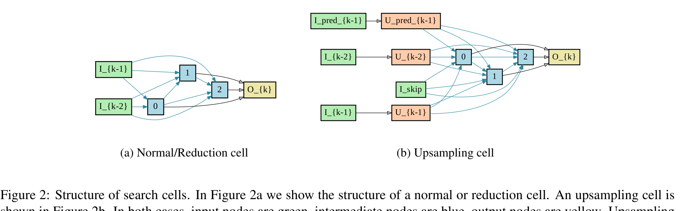
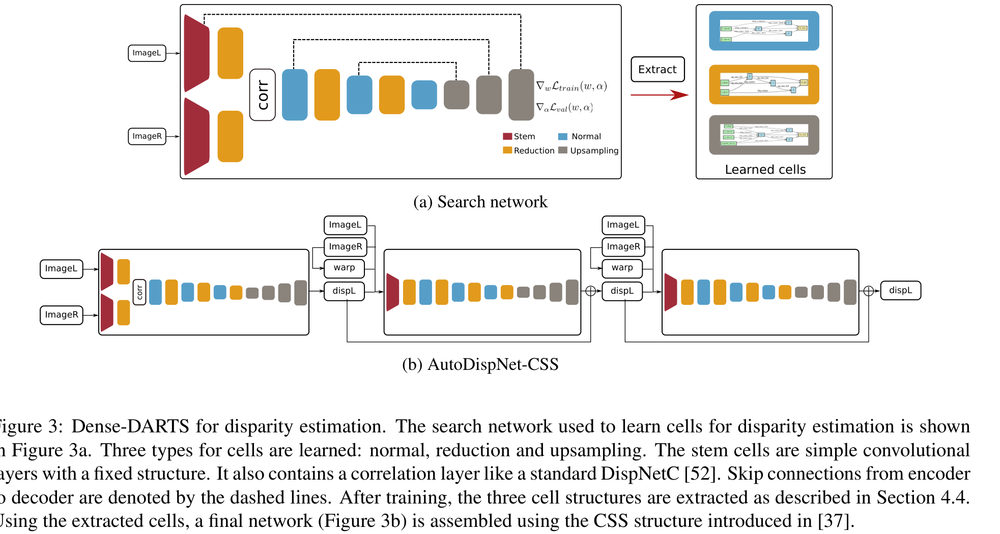
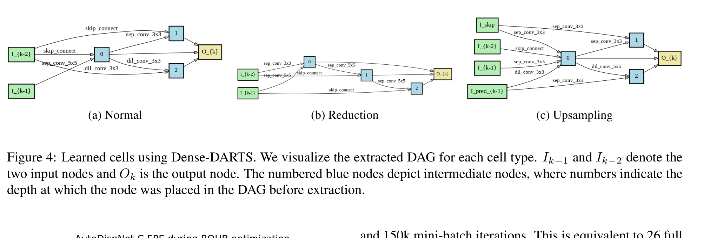
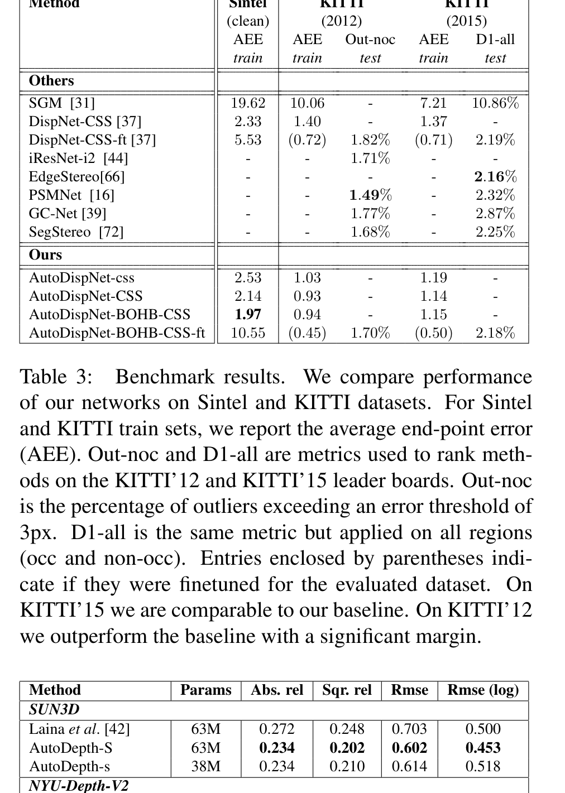

# AutoDispNet: Improving Disparity Estimation With AutoML

**Authors:** Tonmoy Saikia, Yassine Marrakchi, Arber Zela, Frank Hutter, Thomas Brox (University of Freiburg)
**Venue:** ICCV 2019
**Priority:** 7/10 — first application of differentiable NAS to large-scale dense prediction / stereo; motivates NAS in the edge stereo lineage (LEAStereo, EASNet)

---

## Core Problem & Motivation

Manual architecture tuning dominates stereo research: every benchmark percentage point tends to come from a human expert tweaking skip connections, kernel sizes, block depths, and training hyperparameters. DispNet → DispNet-CSS alone halved EPE via carefully chosen stacking tricks. This contradicts the ML paradigm of replacing manual search with numerical optimization.

Neural Architecture Search (NAS) promised to automate this — but two obstacles blocked its use on stereo:

1. **Compute cost of black-box NAS is prohibitive.** RL-based NAS (Zoph & Le) and evolutionary NAS (AmoebaNet) require hundreds-to-thousands of GPU-days even for CIFAR-sized classification. A single DispNet evaluation on FlyingThings3D takes ~1 GPU-day; multiplying that by thousands of candidates is infeasible.
2. **NAS was designed for small classification architectures, not encoder-decoder U-Nets.** DARTS (Liu et al. 2019) introduced differentiable NAS, but its search space only contains **normal** and **reduction** cells (both maintain or shrink spatial resolution). Dense prediction requires an **upsampling decoder** with skip connections and multi-scale supervision, which DARTS cannot natively express.

### AutoDispNet Contribution

AutoDispNet is the first paper to:

- **Extend DARTS with upsampling cells** so it can search full encoder-decoder architectures for dense prediction.
- **Decompose the AutoML problem** into two stages: (i) gradient-based architecture search with DARTS on the cell topology, and (ii) post-hoc hyperparameter tuning with BOHB (Bayesian Optimization + Hyperband) for learning rate and weight decay.
- **Run the whole pipeline on a single Nvidia GTX 1080Ti GPU** with total cost of ~33 GPU-days for BOHB + a few GPU-days for DARTS — making AutoML tractable for large-scale stereo for the first time.

The paper is framed as an empirical contest: "who is better at tweaking — the student who manually engineered DispNet-CSS, or the numerical optimizer?" AutoDispNet-BOHB-CSS wins on every axis (Sintel, KITTI-2012, KITTI-2015) while using fewer parameters.

---

## Architecture

AutoDispNet has two logical layers:

1. **DARTS search framework** (how cells are searched).
2. **Dense-DARTS adaptation** (what the search space and search network look like for stereo).

### DARTS Preliminaries (Search Space & Relaxation)

A **cell** is a directed acyclic graph (DAG) with $N$ nodes and two input nodes (outputs of the two previous cells). Each node $x^{(j)}$ is a feature map; each edge $(i,j)$ carries a candidate operation $o^{(i,j)} \in \mathcal{O}$. The node is computed as:

$$x^{(j)} = \sum_{i<j} o^{(i,j)}(x^{(i)}) \quad \text{(1)}$$

- **$x^{(i)}$** = feature map at node $i$
- **$o^{(i,j)}$** = operation on edge $(i,j)$, chosen from set $\mathcal{O}$
- **$\sum$ over $i<j$** = sum contributions from all predecessor nodes (DAG topology)

The candidate operation set $\mathcal{O}$ contains: skip connection, $3\times3$ avg pool, $3\times3$ max pool, $3\times3$ and $5\times5$ depthwise separable convs, $3\times3$ and $5\times5$ dilated separable convs (dilation 2), and a special **zero** operation (no connection).

### Continuous Relaxation (the DARTS trick)

Choosing one operation per edge is a categorical decision — non-differentiable. DARTS relaxes the choice via a softmax over a trainable real vector $\alpha^{(i,j)} \in \mathbb{R}^{\vert\mathcal{O}\vert}$:

$$S^{(i,j)}_o = \frac{\exp\bigl(\alpha^{i,j}_o\bigr)}{\sum_{o' \in \mathcal{O}} \exp\bigl(\alpha^{i,j}_{o'}\bigr)} \quad \text{(2)}$$

- **$\alpha^{i,j}_o$** = architecture weight for operation $o$ on edge $(i,j)$
- **$S^{(i,j)}_o$** = softmax-normalized probability of operation $o$ on that edge
- The denominator normalizes across all candidate operations so that $\sum_o S_o = 1$

The "mixed operation" on edge $(i,j)$ is a weighted average:

$$\bar{o}^{(i,j)}(x^{(i)}) = \sum_{o \in \mathcal{O}} S^{(i,j)}_o \cdot o(x^{(i)})$$

Equation (1) becomes:

$$x^{(j)} = \sum_{i<j} \bar{o}^{(i,j)}(x^{(i)}) \quad \text{(3)}$$

- Every edge is now **all operations simultaneously**, softmax-weighted.
- The search space is now **continuous in $\alpha$**, so architecture choice becomes differentiable.

### Bilevel Optimization

Two sets of parameters coexist: weights $w$ (the actual conv kernels) and architecture variables $\alpha$. They are optimized in alternation on disjoint splits:

- Train-split $\mathcal{D}_{\text{train}}$ used to update $w$ with SGD.
- Validation-split $\mathcal{D}_{\text{val}}$ used to update $\alpha$ with Adam.

This is a bilevel problem:

$$\min_\alpha \mathcal{L}_{\text{val}}(w^*(\alpha), \alpha) \quad \text{s.t.} \quad w^*(\alpha) = \arg\min_w \mathcal{L}_{\text{train}}(w, \alpha)$$

AutoDispNet uses the **first-order approximation** (ignoring the gradient through $w^*(\alpha)$) because second-order backprop is prohibitively expensive for large stereo networks.

### Architecture Discretization

After search convergence, a discrete cell is extracted by picking the **top-$k$ strongest non-zero operation per edge**, ranked by:

$$\max_{o \in \mathcal{O},\, o \neq \text{zero}} S^{(i,j)}_o \quad \text{(4)}$$

- Only non-zero operations are considered (zero operations indicate edges that should be removed).
- Each intermediate node keeps its top-2 incoming edges; each edge keeps its argmax operation.

The discretized cell is stacked into a deeper final network and retrained from scratch.

### Dense-DARTS: Upsampling Cell

Standard DARTS has **normal** and **reduction** cells. AutoDispNet introduces a third cell type: the **upsampling cell**. It takes **four inputs**:

- $I_{k-1}, I_{k-2}$ — outputs of the two previous decoder cells (upsampled via transposed convolution to double spatial resolution).
- $I_{\text{pred}_{k-1}}$ — the disparity prediction from the previous decoding stage (upsampled via bilinear interpolation, following DispNet-CSS).
- $I_{\text{skip}}$ — a skip connection from the encoder at the matching resolution.

These four inputs feed into DAG nodes that process all inputs via mixed operations (same $\mathcal{O}$ as normal cells). Intermediate node outputs are concatenated → $2$D conv → upsampled disparity prediction at the current scale.



### Full Search Network (Dense-DARTS)



- **Stem cells** (fixed, not searched): two convs $7\times7$ then $5\times5$, both stride-2 → downsamples input by $4\times$ and extracts Siamese features from left/right views.
- **Correlation layer** (DispNetC-style): patch-wise matching between the two Siamese streams → raw cost features.
- **Encoder**: stacked normal + reduction cells, alternating; 6 cells total, total encoder downsampling factor = $32\times$ (plus $\times2$ from stem = $64\times$ effective).
- **Decoder**: 3 upsampling cells with skip connections to the encoder and multi-scale loss heads.
- **First cell channels $C_{\text{init}} = 24$** during search (downsampled-by-2 for memory), doubling at each reduction.

Training the search network uses EPE loss at each output resolution; SGD (lr=0.025, cosine annealed) for $w$; Adam (lr=$10^{-4}$) for $\alpha$; L2 weight decay $3\cdot10^{-4}$ on $w$ and $10^{-3}$ on $\alpha$.

### Final Networks (AutoDispNet-C, -CSS)

Once cells are extracted, the final stereo network mirrors DispNet-CSS:

- **AutoDispNet-C**: 7 encoder cells + 4 decoder cells ($C_{\text{init}}=42$ for parity with DispNet-C). Contains the correlation layer. Outputs initial disparity.
- **AutoDispNet-S**: same cells but without the Siamese branches / correlation — a single stream refinement network. Takes $(I_L, I_R, \text{warped } I_L, d_{\text{prev}})$ as input and predicts a residual disparity.
- **AutoDispNet-CSS**: stack of one C-net and two S-nets, residuals accumulated (exactly the DispNet-CSS recipe).
- **AutoDispNet-css** (lowercase): $C_{\text{init}}=18$ — a ~3$\times$ FLOPs-reduced variant for low-compute comparison.

### BOHB Hyperparameter Search

Even with good cells, learning rate and weight decay must be tuned. BOHB (Bayesian Optimization + Hyperband) is used with:

- Three budgets: 16.67k, 50k, 150k mini-batch iterations ($\eta=3$).
- Search restarts from a 450k-iteration snapshot — only LR and WD are re-tuned.
- Multivariate KDE over best/worst configs drives acquisition.
- 5 parallel GPU workers; 11 Successive-Halving rounds ≈ 26 full evaluations ≈ **33.42 GPU-days total**.

### Learned Cells



Qualitative observations from extracted cells:

- **Normal cells** prefer dilated separable convolutions — the optimizer discovers receptive-field expansion is essential for stereo.
- **Reduction cells** combine dilated convolutions with max pooling, keeping the feature resolution tight while aggressively enlarging context.
- **Upsampling cells** use a mix of skip connections, separable convs, and dilated separable convs; the optimizer rediscovers the "skip + conv" inductive bias of hand-designed decoders.

---

## Key Equations Recap

**Node output (DAG sum):** $x^{(j)} = \sum_{i<j} o^{(i,j)}(x^{(i)})$ — feature flow inside a cell.

**Softmax relaxation:** $S^{(i,j)}_o = \exp(\alpha^{i,j}_o) / \sum_{o'} \exp(\alpha^{i,j}_{o'})$ — categorical → continuous.

**Mixed operation:** $\bar{o}^{(i,j)}(x) = \sum_o S^{(i,j)}_o \cdot o(x)$ — edge "tries" all operations at once.

**Discretization:** argmax over non-zero ops per edge (Eq. 4) — strongest survives.

**Bilevel loss:** $\min_\alpha \mathcal{L}_{\text{val}}(w^*(\alpha), \alpha)$ with $w^*(\alpha) = \arg\min_w \mathcal{L}_{\text{train}}(w, \alpha)$ — outer loop picks architecture, inner loop trains weights.

---

## Training

- **Dataset:** FlyingThings3D (21,818 train / 4,248 test, 960$\times$540 renders). Training-split further halved to produce $\mathcal{D}_{\text{train}}, \mathcal{D}_{\text{val}}$.
- **Search pre-processing:** images downsampled to 480$\times$270 and ground-truth disparities rescaled by $0.5\times$ so search fits on one 1080Ti.
- **Optimizer (weights $w$):** SGD, lr=0.025 → 0.001 cosine anneal, momentum 0.9.
- **Optimizer (arch $\alpha$):** Adam, lr=$10^{-4}$, $\beta_1=0.5, \beta_2=0.999$.
- **Regularization:** L2 with $\lambda_w = 3\cdot10^{-4}$, $\lambda_\alpha = 10^{-3}$; "warmup" epochs where $\alpha$ is frozen and only $w$ trains (prevents $\alpha$ from locking in before weights stabilize).
- **Final network training:** Same recipe as DispNet-CSS from Ilg et al. 2018.

---

## Results



### Single Network (FlyingThings3D test, Sintel train)

| Architecture | FT3D EPE | Sintel EPE | Params (M) | FLOPs (B) |
|---|---|---|---|---|
| DispNet-C (baseline) | 1.67 | 3.19 | 38 | 75 |
| AutoDispNet-c (small) | 1.98 | 3.53 | **7** | **16** |
| AutoDispNet-C | **1.53** | **2.85** | 37 | 61 |
| AutoDispNet-BOHB-C | 1.51 | **2.66** | 37 | 61 |

AutoDispNet-C **reduces Sintel EPE by 11%** at 20% fewer FLOPs; BOHB gives a further 7% gain via hyperparameter tuning. The small variant matches DispNet-C quality at 1/5 the parameters and 1/5 the FLOPs.

### Stacked Networks (Sintel EPE)

| Variant | 1-stack | 2-stack | 3-stack | Params (CSS) | FLOPs (CSS) |
|---|---|---|---|---|---|
| DispNet | 3.19 | 2.49 | 2.36 | 116 | 195 |
| AutoDispNet | 2.85 | 2.30 | 2.14 | 111 | 160 |
| AutoDispNet-BOHB | **2.66** | **2.14** | **1.97** | 111 | 160 |
| AutoDispNet-css (small) | 3.53 | 2.80 | 2.54 | **21** | **44** |

**AutoDispNet-CS already beats DispNet-CSS** — one fewer refinement stack needed. The small variant (AutoDispNet-css) matches DispNet-CS at **3$\times$ fewer FLOPs**.

### KITTI Benchmarks

- **KITTI 2012 Out-noc:** 1.70% (AutoDispNet-BOHB-CSS-ft) vs DispNet-CSS 1.82%, PSMNet 1.49%, GC-Net 1.77%.
- **KITTI 2015 D1-all:** 2.18% (AutoDispNet-BOHB-CSS-ft) vs DispNet-CSS 2.19%, PSMNet 2.32%.

AutoDispNet beats DispNet-CSS on both and outperforms GC-Net and SegStereo on KITTI-2012; slightly behind PSMNet on KITTI-2012 but better on KITTI-2015.

### Search Cost

- **DARTS search:** ~2 GPU-days on 1 GTX 1080Ti.
- **BOHB HPO:** ~33 GPU-days on 5 parallel 1080Ti workers (equivalent to 26 full evaluations).
- **Total:** ~35 GPU-days — comparable to manually training a single large stereo model from scratch a few times.

### Transferability

AutoDispNet extended trivially to **single-view depth estimation** (same encoder-decoder template): Abs.rel 0.234 vs Laina et al. 0.272 on SUN3D, confirming the cells generalize across dense prediction tasks.

---

## Why It Works

1. **Continuous relaxation + weight sharing** amortizes evaluation across candidate architectures. All sub-architectures are simultaneously represented in one super-graph; a single training run gives signal for all $\alpha$ directions.
2. **Dense-DARTS upsampling cell** finally adapts NAS to the encoder-decoder geometry required by dense prediction, exposing skip connections and multi-scale prediction to the search algorithm.
3. **Factorizing search + HPO** is key: DARTS excels at topology (high-dim, continuous) but cannot tune scalar hyperparameters under its formulation; BOHB excels at low-dim scalar HPO but is infeasible on large architectures. Chaining them gets the best of both.
4. **Warmup epochs** prevent premature architecture commitment: if $\alpha$ gradients flow before $w$ is trained, the optimizer commits to operations that look good with random weights but have no long-term value.
5. **First-order DARTS is sufficient** for large stereo networks — second-order corrections give only marginal gains and are prohibitively expensive.

---

## Limitations / Failure Modes

1. **Limited operation set.** Only 7 candidate operations (mostly standard convs and poolings). Modern stereo innovations — correlation / cost volumes, attention, 3D convs, transformers — are not in the search space; the correlation layer is inserted manually.
2. **No latency in the search objective.** Architectures are optimized for EPE only; no hardware-aware cost. This is why AutoDispNet-C still has ~37M parameters — NAS reduced FLOPs from 75B to 61B but did not target edge budgets.
3. **Search is on downsampled 480$\times$270 FT3D** — cells discovered on half-resolution inputs may not be optimal for native 960$\times$540 or KITTI-scale imagery.
4. **DARTS instability.** It is now well-documented that DARTS can collapse to skip-connection-heavy degenerate cells (cf. DARTS-PT, Fair-DARTS). AutoDispNet appears before those fixes and likely inherits the pathology — normal cells prefer dilated separable convs, which is fortunate, but reproducibility across seeds is not studied.
5. **BOHB scope narrow.** Only learning rate and weight decay are tuned — no optimizer choice, no augmentation policies, no loss weights. The total optimization is impressive but still deeply conditional on DispNet-CSS-style training recipe.
6. **No iterative refinement, no 3D cost volume, no monocular prior.** The architecture family AutoDispNet searches is the 2018 DispNet encoder-decoder — a paradigm now superseded by RAFT-Stereo, IGEV, DEFOM-Stereo. AutoDispNet's lesson is methodological, not architectural.

---

## Relevance to Our Edge Model

AutoDispNet is foundational methodological context for the NAS direction in edge-stereo design. For our Jetson Orin Nano $<33\text{ms}$ goal, specific takeaways:

### Directly usable

1. **Use differentiable NAS (DARTS or successors) to search the feature encoder.** Our edge model needs a mobile-friendly backbone; DARTS-style search with latency-aware objective (e.g., ProxylessNAS, FBNet, MobileNetV3-style NAS) is the principled choice for picking cell topology and width under an explicit ms-budget.
2. **Factorize search: topology vs. scalars.** Our pipeline — MPT distillation + iteration count + loss weights — has many scalar hyperparameters that DARTS can't tune. Pair differentiable NAS for topology with BOHB / Hyperband for scalar HPO, just like AutoDispNet.
3. **Upsampling cell template** is directly reusable for any encoder-decoder part of our pipeline (e.g., the convex upsampling head, bilateral-grid upsampler).
4. **Warmup epochs** before architecture gradients flow — a safe default for any NAS integration.
5. **Cell transferability** is real: AutoDispNet cells transfer to single-view depth. Our cells searched for stereo on SceneFlow should transfer to cross-domain generalization (KITTI, ETH3D) without re-search, saving enormous compute.

### Cautions

- **Add latency to the search objective.** AutoDispNet optimizes accuracy only; our edge model must measure real Orin Nano ms (via TensorRT) inside the DARTS inner loop, e.g., via latency LUT or differentiable latency estimator.
- **Expand the candidate operation set** with modern edge primitives: $1\times3 + 3\times1$ factored convs, SE-blocks, MBConv (MobileNetV2) blocks, RepVGG / RepViT blocks.
- **Don't search iterative GRU cells with DARTS.** Pip-Stereo already shows PIP is the right tool for iteration compression; NAS is for the feature encoder and cost-volume regularization.
- **Use NAS on DEFOM-style architecture**: the feature encoder, the scale-update module, and the bilateral-grid upsampling are the components worth searching. The ViT teacher is fixed (via MPT), and the GRU updater is fixed (via PIP).

### Proposed Use in Edge Pipeline

```
Depth Anything V2 (teacher, fixed) ─┐
                                    ├── MPT distillation (train-time)
NAS-searched RepViT encoder  ←──────┘   ← Dense-DARTS with latency objective
    ↓
NAS-searched cost-volume regularization (normal + reduction cells)
    ↓
IGEV-style initial disparity
    ↓
PIP-compressed GRU (1-4 iterations)
    ↓
NAS-searched upsampling cell (bilateral grid or convex upsample)
    ↓
Disparity Map
```

**Rule of thumb:** search components that are **data-hungry but hardware-sensitive** (encoders, upsampling heads). Fix components that have **well-understood algorithmic structure** (correlation, GRU, soft-argmin).

---

## Connections to Other Papers

| Paper | Relationship |
|---|---|
| **DARTS (Liu et al. 2019)** | The NAS algorithm AutoDispNet adopts and extends. |
| **DispNet / DispNet-CSS (Ilg et al.)** | Baseline architecture and training recipe. |
| **LEAStereo** | The successor that carries NAS into modern 3D-cost-volume stereo — search over both feature and matching cell types. |
| **EASNet** | Efficient-aware NAS for stereo — adds latency to the objective. |
| **ProxylessNAS / FBNet** | Latency-aware differentiable NAS — the direction our edge model should follow. |
| **BOHB (Falkner et al. 2018)** | The HPO method used for post-search learning-rate / weight-decay tuning. |
| **iResNet / EdgeStereo / PSMNet / GC-Net** | Contemporary stereo methods compared against on KITTI. |
| **Pip-Stereo** | Also uses NAS (genetic algorithm over RepViT) for backbone search — conceptually direct descendant of AutoDispNet's philosophy on mobile targets. |
