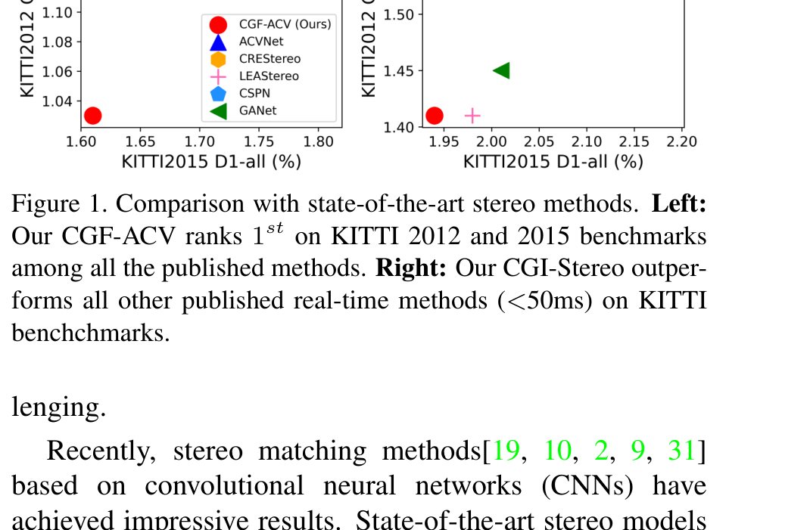
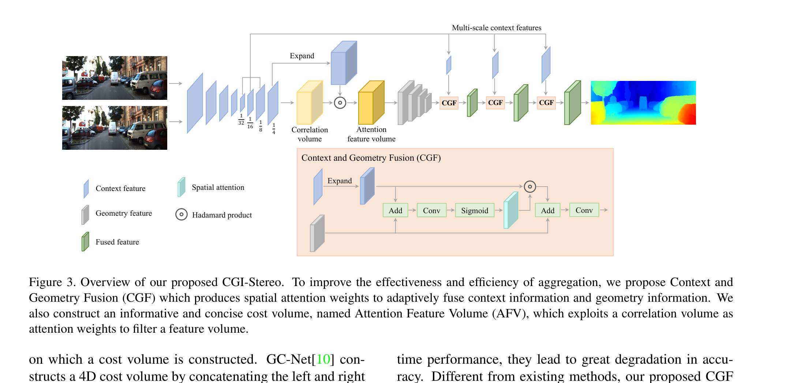
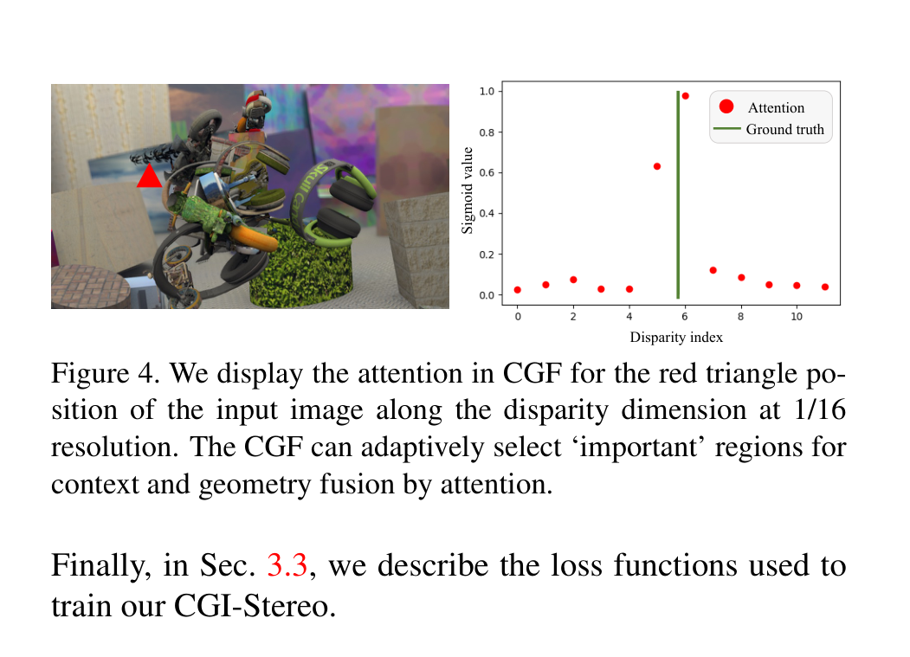
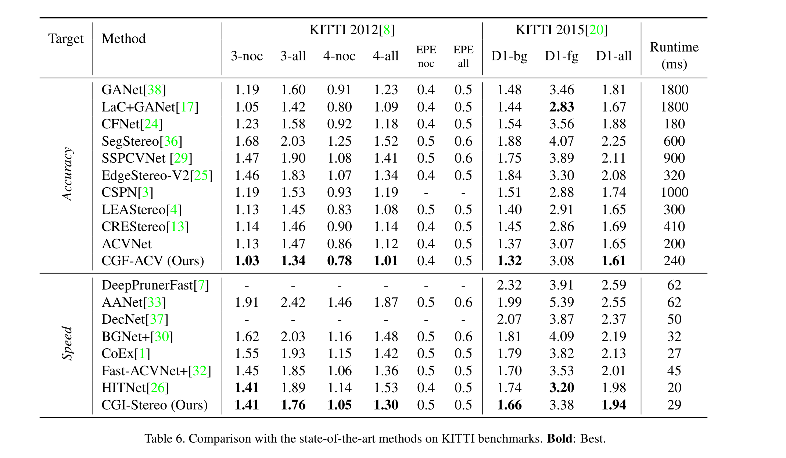
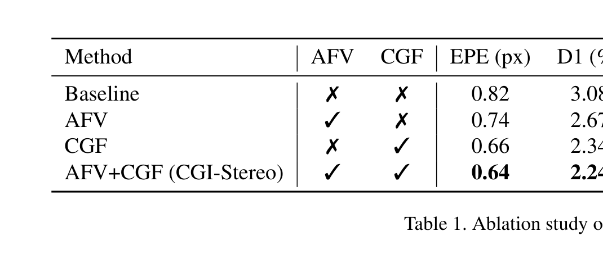

# CGI-Stereo: Accurate and Real-Time Stereo Matching via Context and Geometry Interaction

**Authors:** Gangwei Xu, Huan Zhou, Xin Yang (Huazhong University of Science and Technology)
**Venue:** arXiv 2023 (used as a baseline in CVPR/ICCV 2024+ efficient stereo papers)
**Priority:** 8/10 — one of the most-cited real-time baselines; the CGF block is a template for context-aware cost aggregation in edge models

---



## Core Problem & Motivation

All high-accuracy stereo matching networks rely on **3D encoder-decoder cost aggregation** (PSMNet, GwcNet, ACVNet, GANet). These aggregation networks are critical for recovering geometry in occluded/textureless/reflective regions where the raw cost volume is ambiguous — but **stacked 3D convolutions are computationally ruinous** for real-time deployment.

Two extremes existed in 2022:

1. **Heavy 3D aggregation** (PSMNet, GwcNet, GANet, ACVNet): 200–410 ms per stereo pair on RTX 3090, EPE ~0.76–1.09 on Scene Flow. Unusable for robotics, automotive, AR.
2. **Lightweight models** (BGNet, StereoNet, DeepPrunerFast, DecNet, CoEx, Fast-ACV): 15–62 ms but **great accuracy degradation**. They use low-resolution or sparse cost volumes and sacrifice the quality of geometry reasoning.

**The key question the paper asks:**
> *Can we design a lightweight 3D encoder-decoder aggregation net that is both accurate and real-time?*

### The Conceptual Blind Spot of Prior Work

Prior aggregation networks treat **context features** (from the reference RGB image) and **geometry features** (from the cost volume) as **two separate tensors with different dimensionalities**:

- **Context $C \in \mathbb{R}^{B \times C_0 \times H_0 \times W_0}$** — 4D tensor: batch, channel, spatial
- **Geometry $G \in \mathbb{R}^{B \times C_0 \times D_0 \times H_0 \times W_0}$** — 5D tensor: batch, channel, **disparity**, spatial

The 3D encoder-decoder in PSMNet/GwcNet operates **only on $G$** and only receives context indirectly via the initial cost volume. Context information never re-enters the aggregation pipeline — a huge waste, because context features encode exactly the semantic cues that resolve ambiguity in textureless regions.

CoEx (IROS 2021) partially addressed this with **cost-volume excitation** — but still used context only as a multiplicative gate.

**CGI-Stereo's insight:** Context should be *fused into* geometry **at every decoder scale**, using spatial attention to respect the unimodal disparity-dimension distribution of the geometry tensor. And crucially, the fusion must be **bidirectional** — allowing gradient from the cost aggregation loss to flow back to the context feature extractor.

---

## Architecture



The network has four stages: (1) multi-scale feature extraction, (2) Attention Feature Volume (AFV) construction, (3) 3D encoder-decoder aggregation interleaved with CGF blocks, (4) disparity regression with superpixel upsampling.

### Stage 1: Multi-scale Feature Extraction

- Backbone: **MobileNetV2 pretrained on ImageNet** — a deliberately lightweight choice, not a ResNet.
- Extract features at 1/4, 1/8, 1/16, 1/32 resolution.
- Top-down up-sampling pathway (following CoEx): each upsampling block uses a 4×4 transpose conv with stride 2, then concatenates the skip connection, then applies a 3×3 conv.
- Output: multi-scale context features at 1/4, 1/8, 1/16, 1/32 — these feed into correlation volume, AFV, and CGF.

### Stage 2: Attention Feature Volume (AFV)

The AFV is an "informative yet concise" cost volume — a hybrid between a correlation volume (concise) and a feature volume (expressive).

**Step 1 — correlation volume at 1/4 resolution (Eq. 3):**

$$V_{\text{corr}}(:, d, x, y) = \frac{\langle f_l(:, x, y),\, f_r(:, x-d, y)\rangle}{\Vert f_l(:, x, y)\Vert_2 \cdot \Vert f_r(:, x-d, y)\Vert_2}$$

- **$d$** = disparity index
- **$(x, y)$** = pixel coordinate in the left image
- **$f_l, f_r$** = left/right feature maps at 1/4 resolution
- **$\langle \cdot, \cdot\rangle$** = inner product across channel dimension
- The normalization by $\Vert \cdot \Vert_2$ makes this a **cosine similarity** — robust to feature magnitude.

**Step 2 — filter a feature volume with correlation weights:** the concatenated feature volume ${\bf F}_{\text{concat}}$ (left feat ‖ shifted right feat) is multiplied channel-wise by the correlation-volume attention weights. The result is a 4D tensor that retains rich per-disparity feature information but suppresses ambiguous disparities.

### Stage 3: Context and Geometry Fusion (CGF) — the core contribution



**Setup:**
- $C \in \mathbb{R}^{B \times C_0 \times H_0 \times W_0}$ — context feature from left image
- $G \in \mathbb{R}^{B \times C_0 \times D_0 \times H_0 \times W_0}$ — geometry feature from 3D conv applied to AFV
- $C$ is "expanded" (broadcast-copied) along the disparity dimension to match $G$'s shape, yielding $C_{\text{expand}} \in \mathbb{R}^{B \times C_0 \times D_0 \times H_0 \times W_0}$

**Why not just add $C_{\text{expand}} + G$?** The paper's most important conceptual argument:

> *Geometry features tend to have a unimodal distribution in the disparity dimension. Directly adding expanded context features shares context across disparity channels, ignoring differences in the disparity dimension and yielding ineffective fusion.*

Instead, CGF computes a **disparity-aware spatial attention mask** that says "where should we emphasize context fusion in (x, y, d) space?"

**CGF Equation 1 — spatial attention:**

$$A_s = \sigma(f^{5\times5}(G + C_{\text{expand}}))$$

- **$A_s \in \mathbb{R}^{B \times C_0 \times D_0 \times H_0 \times W_0}$** = spatial attention weights
- **$\sigma$** = sigmoid
- **$f^{5\times5}$** = a single 3D convolution with a $1 \times 5 \times 5$ kernel (1 on disparity, 5×5 spatial). Lightweight.
- $A_s$ encodes where context should be emphasized or suppressed at each $(d, x, y)$.

**CGF Equation 2 — gated fusion:**

$$G_{\text{fused}} = f^{5\times5}(G + A_s \odot C_{\text{expand}})$$

- **$\odot$** = Hadamard (element-wise) product
- First, context is gated by attention (suppress where attention is low).
- Then added to geometry and fused by a second $1\times5\times5$ conv.
- The output $G_{\text{fused}}$ flows into the next 3D decoder stage.

CGF is placed at **every 3D decoder level** (1/32 → 1/16 → 1/8 → 1/4). It's intentionally *not* placed in the 3D encoder — the ablation (Tab. 2) shows encoder-only CGF gives 0.74 EPE, decoder-only gives 0.64 EPE, both gives 0.64 EPE with more latency.

### Stage 4: Disparity Prediction

- Soft-argmax over **top-2 values only** at each pixel (CoEx-style) — produces low-res disparity $d_0 \in \mathbb{R}^{B \times 1 \times H/4 \times W/4}$.
- Superpixel-weight upsampling (following Yang et al., CVPR 2020) to recover full resolution $d_1 \in \mathbb{R}^{B \times 1 \times H \times W}$.

### Why "Interaction" and Not Just "Fusion"?

The paper carefully distinguishes its contribution: CGF enables **bidirectional gradient flow** between context and geometry. Tab. 3 of the paper:

| Gradient flow on context | EPE | D1 | >3px |
|-|-|-|-|
| Truncated (context → guide only) | 0.72 | 2.46 | 3.10 |
| **No truncating (full interaction)** | **0.64** | **2.24** | **2.80** |

When the gradient from cost aggregation flows back into the context extractor, **the context features themselves become more useful for matching**. This is why the authors call it "Interaction" — it's not one-way guidance, it's a closed feedback loop.

---

## Key Equations Summary

**Attention feature volume (correlation filter):**

$$V_{\text{corr}}(:, d, x, y) = \frac{\langle f_l(:, x, y),\, f_r(:, x-d, y)\rangle}{\Vert f_l(:, x, y)\Vert_2 \cdot \Vert f_r(:, x-d, y)\Vert_2} \quad \text{(3)}$$

**Spatial attention for CGF:**

$$A_s = \sigma(f^{5\times5}(G + C_{\text{expand}})) \quad \text{(1)}$$

**Gated context-geometry fusion:**

$$G_{\text{fused}} = f^{5\times5}(G + A_s \odot C_{\text{expand}}) \quad \text{(2)}$$

**Two-scale training loss:**

$$\mathcal{L} = \lambda_0 \cdot \text{SmoothL1}(d_0 - d_{\text{gt}}) + \lambda_1 \cdot \text{SmoothL1}(d_1 - d_{\text{gt}}) \quad \text{(5)}$$

- **$d_0$** = disparity at 1/4 resolution
- **$d_1$** = final full-resolution disparity after superpixel upsampling
- **$d_{\text{gt}}$** = ground-truth disparity
- **$\lambda_0 = 0.3, \lambda_1 = 1.0$** — final resolution weighted much more heavily.

SmoothL1 is the standard piecewise loss, quadratic below |x|=1 and linear above, which tolerates large errors on a few outlier pixels (typical at occlusion boundaries).

---

## Training

- **Framework:** PyTorch on NVIDIA RTX 3090.
- **Optimizer:** Adam ($\beta_1=0.9, \beta_2=0.999$).
- **Scene Flow pretraining:** 20 epochs at lr $10^{-3}$, decay by 2× at epochs 10, 14, 16, 18; then finetune for another 20 epochs.
- **KITTI finetuning:** 600 epochs on mixed KITTI 2012+2015 training sets; lr starts at $10^{-3}$, drops to $10^{-4}$ at epoch 300.
- Random cropping, color normalization with ImageNet statistics (standard).

No special tricks — what makes CGI-Stereo distinctive is the architecture, not the training recipe.

---

## Results



### Scene Flow (synthetic test set)

| Method | EPE (px) | Runtime (ms) |
|-|-|-|
| PSMNet | 1.09 | 410 |
| GwcNet | 0.76 | 320 |
| GANet | 0.84 | 360 |
| LEAStereo (NAS) | 0.78 | 300 |
| StereoNet | 1.10 | 15 |
| BGNet | 1.17 | 25 |
| DecNet | 0.84 | 50 |
| CoEx | 0.68 | 27 |
| **CGI-Stereo** | **0.64** | **29** |

**Headline:** CGI-Stereo is the first real-time method (<30 ms) to achieve EPE < 0.70, beating the much heavier GwcNet (320 ms) and approaching GANet/LEAStereo quality at ~10× the speed.

### KITTI 2012 + 2015 (test set, fine-tuned)

- **CGF-ACV** (CGF plugged into ACVNet) ranks **1st on KITTI 2012 and 2015** among all published methods at the time of submission, at 240 ms.
- **CGI-Stereo** (the full lightweight model, 29 ms) beats all published real-time methods on both benchmarks — KITTI 2015 D1-all = **1.94**, KITTI 2012 3-noc = **1.41**.

### Generalization (Scene Flow → Real, no real-data training)

| Method | KITTI 12 | KITTI 15 | Middlebury | ETH3D |
|-|-|-|-|-|
| PSMNet | 6.0 | 6.3 | 15.8 | 9.8 |
| GANet | 10.1 | 11.7 | 20.3 | 14.1 |
| CFNet | 5.1 | 6.0 | 15.4 | 5.3 |
| DSMNet (domain-generalized) | 6.2 | 6.5 | 13.8 | 6.2 |
| BGNet (real-time) | 12.5 | 11.7 | 24.7 | 22.6 |
| CoEx (real-time) | 7.6 | 7.2 | 14.5 | 9.0 |
| **CGI-Stereo (real-time)** | **6.0** | **5.8** | **13.5** | **6.3** |

CGI-Stereo beats the dedicated domain-generalized method DSMNet across the board **while being 55× faster**. This is a striking generalization result for a 29ms network.

### Ablation



| Config | EPE | D1 | Time |
|-|-|-|-|
| Baseline (no AFV, no CGF) | 0.82 | 3.08 | 27 |
| +AFV | 0.74 | 2.67 | 28 |
| +CGF | 0.66 | 2.34 | 28 |
| **+AFV+CGF (CGI-Stereo)** | **0.64** | **2.24** | **29** |

CGF gives the larger individual gain (0.82 → 0.66). AFV adds another 0.02 EPE on top for nearly free.

### CGF as a Drop-in Module

The CGF block plugged into other networks (PSMNet, GwcNet, ACVNet) reduces their KITTI 2015 D1-all by 8.8%–22.4%, confirming CGF is a general-purpose interaction module, not a one-off trick.

---

## Why It Works

1. **Disparity-aware context fusion.** Prior methods either broadcast context uniformly across disparity or only use context as a pre-filter. CGF computes attention on the joint $(d, x, y)$ grid so fusion respects the unimodal structure of geometry features.

2. **Decoder-stage injection.** The 3D encoder compresses geometry, but the decoder must **recover high-resolution geometry from low-resolution summary**. That's exactly where context cues (edges, object boundaries from the RGB image) are most useful — they tell the decoder *where* to place disparity transitions.

3. **Bidirectional gradient coupling.** Context features don't just guide geometry; cost-aggregation loss supervises context learning. This aligns the feature extractor with what the cost volume actually needs.

4. **Lightweight primitives only.** MobileNetV2 backbone + $1\times5\times5$ 3D convs + top-2 soft-argmax = no heavy 3D conv stacks. The model's 29 ms latency comes from systematic use of cheap ops.

5. **AFV compresses cost info.** Correlation-as-attention on a feature volume keeps feature richness while reducing channel count compared to concat volumes.

---

## Limitations / Failure Modes

- **Rich texture on smooth surfaces.** The paper explicitly calls out Fig. 6 third row: a stop marker on a sign becomes visible in the disparity map while the true disparity is smooth. The CGF's context attention over-reacts to texture that doesn't correspond to geometric variation. This is a fundamental tension: context cues include texture, but texture ≠ geometry.

- **Zero-shot Middlebury still weak** (13.5 >2px) vs. iterative methods (RAFT-Stereo: 12.6). Non-iterative cost aggregation hits a ceiling on cross-domain generalization that iterative refinement surpasses.

- **No iterative refinement.** CGI-Stereo predicts disparity in a single pass. On pathological occlusion or extreme disparity range (high-res stereo > 1000 px max disparity), no second-pass correction is possible.

- **MobileNetV2 backbone is dated.** Modern replacements (RepViT, MobileNetV4, FastViT) would likely improve both speed and accuracy.

- **No explicit confidence output.** Downstream consumers (SLAM, 3D reconstruction) benefit from per-pixel confidence that CGI-Stereo doesn't produce.

- **KITTI 2015 D1-fg (3.38)** is notably worse than D1-bg (1.66) — foreground objects (cars, pedestrians) are still the weak spot, consistent with the "context over-reacts to object texture" observation.

---

## Relevance to Our Edge Model

CGI-Stereo is one of the three or four must-integrate ideas for a Jetson Orin Nano stereo model targeting <33 ms latency.

### Directly adoptable

1. **CGF block architecture.** The $A_s = \sigma(f^{5\times5}(G + C_{\text{expand}}))$ + $G_{\text{fused}} = f^{5\times5}(G + A_s \odot C_{\text{expand}})$ pattern is cheap (two 1×5×5 3D convs) and gives large accuracy gain. Our edge model should place CGF at every decoder stage of whatever 3D aggregation we keep.

2. **AFV construction.** The correlation-volume-as-attention-on-feature-volume trick retains the benefits of both without the channel cost of concat volumes.

3. **MobileNetV2-style backbone.** CGI-Stereo validates that a cheap ImageNet-pretrained mobile backbone is sufficient for competitive stereo — we don't need ResNet-50 or ViT-B. For our model, RepViT or MobileNetV4 are direct upgrades.

4. **Top-2 soft-argmax.** Dramatically cheaper than full soft-argmax over 192 disparities, with no accuracy loss (CoEx + CGI-Stereo both use it).

5. **Superpixel upsampling.** Low-res (1/4) prediction + learned upsampling beats direct full-res prediction.

### Adaptations

- **Replace MobileNetV2 with RepViT** (Pip-Stereo's choice).
- **Distill monocular priors into the backbone** (DEFOM-Stereo's idea, Pip-Stereo's MPT training recipe) without adding ViT at inference.
- **Optionally retain CGF** but replace the 3D encoder-decoder with a lightweight 2D-only aggregation (LightStereo-style) if 3D convs are too slow on Orin Nano NPU.

### Cautions

- **CGF requires non-truncated gradient flow** — if we freeze the backbone (e.g., after distillation), CGF loses half its benefit. Unfreezing the last backbone stage during CGF training is necessary.
- **Single-pass methods like CGI-Stereo generalize worse than iterative ones.** For Middlebury/ETH3D zero-shot, we should pair CGI-Stereo-style aggregation with at least a few GRU refinement iterations (à la IGEV/Pip-Stereo).

### Architectural Integration Sketch

```
Stereo Pair
    ↓
[RepViT Backbone with distilled mono priors]     ← from Pip-Stereo/DEFOM
    ↓
[Multi-scale context features 1/4,1/8,1/16,1/32] ← from CGI-Stereo
    ↓
[Attention Feature Volume at 1/4]                ← from CGI-Stereo
    ↓
[Lightweight 3D encoder]
    ↓
[Decoder with CGF at each scale]                 ← from CGI-Stereo
    ↓
[IGEV-style warm init for GRU]                   ← from IGEV-Stereo
    ↓
[1–4 GRU iterations with PIP distillation]       ← from Pip-Stereo
    ↓
[Superpixel upsampling to full resolution]       ← from CGI-Stereo
    ↓
Disparity
```

---

## Connections to Other Papers

| Paper | Relationship |
|-|-|
| **CoEx** (IROS 2021) | Direct predecessor — CGF generalizes CoEx's guided cost volume excitation from a gate to full attention+fusion |
| **ACVNet** (CVPR 2022) | CGF plugs into ACVNet to form CGF-ACV which hits KITTI #1 |
| **GwcNet / PSMNet** | CGF is also demonstrated to improve these as drop-in module |
| **BGNet** | Competing real-time approach — uses bilateral grid upsampling instead of CGF |
| **LightStereo** | Later work that avoids 3D convs entirely; CGI-Stereo is its most-cited real-time baseline |
| **Fast-ACVNet** | Sparse-cost-volume competitor; CGI-Stereo beats it on both accuracy and speed |
| **Pip-Stereo** | Iterative method; uses CGI-Stereo as one of the non-iterative baselines showing CGI-Stereo's Middlebury generalization ceiling |
| **DSMNet** | Domain-generalized method; CGI-Stereo beats it at 1/55th the latency |
| **IGEV-Stereo / Selective-IGEV** | Iterative descendants; do not use CGF but do use MobileNet-style backbones and superpixel upsampling like CGI-Stereo |
