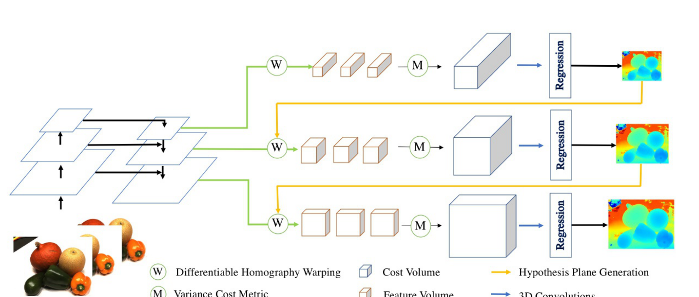
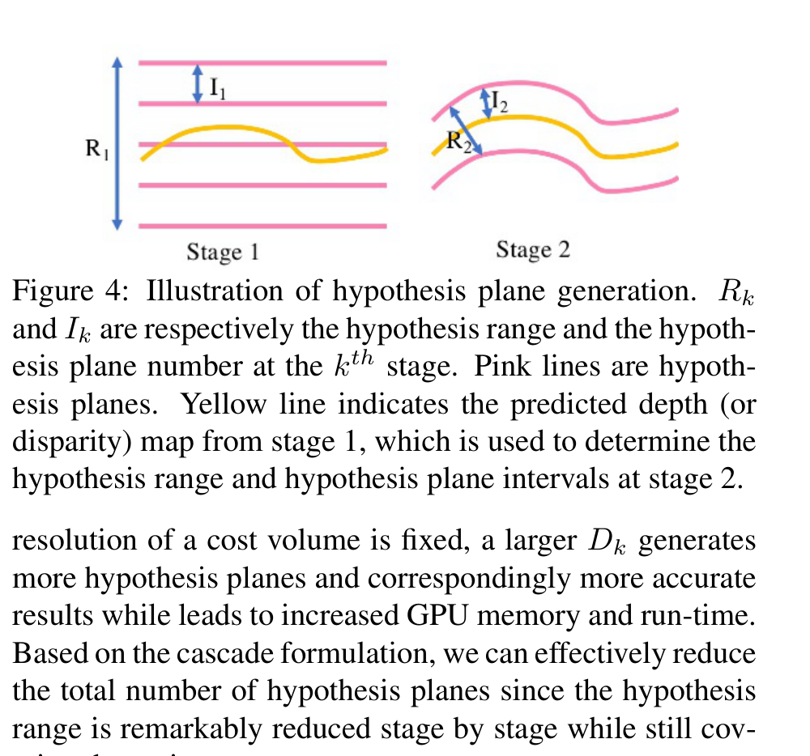
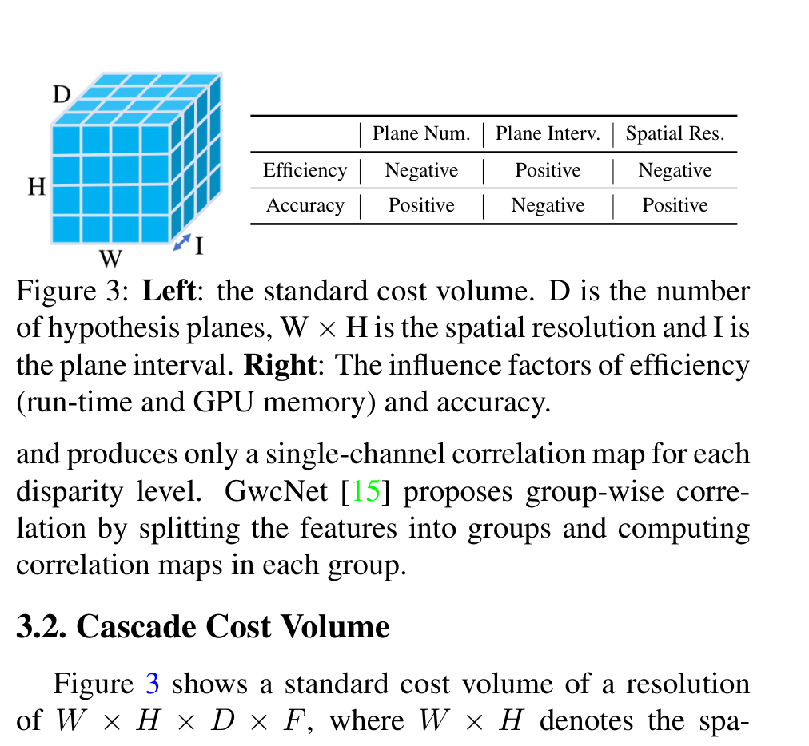
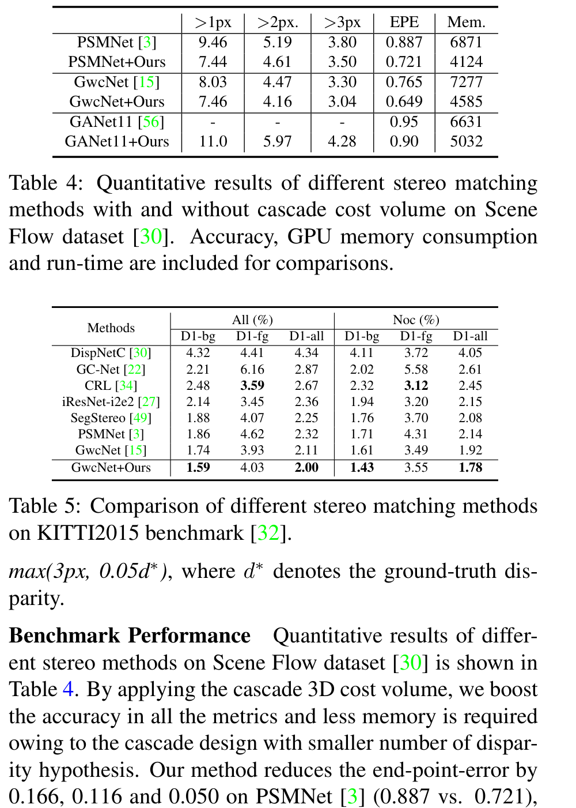

# Cascade Cost Volume for High-Resolution Multi-View Stereo and Stereo Matching

**Authors:** Xiaodong Gu, Zhiwen Fan, Zuozhuo Dai, Siyu Zhu, Feitong Tan, Ping Tan (Alibaba A.I. Labs + Simon Fraser University)
**Venue:** CVPR 2020
**Priority:** 9/10 — this paper introduces the **coarse-to-fine cost volume narrowing** recipe that became foundational for almost every efficient stereo and MVS method since. CFNet, ACVNet, BGNet, HITNet, IGEV++, GwcNet+Cascade, and many others build directly on this formulation.

---

## Core Problem & Motivation

3D-cost-volume stereo networks (GC-Net, PSMNet, GwcNet, GANet) deliver SOTA accuracy but face a **cubic scaling wall**: GPU memory and runtime grow as $O(W \cdot H \cdot D)$ where $D$ is the number of disparity candidates. For a 1600×1184 image with $D=256$, even MVSNet requires the **full 16 GB of a Tesla P100**. High-resolution stereo is effectively barred from these methods.

The standard dodge is to **downsample feature maps before constructing the volume** (commonly to $1/4$) and then **upsample the predicted disparity** (via bilinear + refinement modules). This works but:
- The cost volume is still computed at coarse spatial resolution — fine details (thin structures, depth boundaries) are lost and must be reconstructed by the 2D-conv refinement module,
- Memory and compute are still dominated by the single full-range 3D volume, and
- The method caps out at roughly $1/4$-resolution predictions even with tricks.

### The Key Insight

Cascade Cost Volume replaces the **single full-range, moderate-resolution** cost volume with **multiple stages of progressively narrower, higher-resolution** cost volumes:

- Stage 1: full disparity range $R_1$, coarse spatial resolution (e.g., $1/16$), sparse disparity sampling (e.g., $48$ planes), large plane interval $I_1$.
- Stage 2: narrower disparity range $R_2 = R_1 \cdot w_1$ (centered on stage-1's prediction), medium spatial resolution (e.g., $1/4$), fewer planes but finer interval.
- Stage 3 (MVS only): even narrower range, full resolution, finest interval.

Because each stage uses **much fewer disparity planes** (and the cost volume scales linearly with plane count), the total compute drops dramatically — in MVS: **50.6% less GPU memory, 59.3% less runtime, and 35.6% better accuracy on DTU** compared to MVSNet.

### Why It Matters for Stereo

Adapted to stereo (2 stages, plane counts $(12, 12)$, disparity intervals $(4, 1)$, spatial resolutions $(1/16, 1/4)$), Cascade Cost Volume applied to GwcNet reduces memory **36.99%** and improves EPE **15.2%** on SceneFlow. The same recipe applied to PSMNet yields EPE improvement from 0.887 to 0.721 with memory dropping from 6871 to 4124 MB. **These gains come "for free"** — no backbone changes, no new module design, just rewiring the cost-volume construction.

For our edge model, Cascade Cost Volume is the **primary memory-reduction lever** we can pull before touching the rest of the iterative architecture.

---

## Architecture

### High-Level MVS Pipeline



```
Reference + Source Images
    ↓
[Feature Pyramid Network]                ← features at 1/16, 1/4, 1 resolutions
    ↓
┌─ Stage 1 (P_1 features, 1/16 resolution) ─┐
│   Disparity range R_1 = full range        │
│   Plane interval I_1 (largest)            │
│   D_1 = 48 planes                         │
│   → Warping → Variance cost → 3D-Conv     │
│   → Regression → coarse disparity         │
└────────────────────┬───────────────────────┘
                     ↓ (predicted disparity feeds range narrowing)
┌─ Stage 2 (P_2 features, 1/4 resolution) ──┐
│   R_2 = R_1 · w_1, centered on stage-1 d  │
│   I_2 = I_1 · p_1 (finer interval)        │
│   D_2 = 32 planes                         │
│   → Warping → Variance cost → 3D-Conv     │
│   → Regression → mid-res disparity        │
└────────────────────┬───────────────────────┘
                     ↓
┌─ Stage 3 (P_3 features, 1/1 resolution) ──┐
│   R_3 = R_2 · w_2, centered on stage-2 d  │
│   I_3 = I_2 · p_2 (finest)                │
│   D_3 = 8 planes                          │
│   → Warping → Variance cost → 3D-Conv     │
│   → Regression → full-res disparity/depth │
└────────────────────────────────────────────┘
```

For stereo matching, this is reduced to **2 stages** with plane counts $(12, 12)$ and spatial resolutions $(1/16, 1/4)$. The disparity intervals at stage 1 and 2 are $4$ and $1$ pixels respectively. Maximum disparity is 192.

### Component 1 — Feature Pyramid Network (FPN)

The multi-scale feature extractor (FPN-style with top-down pathway) produces:
- $P_1$: coarsest features ($1/16$ resolution for MVS, $1/16$ for stereo).
- $P_2$: middle ($1/4$).
- $P_3$: finest (full resolution for MVS, $1/4$ for stereo's 2-stage variant).

These features carry progressively finer spatial detail; the cost volume at each stage consumes the corresponding $P_i$. Crucially, the **same FPN is shared across stages** — there is one feature extraction per image, not one per stage.

### Component 2 — Cost Volume Construction at Each Stage

For stereo matching, at stage $k+1$:

1. Compute **hypothesis range**: $R_{k+1} = R_k \cdot w_k$, where $w_k < 1$ is a reducing factor.
2. Compute **hypothesis plane interval**: $I_{k+1} = I_k \cdot p_k$, where $p_k < 1$.
3. Derive **number of planes**: $D_{k+1} = R_{k+1} / I_{k+1}$.
4. For each pixel $m$, the planes are centered on the stage-$k$ prediction $d_k^m$:
   - Candidate disparities are $d_k^m + \Delta_{k+1}^m$ where $\Delta_{k+1}^m$ spans the new narrower range $R_{k+1}$ at interval $I_{k+1}$.
5. Warp the right feature $F_r$ by each candidate disparity (per-pixel), build a per-pixel feature volume.
6. Aggregate into a **variance-based cost volume** (for MVSNet variant) or **concatenation / group-wise correlation** (for PSMNet / GwcNet variants).
7. Regularize with 3D convolutions and regress with soft-argmin.

### Component 3 — Hypothesis Range Narrowing



The figure illustrates stage 1 (wide range $R_1$, coarse interval $I_1$) vs stage 2 (narrow range $R_2$ centered on stage-1 prediction, fine interval $I_2$). The yellow line is the stage-1 disparity prediction, which determines **where** the stage-2 planes are placed (centered on this curve).

This is the paper's headline mechanism: **the planes "follow" the scene geometry**. Stage 2's limited compute budget is spent right around the correct disparity, not wasted on regions already known to be wrong. This is why total compute can drop so dramatically.

### Component 4 — Standard Cost Volume (The Baseline)



The baseline is shown for comparison: a single cost volume of shape $W \times H \times D \times F$ where $W \times H$ is spatial resolution, $D$ is disparity plane count, $F$ is feature channel count. Increasing $D$, $W \times H$, or fineness of plane interval $I$ increases accuracy (positive) but also increases GPU memory and runtime (negative).

**Cascade cost volume circumvents the trade-off**: it gets fine intervals, high spatial resolution, and full range coverage — but only one of those "expensive" dimensions is active per stage.

### Component 5 — Warping Operation (Stereo)

For stereo, the coordinate mapping at stage $k+1$ is:

$$C_r(d_k^m + \Delta_{k+1}^m) = X_l - (d_k^m + \Delta_{k+1}^m) \quad \text{(4)}$$

- **$X_l$** = x-coordinate in the left (reference) image.
- **$d_k^m$** = disparity predicted at stage $k$ for pixel $m$ (fed forward from previous stage).
- **$\Delta_{k+1}^m$** = residual disparity candidate to learn at stage $k+1$ — spans the narrow range $R_{k+1}$ at interval $I_{k+1}$.
- **$C_r(\cdot)$** = target x-coordinate in the right image to sample for building the right feature volume.

Analogous to this, the MVSNet-variant warping uses differentiable homography (Eq. 3 in paper):

$$H_i(d_k^m + \Delta_{k+1}^m) = K_i \cdot R_i \cdot \left( I - \frac{(t_1 - t_i) \cdot n_1^T}{d_k^m + \Delta_{k+1}^m} \right) \cdot R_1^T \cdot K_1^{-1} \quad \text{(3)}$$

- **$K_i, R_i, t_i$** = camera intrinsics, rotations, translations of the $i$-th view.
- **$n_1$** = principal axis of the reference camera.
- **$d_k^m + \Delta_{k+1}^m$** = current depth hypothesis for the $m$-th pixel at stage $k+1$.

### Component 6 — Multi-Stage Loss

$$\text{Loss} = \sum_{k=1}^{N} \lambda_k \cdot L_k \quad \text{(5)}$$

- **$N$** = total number of stages (3 for MVS, 2 for stereo).
- **$L_k$** = loss at stage $k$, same smooth-L1 / cross-entropy loss as the baseline network (PSMNet, GwcNet, MVSNet).
- **$\lambda_k$** = per-stage weight, typically increasing with stage depth so the finest stage dominates.
- Ground truth is downsampled (bilinearly for MVS, average-pooled for stereo sparse GT) to the resolution of each stage.

---

## Key Equations

**Hypothesis range narrowing (core mechanism):**

$$R_{k+1} = R_k \cdot w_k \quad \text{(narrowing factor $w_k < 1$)}$$

- **$R_k$** = disparity hypothesis range at stage $k$. $R_1$ covers full range (e.g., $0$ to $192$ pixels for stereo).
- **$w_k$** = reducing factor between stages. For stereo with intervals $(4, 1)$ and plane counts $(12, 12)$, $R_1 = 48$ pixels and $R_2 = 12$ pixels → $w_1 = 1/4$.

**Hypothesis plane interval refinement:**

$$I_{k+1} = I_k \cdot p_k \quad \text{(refinement factor $p_k < 1$)}$$

- **$I_k$** = plane interval (spacing between adjacent disparity hypotheses). Finer interval = more accurate but more compute.
- **$p_k$** = refinement factor. For stereo: $I_1 = 4$ px, $I_2 = 1$ px → $p_1 = 1/4$.

**Number of planes:**

$$D_k = R_k / I_k$$

- For stereo cascade: $D_1 = 48/4 = 12$, $D_2 = 12/1 = 12$.
- Total planes across stages: $24$. Contrast to PSMNet's single volume at 192 planes — **an 8× reduction in the disparity dimension** summed over stages.

**Spatial resolution progression:**

$$\text{Resolution at stage } k = \frac{W}{2^{N-k}} \times \frac{H}{2^{N-k}}$$

- **$N$** = total number of stages.
- Stage 1: $W/2^{N-1} \times H/2^{N-1}$ (coarsest).
- Stage $N$: $W \times H$ (finest, for MVS) or $W/4 \times H/4$ (for 2-stage stereo).

**Stereo warping (Eq. 4):**

$$C_r(d_k^m + \Delta_{k+1}^m) = X_l - (d_k^m + \Delta_{k+1}^m) \quad \text{(4)}$$

(Variable definitions above under "Warping Operation".)

**MVS homography warping (Eq. 3):**

$$H_i(d_k^m + \Delta_{k+1}^m) = K_i \cdot R_i \cdot \left( I - \frac{(t_1 - t_i) \cdot n_1^T}{d_k^m + \Delta_{k+1}^m} \right) \cdot R_1^T \cdot K_1^{-1} \quad \text{(3)}$$

(Variable definitions above.)

**Total loss (Eq. 5):**

$$\text{Loss} = \sum_{k=1}^{N} \lambda_k \cdot L_k \quad \text{(5)}$$

- **$L_k$** = per-stage disparity regression loss (same form as the underlying baseline: smooth-L1 for stereo, cross-entropy for MVS).
- **$\lambda_k$** = per-stage weighting. In practice set so that later stages dominate but earlier stages still have significant gradient signal.

---

## Training

- **Supervision:** multi-stage smooth-L1 loss on disparity predictions at each stage (stereo) or cross-entropy on depth probabilities (MVS). Ground truth downsampled per stage.
- **Datasets:**
  - **MVS:** DTU dataset — 124 scenes with 49 or 64 views each under 7 lighting conditions. Tanks and Temples (8 intermediate scenes) for cross-dataset generalization.
  - **Stereo:** SceneFlow (finalpass, 35,454 train / 4,370 test), KITTI 2015 (200 train / 200 test), Middlebury (60 high-res pairs).
- **Implementation for MVS (MVSNet + Cascade):** 3 stages, plane counts $(48, 32, 8)$, depth intervals $(4, 2, 1)$× MVSNet's baseline, spatial resolutions $(1/16, 1/4, 1)$. Training at $640 \times 512$.
- **Implementation for stereo (PSMNet / GwcNet / GANet11 + Cascade):** 2 stages, plane counts $(12, 12)$, disparity intervals $(4, 1)$, spatial resolutions $(1/16, 1/4)$. Max disparity 192.
- **Optimizer:** Adam ($\beta_1 = 0.9, \beta_2 = 0.999$).
- **MVS training:** 16 epochs, initial LR $10^{-3}$ with factor-of-2 decay at epochs 10, 12, 14. 8 × GTX 1080Ti GPUs, batch 2 per GPU.
- **Stereo training:** follows the baseline network's original training protocol for fair comparison (so e.g., PSMNet+Ours uses PSMNet's training setup).
- **Post-processing (MVS):** fusibile for depth fusion (photometric + geometric filter + fusion).

---

## Results

### MVS on DTU (Table 1)

| Method | Acc. (mm) | Comp. (mm) | Overall (mm) | GPU Mem (MB) | Runtime (s) |
|--------|----------|-----------|--------------|--------------|-------------|
| Gipuma | 0.283 | 0.873 | 0.578 | – | – |
| R-MVSNet | 0.383 | 0.452 | 0.417 | 7577 | 1.28 |
| P-MVSNet | 0.406 | 0.434 | 0.420 | – | – |
| Point-MVSNet | 0.342 | 0.411 | 0.376 | 8731 | 3.35 |
| MVSNet (D=192) | 0.456 | 0.646 | 0.551 | 10823 | 1.210 |
| **MVSNet+Cascade** | **0.325** | **0.385** | **0.355** | **5345** | **0.492** |
| **Improvement vs MVSNet** | **28.7%** | **40.4%** | **35.6%** | **50.6%** | **59.3%** |

Rank: **1st on DTU at submission time**. Simultaneous 35.6% accuracy improvement with 50.6% memory reduction and 59.3% runtime reduction is the kind of uncommon dominance that signals a fundamental architectural insight.

### Tanks and Temples (Table 2)

MVSNet+Cascade: **rank 9.5** vs MVSNet rank 52 — improvement of 52 → 9.5 places (at submission time). Demonstrates the method's generalization to unseen scenes.

### Stereo on SceneFlow (Table 4)



| Method | >1px | >2px | >3px | EPE | Memory (MB) |
|--------|------|------|------|-----|-------------|
| PSMNet | 9.46 | 5.19 | 3.80 | 0.887 | 6871 |
| **PSMNet + Cascade** | **7.44** | **4.61** | **3.50** | **0.721** | **4124** |
| GwcNet | 8.03 | 4.47 | 3.30 | 0.765 | 7277 |
| **GwcNet + Cascade** | **7.46** | **4.16** | **3.04** | **0.649** | **4585** |
| GANet11 | – | – | – | 0.95 | 6631 |
| **GANet11 + Cascade** | 11.0 | 5.97 | 4.28 | **0.90** | **5032** |

- PSMNet EPE improvement: **18.7%** (0.887 → 0.721).
- GwcNet EPE improvement: **15.2%** (0.765 → 0.649).
- Memory reduction: **40.0% / 37.0% / 24.1%** across PSMNet / GwcNet / GANet.

### Stereo on KITTI 2015 (Table 5)

GwcNet+Cascade achieves D1-all 2.00 (all) / 1.78 (noc), compared to GwcNet 2.11 / 1.92 — solid improvement. **KITTI rank rose from 29th to 17th** at submission time.

### Stage-wise Ablation on DTU (Table 3)

| Stage | Resolution | >2mm (%) | >8mm (%) | Overall (mm) | GPU Mem (MB) | Runtime (s) |
|-------|-----------|---------|---------|--------------|--------------|-------------|
| 1 | 1/4 × 1/4 | 0.310 | 0.163 | 0.602 | 2373 | 0.081 |
| 2 | 1/2 × 1/2 | 0.208 | 0.084 | 0.401 | 4093 | 0.243 |
| 3 | 1/1 × 1/1 | 0.174 | 0.077 | 0.355 | 5345 | 0.492 |

Each stage substantially improves accuracy — no collapse at any stage. Both memory and time grow moderately because later stages have fewer disparity planes even though spatial resolution is larger.

### Ablations on Stage Number, Spatial Resolution, Feature Pyramid, Weight Sharing (Tables 6 & 7)

- **Stage number**: 2 or 3 stages both outperform the baseline; 4 stages gives diminishing returns.
- **Shared vs separate weights across stages**: separate weights (different 3D regularizer per stage) **outperform shared** (0.431 vs 0.451 Overall on DTU). Each stage refines a distinct residual, so weight sharing is suboptimal.
- **Feature pyramid vs bilinear upsample**: using FPN features (MVSNet+Ours) gives 0.355 Overall vs 0.379 with bilinearly upsampled features — FPN's semantic-fine features are genuinely useful.

---

## Why It Works

### Insight 1 — Coarse-to-Fine Range Narrowing Escapes Cubic Scaling

A single-stage volume is cubic in resolution × disparity. Cascade Cost Volume **decouples** those dimensions:
- Early stages: high disparity plane count, low spatial resolution.
- Late stages: low disparity plane count (because the range is narrow), high spatial resolution.

The product of "plane count × spatial cells × feature channels" per stage is **far smaller** than a single full-resolution full-range volume, and the total across stages still fits within the baseline's compute budget while producing much better accuracy.

### Insight 2 — Refinement on Pyramid Features Is More Powerful Than 2D-Conv Refinement

Prior efficient methods (e.g., DeepPruner, many refinement modules) use 2D-conv refinement on a low-resolution disparity map. This cannot recover sub-pixel structure in high-frequency regions (thin objects, depth discontinuities) because the 2D refinement has no access to per-candidate matching costs at high resolution.

Cascade Cost Volume **does a full cost-volume matching at high resolution**, just over a narrow disparity range. It keeps the 3D-matching inductive bias all the way to the final stage, which is why the thin-structure and boundary accuracy is so much better than refinement-only approaches.

### Insight 3 — Range-Narrowing ≈ Implicit Attention

By placing the stage-$k+1$ planes around the stage-$k$ prediction, the network effectively says "trust the coarser prediction as a spatial attention prior" — compute is spent only on disparities that could plausibly correct it. This is a form of **learned, input-adaptive cost-volume pruning** similar to what DeepPruner and later BGNet would do with confidence-guided sparsification.

### Insight 4 — Multi-Stage Loss Provides Strong Gradient Signal at Every Scale

Supervising each stage separately (Eq. 5) ensures the FPN features at all levels remain discriminative — no stage can "free-ride" on the subsequent refinement. This also means the stage-1 prediction is genuinely useful (0.602 Overall on DTU alone) and could be used as a fast mode if needed.

---

## Limitations / Failure Modes

- **Error propagation between stages**: if stage 1's disparity is badly wrong by more than $R_2 / 2$, stage 2 cannot recover because the correct disparity is **outside** stage 2's narrower search range. This is particularly problematic in textureless regions or occlusions where stage 1 may confidently predict a wrong mode.
- **Winner-takes-all dynamic**: each stage outputs a single disparity via soft-argmin, inheriting the **mode-averaging problem** that CoEx and HD3 identified. CascadeCV does not address this directly.
- **Still not iterative**: each stage is visited once. No re-querying of correlation, no recurrent refinement. This is why later iterative methods (RAFT-Stereo, IGEV-Stereo) came along and gave further gains on top of cascade designs.
- **Ranges and intervals are hyperparameters, not learned**: the narrowing factors $w_k$ and $p_k$ are fixed per architecture. Could in principle be learned per-pixel (adaptive narrowing) — BGNet and PCVNet later explored this.
- **Stereo variant limited to 2 stages**: more stages give diminishing returns because the disparity range is naturally bounded. MVS with its unbounded depth range benefits more from 3 stages.
- **Runtime gains are less dramatic in stereo than MVS**: MVS gains 59.3% runtime reduction; stereo gains are more modest (~20-30%). The reason is that stereo's baseline already has a relatively small disparity range (192 vs MVS's 256+ depth hypotheses at arbitrary scale).
- **Does not directly address iterative refinement compute**: for modern iterative methods the cost volume is built once; cascade's savings are locked into feed-forward networks like PSMNet/GwcNet unless specifically re-engineered.

---

## Relevance to Our Edge Model

Cascade Cost Volume is arguably **the single most important efficiency lever** we can apply to our edge stereo model. Nearly every subsequent efficient-stereo method uses a cascade-style design.

### Directly Adoptable

1. **2-stage cascade for stereo at $(1/16, 1/4)$ resolutions with plane counts $(12, 12)$.** This is the proven recipe. We should start with this configuration and measure Orin Nano latency before expanding.

2. **Per-pixel disparity-range narrowing** fed from coarse stage to fine stage. The coarse stage's soft-argmin output centers the fine stage's planes. No free parameters to learn — deterministic.

3. **FPN-style feature pyramid backbone.** Multi-scale features are reused across stages, so feature extraction is amortized. Our MobileNetV4 or RepViT backbone should expose $(1/16, 1/8, 1/4)$ features for cascade consumption.

4. **Separate 3D-conv regularizers per stage (not shared).** Table 6/7 confirm weight sharing hurts. Each stage should have its own compact 3D hourglass (e.g., 4–6 layers).

5. **Multi-stage smooth-L1 supervision with increasing weights.** $\lambda = (0.5, 1.0)$ or $(0.3, 0.7, 1.0)$ for 3 stages.

### How This Combines With Our Other Inspirations

```
Stereo Pair
    ↓
[Mobile Backbone with FPN]
(distilled from Depth Anything V2 via MPT — Pip-Stereo)
    ↓
[Cascade Cost Volume Stage 1]          ← CascadeCV
(1/16 res, 12 planes, full disparity range)
    ↓
[GCE channel gating]                    ← CoEx
[3D-conv hourglass, small]
    ↓
[Top-k soft-argmin to seed stage 2]     ← CoEx
    ↓
[Cascade Cost Volume Stage 2]          ← CascadeCV
(1/4 res, 12 planes, narrow range around stage-1 prediction)
    ↓
[GCE channel gating + GEV]              ← CoEx + IGEV-Stereo
    ↓
[Warm start initial disparity]          ← IGEV-style
    ↓
[SRU × 1-4 iterations with PIP pruning] ← Selective-Stereo + Pip-Stereo
    ↓
[Convex upsampling]                     ← RAFT-Stereo
    ↓
Disparity + Confidence Map              ← HD3-inspired density readout
```

### Key Engineering Notes

- **Disparity range**: for KITTI/automotive, $R_1 = 192$ is standard. For general robotics, may need $R_1 = 256$.
- **Interval 1 at stage 1**: we could experiment with $I_1 = 2$ (96 planes stage 1) — sacrifice 2× stage-1 compute for better narrowing accuracy. But this is the tuning knob.
- **Stage 1 as early-exit**: the stage-1 disparity itself is usable for low-latency applications. Budget 5-10 ms for stage 1 alone on Orin Nano.
- **Pre-warping at stage 2+**: stage 2's features can be **pre-warped** by the stage-1 disparity to reduce effective search range further. A dense shift operation, cheap on GPU.
- **Memory profiling matters**: Orin Nano has 8 GB total LPDDR5. A cascade design with 2 stages at $(1/16, 1/4)$ should fit comfortably; expansion to stage 3 needs careful memory accounting.

### Cautions

- **Error propagation**: ensure stage 1's confidence is high before shrinking stage 2's range. A simple safeguard: widen stage-2's range by $\pm 1$-$2$ extra planes for robustness.
- **Interaction with iterative GRU updates**: cascade + iterative refinement is the combination IGEV++ uses. Be careful that the GRU iterates on a volume small enough (cascade-narrowed) that each iteration is cheap.
- **Not all baselines benefit equally**: GANet11's improvement from cascade was smaller (5% EPE reduction) than PSMNet's (19%) — methods with already-heavy aggregation may hit diminishing returns.

---

## Connections to Other Papers

| Paper | Relationship |
|-------|-------------|
| **MVSNet (Yao et al., ECCV 2018)** | Direct base architecture — CascadeCV's headline variant is MVSNet+Cascade |
| **PSMNet / GwcNet / GANet11** | Stereo baselines — all three get improvements when combined with Cascade |
| **FPN (Lin et al., CVPR 2017)** | Feature pyramid backbone used for multi-scale features |
| **HD3 (CVPR 2019)** | Conceptually related: both do hierarchical coarse-to-fine refinement. HD3 in density space; CascadeCV in cost-volume space |
| **DeepPruner (ICCV 2019)** | Differentiable PatchMatch for narrowing disparity search — different mechanism, similar goal |
| **Point-MVSNet (ICCV 2019)** | Alternative point-based refinement — CascadeCV outperforms at less memory and time |
| **AnyNet (ICRA 2019)** | Anytime stereo — progressive prediction at multiple resolutions, conceptual ancestor |
| **CFNet (CVPR 2021)** | Direct successor: **Cascade and Fused** cost volume — explicitly builds on CascadeCV with a domain-adaptive variance module |
| **ACVNet (CVPR 2022)** | Attention-based cascade cost volume — combines cascade with attention aggregation |
| **BGNet (CVPR 2021)** | Uses bilateral grid to upsample low-res cost volumes — compatible with cascade narrowing |
| **HITNet (CVPR 2021)** | Uses multi-scale tile hypotheses — cascade-like in spirit but at tile level |
| **IGEV-Stereo (CVPR 2023)** | Combines cascade-style geometry encoding with iterative updates — direct descendant |
| **IGEV++** | Adaptive multi-scale iterative updates, benefits from cascade's range narrowing |
| **Fast-ACVNet** | Efficient cascade variant — one of the first real-time cascade models |

Cascade Cost Volume's influence is impossible to overstate: it is the architectural motif behind nearly every efficient 3D-cost-volume stereo and MVS method since 2020. For our edge model's review paper, this is a **foundational reference** that must be covered in the efficient-stereo section alongside BGNet, HITNet, and CoEx.
