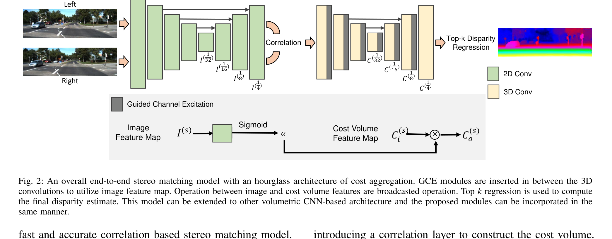
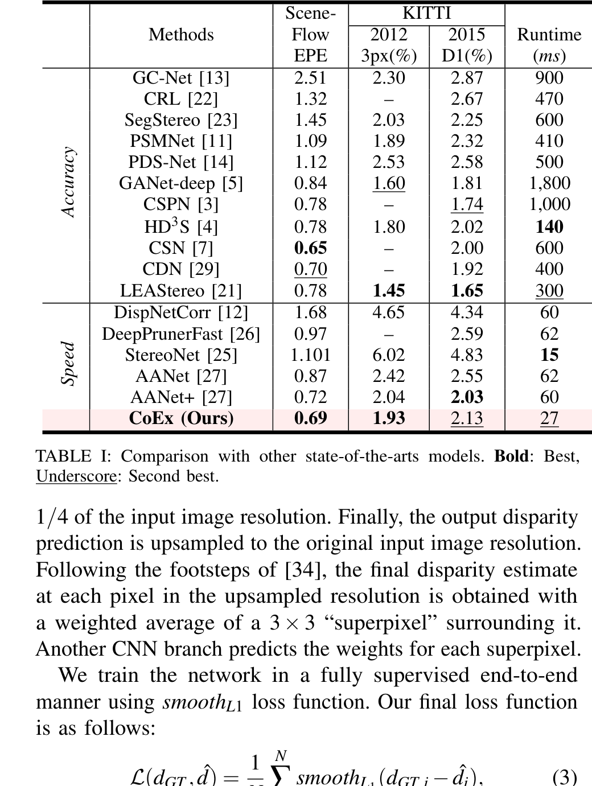
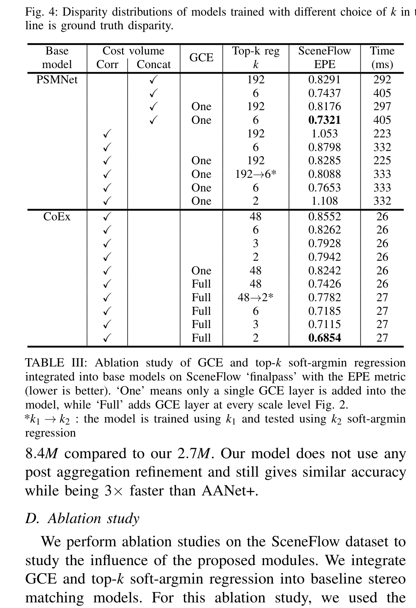
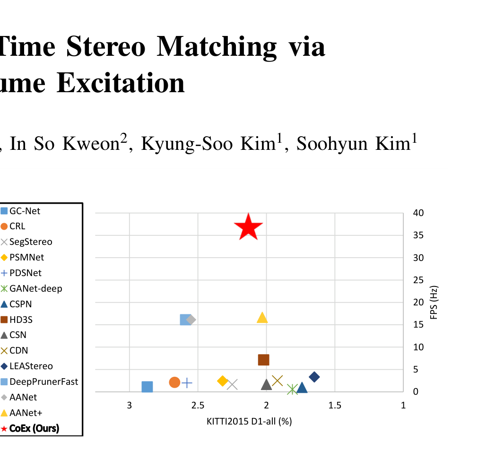

# CoEx: Correlate-and-Excite — Real-Time Stereo Matching via Guided Cost Volume Excitation

**Authors:** Antyanta Bangunharcana, Jae Won Cho, Seokju Lee, In So Kweon, Kyung-Soo Kim, Soohyun Kim (KAIST)
**Venue:** IROS 2021
**Priority:** 8/10 — foundational real-time 3D-cost-volume design that introduces image-guided channel excitation and top-$k$ regression. Directly influences our edge design via its efficient volumetric aggregation + lightweight regression choices.

---

## Core Problem & Motivation

Volumetric stereo matchers (GC-Net, PSMNet, GA-Net) dominate accuracy benchmarks but are **slow**: they build a 4D cost volume and regularize it with a deep stack of 3D convolutions, both memory- and compute-intensive. Spatially varying aggregation methods (GANet's SGA/LGA, CSPN's propagation) gained accuracy but **amplified latency and memory cost**, and introduced implementation complexity.

Meanwhile, real-time stereo (StereoNet, DeepPrunerFast, AANet) achieved sub-100 ms latency by **sacrificing accuracy**. The gap is the core motivation: can a volumetric network regularize its cost volume **accurately** without the quadratic or cubic cost of spatially dense 3D aggregation?

CoEx's answer is a **three-part reframing** of the volumetric pipeline:

1. Use **correlation** (not concatenation) for the cost volume — cheap, memory-light, but loses channel information.
2. Compensate for the lost information via **Guided Cost volume Excitation (GCE)** — a simple image-feature-driven channel attention on the cost volume that requires only a pointwise 2D convolution per scale.
3. Replace full soft-argmin disparity regression with **top-$k$ soft-argmin** that operates only on the dominant disparity modes of each pixel's cost distribution.

### The Specific Gap

- Concatenation cost volume: $2F$ channels × $D$ disparities → expensive.
- Correlation cost volume: $1$ channel × $D$ disparities → cheap but weak.
- Existing spatially varying aggregation (GA-Net, CSPN): per-pixel neighborhood filters → 1800 ms and 1000 ms on KITTI 2015.

CoEx reduces the reasoning "per-pixel + per-neighborhood" to "per-pixel + per-channel" — the **channel excitation weights are shared across disparity** and computed once per image scale. This turns quadratic neighborhood aggregation into linear pointwise modulation.

---

## Architecture

### High-Level Pipeline

```
Stereo Pair (H×W×3)
    ↓
[MobileNetV2 U-Net backbone]     ← shared feature extractor, multi-scale I(s)
    ↓  (features at 1/4, 1/8, 1/16, 1/32)
[Correlation at 1/4]             ← 1-channel × D/4 cost volume
    ↓
[3D-Conv Hourglass + GCE]        ← GCE modules inserted at 1/4, 1/8, 1/16, 1/32 scales
    ↓
[Top-k Soft-Argmin Regression]   ← at 1/4 resolution, k=2
    ↓
[Superpixel Upsampling]          ← 3×3 learned weighted average to full resolution
    ↓
Disparity Map (H×W)
```



### Component 1 — Feature Extraction (MobileNetV2 U-Net)

- Backbone is **MobileNetV2 pre-trained on ImageNet** for fast convergence and lightweight inference.
- A U-Net-style upsampling head with long skip connections produces features at scales $\{1/4, 1/8, 1/16, 1/32\}$.
- The features at each scale serve double duty: they are used (a) for cost volume construction at $1/4$, and (b) as guidance signals for GCE at all four scales.
- Feature-extraction latency on an RTX 2080Ti: **10 ms** (Table II in paper).

### Component 2 — Correlation Cost Volume

- Build the volume at $1/4$ resolution:

$$C(x, y, d) = \frac{1}{N_c} \langle F_l(x, y), F_r(x - d, y) \rangle \quad \text{(correlation over channels)}$$

- $F_l, F_r \in \mathbb{R}^{C_f \times H/4 \times W/4}$ are left/right feature maps.
- $\langle \cdot, \cdot \rangle$ is the inner product across the $C_f$ feature channels, reducing to a single scalar per $(x, y, d)$.
- Maximum disparity $D = 192$ → cost volume shape $(D/4) \times (H/4) \times (W/4) = 48 \times H/4 \times W/4$ with $1$ channel.

This single-channel form is what makes correlation so fast, but also what makes it **representation-poor** — GCE re-injects the lost channel context.

### Component 3 — Guided Cost volume Excitation (GCE)

The central contribution. At each scale $s$, GCE:

1. Takes the **image feature map** $I^{(s)}$ at that scale (from the MobileNetV2 head).
2. Runs it through a $1\times 1$ 2D convolution $F_{2D}$ with **$c$ output channels** (matching the cost volume's feature channel count at this stage).
3. Applies a sigmoid so weights live in $(0,1)$.
4. Uses the result as a **per-pixel, per-feature-channel** excitation applied to the 3D cost volume feature $C_i^{(s)}$ — broadcast across the disparity dimension.

This is the **SENet-style squeeze-and-excite principle adapted to a 4D cost volume**: you pre-compute channel attention **from the reference image only**, making the weights spatially varying but disparity-invariant.

### Component 4 — Top-$k$ Soft-Argmin Disparity Regression

Standard soft-argmin (Kendall et al., GC-Net) computes:

$$\hat{d}(x,y) = \sum_{d=0}^{D} d \cdot \text{Softmax}_d(c_d(x,y))$$

The issue: on boundaries and textureless regions, the cost distribution can be **multi-modal** or nearly **uniform**, and the expected value is biased toward the distribution's mean rather than the correct mode.

CoEx replaces this with **top-$k$ soft-argmin**: at each pixel, only the $k$ highest-confidence disparity candidates participate:

1. Sort the disparity-axis cost vector $c_\cdot(x,y)$ descending and retain the top-$k$ indices $\mathcal{K}(x,y)$.
2. Softmax over this subset only.
3. Compute the weighted average using these $k$ weights and indices.

Special cases:
- $k = D$: reduces to standard soft-argmin.
- $k = 1$: becomes argmax — non-differentiable and untrainable.
- $1 < k < D$: differentiable, focuses regression on dominant modes.

CoEx's best setting is **$k = 2$** when regressing at $1/4$ resolution with $D/4 = 48$ candidates. This is remarkably aggressive: only the top-2 disparities contribute to each pixel's prediction.

### Component 5 — Superpixel Upsampling

Disparity is regressed at $1/4$ resolution (48 disparities) for speed. To reach full resolution, CoEx uses a RAFT-style **learned convex combination** ("superpixel" upsampling): a separate CNN branch predicts $3 \times 3$ weights per full-resolution pixel, and the final disparity is a weighted sum over the $3 \times 3$ patch of the upsampled low-resolution prediction.

This avoids the artifacts of bilinear upsampling while adding negligible compute.

---

## Key Equations

**Guided Cost volume Excitation (Eq. 1 in paper):**

$$\alpha = \sigma(F_{2D}(I^{(s)})), \quad C_o^{(s)} = \alpha \times C_i^{(s)} \quad \text{(1)}$$

- **$I^{(s)} \in \mathbb{R}^{C_I \times H/s \times W/s}$** = image feature map at scale $s$ (from the MobileNetV2 U-Net head).
- **$F_{2D}$** = pointwise $1\times 1$ 2D convolution that remaps $I^{(s)}$ from $C_I$ image channels to $c$ cost-volume feature channels.
- **$\sigma$** = elementwise sigmoid producing excitation weights in $(0, 1)$.
- **$\alpha \in \mathbb{R}^{c \times H/s \times W/s}$** = per-pixel channel attention tensor; spatially varying but disparity-invariant.
- **$C_i^{(s)} \in \mathbb{R}^{c \times D/s \times H/s \times W/s}$** = input cost volume feature at scale $s$, with $c$ feature channels, $D/s$ disparity levels, and spatial dims $H/s \times W/s$.
- **$C_o^{(s)}$** = excited cost volume, same shape as $C_i^{(s)}$.
- **$\times$** = broadcasted elementwise multiplication where $\alpha$ is replicated along the disparity axis so the same $c$-dim weights gate every disparity slice at a given pixel.

The broadcasting is what makes GCE cheap: the expensive 3D operation is replaced by a 2D operation whose output is reused across the $D/s$ disparity slices.

**Top-$k$ Soft-Argmin Disparity Regression:**

$$\hat{d}(x,y) = \sum_{d \in \mathcal{K}(x,y)} d \cdot \frac{\exp(c_d(x,y))}{\sum_{d' \in \mathcal{K}(x,y)} \exp(c_{d'}(x,y))}$$

- **$c_d(x,y)$** = aggregated matching cost at pixel $(x,y)$, disparity $d$ (output of the final 3D-conv head).
- **$\mathcal{K}(x, y)$** = index set of the top-$k$ disparity values at pixel $(x, y)$ ranked by cost.
- **$k$** = hyperparameter. CoEx uses $k=2$ at $1/4$ resolution with $D/4 = 48$ candidates.

**Soft-Argmin Baseline (Eq. 2 in paper):**

$$\hat{d} = \sum_{d=0}^{D} d \cdot \text{Softmax}(c_d) \quad \text{(2)}$$

- Summation runs over **all** $D$ disparities — this is the full-distribution expectation that top-$k$ restricts.

**Smooth L1 Training Loss (Eqs. 3, 4 in paper):**

$$\mathcal{L}(d_{GT}, \hat{d}) = \frac{1}{N} \sum_{i=1}^{N} \text{smoothL}_1(d_{GT,i} - \hat{d}_i) \quad \text{(3)}$$

$$\text{smoothL}_1(x) = \begin{cases} 0.5 x^2 & \text{if } |x| < 1 \\ |x| - 0.5 & \text{otherwise} \end{cases} \quad \text{(4)}$$

- **$N$** = number of labeled pixels.
- **$d_{GT,i}$** = ground truth disparity at pixel $i$.
- **$\hat{d}_i$** = predicted disparity at pixel $i$ (from top-$k$ regression).
- Smooth L1 is the standard Huber loss: quadratic for small errors, linear for large errors — robust to outliers while differentiable at zero.

---

## Training

- **Supervision:** fully supervised, smooth L1 loss on the final predicted disparity only (no multi-stage loss — single output at $1/4$ resolution upsampled).
- **Datasets:**
  - **SceneFlow (finalpass)** for pretraining: 35,454 train / 4,370 test stereo pairs at $960 \times 540$; disparities filtered to $\leq 192$.
  - **KITTI 2012 and 2015** for fine-tuning: 90/10 train/val split of the real-world training data.
- **Optimizer:** Adam ($\beta_1 = 0.9, \beta_2 = 0.999$) with **Stochastic Weight Averaging (SWA)**.
- **Hyperparameters:**
  - SceneFlow: 10 epochs, LR $10^{-3}$ for 7 epochs → $10^{-4}$ for 3, batch size 8, crop $576 \times 288$.
  - KITTI fine-tune: 800 epochs, LR $10^{-3}$ decaying by $0.5$ at epochs 30, 50, 300.
- **Hardware:** single Nvidia RTX 2080Ti.
- **Model size:** 2.7M parameters — smaller than AANet+ (8.4M) and an order of magnitude smaller than GA-Net and PSMNet.

---

## Results

### Headline Benchmark Table



| Method | SceneFlow EPE | KITTI 2012 3px% | KITTI 2015 D1-all% | Runtime (ms) |
|--------|--------------|-----------------|---------------------|--------------|
| GC-Net | 2.51 | 2.30 | 2.87 | 900 |
| PSMNet | 1.09 | 1.89 | 2.32 | 410 |
| GANet-deep | 0.84 | 1.60 | 1.81 | 1800 |
| LEAStereo | 0.78 | 1.45 | **1.65** | 300 |
| HD3S | 0.78 | 1.80 | 2.02 | 140 |
| StereoNet | 1.101 | 6.02 | 4.83 | **15** |
| AANet | 0.87 | 2.42 | 2.55 | 62 |
| AANet+ | 0.72 | 2.04 | 2.03 | 60 |
| **CoEx** | **0.69** | 1.93 | 2.13 | **27** |

**Headline:** CoEx beats AANet+ on SceneFlow EPE (0.69 vs 0.72) while being **2.2× faster** (27 ms vs 60 ms) and using **3× fewer parameters** (2.7M vs 8.4M). It is the Pareto-optimal fast method in 2021.

### Runtime Breakdown (RTX 2080Ti, Table II)

| Phase | LEAStereo | AANet | AANet+ | **CoEx** |
|-------|-----------|-------|--------|----------|
| Feature extraction | 12 | 22 | 11 | **10** |
| Cost aggregation | 463 | 32 | 21 | **17** |
| Refinement | – | 32 | 45 | – |
| **Total (ms)** | 475 | 88 | 80 | **27** |

- CoEx has **no post-aggregation refinement** — the GCE-enhanced 3D hourglass and top-$k$ regression directly yield competitive accuracy.
- 17 ms cost-aggregation total is the key competitive advantage.

### Ablation on GCE and Top-$k$ (Table III)

Key findings when integrating GCE/top-$k$ into a PSMNet backbone and the native CoEx:

- Swapping concatenation for correlation in PSMNet degrades EPE (1.05 vs 0.83) → correlation loses representation power.
- Adding **a single GCE layer** to correlation-PSMNet recovers concatenation accuracy (0.83 EPE) — GCE re-injects the lost channel info.
- Adding **GCE at every scale** ("Full") gives the best CoEx result: EPE **0.74** → **0.6854** with top-$k=2$.
- Trained at $k=48$, tested at $k=2$ (mismatched): degrades to 0.778. Top-$k$ must be applied during training.



### Ablation: Excite vs Add vs Neighborhood (Tables IV, V)

- GCE as **excitation (multiplication)** beats GCE as **addition** (0.685 vs 0.731 EPE).
- A neighborhood-aggregating GCE variant (per-pixel + per-neighbor filters) increased runtime from 26 → 47 ms **without accuracy gain** — confirms that pointwise channel excitation is the right efficiency/accuracy trade-off.

### Benchmark Chart



On the KITTI 2015 FPS vs D1-all trade-off, CoEx sits alone at the top-left (high FPS, low error) — no prior method occupied that Pareto frontier at IROS 2021.

---

## Why It Works

### Insight 1 — Correlation + Channel Excitation ≈ Concatenation

The ablation shows that adding a single $1\times 1$ GCE layer restores the accuracy of a $2F$-channel concatenation cost volume. Intuitively:

- A concatenation cost volume gives the 3D convs **raw left and right features separately**; they can learn arbitrary channel-mixing to produce similarity signals.
- Correlation **pre-commits** to cosine similarity as the matching metric and collapses to 1 channel — information is lost.
- GCE **re-injects** image context: by modulating the cost volume features with image-derived weights, the 3D hourglass effectively recovers the ability to weight different semantic regions differently (e.g., "trust the cost here because this is textured") without having to carry both feature tensors through the 3D aggregation.

This is the same spirit as squeeze-and-excite: cheap channel re-weighting substitutes for expensive spatial mixing.

### Insight 2 — Disparity Distributions Are Often Multi-Modal

Soft-argmin was designed for clean unimodal distributions. In practice:

- On edges, the true disparity is at a discontinuity — the distribution has two peaks (background and foreground disparities).
- In textureless regions, the distribution is nearly uniform.
- Taking the full expectation in either case **biases the estimate toward the distribution mean**, which does not correspond to any valid disparity.

Restricting to top-$k$ (and particularly $k=2$) forces the network to commit to the dominant modes, producing sharper predictions at boundaries. The qualitative figures show the trained distribution becoming **sharper and more concentrated** as $k$ decreases.

### Insight 3 — Regress at Low Resolution, Upsample Smart

By regressing disparity at $1/4$ resolution with only 48 candidates, CoEx:

- Cuts the soft-argmin cost by $16\times$ (spatial) × $4\times$ (disparity) = $64\times$.
- Enables top-$k$ sorting to be tractable (sorting 48 values per pixel at $1/4$ is cheap).
- Uses a RAFT-style convex upsampling to reach full resolution without artifacts.

This "low-res regression + learned upsampling" is the same recipe later codified in RAFT-Stereo and adopted across virtually all iterative stereo networks.

---

## Limitations / Failure Modes

- **Correlation ceiling**: despite GCE recovering most of the gap, correlation cost volumes still trail concatenation on the hardest samples. Ablation: correlation-PSMNet + single GCE = 0.83 EPE, vs concat-PSMNet = 0.83 (tied) — but with more GCE layers the gap does close.
- **Top-$k$ is not universally better**: on some PSMNet variants, extremely low $k$ (= 2) **degraded** performance because the backbone is not trained to produce concentrated distributions. Top-$k$ requires the whole pipeline to co-adapt.
- **Limited receptive field for disambiguation**: GCE's excitation is purely pointwise. It can downweight channels but cannot inject neighborhood reasoning — large textureless regions still rely on the 3D convs' receptive field.
- **No refinement module**: while this is a speed advantage, it leaves accuracy on the table vs methods with iterative refinement (LEAStereo, AANet+, and much later IGEV).
- **KITTI D1-all of 2.13% trails LEAStereo (1.65%)**: CoEx is **not** SOTA on accuracy — it targets the fast end of the Pareto frontier.
- **MobileNetV2 backbone** is aging; later lightweight backbones (MobileNetV3, RepVGG, EfficientViT) would likely give better accuracy/speed.

---

## Relevance to Our Edge Model

CoEx is an excellent template for an edge baseline. Its philosophy — **cheap correlation + pointwise channel gating + top-$k$ regression + learned upsampling** — is precisely what we need before layering in iterative refinement and monocular priors.

### Directly Adoptable

1. **GCE modules at every cost-volume scale.** Pointwise $1\times 1$ 2D conv → sigmoid → broadcast multiply. Near-zero compute, strong accuracy win. This should sit on top of our IGEV-style geometry encoding volume as channel attention **before** GRU updates start.

2. **Correlation (or group-wise correlation) at $1/4$ resolution** with GCE compensation for the information loss. Concatenation volumes are too heavy for Orin Nano memory budgets.

3. **Top-$k$ soft-argmin for the warm-start disparity initialization** in an IGEV-style pipeline. Our GEV-derived initial disparity estimate should use top-$k=2$ (or $k=3$) rather than full soft-argmin to avoid mode-averaging.

4. **Regress at $1/4$ + RAFT-style convex upsampling** — this is already standard in RAFT-Stereo and IGEV, and CoEx's result confirms it is the right resolution trade-off.

5. **MobileNetV2 class backbone** (or its successor) as starting point before distilling monocular priors (Pip-Stereo's MPT recipe).

### Specific Metrics Targets

If our edge model + IGEV-style recurrent head + MPT distillation can match CoEx's 27 ms at $\sim$KITTI resolution on a 2080Ti, we should be in the 30–60 ms range on Jetson Orin Nano (roughly 2-3× slower per operation). That gets us within range of the 33 ms target for the fast path and comfortably under 100 ms for the quality path.

### Cautions

- **Top-$k=2$ is too aggressive** if we use a noisy-initial-disparity pipeline — it forces commitment to mode peaks that may not exist yet at iteration 1. Use top-$k=4$ or gradually decrease $k$ through iterations.
- **No refinement means no uncertainty signal** — we want our iterative updates to serve the refinement role, so this is not a blocker but a note.
- **GCE's attention is reference-image-only** — it cannot use the right image or any iterative feedback. Combining GCE with an IGEV GEV (which already mixes geometry and image features) may have diminishing returns; ablate carefully.

---

## Connections to Other Papers

| Paper | Relationship |
|-------|-------------|
| **GC-Net / PSMNet** | Parent 3D-cost-volume architecture — CoEx strips these down to real-time |
| **GA-Net / CSPN** | Inspiration for spatially varying aggregation — CoEx shows pointwise is enough |
| **SENet (Hu et al., CVPR 2018)** | Squeeze-and-Excite concept transplanted from 2D classification to 4D cost volume |
| **AANet / AANet+** | Direct baseline — CoEx beats at speed and matches at accuracy |
| **LEAStereo** | NAS-searched SOTA at the time — CoEx trades 0.48% KITTI accuracy for $11\times$ speedup |
| **RAFT-Stereo (2021)** | Concurrent work — later papers combine CoEx's GCE with RAFT's iterative updates |
| **BGNet** | Shares low-resolution regression + learned upsampling philosophy |
| **IGEV-Stereo** | Uses a GEV that could benefit from GCE-style channel gating |
| **CGI-Stereo** | Direct successor — extends GCE idea with Context-Guided Interaction |
| **Fast-ACVNet** | Reformulates attention on cost volume — competitive descendant of GCE philosophy |

CoEx was cited prolifically for its GCE mechanism; the idea of "modulate the cost volume with image-derived channel weights" became a standard tool in the efficient-stereo toolkit, appearing in CGI-Stereo, Fast-ACVNet, LightStereo, and BANet among others. For our edge model, CoEx is the textbook example of **architectural minimalism that does not sacrifice accuracy** — a principle we should carry forward.
