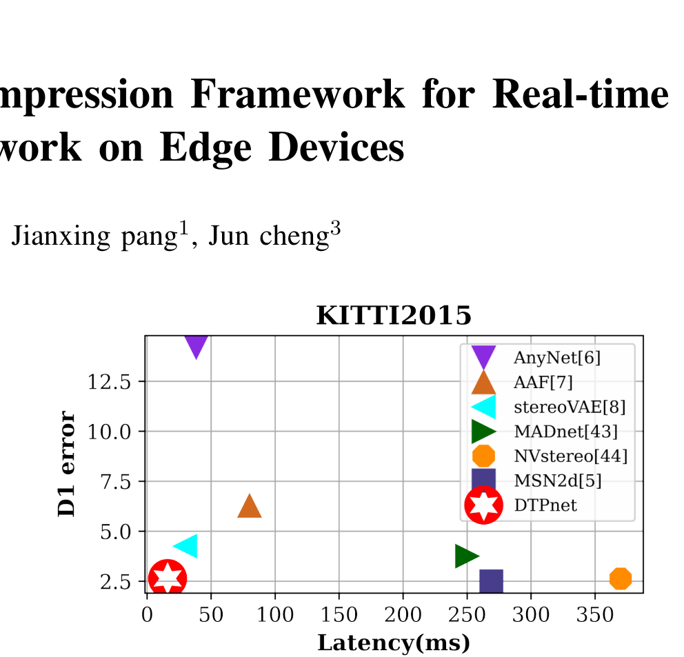
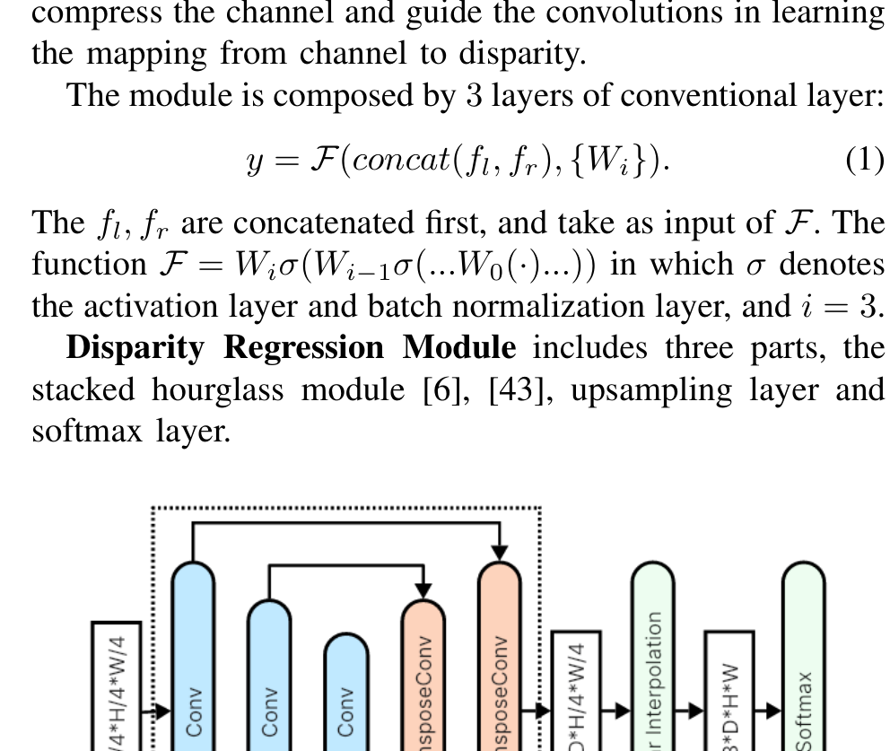

# Distill-then-Prune: An Efficient Compression Framework for Real-time Stereo Matching on Edge Devices

**Authors:** Baiyu Pan, Jichao Jiao, Jianxing Pang, Jun Cheng (UBTech Robotics Corp, BUPT, SIAT)
**Venue:** ICRA 2024
**Priority:** 7/10 — directly targets edge deployment constraints

---

## Core Problem & Motivation

Most real-time stereo papers ignore a critical practical gap: **TensorRT and edge inference SDKs don't fully support operations** like 3D convolutions, trilinear interpolation, and slice ops. Academic "real-time" methods often cannot actually deploy to Jetson or mobile NPUs.

Three concrete obstacles:
1. **SDK incompatibility** — prior work ignores what deployment toolchains support
2. **Heavy computation** — 3D convolutions are unsupported on many NPUs
3. **Accuracy collapse under compression** — architectural tricks alone can't recover it

**DTPnet's insight:** Rather than designing a better architecture, build a **compression framework** (distill + prune) that can be applied on top of any lightweight stereo model. Distillation-guided pruning recovers accuracy lost during architectural reduction, without adding inference cost.

---

## Architecture: TensorRT-Compatible Lightweight Backbone

Three sequential modules, all TensorRT-compatible by construction:

### Module 1: Feature Extraction
- Siamese network with two residual blocks
- Outputs $\mathbf{f}_l, \mathbf{f}_r \in \mathbb{R}^{B \times C \times H/4 \times W/4}$
- **0.10M params, 0.72G FLOPs**

### Module 2: Cost Volume Construction (Channel-to-Disparity)

The key implementation-friendly choice — **replace 3D convolutions entirely** with 2D convolutions that learn a channel-to-disparity mapping:

$$y = \mathcal{F}(\text{concat}(\mathbf{f}_l, \mathbf{f}_r), \{W_i\}) \quad \text{(1)}$$

Every element:
- **$\mathbf{f}_l, \mathbf{f}_r$** = left and right feature maps at 1/4 resolution
- **$\text{concat}(\mathbf{f}_l, \mathbf{f}_r)$** = channel-wise concatenation of left and right features
- **$W_i$** = weight matrices of the $i$-th convolutional layer, $i = 0, 1, 2$ (3 layers total)
- **$\mathcal{F} = W_i \cdot \sigma(W_{i-1} \cdot \sigma(\ldots W_0(\cdot)\ldots))$** = sequential composition with activations
- **$\sigma$** = activation + batch normalization
- **$y$** = output cost volume where **disparity is encoded in channels**, not a separate axis

**Contrast with MobileStereoNet's 3D approach:**

$$C(c, d, x, y) = g_c(\mathbf{f}_l(\cdot, x, y), \mathbf{f}_r(\cdot, x-d, y)) \quad \text{(3)}$$

MobileStereoNet iteratively compresses channels, requires slice operations, and uses 3D convolutions — all problematic for TensorRT. DTPnet's channel-to-disparity is functionally similar but implements entirely in 2D with no slicing.

**0.03M params, 0.11G FLOPs** — extremely cheap.

### Module 3: Disparity Regression (Stacked Hourglass)

- Stacked hourglass encoder-decoder (PSMNet-style, simplified to one block)
- **Upsampling: conv layer (D/4 → D channels) + bilinear interpolation** — replaces trilinear interpolation which isn't well-supported
- **0.51M params, 5.42G FLOPs** (dominant module by compute)

### Soft-argmax disparity regression:

$$\mathcal{D} = \sum_{i=0}^{d_{max}} d_i \cdot \frac{\exp(p_i)}{\sum_j \exp(p_j)} \quad \text{(2)}$$

- **$\mathcal{D}$** = predicted disparity (scalar per pixel)
- **$d_i$** = discrete disparity value at bin $i$
- **$p_i$** = $i$-th channel of the cost volume at that pixel (raw score)
- **$d_{max} = 192$** = maximum disparity
- The softmax normalizes to a probability distribution; the sum computes expected disparity

**Pre-DTP total: 0.64M params, 6.25G FLOPs.**

---

## The DTP Framework (Distill THEN Prune)

### Why Order Matters: Distill THEN Prune

**If you prune first, then distill:** The pruned model has already lost capacity. The teacher's knowledge cannot be fully absorbed because there aren't enough parameters. The model is irreversibly damaged before knowledge transfer.

**If you distill first, then prune:** The full-capacity student first learns rich representations from the teacher. Parameters are organized to encode semantically meaningful features. Pruning then removes **genuinely unimportant** weights while preserving the distilled knowledge.

### Distillation Loss (the central equation)

$$\mathcal{L}(p, q) = \sum_{i=0}^{d_{max}} \Vert \frac{\exp(p_i/t)}{\sum_j \exp(p_j/t)} - \frac{\exp(q_i/t)}{\sum_j \exp(q_j/t)}\Vert _1 \quad \text{(4)}$$

Every element:
- **$p$** = teacher's raw logits over disparity bins ($d_{max}$ values per pixel)
- **$q$** = student's raw logits over disparity bins
- **$p_i / t$** = teacher's $i$-th logit divided by temperature $t$
- **$\exp(p_i/t) / \sum_j \exp(p_j/t)$** = teacher's softmax probability for disparity bin $i$
- **$t$** = temperature hyperparameter, **annealed from 0.5 to 1.0** during training. Higher $t$ = softer distributions (easier to learn early on)
- **$\Vert \cdot\Vert _1$** = L1 norm — **not KL divergence** (this is the unconventional choice)
- The loss is the L1 distance between teacher and student softmax distributions over all disparity bins, summed per pixel

**No ground truth labels are used** — teacher logits are the sole supervision signal.

### Why L1 (not KL) and Teacher-Only (not Teacher+GT)

The authors make non-obvious empirical arguments:

1. **For dense estimation (stereo), ground truth resembles the teacher's softmax distribution** more than a sparse classification label. So teacher distributions are actually a **better supervision signal than ground truth alone**.
2. **L1 is the standard loss for disparity networks**, so it transfers the teacher's knowledge in the format the student is optimized to produce.

Ablation confirms:
- GT only: EPE **1.73**
- Knowledge + GT: EPE **1.61**
- **Knowledge only: EPE 1.56** (best)

And for loss function:
- KL divergence: EPE **1.86**
- **L1: EPE 1.78** (best)

### Pruning Criterion: Group Importance

$$I(g) = \sum_{w_i \in g} \Vert w_i\Vert _2 \quad \text{(5)}$$

- **$g$** = a group of coupled convolution kernels (identified by a dependency graph analysis to handle skip connections correctly)
- **$w_i$** = individual kernel in the group
- **$\Vert w_i\Vert _2$** = L2 norm of the kernel
- **$I(g)$** = aggregated group importance
- Groups are pruned in **ascending order** — lowest importance removed first

### Iterative Pruning with Finetuning

Pruning happens over **$M = 5$ steps** with distillation-based finetuning between each:
1. Rank groups by $I(g)$
2. Prune $r = 10\%$ of least-important groups
3. Finetune with distillation loss (5 epochs on SceneFlow, 100 epochs on KITTI)
4. Repeat

Total pruning: $r \times M = 50\%$ of parameters. Iterative pruning prevents catastrophic accuracy collapse from aggressive single-shot pruning.

---

## Benchmark Results

### KITTI 2015 (comparison with lightweight methods)

| Method | D1-all | Latency | Hardware |
|--------|--------|---------|----------|
| AnyNet | 8.51% | 38.4 ms | Jetson AGX |
| StereoVAE | 5.23% | 29.8 ms | Jetson AGX |
| MADnet | 4.66% | 250 ms | TX2 |
| MABnet | 3.88% | N/A | — |
| **DTPnet** | **3.28%** | **16.3 ms (~61 FPS)** | **Jetson AGX** |
| NVStereo | 3.13% | 370 ms | TX2 |
| MSN2d | 2.83% | 269 ms | Jetson AGX |
| DeepPruner | 2.59% | N/A | — |

**DTPnet is the fastest on Jetson AGX** while beating every method at comparable speed by a large accuracy margin. The only methods with lower D1 error are 16-17× slower.

### Scene Flow (comparison including complex models)

| Method | EPE | Params (M) | FLOPs (G) | Latency (Titan XP) |
|--------|-----|------------|-----------|-------------------|
| PSMNet | 1.12 | 9.37 | 1083 | 450 ms |
| MSN3d | 0.80 | 5.22 | 578.9 | 226 ms |
| DeepPruner | 0.97 | 7.47 | 103.6 | 182 ms |
| MADnet | 1.66 | 0.47 | 15.6 | 65 ms |
| **DTPnet** | **1.56** | **0.26** | **3.677** | **8 ms** |

**36× fewer parameters than PSMNet, 295× fewer FLOPs, 56× faster, with only 0.44 EPE loss.**

---

## Ablation Highlights

### Architectural reduction (Setting 1 → Setting 3)

| Setting | Params | FLOPs | EPE | Latency (AGX) |
|---------|--------|-------|-----|--------------|
| 1 (MobileStereoNet-based) | 2.04M | 23.4G | 1.27 | 104 ms |
| 2 (intermediate) | 0.95M | 15.4G | 1.48 | 44 ms |
| **3 (DTPnet backbone)** | **0.64M** | **4.00G** | **1.73** | **16 ms** |

Architectural reduction costs 0.46 EPE. **DTP framework then recovers 0.17 EPE of this loss** (from 1.73 → 1.56).

### Module importance

| Removed | Params saved | FLOPs saved | EPE delta |
|---------|-------------|-------------|-----------|
| SPP module | 0.01M | 0.40G | +0.01 (negligible) |
| Our cost vol vs MSN | 0.10M | 7.05G | +0.16 (accepted) |
| Hourglass entirely | 0.50M | 2.67G | **+3.31 (unacceptable)** |

**The stacked hourglass is non-negotiable** — removing it causes EPE to explode from 1.73 to 5.04.

---

## Strengths & Limitations

**Strengths:**
- **Genuine edge focus** — actually measures on Jetson AGX with TensorRT, not just FLOPs
- **Implementation-friendly by construction** — no 3D convs, no trilinear interp, no slice ops
- **Framework is backbone-agnostic** — can be applied to any stereo model
- **Non-obvious distillation findings** — teacher-only supervision + L1 loss challenge conventional wisdom
- **Extreme compression** — 36× fewer parameters than PSMNet, 295× fewer FLOPs
- **Best latency on AGX** — 16.3 ms at 3.28% D1-all is SOTA for its accuracy level

**Limitations:**
- **Weak teacher** — PSMNet (EPE 0.69) is a 2018 model. Modern teachers (IGEV-Stereo, FoundationStereo) would yield better-distilled students
- **Architecture is not novel** — assembled from existing components; the framework is the contribution
- **No depthwise separable convs** — doesn't incorporate more modern efficiency techniques
- **Limited evaluation** — only SceneFlow + KITTI; no Middlebury, ETH3D, or zero-shot
- **Stacked hourglass is the bottleneck** — 87% of FLOPs but "can't remove it"
- **No power/memory measurements** — latency reported but edge devices also care about power draw

---

## Relevance to Our Edge Model

**The DTP framework is directly applicable to our DEFOM-Stereo edge variant.** Specific takeaways:

### Directly adoptable

1. **Distill THEN prune order** — our lightweight edge model should first be distilled from full DEFOM-Stereo/FoundationStereo teacher, THEN iteratively pruned with finetuning between steps.

2. **L1 distillation loss (Eq. 4)** — not KL divergence. Use L1 on softmax distributions with temperature annealing.

3. **Teacher-only supervision** — skip ground truth during distillation phase. The teacher's dense distribution is a richer signal for dense estimation tasks.

4. **Temperature annealing** — start at $t = 0.5$, anneal to $t = 1.0$. Simple scheduler, stabilizes early training.

5. **Iterative pruning ($M = 5$ steps, $r = 10\%$ per step)** — prevents catastrophic accuracy collapse vs one-shot pruning.

6. **Dependency graph for structural pruning** — handle skip connections correctly.

### Critical gap DTP leaves open

**DTP does not incorporate monocular depth priors.** The distillation is purely stereo-to-stereo. For our DEFOM-Stereo variant, we need to distill the **scale update module's output** from teacher DEFOM-Stereo into our lightweight student's monocular prior integration.

Also, DTP's teacher (PSMNet) is weak. Our teacher should be DEFOM-Stereo or FoundationStereo, which provides access to rich foundation-model-informed features.

### TensorRT compatibility audit

DTP reminds us to explicitly audit our model for TensorRT-compatible ops:
- No 3D convolutions (use Separable-Stereo's separable 3D or eliminate via BGNet's low-res approach)
- No trilinear interpolation (use conv + bilinear as DTP does)
- No dynamic shape operations
- No attention with dynamic sequence lengths

---

## Connections to Other Papers

| Paper | Relationship |
|-------|-------------|
| **PSMNet** | Teacher used for distillation |
| **MobileStereoNet** | Compared baseline — DTP's channel-to-disparity replaces MSN's iterative 3D compression |
| **StereoNet** | Competitor in lightweight category |
| **StereoVAE** | Contemporary lightweight method — DTPnet beats it on accuracy |
| **BGNet** | Complementary — BGNet reduces aggregation cost, DTP reduces all parameters |
| **Separable-Stereo** | Complementary — separable 3D convs + DTP distillation could compound |
| **Fast-FoundationStereo** | Similar philosophy (distill + prune) but for much larger foundation teachers |
| **AAFS** | Same mobile/edge target, different compression approach |
