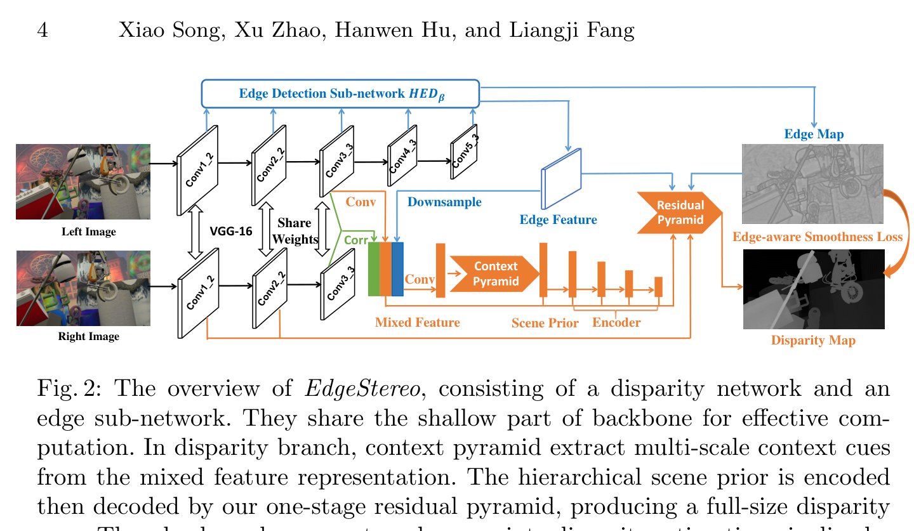
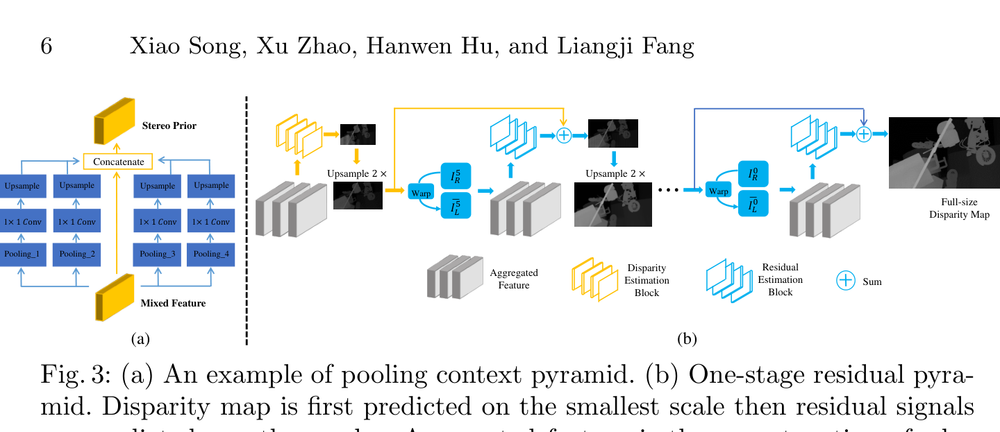
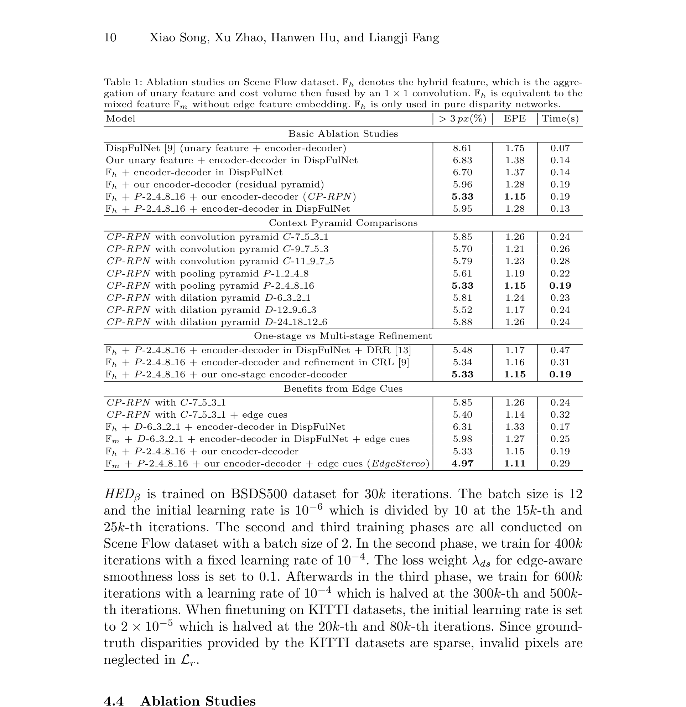
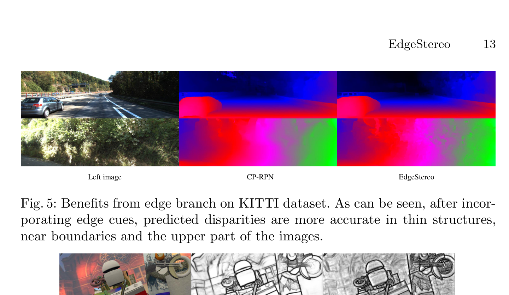

# EdgeStereo: A Context Integrated Residual Pyramid Network for Stereo Matching

**Authors:** Xiao Song, Xu Zhao, Hanwen Hu, Liangji Fang (Shanghai Jiao Tong University)
**Venue:** ACCV 2018
**Priority:** 7/10 — foundational multi-task stereo paper; auxiliary edge supervision anticipates the monocular-prior era (DEFOM, MonSter) by six years

---

## Core Problem & Motivation

By late 2018, end-to-end stereo networks (DispNetC, DispNet-CSS, CRL, GC-Net, PSMNet) dominated benchmarks, but three issues persisted:

1. **Ill-posed regions** (textureless surfaces, shadowed roads, reflective glass) produce ambiguous matches that CNN feature extractors alone cannot resolve.
2. **Cascade refinement structures** (DRR, CRL) repeatedly apply similar sub-networks to improve disparity — but residuals shrink to near zero after a few stages, so later stages contribute little while adding proportional compute.
3. **Boundary & thin-structure errors** dominate residual EPE. End-to-end CNNs blur sharp disparity discontinuities because downsampling and convolution smoothness act like a low-pass filter on the disparity field.

EdgeStereo's key observation: **humans resolve stereo correspondences by perceiving edges and context jointly** — object contours disambiguate depth transitions, global context resolves textureless ambiguities. The paper operationalizes this insight via an explicit **two-branch multi-task network**:

- **Disparity branch** — produces the disparity map using a **Context Pyramid** (for textureless / ill-posed regions) and a **Residual Pyramid** decoder (for boundary-sharp refinement).
- **Edge branch** (HED-based) — produces an edge probability map, **shares VGG-16 backbone** with the disparity branch, and feeds its edge features + edge map back into the disparity pipeline.

This is an early — and conceptually clean — instance of **auxiliary-task distillation of geometric priors** into stereo, the same philosophical direction that DEFOM-Stereo / MonSter / FoundationStereo pursue today with monocular depth foundation models.

---

## Architecture



### Basic Network Structure

1. **Shared backbone:** VGG-16, conv1_1 through conv3_3 (1/4 spatial resolution). Used by both branches.
2. **Siamese feature extraction:** shared backbone produces left feature $F_l$ and right feature $F_r$.
3. **1D correlation layer** (DispNetC-style) with max displacement 40 → cost volume $F_c$.
4. **Reduced image feature:** a conv block on $F_l$ → $F_l^r$ (lower-dimensional image feature for semantics).
5. **Edge sub-network ($\text{HED}_\beta$):** processes left image only → edge feature $F_l^e$ + edge probability map.
6. **Mixed feature** $F_m$: concat $\{F_l^r, F_c, F_l^e\}$ → $1\times1$ conv to fuse.
7. **Context Pyramid** on $F_m$ → hierarchical scene prior.
8. **Hourglass encoder** further downsamples the scene prior to ultimate feature (1/128 input resolution, for deep context).
9. **Residual Pyramid decoder** produces full-size disparity map with edge cues and warped image residuals injected at each scale.

### Context Pyramid

Motivation: single-scale context is insufficient. Small receptive fields miss large textureless walls; overly global receptive fields dissolve small objects. The Context Pyramid has four parallel branches with different receptive-field sizes — all sharing the $F_m$ input — and their outputs + $F_m$ are concatenated as the hierarchical scene prior.

Three variants are studied:

**Convolution context pyramid (C-k1_k2_k3_k4):** each branch = two $k\times k$ convs; larger $k$ = larger context.

**Pooling context pyramid (P-s1_s2_s3_s4):** each branch = avg-pool at scale $s_i$ → $1\times1$ conv → upsample. Mirrors PSMNet's SPP.

**Dilation context pyramid (D-r1_r2_r3_r4):** each branch = $3\times3$ dilated conv at rate $r_i$ → $1\times1$ conv. Inspired by DeepLab.

The ablation (see Table 1 below) shows **pooling pyramid P-2_4_8_16 is best** (3-pixel error 5.33%); over-aggressive dilation (D-24_18_12_6) hurts due to grid artifacts.

### Residual Pyramid



The decoder predicts disparity hierarchically from coarse to fine. Prior multi-stage refinement (CRL, DRR) stacks entire independent networks; EdgeStereo collapses refinement into **a single decoder** with $S$ scales.

At the smallest scale $S-1$ (deepest feature), disparity $d_{S-1}$ is **regressed directly**. At every finer scale $s$ where $0 \le s < S-1$, only a **residual signal** $r_s$ is predicted and added to the upsampled disparity from the previous scale:

$$d_s = u(d_{s+1}) + r_s, \quad 0 \le s < S \quad \text{(1)}$$

- **$d_s$** = full disparity map at scale $s$ (scale 0 = full resolution, $1/2^s$ of input)
- **$u(\cdot)$** = bilinear upsample by factor 2
- **$r_s$** = predicted residual correction at scale $s$
- **$d_{S-1}$** = directly regressed coarsest disparity (no residual)

Curriculum rationale ("From Easy to Tough"): at the smallest scale the search range is narrow and few details are needed → disparity regression is easy. Upsampling errors at finer scales are smaller, so residuals stay learnable.

**Per-scale estimation block inputs** (each scale except the smallest):

- Skip-connected encoder feature (high-frequency detail).
- Interpolated edge feature $F_l^{e, s}$ and edge map $E^s$ (see next section).
- **Geometrical constraints:** $(I_L^s, I_R^s, d_s, \bar{I}_L^s, e_s)$ where $\bar{I}_L^s = \mathcal{W}(I_R^s, d_s)$ is the warped right image and $e_s = \vert I_L^s - \bar{I}_L^s\vert$ is the per-scale photometric error.

Scale count $S = 7$ (encoder downsamples by $2^6 = 64$, plus stem stride-2).

### Edge Branch ($\text{HED}_\beta$)

The edge detector modifies HED (Holistically-Nested Edge Detection):

- VGG-16 backbone from conv1_1 to conv5_3 (shares conv1_1–conv3_3 with disparity branch).
- Five side branches from conv1_2, conv2_2, conv3_3, conv4_3, conv5_3.
- Each side branch: two $3\times3$ convs → upsample → $1\times1$ conv → per-scale edge probability map.
- **Edge feature** = concatenation of all upsampled side branch features → **full-resolution feature map**.
- **Edge map** = fused edge probabilities from all side branches.

Why $\text{HED}_\beta$ and not plain HED? Low-level edge features are easier to obtain from conv1_2 (the original HED starts at conv1_2 but aggregates differently). The edge map from $\text{HED}_\beta$ is more "semantic-meaningful" — it suppresses low-level texture edges that would mislead disparity discontinuities.

Edge pre-training loss: **class-balanced cross-entropy** on BSDS500 + PASCAL VOC Context (standard HED training).

### Cooperation of Edge Cues

Three mechanisms tie the edge and disparity branches:

1. **Edge feature embedding in Context Pyramid input.** Edge feature $F_l^e$ is concatenated into the mixed feature $F_m$ → Context Pyramid sees both matching cost, image semantics, and edge cues when aggregating context.

2. **Edge feature + edge map injection at every residual pyramid scale.** Each residual estimation block receives an interpolated edge feature and edge map → helps the decoder preserve boundary sharpness (alleviates the "residual pyramid lacks low-level representations" issue).

3. **Edge-aware smoothness loss** — the single most elegant contribution. Standard left-right consistency smoothness losses weight the disparity-gradient penalty by image intensity gradient. EdgeStereo replaces image gradient with the **edge probability map gradient**, which is semantically cleaner (it ignores texture edges, focuses on actual object contours):

$$\mathcal{L}_{ds} = \frac{1}{N} \sum_{i,j} \Bigl[\vert \partial_x d_{i,j}\vert \cdot e^{-\vert \partial_x E_{i,j}\vert} + \vert \partial_y d_{i,j}\vert \cdot e^{-\vert \partial_y E_{i,j}\vert}\Bigr] \quad \text{(2)}$$

- **$d_{i,j}$** = predicted disparity at pixel $(i,j)$
- **$\partial_x d_{i,j}, \partial_y d_{i,j}$** = horizontal / vertical finite-difference disparity gradients
- **$E_{i,j}$** = edge probability at pixel $(i,j)$ (output of HED$_\beta$)
- **$e^{-\vert \partial E\vert}$** = exponential weighting that **suppresses the smoothness penalty at strong edge pixels** (where disparity *should* be discontinuous) and **enforces it where edges are weak** (surfaces expected to be smooth).
- **$N$** = number of pixels.

This is effectively **learned edge-aware smoothness** — the network learns where disparity can jump because the edge branch tells it so. The mechanism is analogous to modern monocular-prior-informed stereo (the edge map is a geometric structure prior), but here the "prior" is a lightweight learned edge detector rather than a ViT foundation model.

### Disparity Regression Loss

At each scale $s$:

$$\mathcal{L}_r = \frac{1}{N}\Vert d - \hat{d}\Vert _1 \quad \text{(3)}$$

- **$d$** = predicted disparity map
- **$\hat{d}$** = ground-truth disparity
- **$\Vert \cdot\Vert _1$** = $L_1$ norm (smooth-L1 / Huber in practice).
- **$N$** = pixel count.

Total per-scale loss (in Phase 2 of multi-phase training):

$$C_s = \mathcal{L}_r + \lambda_{ds} \mathcal{L}_{ds}$$

- **$\lambda_{ds} = 0.1$** (empirical).

Summed over scales: $C = \sum_{s=0}^{S-1} C_s$ — deep supervision.

---

## Multi-Phase Training Strategy

A major practical contribution: **disparity datasets lack edge GT, edge datasets lack stereo GT.** Most prior multi-task work requires joint labels. EdgeStereo sidesteps this:

- **Phase 1 — Edge pretraining.** Train $\text{HED}_\beta$ on BSDS500 + PASCAL VOC Context with class-balanced cross-entropy. Backbone fixed.
- **Phase 2 — Disparity training with frozen edges.** Train the disparity branch (including context pyramid and residual pyramid) on SceneFlow with $\mathcal{L}_r + \lambda_{ds} \mathcal{L}_{ds}$. Edge branch and backbone **frozen**; it only provides edge features / edge maps. 400k iterations, lr = $10^{-4}$ fixed.
- **Phase 3 — Joint fine-tuning.** All layers except backbone are unfrozen on the same stereo dataset. **$\mathcal{L}_{ds}$ is disabled** because edge contours in Phase 2 are already stable — further co-optimization risks disparity-driven edge drift. Loss reduces to $C_s = \mathcal{L}_r$ per scale. 600k iterations.
- **Phase 4 (KITTI fine-tune).** Fine-tune Phase-3 model on KITTI 2012/2015 with lr = $2\cdot10^{-5}$, halved at 20k / 80k iterations. Invalid pixels (no LIDAR GT) neglected.

Critical property: **no dataset with joint edge + stereo labels is ever needed.** Edges come from BSDS; disparities from SceneFlow / KITTI.

---

## Key Equations Summary

**Residual pyramid recursion (Eq. 1):** $d_s = u(d_{s+1}) + r_s$ — scale-wise residual refinement.

**Edge-aware smoothness (Eq. 2):** $\mathcal{L}_{ds} = \tfrac{1}{N}\sum\bigl[\vert\partial_x d\vert e^{-\vert\partial_x E\vert} + \vert\partial_y d\vert e^{-\vert\partial_y E\vert}\bigr]$ — penalize disparity changes only in non-edge regions.

**Disparity regression loss (Eq. 3):** $\mathcal{L}_r = \tfrac{1}{N}\Vert d - \hat{d}\Vert _1$.

**Per-scale total:** $C_s = \mathcal{L}_r + \lambda_{ds} \mathcal{L}_{ds}$ (Phase 2) or $C_s = \mathcal{L}_r$ (Phase 3).

---

## Results

### Model Specifications

- **Backbone:** VGG-16 (conv1_1–conv3_3 shared).
- **Correlation max displacement:** 40 (at 1/4 resolution).
- **Encoder downsampling:** 64$\times$; 7 residual pyramid scales.
- **Per-scale estimation block:** four $3\times3$ convs + last regression conv; ReLU everywhere except output.
- **Framework:** Caffe, Adam ($\beta_1=0.9, \beta_2=0.999$).

### SceneFlow (Table 2)

| Method | >3px (%) | EPE |
|---|---|---|
| SGM | 12.54 | 4.50 |
| MC-CNN | 13.70 | 3.79 |
| DispNet | 9.67 | 1.84 |
| DispFulNet | 8.61 | 1.75 |
| CRL | 6.20 | 1.32 |
| GC-Net | 7.20 | — |
| CA-Net | 5.62 | — |
| **EdgeStereo** | **4.97** | **1.11** |

EdgeStereo achieves SOTA on SceneFlow at the time, outperforming CRL (6.20 → 4.97) by ~20% relative.

### KITTI 2012 (Table 3)

EdgeStereo achieves **>3px Noc 2.79**, **>3px All 3.43**, with runtime 0.48s. Competitive with PSMNet and iResNet at that era.

### KITTI 2015 (Table 4, from Tier 3 sources)

**D1-all (All)** 2.59, **D1-all (Noc)** 2.40, runtime 0.27s — competitive with PSMNet (2.32) but faster.

### Ablation — Context & Residual Pyramids (Table 1)



**Basic decomposition on SceneFlow:**

| Model | >3 px (%) | EPE | Time (s) |
|---|---|---|---|
| DispFulNet (baseline) | 8.61 | 1.75 | 0.07 |
| + our unary feature | 6.83 | 1.38 | 0.14 |
| + hybrid $F_h$ (unary + corr) | 6.70 | 1.37 | 0.14 |
| + residual pyramid | 5.96 | 1.28 | 0.19 |
| + Context Pyramid P-2_4_8_16 | 5.33 | 1.15 | 0.19 |
| + Edge cues (full EdgeStereo) | **4.97** | **1.11** | **0.29** |

Every component contributes ~0.05–0.1 EPE and ~0.5–1% >3px error. Edge cues alone take the model from 5.33% to 4.97% (relative 6.7%) at +10ms cost.

**Context pyramid variants:**

| Variant | >3 px (%) | EPE | Time |
|---|---|---|---|
| C-7_5_3_1 (conv) | 5.85 | 1.26 | 0.24 |
| C-11_9_7_5 (conv, biggest) | 5.79 | 1.23 | 0.28 |
| P-1_2_4_8 (pool) | 5.61 | 1.19 | 0.22 |
| **P-2_4_8_16 (pool, best)** | **5.33** | **1.15** | **0.19** |
| D-6_3_2_1 (dilation) | 5.81 | 1.24 | 0.23 |
| D-12_9_6_3 (dilation) | 5.52 | 1.17 | 0.24 |
| D-24_18_12_6 (dilation, over) | 5.88 | 1.26 | 0.24 |

Pooling is best; convolutions grow cost faster than accuracy; large dilation hurts (grid artifacts).

**Refinement structure comparison:**

| Model | >3 px (%) | EPE | Time |
|---|---|---|---|
| + DRR (3-stage cascade) | 5.48 | 1.17 | **0.47** |
| + CRL (2-stage cascade) | 5.34 | 1.16 | 0.31 |
| + residual pyramid (ours) | **5.33** | **1.15** | **0.19** |

EdgeStereo's single-stage residual pyramid is **equal or better than 2-3 cascaded networks** while running 1.6–2.5$\times$ faster. This directly validates the "collapse cascade into residual pyramid" design.

### Bidirectional Benefit: Better Edges after Multi-task Learning

Edge detection quality also improves after joint training (the "reciprocal" benefit):

| Model | ODS F-measure on BSDS500 |
|---|---|
| HED baseline | 0.788 |
| $\text{HED}_\beta$ alone | 0.790 |
| $\text{HED}_\beta$ after multi-task | **0.795** |

A small but real improvement — stereo geometry teaches edge detector to highlight depth-relevant boundaries.

### Qualitative



Edge cues improve disparity in thin structures (poles, railings) and near object boundaries — the exact failure modes of CNN-based stereo.

---

## Why It Works

1. **Edges are a geometric prior for depth discontinuities.** Object contours are where disparity *should* jump; texture edges are where it shouldn't. HED-style edge detection gives a learned, semantic prior distinguishing the two.
2. **Context pyramid explicitly multiplexes receptive-field sizes.** Textureless regions (shadowed roads, sky) need global context; small objects need local context. A pyramid with matched pooling/dilation rates covers both.
3. **Residual pyramid curriculum is easier to train.** Regressing disparity is hardest at full resolution (high variance); predicting residuals at fine scales is much easier because the expected residual is small. The combined prediction enjoys the best of both.
4. **Shared backbone amortizes compute.** Conv1_1–conv3_3 is computed once for both tasks — multi-task overhead is only the edge-specific side branches.
5. **Edge-aware smoothness loss** is a principled spatial regularizer: it suppresses noise on planar surfaces while preserving sharp discontinuities exactly where the edge branch detects them.
6. **Multi-phase training sidesteps the joint-label problem** that blocks most multi-task vision work. Each phase uses its native dataset; cross-task interaction happens through feature sharing, not joint supervision.
7. **Implicit scale coupling between edge gradient and disparity gradient.** The exponential weighting $e^{-\vert\partial E\vert}$ naturally balances magnitudes: where edges are strong ($\partial E$ large) the smoothness term is suppressed; where edges are weak the disparity is pulled toward smoothness. No manual threshold needed.

---

## Limitations / Failure Modes

1. **HED edge branch adds ~100ms** at inference — not trivial. For edge devices this is unacceptable; the edge branch would need to be heavily compressed (smaller VGG, shared feature pyramid) to fit.
2. **Edges ≠ geometry.** Many disparity discontinuities happen at **occlusion boundaries without photometric edges** (e.g., objects of same color as background). HED cannot detect these, so the smoothness loss fails to permit disparity jumps there.
3. **Auxiliary edges are 2018-class weak priors** compared to modern monocular depth foundations (Depth Anything V2). The conceptual structure is the same, but the signal quality is orders of magnitude stronger with modern foundations — meaning EdgeStereo's absolute gains are modest.
4. **Phase 3 disables $\mathcal{L}_{ds}$**, so the edge-aware smoothness signal is only effective in the first joint training phase. The paper acknowledges joint-optimization with smoothness "risks unstable edges" — but this also reveals the prior is somewhat fragile.
5. **Residual pyramid depends on good coarse-scale initialization.** If the smallest-scale disparity is wrong (e.g., a large textureless wall), fine-scale residuals cannot recover correct disparity — residuals are bounded in magnitude by design.
6. **No iterative refinement.** Single-pass residual pyramid — no modern all-pairs correlation / GRU update loop. Generalization likely worse than RAFT-Stereo-family methods.
7. **VGG-16 backbone is outdated and heavy.** Modern equivalents (MobileNetV4, RepViT) would roughly halve params for similar capacity.
8. **Only 1D correlation cost volume.** Modern stereo uses 3D cost volumes + group-wise correlation for higher matching fidelity; EdgeStereo's cost volume is relatively weak.

---

## Relevance to Our Edge Model

EdgeStereo is conceptually important for our edge DEFOM variant — it is the **proof of concept that auxiliary geometric priors improve stereo** — the philosophical foundation of DEFOM-Stereo / MonSter / FoundationStereo. Specific takeaways:

### Directly adoptable

1. **Edge-aware smoothness loss (Eq. 2)** is a free regularizer at inference time: we can add it as an auxiliary training loss with **any edge source** — including the gradient of the monocular depth foundation's output (Depth Anything V2 gradient is a semantic edge map). This gives our edge model an extra supervision signal with zero inference overhead.
2. **Residual pyramid decoder design** (Eq. 1): coarse-to-fine residual refinement collapses multi-stage cascades into a single decoder. Useful when we do **not** use iterative refinement at a given scale — the upsampling from 1/4 or 1/8 to full resolution can use the residual pyramid structure instead of convex upsampling.
3. **Multi-phase training** is a model for how to integrate auxiliary tasks (edge, monocular depth) without joint labels. Our MPT distillation + disparity training pipeline naturally inherits this structure.
4. **Context Pyramid (P-2_4_8_16)** is a drop-in multi-scale context aggregator for 1/4-resolution features, comparable to Vortex Pooling (StereoDRNet) and SPP (PSMNet).

### Cautions

- **Do not run a separate HED branch at inference.** Edge supervision must be **training-time only**: either distill edges into disparity-branch features, or use a foundation model's output gradient at train time.
- **Aux-task signals from foundation models (Depth Anything, SAM edges) strictly dominate learned HED edges.** If we're going to have auxiliary supervision, use the modern version.
- **Single residual pyramid insufficient for zero-shot generalization.** Pip-Stereo results show non-iterative methods catastrophically fail on cross-domain data. Residual pyramid is a fine *refinement* head but cannot replace iterative GRU for generalization.

### Proposed Integration

```
[NAS-searched encoder, MPT-distilled from Depth Anything V2]
    ↓
[Vortex / Context Pyramid @ 1/4 res]
    ↓
[GWC + GEV cost volume @ 1/8 res]
    ↓
[Shallow 3D regularizer]
    ↓
[Initial disparity]
    ↓
[PIP-compressed GRU × 1-4 iterations]
    ↓
[Residual Pyramid decoder @ 1/4 → 1/2 → full]    ← from EdgeStereo
    ↓
Disparity Map

Training losses:
  - Smooth-L1 per scale (Eq. 3)
  - Edge-aware smoothness (Eq. 2) with Depth Anything V2 gradient as E
  - View-consistency Ep + Eg (from StereoDRNet)
  - MPT distillation (from Pip-Stereo)
```

**Net effect:** three auxiliary losses (edge smoothness, view consistency, MPT alignment) — all training-time, zero inference cost — that collectively encode rich geometric priors our edge model's tiny architecture cannot learn from raw stereo alone.

### The Meta-Lesson

EdgeStereo's deeper message: **auxiliary-task supervision trades inference efficiency for training complexity**. You get stronger priors at no inference cost if you're willing to engineer a multi-phase training pipeline. For resource-constrained edge deployment, this tradeoff is always worth it — training happens once, inference happens billions of times. Our edge model should aggressively exploit every training-time prior available: edge maps (from HED or Depth Anything V2 gradients), monocular depth, semantic segmentation, surface normals — all distilled into a single tiny inference-time network.

---

## Connections to Other Papers

| Paper | Relationship |
|---|---|
| **DispNetC / DispNet-CSS** | Baseline architecture; EdgeStereo modifies the decoder into a residual pyramid. |
| **CRL / DRR** | Prior cascade refinement work EdgeStereo replaces with single-decoder residual pyramid. |
| **HED / RCF** | Edge-detection backbone; $\text{HED}_\beta$ is a modified HED. |
| **PSMNet** | Contemporary; SPP in PSMNet ≈ pooling context pyramid in EdgeStereo; PSMNet uses 3D convs instead of 2D correlation. |
| **SegStereo / Displets** | Contemporary multi-task stereo; SegStereo adds segmentation, Displets adds object recognition. EdgeStereo's edge task is lightest and most directly relevant to disparity boundaries. |
| **DEFOM-Stereo / MonSter** | Modern successors: replace HED edges with monocular depth foundation features. Same philosophical structure — auxiliary geometric prior improves stereo. |
| **StereoDRNet** | Contemporary (CVPR 2019); both use residual refinement but StereoDRNet uses photometric/geometric signals instead of edges. |
| **Pip-Stereo** | Modern edge-optimized iterative stereo; MPT distillation is the 2026 equivalent of EdgeStereo's edge-feature fusion — bake the auxiliary prior into the encoder weights. |
| **BridgeDepth / NMRF** | MRF-based modern methods that explicitly model disparity discontinuities — edge-aware regularization is their spiritual successor. |
