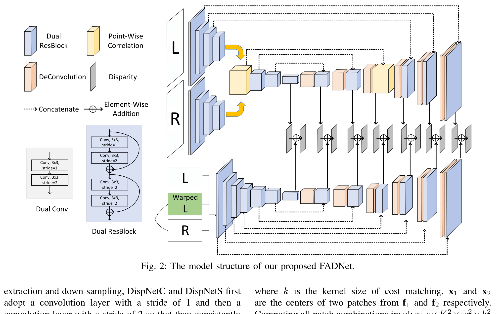
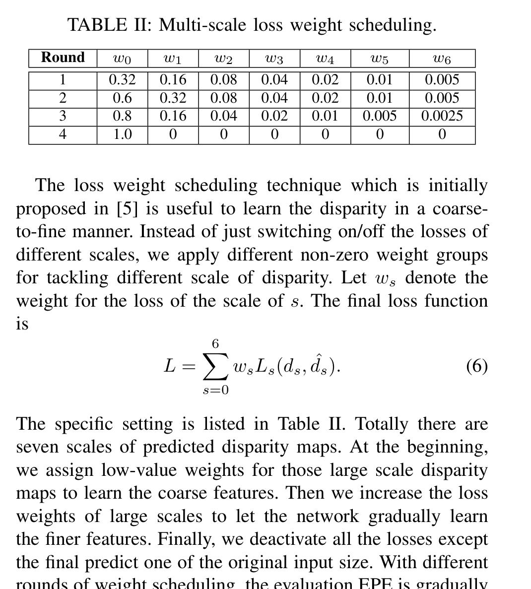
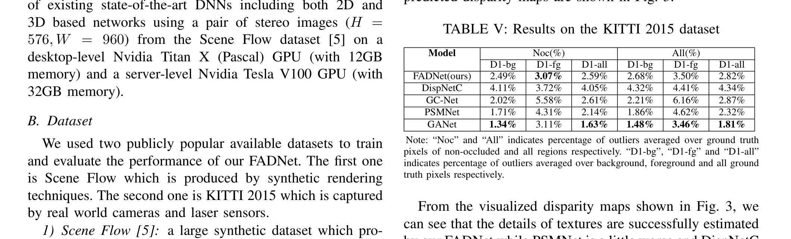
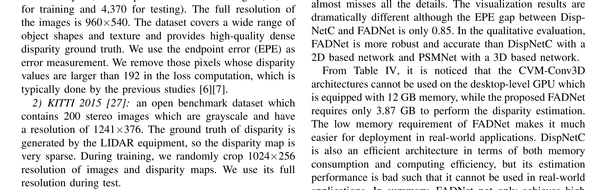
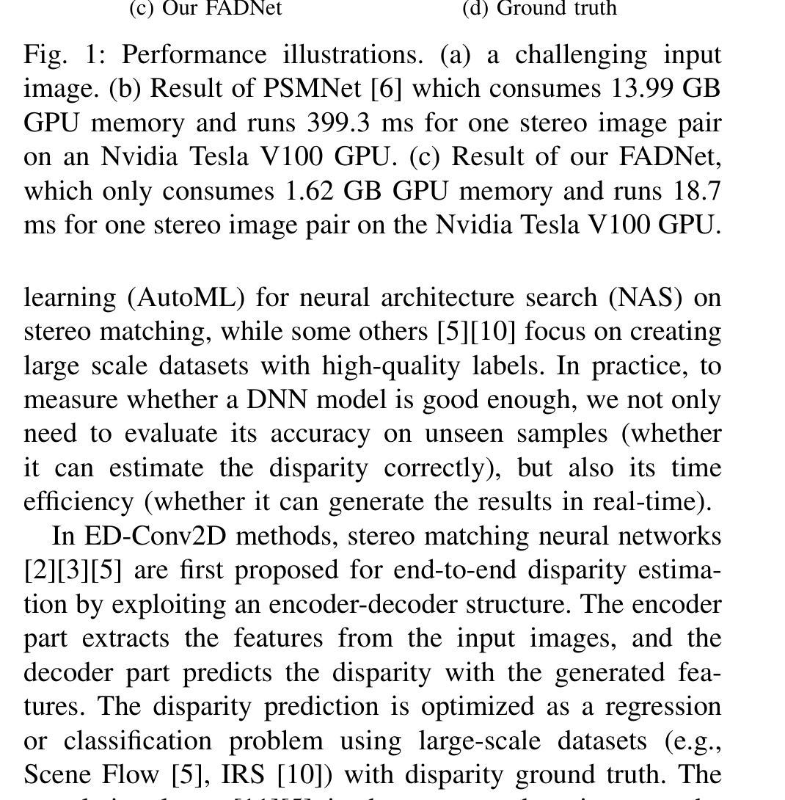

# FADNet: A Fast and Accurate Network for Disparity Estimation

**Authors:** Qiang Wang, Shaohuai Shi, Shizhen Zheng, Kaiyong Zhao, Xiaowen Chu (Hong Kong Baptist University)
**Venue:** ICRA 2020 (arXiv 2020)
**Priority:** 7/10 — foundational efficient-2D baseline; the "Dual-ResBlock + point-wise correlation + stack-and-refine" recipe is the archetype for mobile stereo

---

## Core Problem & Motivation

By 2020, the field had polarized into two camps:

1. **ED-Conv2D** (DispNet, DispNetC, DenseMapNet): 2D encoder-decoder networks with an optional correlation layer. Fast (sub-30 ms on a V100) but with poor accuracy — DispNetC hits EPE 1.68 on Scene Flow, which is only marginally better than SGM.

2. **CVM-Conv3D** (GC-Net, PSMNet, GANet): 4D cost volume regularized by 3D convolutions. State-of-the-art accuracy (PSMNet 1.09, GANet 0.84) but **heroic cost** — PSMNet consumes 13.99 GB and 399 ms per pair on Tesla V100; GANet takes 29 GB and 2.25 s, doesn't fit in 12 GB consumer GPUs at all. Training GANet on Scene Flow takes weeks even on multiple V100s.

**The paper's core claim:** It is possible to bridge this gap **without 3D convolutions** by stacking two carefully designed 2D networks — a DispNetC-like correlation branch and a DispNetS-like residual refinement branch — using residual blocks to enable greater depth, a cheaper "point-wise" correlation, multi-scale supervision, and a multi-round weight scheduling recipe. The result: **EPE 0.83 on Scene Flow at 48 ms on V100** — PSMNet-grade accuracy at ~10× the speed and ~10× less memory (3.87 GB vs 13.99 GB).

This paper is the archetype of "no fancy tricks, just fast and accurate 2D stereo" and is still cited as the baseline that every edge-stereo paper must beat.

### Why 2D-Only Matters for Edge Deployment

- **3D convolutions have notoriously poor hardware support** on mobile/NPU platforms (SNPE, CoreML, Hexagon DSP, Edge TPU, Jetson DLA). 3D convs frequently fall back to CPU, killing throughput.
- **Memory pressure from 4D cost volumes** (B×C×D×H×W with D=48 at 1/4 resolution, H=96, W=304) creates hundreds of MB of activations; on a 4–8 GB Orin Nano this is fatal.
- A **purely 2D architecture** compiles cleanly to TensorRT / ONNX / TFLite and runs on every accelerator without fallback.

FADNet is the first paper to show that you can compete with 3D networks using only 2D operations.

---

## Architecture



FADNet has **two stacked subnetworks**: RB-NetC (correlation-based coarse prediction) followed by RB-NetS (residual refinement). The output of each stage is predicted at **7 scales**, all supervised by ground truth.

### Building Block 1: Dual-ResBlock

The DispNet family uses a "Dual-Conv" module — two 3×3 convs, one with stride 2 (downsample) and one with stride 1. FADNet replaces this with **Dual-ResBlock**, where each conv is wrapped in a residual connection (ResNet-style):

- Stride-2 residual block: 3×3 conv stride 2 + 3×3 conv stride 1 + residual skip.
- Stride-1 residual block: two 3×3 convs stride 1 + residual skip.

**Why:** Residual connections solve the vanishing-gradient problem that prevents DispNetC from being made deeper. With Dual-ResBlock, FADNet increases the encoder depth from **5 down-sampling stages (DispNet) to 7 stages** without training instability. More depth = more expressive features at each scale.

**Empirical gain (Table I):** Under identical training, RB-NetC reaches Scene Flow test EPE **1.76** vs DispNetC's 2.80 at the same max-disparity setting (D=20) — a 37% improvement just from the residual structure.

### Building Block 2: Point-Wise Correlation

The standard correlation layer from DispNetC / FlowNet computes a patch-based cost:

$$c(x_1, x_2) = \sum_{o \in [-k, k] \times [-k, k]} \langle f_1(x_1 + o),\, f_2(x_2 + o)\rangle \quad \text{(1)}$$

- **$f_1, f_2 \in \mathbb{R}^{c \times H \times W}$** — left and right feature maps.
- **$x_1, x_2$** — centers of patches in $f_1, f_2$.
- **$o$** — offset within a $(2k+1) \times (2k+1)$ patch.
- **$\langle \cdot, \cdot\rangle$** — inner product across channel dimension.
- Cost of computing all patch combinations: $c \times K^2 \times w^2 \times h^2$ multiplications, where $K = 2k+1$ is the patch size. With $k=1$ this is 9× more expensive than a pointwise correlation.

FADNet argues the **patch aggregation is lossy** — it treats all pixels in the patch as contributing equally to the similarity, which bakes in a uniform smoothness prior.

**Point-wise correlation (Eq. 2):**

$$c(x_1, x_2) = \sum \langle f_1(x_1),\, f_2(x_2)\rangle \quad \text{(2)}$$

- Drops the patch aggregation; uses the inner product at a single pixel pair.
- To recover the context previously provided by the patch, they **prepend a 3×3 stride-1 conv** to the features before correlation. This learns what to include in the matching feature — a more flexible inductive bias than a fixed uniform patch.

**Disparity search range.** Because correlation runs at 1/8 resolution (after the 3rd Dual-ResBlock) and KITTI max disparity is 192, search range at 1/8 must cover 192/8 = 24. They choose $D = 20$ with stride 2, giving a cost volume of shape $w \times h \times 40$. Table I shows $D = 20$ is optimal (EPE 1.76 vs 2.06 for $D=10$, 1.83 for $D=40$) — larger $D$ over-fits, smaller $D$ under-fits.

The resulting network is **RB-NetC** (Residual-Block NetC), which alone already outperforms DispNetC by 37%.

### Building Block 3: Dual-Network Stack (RB-NetC + RB-NetS)



The full FADNet stacks **RB-NetC** (correlation-based coarse predictor) and **RB-NetS** (residual refiner). The trick is **multi-scale residual learning**, borrowed from cascade residual learning (Pang et al., 2017):

- RB-NetC takes $(L, R)$ as input and outputs coarse disparity $c_s$ at 7 scales ($s = 0, \ldots, 6$; scale 0 = full resolution, scale 6 = 1/64).
- RB-NetS takes $(L, R, L_{\text{warped}})$ as input, where $L_{\text{warped}}$ is the right image warped into the left frame using $c_s$. **The warped left is crucial — it exposes the residual error directly to the refiner.**
- RB-NetS outputs disparity residuals $r_s$.
- Final disparity at each scale:

$$\hat{d}_s = c_s + r_s, \quad 0 \le s \le 6 \quad \text{(3)}$$

**Why residual refinement?** The first network produces a reasonable-but-imperfect coarse estimate. Asking a second network to *regress the whole disparity again* wastes capacity on correct pixels and risks "unlearning" the good parts. Instead, RB-NetS only has to regress the **residual**, which is usually small and highly nonlinear (occlusion boundaries, fine details). This is exactly the residual-learning principle from image classification transplanted to disparity.

### Stage Output: 7 Scales, All Supervised

The disparity outputs of FADNet live at 7 scales:

$$H \times W,\ \tfrac{H}{2} \times \tfrac{W}{2},\ \tfrac{H}{4} \times \tfrac{W}{4},\ \tfrac{H}{8} \times \tfrac{W}{8},\ \tfrac{H}{16} \times \tfrac{W}{16},\ \tfrac{H}{32} \times \tfrac{W}{32},\ \tfrac{H}{64} \times \tfrac{W}{64}$$

Each is supervised, so gradient signals reach all decoder stages — a standard deep-supervision pattern.

---

## Key Equations

**Patch correlation (used in DispNetC, replaced in FADNet):**

$$c(x_1, x_2) = \sum_{o \in [-k, k] \times [-k, k]} \langle f_1(x_1 + o),\, f_2(x_2 + o)\rangle \quad \text{(1)}$$

- **$f_1, f_2$** — left/right feature maps.
- **$x_1, x_2$** — patch centers.
- **$o$** — 2D offset within $(2k+1) \times (2k+1)$ patch.
- **$\langle \cdot, \cdot\rangle$** — channel-wise dot product.

**Point-wise correlation (FADNet's cheap replacement):**

$$c(x_1, x_2) = \sum \langle f_1(x_1),\, f_2(x_2)\rangle \quad \text{(2)}$$

- Drops the patch window; compensated by a preceding 3×3 conv on the input features.

**Multi-scale residual disparity:**

$$\hat{d}_s = c_s + r_s, \quad 0 \le s \le 6 \quad \text{(3)}$$

- **$c_s$** — coarse disparity from RB-NetC at scale $s$.
- **$r_s$** — residual from RB-NetS at scale $s$.
- **$\hat{d}_s$** — final disparity at scale $s$.

**Smooth-L1 per-pixel loss:**

$$L_s(d_s, \hat{d}_s) = \frac{1}{N} \sum_{i=1}^{N} \text{smoothL1}(d^i_s - \hat{d}^i_s) \quad \text{(4)}$$

- **$N$** — number of pixels at scale $s$.
- **$d^i_s$** — $i$-th pixel of ground-truth disparity at scale $s$ (downsampled from full-res GT).
- **$\hat{d}^i_s$** — $i$-th pixel of predicted disparity at scale $s$.

**Smooth-L1 definition:**

$$\text{smoothL1}(x) = \begin{cases} 0.5 x^2, & \text{if } |x| < 1 \\ |x| - 0.5, & \text{otherwise} \end{cases} \quad \text{(5)}$$

- Quadratic for small errors (stable gradient), linear for large errors (robust to outliers).

**Total loss — weighted sum across 7 scales:**

$$L = \sum_{s=0}^{6} w_s L_s(d_s, \hat{d}_s) \quad \text{(6)}$$

- **$w_s$** — scale-specific loss weight; scheduled across four rounds (coarse-to-fine).

### Multi-Round Loss Weight Scheduling

Table II from the paper (4 rounds):

| Round | $w_0$ | $w_1$ | $w_2$ | $w_3$ | $w_4$ | $w_5$ | $w_6$ |
|-|-|-|-|-|-|-|-|
| 1 | 0.32 | 0.16 | 0.08 | 0.04 | 0.02 | 0.01 | 0.005 |
| 2 | 0.6  | 0.32 | 0.08 | 0.04 | 0.02 | 0.01 | 0.005 |
| 3 | 0.8  | 0.16 | 0.04 | 0.02 | 0.01 | 0.005 | 0.0025 |
| 4 | 1.0  | 0    | 0    | 0    | 0    | 0    | 0      |

**Reading this:** Round 1 learns coarse multi-scale features broadly. Round 4 focuses entirely on full-resolution output. The gradual shift of weight toward $w_0$ implements a **coarse-to-fine curriculum**.

**Impact (Table III):** Rounds 1 → 2 → 3 → 4 on Scene Flow test:
1.57 → 1.32 → 0.93 → 0.83 EPE — each round is a 12–42% relative improvement. The scheduling matters as much as the architecture.

---

## Training

- **Framework:** PyTorch, 4× Nvidia Titan X (Pascal), batch size 16.
- **Optimizer:** Adam ($\beta_1=0.9, \beta_2=0.999$).
- **Crop:** $384 \times 768$ random crops.
- **Color normalization:** ImageNet mean/std.
- **Four-round training:** each round uses one weight schedule row. Rounds 1–3 = 20 epochs, round 4 = 30 epochs. Learning rate: $10^{-4}$ initial, half every 10 epochs, reset to $10^{-4}$ at the start of each round.
- **KITTI 2015 fine-tuning:** random crop $1024 \times 256$, use full resolution at test.

Remarkably simple recipe — no teacher, no distillation, no synthetic-to-real tricks, no pretrained backbone. Just Adam, supervised L1.

---

## Results



### Scene Flow

| Model | EPE | Memory (GB) | Runtime on V100 (ms) |
|-|-|-|-|
| DispNetC | 1.68 | 1.62 | 18.7 |
| DenseMapNet | 5.36 | — | <30 |
| PSMNet | 1.09 | 13.99 | 399.3 |
| GANet | 0.84 | 29.1 | 2251.1 |
| **FADNet** | **0.83** | **3.87** | **48.1** |

FADNet **matches GANet EPE at 46× the speed and 7.5× less memory**, and matches PSMNet EPE at 8× the speed. The Titan X (Pascal, 12 GB) could not even run PSMNet or GANet — FADNet runs comfortably.



### KITTI 2015

| Model | D1-bg | D1-fg | D1-all (all) |
|-|-|-|-|
| DispNetC | 4.32 | 4.41 | 4.34 |
| GC-Net | 2.21 | 6.16 | 2.87 |
| PSMNet | 1.86 | 4.62 | 2.32 |
| GANet | 1.48 | 3.46 | 1.81 |
| **FADNet** | **2.68** | **3.50** | **2.82** |

On KITTI 2015 FADNet is **between PSMNet and GANet** in accuracy, substantially ahead of DispNetC. It's not SOTA but is impressive given there's no 3D cost volume aggregation anywhere in the pipeline.

### Qualitative Comparison



Fig. 3 of the paper: FADNet captures fine textures (tree branches, fences) that DispNetC misses entirely and that PSMNet gets wrong. Paper observation: "the EPE gap between DispNetC and FADNet is only 0.85 but the visualization is dramatically different" — EPE averages hide how much more usable FADNet's outputs are at object boundaries.

---

## Why It Works

1. **Residual depth, not compute.** Replacing Dual-Conv with Dual-ResBlock lets them increase encoder depth from 5 → 7 without training collapse. Depth is the cheapest form of capacity — adds parameters but not much FLOPs per inference.

2. **Point-wise correlation + learned pre-conv > fixed patch correlation.** The 3×3 conv before correlation is a *learned* replacement for the fixed patch aggregation; it's both cheaper and more expressive.

3. **Stack-and-refine via warping.** Warping the right image using coarse disparity exposes the exact residual structure to the second network. RB-NetS only has to learn the hard, nonlinear residual.

4. **Deep supervision at 7 scales.** Every decoder stage has a loss. Gradient paths are short, training is stable, multi-scale features all contribute.

5. **Coarse-to-fine curriculum in loss weighting.** Start by learning low-res disparity (easy), gradually shift weight to high-res. This avoids the early-training problem where random high-res predictions dominate the loss and produce noisy gradients.

6. **Aggressive resolution downsampling.** At 1/8 resolution the disparity search range is 24 pixels — small enough that point-wise correlation is tractable. The hierarchy amortizes matching cost.

---

## Limitations / Failure Modes

- **No 3D cost volume = accuracy ceiling.** FADNet hits EPE 0.83 on Scene Flow; later 3D methods (GANet 0.84, PSMNet 1.09) are comparable but GwcNet (0.76) and LEAStereo (0.78) surpass it without special tricks. Pure 2D nets have a ceiling that 3D aggregation breaks through.
- **Single forward pass** — no iterative refinement, so pathological cases (huge textureless regions, severe occlusion) have no second-chance correction.
- **No attention or context-geometry coupling.** CGI-Stereo (2023) later shows that even without 3D cost volumes, explicit context-geometry fusion yields substantial gains. FADNet predates this insight.
- **Heavy parameter count** — the two stacked sub-networks give FADNet ~100M+ parameters. Not especially small for mobile.
- **No pretrained backbone.** Trained from scratch — sensible for 2020 but a missed opportunity for modern ImageNet-pretrained MobileNet/RepViT/FastViT backbones.
- **Coarse-only KITTI performance.** D1-fg = 3.50 is significantly worse than D1-bg = 2.68 — foreground (vehicles, pedestrians) suffers more than road/background, suggesting the point-wise correlation loses some of the local-patch discriminability that helps on small objects.
- **Runtime on edge hardware isn't reported** — all numbers are on V100/Titan X. On Jetson TX2 / Orin Nano the runtime would be substantially higher (factor of 10–20×).
- **Deprecated style in 2024+.** Modern efficient methods (BGNet, CGI-Stereo, LightStereo, Pip-Stereo) all outperform FADNet on both accuracy and latency using lighter architectures.

---

## Relevance to Our Edge Model

FADNet is an **anchor baseline, not a direct template** for our model, but several ideas remain relevant.

### Directly adoptable

1. **Stack-and-refine via warp.** FADNet's RB-NetC + RB-NetS pattern, where the second network takes the warped right image as input and regresses residuals, is a **training-free alternative to iterative GRU refinement**. For edge devices that can't run GRUs efficiently, a single residual-refinement pass is a reasonable fallback.

2. **Multi-scale deep supervision** across 7 scales is a clean recipe that stabilizes training and benefits nearly any stereo architecture — our edge model should adopt it.

3. **Coarse-to-fine loss weight scheduling.** Round-based shifting of weights from coarse scales toward full resolution is a free trick to accelerate convergence.

4. **Point-wise correlation + learned pre-conv.** Cheaper than patch correlation; directly portable to our model. For max-disparity 192 at 1/8 resolution, this saves significant compute.

5. **Dual-ResBlock encoder pattern.** Straightforward; easy to port into a 2D backbone.

### Cautions / What to Avoid

- **Don't stack two full networks.** FADNet's 100M+ parameters double the memory footprint and latency on edge hardware. A **single** encoder with light residual refinement is enough.
- **Pure 2D hits an accuracy ceiling.** For competitive zero-shot generalization we must incorporate 3D cost volume (lightweight GEV from IGEV-Stereo or sparse volumes from Fast-ACV) and/or iterative refinement. A pure-FADNet design will lose to CGI-Stereo + iterations.
- **No pretrained backbone is a 2020 artifact.** We should always start from an ImageNet/DepthAnything-pretrained mobile backbone.

### Proposed Integration

Use FADNet ideas as the **fallback "zero-3D" path** for the cheapest tier of our edge model:

```
Ultra-Cheap Tier (no 3D convs):
  Stereo Pair
    → [Shared MobileNetV4 backbone]
    → [Point-wise correlation at 1/8 with learned pre-conv]   ← FADNet
    → [2D encoder-decoder coarse disparity]                    ← FADNet
    → [Warp right image with coarse disparity]                 ← FADNet
    → [Residual refiner on (L, R, L_warped)]                   ← FADNet
    → [Multi-scale supervision at 4 scales]                    ← FADNet
    → Disparity
```

This path is fallback for edge devices with **no 3D conv support** (CoreML <15, Hexagon DSP, some NPUs). On Orin Nano (which has DLA 3D conv support), we should use a lightweight 3D cost volume + CGF + iterative refinement as the main path.

---

## Connections to Other Papers

| Paper | Relationship |
|-|-|
| **DispNetC** (Mayer et al., CVPR 2016) | Direct ancestor — FADNet replaces DispNetC's Dual-Conv with Dual-ResBlock and adds point-wise correlation |
| **FlowNet / FlowNet2** | Origin of the correlation layer reused here |
| **CRL / Cascade Residual Learning** (Pang 2017) | Origin of the residual-refinement-via-warping pattern that FADNet adopts |
| **PSMNet / GANet** | 3D-cost-volume baselines that FADNet matches in accuracy at order-of-magnitude lower cost |
| **StereoNet** (Khamis 2018) | Other fast baseline — StereoNet uses a tiny 3D conv head, FADNet stays pure 2D |
| **DenseMapNet** (Atienza 2018) | Fast 2D baseline; FADNet matches speed with 6× better accuracy |
| **AANet / DecNet / BGNet** (2020–2021) | Later efficient baselines; FADNet is cited as the pure-2D reference |
| **CGI-Stereo** (2023) | Next-generation efficient stereo; relies on 3D cost volume and CGF — FADNet-style pure-2D is abandoned |
| **LightStereo / Pip-Stereo** | 2025+ efficient methods; FADNet still appears as historical baseline in comparison tables |
| **IRS dataset** (Wang et al., 2019) | Same authors; FADNet was a major use case for training on synthetic indoor data |
