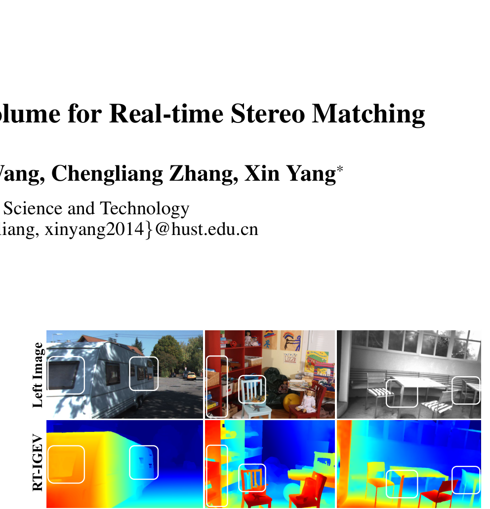

# GGEV: Generalized Geometry Encoding Volume for Real-time Stereo Matching

**Authors:** Jiaxin Liu, Gangwei Xu, Xianqi Wang, Chengliang Zhang, Xin Yang (Huazhong University of Science and Technology)
**Venue:** AAAI 2026
**Priority:** 8/10 — **extends IGEV-Stereo's GEV concept to real-time with monocular prior integration**
**Code:** https://github.com/JiaxinLiu-A/GGEV
**arXiv:** https://arxiv.org/abs/2512.06793

---

## Core Problem & Motivation

Real-time stereo methods (RT-IGEV++, Fast-ACVNet, IINet) focus on in-domain performance but overlook **zero-shot generalization** — a critical gap for real-world deployment.

Meanwhile, foundation-model methods (FoundationStereo, DEFOM-Stereo, MonSter) leverage Monocular Foundation Models (MFMs) to achieve strong generalization but have **prohibitive inference latency** (100s of ms to seconds on edge hardware).

**The core question:** How to design a real-time stereo matching network that achieves **strong generalization while maintaining high accuracy**?

### Analysis of Existing Geometry Encoding Volume Limitations

The authors identify **two key limitations** of current geometry encoding volumes:

1. **Critical regions vary significantly across disparity hypotheses** — the matching relationships in different regions differ in structure, texture, and occlusion patterns. A single fixed aggregation fails everywhere simultaneously.

2. **Matching relationships in certain regions are fragile** — especially in textureless areas, repetitive patterns, and thin structures. These need **structural guidance** from an external source to be reliable.

### The Insight

Both problems can be solved by **integrating depth-aware structural priors from a frozen monocular depth foundation model (DAv2-Small)** into the cost aggregation process. The monocular prior provides exactly the structural guidance that fragile matching relationships need.

---

## Architecture

### Four Main Stages

#### Stage 1: Multi-cue Feature Extraction

Two parallel feature encoders:

**Texture Feature Encoder:**
- **MobileNetV2** (pre-trained on ImageNet)
- Extracts multi-scale texture features from both images
- Output: $\mathbf{f}_{l,i}, \mathbf{f}_{r,i} \in \mathbb{R}^{C_i \times H/i \times W/i}$ at $i \in \{4, 8, 16\}$
- Used to construct the cost volume

**Depth Feature Encoder (the key distinction):**
- **Frozen Depth Anything V2 Small** — provides monocular depth structural priors
- Applied **only to the left image** (not both, to save compute)
- Extracts multi-scale depth features $\mathbf{f}_{da,i} \in \mathbb{R}^{C_i \times H/i \times W/i}$ at $i \in \{2, 4, 8, 16\}$
- **Frozen throughout training** — preserves the foundation model's generalization
- Used to **guide** cost aggregation and iterative refinement (never directly in matching)

**Selective Channel Fusion (SCF):**
- A lightweight $1 \times 1$ convolution integrates texture and depth features
- Preserves structural details and avoids spatial blurring
- Output: depth-aware prior features $\mathbf{f}_{da,i}$ that enrich texture features with monocular structural cues

#### Stage 2: Cost Volume Construction

Standard group-wise correlation at 1/4 resolution:

$$\mathbf{C}(g, d, x, y) = \frac{1}{N_c/N_g} \langle \mathbf{f}^g_{l,4}(x, y), \mathbf{f}^g_{r,4}(x-d, y) \rangle \quad \text{(1)}$$

Every element:
- **$g \in \{1, ..., N_g\}$** = group index, $N_g = 8$ groups
- **$d \in \mathcal{D} = \{0, 1, ..., D/4 - 1\}$** = disparity index at 1/4 resolution
- **$(x, y)$** = spatial coordinates
- **$N_c$** = total feature channels
- **$N_c / N_g$** = channels per group
- **$\mathbf{f}^g_{l,4}, \mathbf{f}^g_{r,4}$** = $g$-th channel group of left/right texture features
- **$\langle \cdot, \cdot \rangle$** = inner product over $N_c/N_g$ channels

#### Stage 3: Depth-aware Dynamic Cost Aggregation (DDCA) — THE core innovation

Unlike standard cost aggregation that uses **fixed** convolution weights everywhere, DDCA uses **dynamic, spatially adaptive** kernels generated from the depth features.

**Disparity-wise Depth Structural Representation:**

Given input cost volume $\mathbf{C}_d \in \mathbb{R}^{G \times C \times W}$ at disparity hypothesis $d$ and depth feature $\mathbf{f}_{da} \in \mathbb{R}^{C \times H \times W}$:

$$\mathbf{Q} = \text{Re}(W_q \mathbf{C}_d) \quad \text{(2)}$$

$$\mathbf{K} = \text{Re}(W_k \text{Pool}(\mathbf{f}_{da})) \quad \text{(3)}$$

$$\mathbf{A} = \mathbf{Q}^T \mathbf{K} \quad \text{(4)}$$

Every element:
- **$W_q, W_k$** = $1 \times 1$ convolutional layers
- **$\text{Re}(\cdot)$** = reshape operation
- **$\text{Pool}(\cdot)$** = adaptive pooling that reduces spatial resolution
- **$\mathbf{Q} \in \mathbb{R}^{C \times HW}$** = query, comes from the cost volume at this disparity
- **$\mathbf{K} \in \mathbb{R}^{C \times S^2}$** = key, comes from **pooled depth features** (multi-head attention style)
- **$\mathbf{A} \in \mathbb{R}^{HW \times S^2}$** = affinity matrix — captures relationships between each cost-volume location and the depth features
- This is **multi-head attention across the channel dimension**: each channel group contributes independently

**Disparity-wise Adaptive Cost Aggregation:**

The affinity matrices $\mathbf{A}^g$ (for each of $G$ groups) generate $G$ distinct $K \times K$ dynamic convolution kernels:

$$\mathbf{M}^g = \text{softmax}(\mathbf{A}^g W_m) \quad \text{(5)}$$

- **$W_m$** = learnable linear layer mapping affinity to convolution kernel weights
- **$\mathbf{M}^g \in \mathbb{R}^{HW \times K^2}$** = spatially adaptive convolution filter, reshaped to $K \times K$ at each pixel
- **$\text{softmax}$** = normalizes the kernel weights

Then the aggregation:

$$\mathbf{C}'_d = \mathbf{C}_d \ast \mathbf{M}^g_{dynamic}(\mathbf{C}_d, \mathbf{f}_{da}) \quad \text{(6)}$$

- **$\ast$** = group-wise convolution
- **$\mathbf{C}'_d$** = aggregated cost at disparity $d$ — each pixel processed by its own custom kernel based on the depth features at that pixel
- Uses both **large and small kernels** to capture low- and high-frequency information

**Critical insight:** Each pixel gets a **spatially adaptive** convolution kernel derived from the depth features. This means:
- **In textureless regions**, the depth features provide smooth spatial context → smooth kernel → smooth cost
- **At depth discontinuities**, the depth features change sharply → sharp kernel → preserved edges
- **At repetitive patterns**, the depth features disambiguate → correct kernel selects right match

The aggregated hypotheses form the **Generalized Geometry Encoding Volume** — a cost volume with monocular-prior-informed structural guidance baked in.

#### Stage 4: Iterative Refinement

**Initial disparity via soft argmin:**

$$\mathbf{d}_0 = \sum_{d \in \mathcal{D}} d \cdot \text{Softmax}(\mathbf{C}'(d)) \quad \text{(7)}$$

**ConvGRU iterative refinement:**

$$z_k = \sigma(\text{Conv}([h_{k-1}, x_k], W_z))$$
$$r_k = \sigma(\text{Conv}([h_{k-1}, x_k], W_r)) \quad \text{(8-10)}$$
$$\tilde{h}_k = \tanh(\text{Conv}([r_k \odot h_{k-1}, x_k], W_h))$$
$$h_k = (1 - z_k) \odot h_{k-1} + z_k \odot \tilde{h}_k \quad \text{(11)}$$

Every element:
- **$x_k$** = concatenation of $h_{k-1}$, current disparity $\mathbf{d}_k$, and the retrieved geometry features $\mathbf{f}_G$ indexed from $\mathbf{C}'$
- **$h_{k-1}$** = previous hidden state, initialized from $\mathbf{f}_{da,4}$ — the depth features directly initialize the GRU state, injecting depth prior into the iterative process from iteration 0
- **Single-layer GRU** (not multi-level like IGEV-Stereo) — the depth prior compensates for the reduced GRU capacity
- **$W_z, W_r, W_h$** = learnable conv weights for update gate, reset gate, candidate state
- **$\sigma$** = sigmoid, **$\odot$** = element-wise product
- Disparity update: $\mathbf{d}_{k+1} = \mathbf{d}_k + \Delta\mathbf{d}_k$

**Spatial upsampling:** The depth features $\mathbf{f}_d$ (from the left image) are used to generate a weight map $W \in \mathbb{R}^{H \times W \times 9}$ that guides convex upsampling from 1/4 resolution to full resolution.

### Loss Function

$$\mathcal{L} = \Vert \mathbf{d}_0 - \mathbf{d}_{gt}\Vert _{smooth} + \sum_{i=1}^{N} \gamma^{N-i} \Vert \mathbf{d}_i - \mathbf{d}_{gt}\Vert _1 \quad \text{(13)}$$

- **$\Vert \cdot\Vert _{smooth}$** = smooth L1 loss on initial disparity (from soft argmin on $\mathbf{C}'$)
- **$\gamma = 0.9$** = exponential decay
- **$N$** = number of iterations (11 training, 8 inference)

---

## Key Innovations

1. **Integration of frozen DAv2 features into cost aggregation** — Unlike DEFOM-Stereo or MonSter which use DAv2 at every iteration, GGEV uses DAv2 **only once** to guide DDCA kernel generation. The rest of the network is lightweight.

2. **Depth-aware Dynamic Cost Aggregation (DDCA)** — spatially adaptive convolution kernels generated from depth features. This is a **content-adaptive** alternative to fixed cost filtering: each pixel gets a custom kernel based on its depth prior.

3. **Selective Channel Fusion** — a lightweight $1 \times 1$ conv fuses depth and texture features without spatial blurring.

4. **Single-layer ConvGRU** — the depth prior provides sufficient context that a multi-level GRU (as in RAFT-Stereo / IGEV-Stereo) is not needed, saving compute.

5. **Depth features initialize the GRU hidden state** — the monocular prior is injected from iteration 0, not added later.

---

## Benchmark Results

### Zero-Shot Generalization (trained on Scene Flow)

| Method | Category | KITTI-12 | KITTI-15 | Middlebury-quarter | ETH3D |
|--------|----------|----------|----------|-------------------|-------|
| RAFT-Stereo | Accuracy | 4.5 | 5.7 | 9.3 | 3.2 |
| FC-GANet | Accuracy | 4.6 | 5.3 | 7.8 | 5.8 |
| DEFOM-Stereo | Accuracy | 3.7 | 4.9 | 5.6 | 2.3 |
| DEFOM-Stereo (ViT-S) | Accuracy | 4.2 | 5.3 | 6.3 | 2.6 |
| FoundationStereo | Accuracy | 3.2 | 4.9 | — | 1.8 |
| DeepPrunerFast | Speed | 16.8 | 15.9 | 18.3 | 11.0 |
| CoEx | Speed | 13.5 | 10.6 | 14.5 | 9.0 |
| BGNet+ | Speed | 5.3 | 6.6 | 12.2 | 10.3 |
| Fast-ACVNet | Speed | 12.4 | 10.6 | 13.5 | 7.9 |
| IINet | Speed | 11.6 | 8.5 | — | — |
| RT-IGEV | Speed | 5.8 | 6.6 | 7.8 | 5.8 |
| **GGEV (Ours)** | **Speed** | **4.1** | **5.8** | **7.5** | **2.8** |

**Headline result:** GGEV achieves zero-shot generalization **comparable to accuracy-oriented methods** (DEFOM-Stereo, FoundationStereo) while being a real-time method.

- **29% error reduction over RT-IGEV on KITTI 2012** (4.1 vs 5.8)
- **16% reduction on Middlebury-quarter** (7.5 vs 8.9)
- **51% error reduction on ETH3D** (2.8 vs 5.8 vs RT-IGEV)
- **Speed comparable to DEFOM-Stereo (ViT-S) while reducing ETH3D error by 81%**

### With Extended Training Data (Scene Flow + CREStereo + TartanAir)

| Method | KITTI-12 | KITTI-15 | Middlebury-quarter | ETH3D |
|--------|----------|----------|-------------------|-------|
| RT-IGEV (2025c) | 4.0 | 5.4 | 8.6 | 3.4 |
| **GGEV (Ours)** | **3.6** | **4.7** | **5.7** | **2.2** |

### KITTI Benchmarks (In-Domain)

- **KITTI 2012:** Outperforms RT-IGEV and BANet-3D by 13% on 2-noc and 3-noc metrics
- **KITTI 2015:** Top performance on both D1-bg and D1-all

### ETH3D

**Nearly 50% error reduction** over existing real-time methods. Surpasses both GMStereo and Selective-IGEV on Bad 1.0 metric while requiring **less than 1/4 of their inference time**.

---

## Strengths & Limitations

**Strengths:**
- **Bridges the real-time vs generalization gap** — first real-time method with zero-shot comparable to FoundationStereo / DEFOM-Stereo
- **Principled use of foundation models** — DAv2 features used ONCE for aggregation guidance, not repeatedly at every GRU iteration
- **Content-adaptive DDCA** — spatially dynamic kernels handle textureless / repetitive / thin structures gracefully
- **Single-layer GRU sufficient** — depth priors provide enough context
- **Real-time:** matches RT-IGEV speed (~48ms range on edge GPUs)
- **51% ETH3D error reduction** over RT-IGEV is dramatic
- **Depth encoder is FROZEN** — preserves DAv2 generalization, no fine-tuning risk

**Limitations:**
- **Still includes DAv2-Small at inference** — unlike Pip-Stereo's MPT which distills the knowledge and removes the foundation model at inference. Adds memory footprint.
- **DAv2-Small adds inference overhead** — though smaller than DAv2-Large, it's still a ViT
- **Single-scale depth feature** at each level — no multi-scale depth pyramid fusion
- **No reported mobile/Jetson latency** — inference time on 3090 GPU
- **Single-layer GRU may limit iterative refinement ceiling** vs 3-level GRU approaches
- **Parameter count not explicitly reported**

---

## Relevance to Our Edge Model

**GGEV is directly relevant** — it represents one of two competing philosophies for integrating monocular priors into real-time iterative stereo:

### GGEV vs Pip-Stereo (two philosophies)

| Aspect | GGEV | Pip-Stereo |
|--------|------|-----------|
| Monocular prior at inference | **YES** (DAv2-Small runs) | **NO** (distilled via MPT at training) |
| Integration approach | Dynamic cost aggregation kernels | Knowledge distilled into student encoder weights |
| Iterations | Fixed (11 train, 8 infer) | Variable (PIP compresses 32→1) |
| GRU levels | Single-layer | Single-layer (RepViT NAS) |
| Zero-shot generalization | Comparable to DEFOM/FS | Comparable to MonSter |
| Inference overhead | DAv2-Small at every inference | Zero (encoder baked in) |

**Trade-off:** GGEV's DAv2-Small still runs at inference (memory overhead), while Pip-Stereo eliminates it via MPT distillation but requires more complex multi-stage training. **For our edge model, Pip-Stereo's MPT approach is preferable** since edge devices have strict memory constraints.

### Directly Adoptable Ideas

1. **Depth-aware Dynamic Cost Aggregation (DDCA)** — the idea of using depth features to generate spatially adaptive convolution kernels. Could be combined with:
   - **Pip-Stereo's MPT distillation** — distill DDCA behavior into static kernels at training time
   - **Our edge model's aggregation stage** — replace IGEV-Stereo's 3D UNet regularization with DDCA

2. **Depth features as GRU hidden state initializer** — initializing the GRU from mono features (rather than zero or context features) is a simple but effective technique.

3. **Single-layer GRU is sufficient with good priors** — validates our design choice to reduce from 3-level to 1-level GRU.

4. **Selective Channel Fusion** — lightweight $1 \times 1$ conv for fusing texture and depth features.

### Caveat

GGEV's DAv2-Small at inference is incompatible with strict edge constraints. The better approach is:
- **Use GGEV's DDCA concept** for cost aggregation design
- **But distill it via Pip-Stereo's MPT** so no foundation model runs at inference
- This combines the best of both — content-adaptive aggregation + no inference overhead

---

## Connections to Other Papers

| Paper | Relationship |
|-------|-------------|
| **IGEV-Stereo** | Direct predecessor — GGEV extends GEV with depth priors |
| **IGEV++** | Orthogonal extension (multi-range) vs GGEV (depth-aware) |
| **RT-IGEV / RT-IGEV++** | Direct real-time competitor — GGEV reduces ETH3D error by 51% at similar speed |
| **DEFOM-Stereo** | Uses DAv2 similarly but at every iteration (more expensive) |
| **FoundationStereo** | Provides the zero-shot accuracy target that GGEV approaches at 1/4 the cost |
| **Pip-Stereo** | **Closest alternative** — different philosophy (distill vs use) but similar goal |
| **MonSter** | Bidirectional mono-stereo refinement — more complex than GGEV's one-shot cost aggregation |
| **DAv2 (Depth Anything V2)** | Frozen monocular teacher (Small variant) |
| **MobileNetV2** | Texture backbone |
| **BANet** | Same HUST group — bilateral aggregation vs GGEV's depth-aware aggregation |
