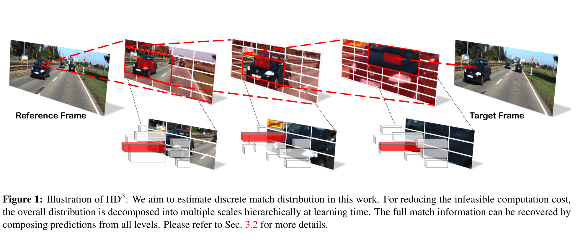
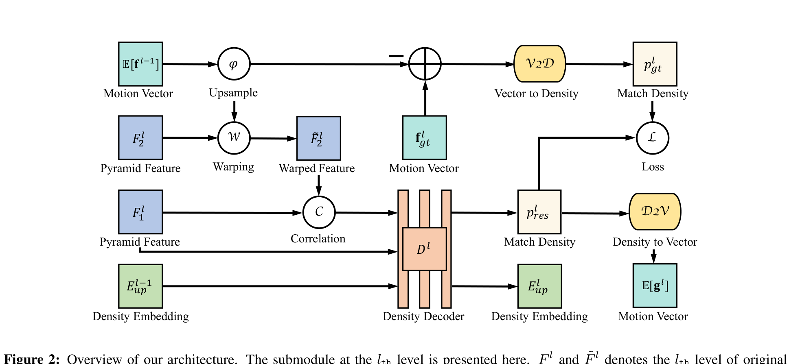
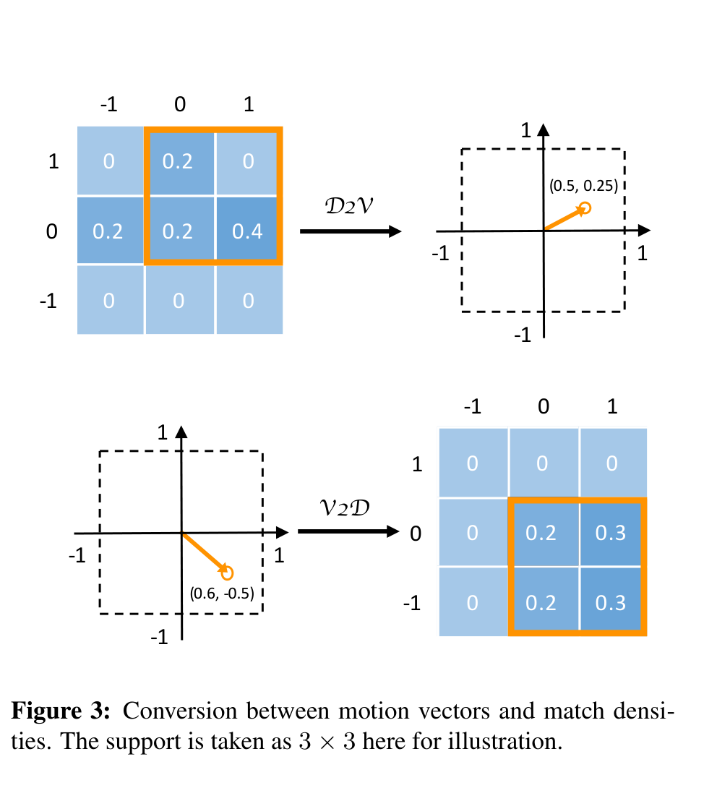
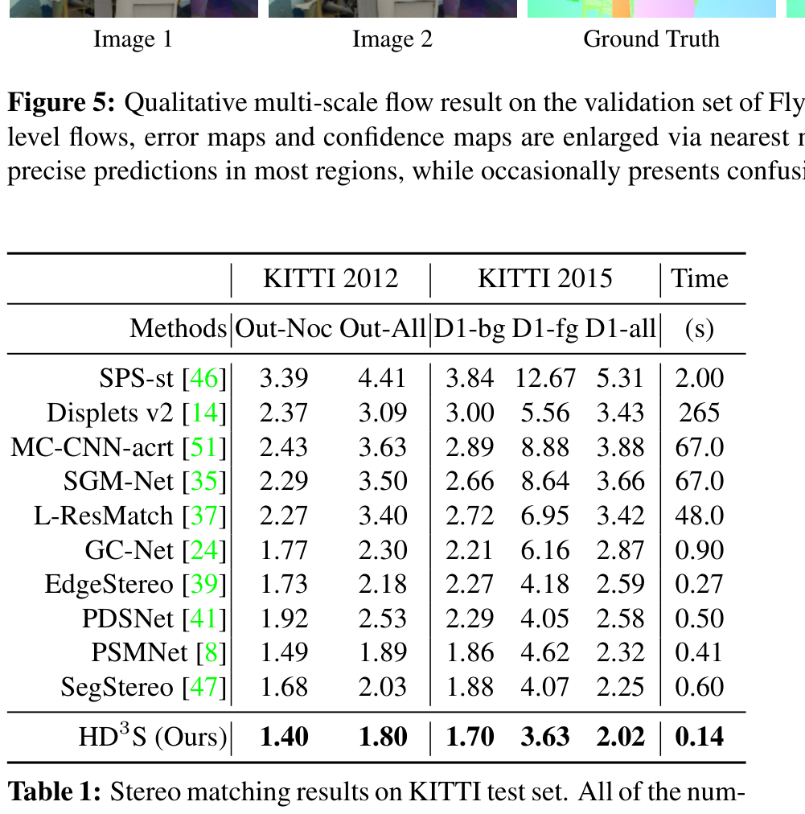
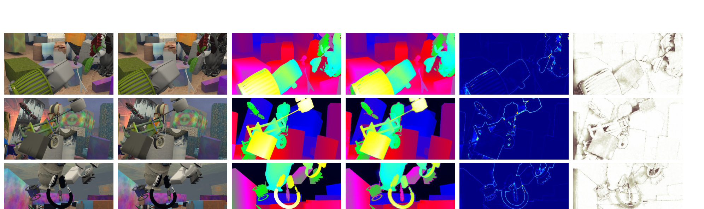

# HD3: Hierarchical Discrete Distribution Decomposition for Match Density Estimation

**Authors:** Zhichao Yin, Trevor Darrell, Fisher Yu (UC Berkeley)
**Venue:** CVPR 2019
**Priority:** 8/10 — conceptually rich, predating RAFT-Stereo's hierarchical updates. Introduces the idea of **predicting full match distributions** rather than point estimates, with native model-inherent uncertainty. A key conceptual ancestor of confidence-aware and iterative stereo.

---

## Core Problem & Motivation

By 2019, deep stereo and optical flow networks (FlowNet2, PWC-Net, GC-Net, PSMNet) were highly accurate but **agnostic to their own failures**. They regressed a single continuous displacement per pixel — no native notion of matching confidence, no distribution over candidates, no way to say "I don't know here" at boundaries and occlusions.

Two partial remedies existed:

1. **Post-hoc confidence estimation** (Kondermann et al., Mac Aodha et al., and later learned-confidence works): runs a second network after the disparity estimator. Decoupled from training; the main network never learns to be calibrated.
2. **Parametric probabilistic heads** (Gast & Roth 2018, ProbFlow 2017): wrap outputs in a **local Gaussian** and propagate uncertainty. Forces the distribution to be unimodal — breaks on occlusions, edges, and textureless regions where the true posterior is multi-modal or heavy-tailed.

The **correct** approach — predict a full dense match density (probability of each candidate displacement for each pixel) — was known but **computationally infeasible**: for a $1000 \times 1000$ image with displacement range $\pm 50$, the full discrete distribution has $10^4$ support cells × $10^6$ pixels $= 10^{10}$ entries. No GPU can hold or predict that volume directly.

### The HD3 Insight

HD3 asks: **can the full match density be decomposed hierarchically so that each scale only predicts a local, low-variance residual distribution over a small support?** The answer is yes, and the decomposition comes from three observations:

1. A coarse estimate at scale $l-1$ drastically narrows the true displacement range at scale $l$ — most of the probability mass concentrates in a tiny neighborhood of the upsampled coarse prediction.
2. That neighborhood can be represented by a **very small discrete support** (e.g., a $9 \times 9$ patch for 2D flow, $9$ bins for 1D stereo).
3. The full match density factorizes as a product of per-level conditional densities, each of which is cheap to represent and predict.

This turns an intractable global distribution prediction into a chain of tractable local ones — the probabilistic analogue of coarse-to-fine feature warping in SpyNet / PWC-Net.

### Why It Matters for Stereo (and Our Work)

HD3 treats stereo as a **special case of optical flow** where the displacement is 1D, and demonstrates that the hierarchical-density framework generalizes. The stereo variant (HD3S) achieved **SOTA on KITTI 2012 and 2015** at submission time, with **140 ms inference** — faster than GC-Net (900 ms) and PSMNet (410 ms). More importantly for us, HD3 is a **conceptual ancestor of hierarchical iterative methods**: the level-by-level residual refinement with a context/density bypass anticipates the multi-level updates in RAFT-Stereo and the coarse-to-fine narrowing in Cascade Cost Volume.

---

## Architecture

### High-Level Pipeline

```
(I1, I2) stereo pair
    ↓
[DLA-34-Up Pyramid Feature Extractor]          ← shared multi-scale features F^l
    ↓  (features at 6 levels for stereo, coarsest ×64 downsampled)
Repeat for l = 0, 1, ..., L:
    ├─ Upsample previous motion E[f^{l-1}] → ϕ(E[f^{l-1}])
    ├─ Warp right feature F_2^l with the upsampled motion → F̃_2^l
    ├─ 1D correlation(F_1^l, F̃_2^l) over range ±4 pixels  ← key cost volume
    ├─ Density Decoder D^l: ConvNet on [correlation, context features, E^{l-1}_up]
    │     outputs p_res^l — residual match density over small support (local distribution)
    ├─ D2V (Density → Vector): local expectation → E[g^l] = residual motion
    ├─ V2D (Vector → Density): converts ground-truth motion to density at this scale (for loss)
    ├─ KL-divergence loss against p_gt^l
    └─ Pass density embedding E^l_up forward to next level as density bypass
    ↓
Compose residuals: f = Σ_l ϕ^{L-l}(g^l)   ← final displacement
```



### Submodule — Single Level of HD3



Each level $l$'s submodule has six inputs/outputs (shown in Fig. 2 of the paper):

| Symbol | Meaning |
|--------|---------|
| $F_1^l, F_2^l$ | Pyramid features at level $l$ for reference and target image |
| $\mathbb{E}[\mathbf{f}^{l-1}]$ | Motion vector from previous (coarser) level — expectation of coarse match density |
| $\varphi$ | $\times 2$ upsampling operator (spatial bilinear upsampling + doubling motion magnitude) |
| $\tilde{F}_2^l$ | Target feature **warped** by the upsampled motion (backward warp) |
| $p_{res}^l$ | **Residual match density** at level $l$ — probability distribution over displacement residuals $g^l$ |
| $E_{up}^{l-1}$ | Density embedding from previous level (context bypass, carries uncertainty forward) |
| $\mathbb{E}[g^l]$ | Local expectation of the residual density → point estimate of residual motion |
| $p_{gt}^l$ | Ground-truth density at level $l$, derived from downsampled GT flow via V2D |
| $\mathcal{L}$ | KL-divergence loss between $p_{res}^l$ and $p_{gt}^l$ |

### V2D: Vector-to-Density Conversion

This is how HD3 converts a continuous ground-truth motion vector $f_{ij}$ into a discrete distribution supervisor. Observation: a real-valued $f_{ij}$ lies inside a $2 \times 2$ integer-grid window $W_{ij}$ (its four nearest integer displacement cells). HD3 splats bilinear weights of $f_{ij}$ into these four cells:

$$P(f_{ij} = d) = \begin{cases} 0 & d \notin W_{ij} \\ \rho(f_{ij} - \tilde{d}) & d \in W_{ij} \end{cases} \quad \text{(3)}$$

- **$f_{ij} \in \mathbb{R}^2$** = continuous motion vector at pixel $(i,j)$ (for stereo: 1D).
- **$d \in \mathbb{Z}^2$** = integer displacement candidate (a cell of the integer grid).
- **$W_{ij}$** = $2 \times 2$ window of integer displacements around $f_{ij}$ (4 candidates).
- **$\tilde{d}$** = diagonal opposite coordinate of $d$ within $W_{ij}$.
- **$\rho(\cdot)$** = product of elements of the vector argument — this is precisely the bilinear kernel: a cell closer to $f_{ij}$ gets higher weight.

The support has size $\leq 4$ for 2D flow (and 2 for 1D stereo). That bound is crucial — it is what keeps the match density prediction tractable.

### D2V: Density-to-Vector Conversion (Local Expectation)

The inverse operation. Given a predicted residual density $p(f_{ij})$:

1. Find the $2 \times 2$ window $W_{ij}^*$ over which the density integral is maximal (the dominant mode).
2. Restrict $p$ to $W_{ij}^*$ and renormalize → $p^*(f_{ij})$.
3. Compute the **local expectation** $\mathbb{E}[f_{ij}]$ with respect to $p^*$.

This is effectively a **local soft-argmin over the $2 \times 2$ window around the dominant peak** — not the global expectation (which would average over noise), and not a hard argmax (which is non-differentiable). It is HD3's principled answer to the multi-modal distribution problem that CoEx addressed with top-$k$. The key benefit is that it sidesteps expensive sampling over the full quadtree of candidates at all levels.

### Match Density Decomposition — The Core Probabilistic Framework

**Multi-scale motion fields:** $\{f^l\}$, $l = 0, \ldots, L$, where $f^l$ has half the resolution of $f^{l+1}$ and $f^L = f$ (full resolution).

**Residual transformation:**
$$g^l = f^l - \varphi(f^{l-1})$$
where $\varphi$ is the $\times 2$ upsampling operator. $g^l$ is the **residual motion** at level $l$ not explained by the upsampled coarser prediction. Because the coarse prediction already captures most of the displacement, $g^l$ has **very low variance** — it lives in a small local support.

Then the full motion is the sum of these residuals at their respective resolutions:

$$\mathbf{f} = \sum_{l=0}^{L} \varphi^{L-l}(g^l) \quad \text{(1)}$$

- **$\varphi^{L-l}$** = upsampling operator applied $L - l$ times, bringing level-$l$ residual from its native resolution up to full resolution $L$.
- Each $g^l$ contributes its portion of the total displacement at its own scale.

And the joint density factorizes:

$$p(\mathbf{f}) = \sum_{\{g^l\} \in \mathcal{F}} \prod_{l=0}^{L} p(g^l | G^{l-1}) \quad \text{(2)}$$

- **$G^l = \{g^s\}_{s=0}^{l}$** = all residuals up through level $l$ (the conditioning context).
- **$\mathcal{F}$** = set of all combinations of $\{g^l\}$ that satisfy Eq. 1.
- **$p(g^l | G^{l-1})$** = conditional density of the level-$l$ residual given coarser residuals.

### Approximation via Local Expectation

Exhaustively enumerating $\{g^l\}$ would be expensive (quadtree sampling). Instead, HD3 approximates by taking the **mode** (via local expectation) at each coarser level:

$$G^{(l-1)*} = \{\mathbb{E}[g^s]\}_{s=0}^{l-1}, \quad p_{res}^l := p(g^l | G^{(l-1)*})$$

So at each level, only a single pass of the density decoder is required — no test-time sampling. This is the key practical simplification that makes HD3 real-time.

### Density Decoder and Density Bypass

The density decoder $D^l$ takes as input:
- The **correlation volume** between $F_1^l$ and the warped $\tilde{F}_2^l$ with a small ±4-pixel range (matches the $W_{ij}$ support width),
- The **pyramid feature** $F_1^l$ directly (so the decoder sees image context, not only correlation),
- The **upsampled density embedding** $E_{up}^{l-1}$ from the previous level (density bypass connection — a learned tensor that carries shape-of-distribution information forward, not just the mode).

It outputs (a) the residual match density $p_{res}^l$ over the local support, and (b) a new density embedding $E^l$ that will be upsampled and passed to level $l+1$.

- Density decoder implementation: 2 residual blocks + 1 aggregation node (from Deep Layer Aggregation / DLA). The final level uses a dilated convolutional context module for larger receptive field.
- Feature extractor: **DLA-34-Up** — deep layer aggregation with iterative deep upsampling. Coarsest features are $\times 64$ downsampled (6 levels for stereo, 5 for flow).

### Key Design Choices

- **Correlation range ±4** at every level: matches the maximum support size of the match density window. Any larger range would waste computation; smaller would miss genuine residuals.
- **1D correlation for stereo (HD3S), 2D for flow (HD3F)**: epipolar constraint is exploited.
- **Clipping**: for stereo, positive values in converted point estimates are clipped at each level since disparity is non-negative.
- **Pyramid levels**: 6 for stereo (since disparity can be larger), 5 for flow. Experiment-driven.

### V2D and D2V Visualization



The diagram at right shows the 3×3 version of V2D and D2V (the paper uses 2×2 in practice for stereo; 3×3 is shown for illustration of the concept). V2D converts a point estimate (e.g., $(0.5, 0.25)$) into a sparse distribution; D2V inverts this by taking the local expectation over the 2×2 window with maximum integrated probability.

---

## Key Equations

**Residual decomposition (Eq. 1):**
$$\mathbf{f} = \sum_{l=0}^{L} \varphi^{L-l}(g^l) \quad \text{(1)}$$

**Density factorization (Eq. 2):**
$$p(\mathbf{f}) = \sum_{\{g^l\} \in \mathcal{F}} \prod_{l=0}^{L} p(g^l | G^{l-1}) \quad \text{(2)}$$

**Vector-to-density (Eq. 3):**
$$P(f_{ij} = d) = \begin{cases} 0 & d \notin W_{ij} \\ \rho(f_{ij} - \tilde{d}) & d \in W_{ij} \end{cases} \quad \text{(3)}$$

- **$f_{ij}$** = continuous ground-truth motion vector at pixel $(i,j)$.
- **$d$** = candidate integer displacement.
- **$W_{ij}$** = 2×2 window of integer displacements around $f_{ij}$.
- **$\tilde{d}$** = diagonal opposite of $d$ in $W_{ij}$.
- **$\rho(v)$** = product of the components of vector $v$ (bilinear kernel).

**Training loss — multi-scale KL-divergence (Eq. 4):**

$$\mathcal{L} = \sum_{l} \sum_{g \in \mathcal{R}_{g^l}} p_{gt}^l(g) \bigl( \log p_{gt}^l(g) - \log p_{res}^l(g) \bigr) \quad \text{(4)}$$

- **$\mathcal{R}_{g^l}$** = support set of the residual distribution at level $l$ (size $\leq 4$ for 2D, $\leq 2$ for 1D).
- **$p_{gt}^l(g)$** = ground-truth match density at level $l$, obtained by (a) downsampling GT motion to level $l$ resolution, (b) subtracting the upsampled coarser prediction to get residual, (c) V2D converting to density.
- **$p_{res}^l(g)$** = predicted residual density at level $l$ from the density decoder.
- Sum is over all levels $l$ and all support elements $g$.
- KL divergence treats the densities as discrete categorical distributions — since the $p_{gt}$ entropy term is constant, this is equivalent to weighted cross-entropy.

**Implicit inference equation (used implicitly, not numbered in paper):**
$$\hat{\mathbf{f}} = \sum_{l=0}^{L} \varphi^{L-l}\bigl(\mathbb{E}[g^l]\bigr)$$

- **$\mathbb{E}[g^l]$** = local expectation of the predicted residual density at level $l$ (D2V operation).
- At inference, all predicted residual modes are combined to produce the final displacement.

---

## Training

- **Supervision:** dense or sparse ground-truth flow/disparity, converted per-level into discrete densities via V2D. Dense annotations are bilinearly downsampled; sparse (KITTI) annotations are average-pooled.
- **Loss:** KL-divergence between predicted and V2D-derived ground-truth residual densities, summed across all pyramid levels (Eq. 4).
- **Pretraining data:** FlyingThings3D subset (same as FlowNet2's protocol). Stereo training uses crop $320 \times 896$, batch 32, LR $2 \times 10^{-4}$, 200 epochs.
- **KITTI fine-tuning:** 394 training pairs (KITTI 2012 + 2015), 2000 epochs, batch 16, crop $320 \times 896$, LR $1 \times 10^{-5}$ with decay at 1000 and 1500 epochs by $0.5$.
- **Optical flow** uses FlyingChairs pretraining, then FlyingThings3D fine-tune, then Sintel/KITTI fine-tune.
- **Optimizer:** Adam ($\beta_1 = 0.9, \beta_2 = 0.999$).
- **Batch norm:** used throughout; not synchronized across GPUs.
- **Augmentation:** random crop/resize/color perturbation for fine-tuning; random flip for flow.
- **Backbone:** DLA-34-Up (Deep Layer Aggregation), ImageNet pretrained.
- **Hardware:** 8 GPUs.

---

## Results

### KITTI Stereo 2012 & 2015 (Table 1)



| Method | KITTI 2012 Out-Noc | Out-All | KITTI 2015 D1-bg | D1-fg | D1-all | Time (s) |
|--------|--------------------|---------|--------------------|-------|--------|----------|
| SPS-st | 3.39 | 4.41 | 3.84 | 12.67 | 5.31 | 2.00 |
| MC-CNN-acrt | 2.43 | 3.63 | 2.89 | 8.88 | 3.88 | 67.0 |
| SGM-Net | 2.29 | 3.50 | 2.66 | 8.64 | 3.66 | 67.0 |
| GC-Net | 1.77 | 2.30 | 2.21 | 6.16 | 2.87 | 0.90 |
| EdgeStereo | 1.73 | 2.18 | 2.27 | 4.18 | 2.59 | 0.27 |
| PSMNet | 1.49 | 1.89 | 1.86 | 4.62 | 2.32 | 0.41 |
| SegStereo | 1.68 | 2.03 | 1.88 | 4.07 | 2.25 | 0.60 |
| **HD3S (Ours)** | **1.40** | **1.80** | **1.70** | **3.63** | **2.02** | **0.14** |

**Headline:** HD3S was SOTA on KITTI 2012 and 2015 at CVPR 2019 submission time, across **all metrics** (Out-Noc, Out-All, D1-bg, D1-fg, D1-all) — and it was **faster** than PSMNet (140 ms vs 410 ms) and ~6.4× faster than GC-Net.

### Qualitative — Visualization of Predictions, Errors, Confidence



The qualitative results on FlyingThings3D show:
- Accurate disparity predictions across most of the frame,
- **Errors concentrate at boundaries and occlusions** (warm colors in error map), and
- **Confidence maps correlate with error** — dark pixels in confidence = high error regions, demonstrating that uncertainty is calibrated.

### Optical Flow (Sintel, KITTI)

HD3F beats all **two-frame** optical flow methods on KITTI 2012/2015 at submission time by wide margins, and even beats some competitive **scene flow methods** (PRSM). On Sintel-final it has the lowest average EPE among learning-based approaches. (Tables 2 & 3 in the paper.)

### Uncertainty Calibration (Table 4)

HD3F has dramatically higher average log likelihood than competing probabilistic flow networks:

| Method | Sintel clean | Sintel final | Chairs |
|--------|-------------|--------------|--------|
| FlowNetDropOut | -7.106 | -10.820 | -6.176 |
| FlowNetProbOut | -6.888 | -7.621 | -3.591 |
| FlowNetADF | -3.878 | -4.186 | -3.348 |
| **HD3F** | **-1.487** | **-1.821** | **-0.872** |

### Uncertainty as Outlier Classifier (Table 5)

Using a confidence threshold $\sigma > 0.3$ to classify outliers on KITTI 2015, HD3F outperforms classical forward-backward consistency check:

| Metric | Consistency | HD3F |
|--------|------------|------|
| Mean IoU (all) | 49.5 | **68.0** |
| Mean Accuracy (all) | 79.4 | **85.1** |

The uncertainty is **model-inherent** (comes straight from the predicted density without post-processing) and already beats the most popular classical uncertainty proxy.

---

## Why It Works

### Insight 1 — Hierarchical Decomposition Tames the Distribution

A single-scale prediction of the full match density over a 1000×1000 image with ±50 displacement is 10¹⁰ cells — intractable. But the full density can be **factored through coarse-to-fine residuals**, each with support only $\leq 4$ cells. The total compute is $O(L \cdot H \cdot W \cdot 4)$ — linear in image area and number of levels, not quadratic in search range.

This is precisely the same trick that later cascade and iterative methods exploit: **don't predict the full distribution once, predict small residuals many times**.

### Insight 2 — Residual Distributions Are Naturally Low-Variance

The key empirical observation: because $g^l = f^l - \varphi(f^{l-1})$ is the part of the motion not already explained by the coarser prediction, and the coarser prediction is already accurate **in the easy regions**, the residual almost always falls within 1–2 integer cells. This means a $2 \times 2$ window is sufficient support — you don't need a wide distribution at each level.

Occasional failures (occlusions, large motion disparities) are absorbed by the probabilistic framework: the residual distribution becomes less peaked, and the corresponding pixel's confidence drops. HD3 is **self-aware of its own failure modes** in a way displacement-regression networks are not.

### Insight 3 — Density Bypass Is the Context Channel

The learned density embedding $E^l_{up}$ passed between levels is crucial. Without it, the decoder at level $l$ only sees the correlation and the point estimate from level $l-1$ — no information about **how confident** the coarser prediction was. The density embedding carries distribution-shape information forward so later levels can adapt (e.g., at an occlusion boundary the coarse level was uncertain; the finer level should weight its correlation signal more and the point estimate less).

### Insight 4 — V2D/D2V Are Soft, Differentiable, and Local

V2D is a bilinear splat — soft and differentiable. D2V is a local (not global) expectation — focused on the dominant mode rather than averaging over noise. Together, they let HD3 supervise continuous motion with discrete distributions **without losing sub-pixel precision** and without the mode-averaging problem CoEx later addressed with top-$k$.

---

## Limitations / Failure Modes

- **Small support at each level** (2×2 for 2D, 2 for 1D): works only because the feature pyramid already does most of the heavy lifting. If the coarse prediction is off by more than ~4 pixels at a given level, that level cannot recover (the residual is outside its support). Large unseen motions are a failure mode.
- **Local expectation approximation**: HD3's inference uses $\mathbb{E}[g^l]$ (the mode) rather than full posterior sampling. This is cheap but loses information — in principle HD3 could compose full densities across levels, but that is expensive. The predicted posterior is **marginal-only** at each level, not joint.
- **Training loss is KL per level**: this weights all levels equally. Later works (RAFT, IGEV) weight later levels higher via exponential decay — HD3 does not.
- **No iterative refinement**: each level is visited once. The architecture is feedforward. This is a limitation vs later iterative methods which re-query correlation via a learned update at every step.
- **Backbone is dated**: DLA-34-Up predates modern lightweight backbones. Reimplementing HD3 with a MobileNet or RepVGG backbone would likely preserve accuracy with far less compute.
- **140 ms is fast for 2019, slow for edge**: at $374 \times 1238$ KITTI resolution on a high-end GPU. On a Jetson Orin Nano it would likely be >500 ms — not real-time.
- **D1-fg = 3.63%** on KITTI 2015 is still relatively high — HD3 still struggles with foreground objects (thin structures, fine details) despite its hierarchical design.

---

## Relevance to Our Edge Model

HD3 is the conceptual ancestor of much of modern efficient stereo. Its insights are **directly useful** even if its specific architecture is not edge-ready.

### Directly Adoptable Concepts

1. **Coarse-to-fine residual refinement with bounded local support.** Our edge model's iterative GRU updates at $1/8$ resolution should output residuals with a small local support (±4 pixels) — matches HD3's finding and keeps compute linear.

2. **Local-mode expectation instead of global soft-argmin.** HD3's D2V operator is a **principled soft local argmin** — pick the window with maximum integrated probability, renormalize, expectation. This avoids mode averaging in multi-modal distributions (similar goal to CoEx's top-$k$ but more principled). We should experiment with D2V-style disparity readout for edge cases.

3. **Density bypass connections between stages.** Carrying **distribution-shape information** (not just the point estimate) between refinement iterations is something current iterative stereo methods underexploit. Our edge model could benefit from an explicit per-pixel uncertainty channel fed between GRU iterations, initialized from the GEV soft-softmax entropy.

4. **KL-divergence loss as a supervisory signal.** Training iterative stereo networks with bilinear-splat density targets at every iteration (not just L1 on the predicted disparity) could improve calibration — a potential replacement for or augmentation of the standard $\gamma^{T-i}$-weighted L1 loss.

5. **Model-inherent uncertainty.** Our edge model should output a confidence channel alongside disparity, derivable natively from the predicted distribution (not a separate post-hoc head). This matters for safety-critical applications (autonomous driving) where the system needs to know when to fall back on LiDAR or slow down.

### Cautions

- **Hierarchical decomposition with 6 levels and DLA-34 backbone is not edge-friendly as-is.** Implementation would need to be stripped down — at most 3 levels (1/16, 1/8, 1/4) with a MobileNet or RepVGG backbone.
- **No iterative refinement** — HD3 is feedforward; we want to combine its hierarchical density idea with iterative updates (RAFT-Stereo style).
- **The local support of 2 for stereo** is very tight — in high-disparity driving scenes the level-$l$ residual may exceed it. We may need ±3 or ±4 bins depending on our pyramid depth.

### Where HD3 Sits in the Lineage

HD3 (2019) → Cascade Cost Volume (2020): both use coarse-to-fine narrowing of the search range, but CascadeCV does it in cost volume space (feature pyramid + narrowing disparity hypotheses) while HD3 does it in density space (predicting residual distributions). RAFT-Stereo (2021) merges the idea with an iterative GRU update. IGEV-Stereo (2023) adds geometry encoding to the volume. Our edge model is the latest step in this lineage.

---

## Connections to Other Papers

| Paper | Relationship |
|-------|-------------|
| **SpyNet / PWC-Net / LiteFlowNet** | Coarse-to-fine feature warping ancestors — HD3 adds probabilistic reasoning |
| **Cascade Cost Volume (CVPR 2020)** | Parallel idea: narrow search range via coarser stages — but in cost-volume rather than density space |
| **RAFT-Stereo / RAFT (2021)** | Hierarchical updates at multiple scales — direct conceptual successor |
| **GC-Net / PSMNet** | HD3S beats both on KITTI at 3-6× the speed |
| **AcfNet / CDN** | Later works on training better unimodal distributions — HD3 sidesteps this via multi-modal local supports |
| **Gast & Roth (CVPR 2018)** | Gaussian probabilistic flow networks — HD3 shows non-parametric decomposition beats them |
| **CoEx** | HD3's D2V (local expectation on dominant window) is conceptually similar to CoEx's top-$k$ |
| **DLA (Yu et al., CVPR 2018)** | HD3's backbone — deep layer aggregation |
| **IGEV-Stereo** | Later method that combines geometry encoding with iterative updates at multi-scale — extends the coarse-to-fine spirit |
| **DEFOM-Stereo / FoundationStereo** | Foundation-model-era stereo — use monocular priors as the coarsest-level initialization, echoing HD3's hierarchical prior idea |

HD3 is not frequently cited in recent edge-stereo work, but its conceptual framework (hierarchical density prediction, small-support residuals, model-inherent uncertainty) is a **hidden ancestor** of much of modern iterative stereo. For our edge model's review paper, HD3 is a must-cover bridge between classical probabilistic methods and modern iterative refinement.
