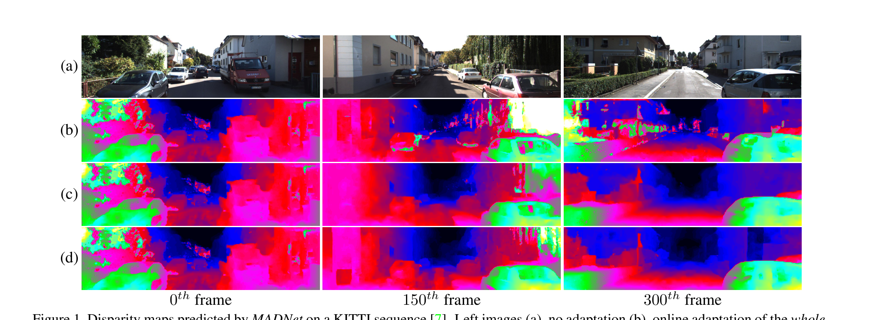
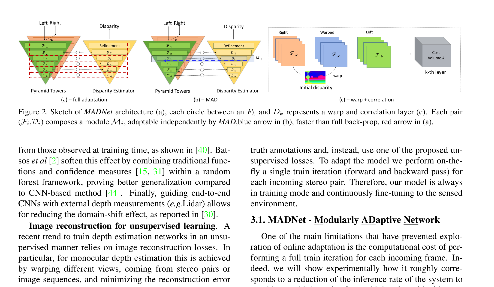
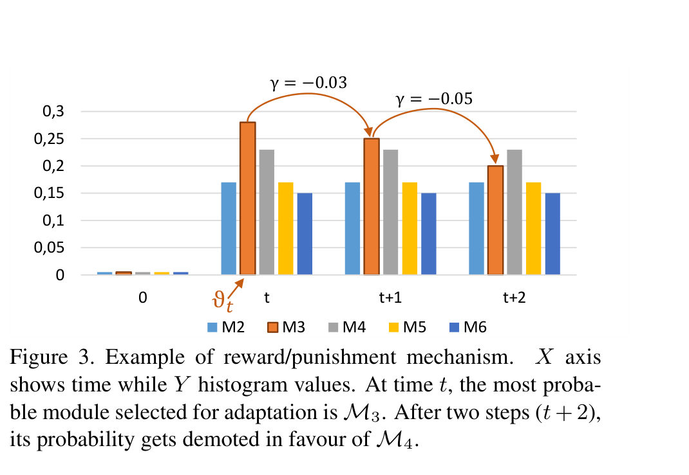
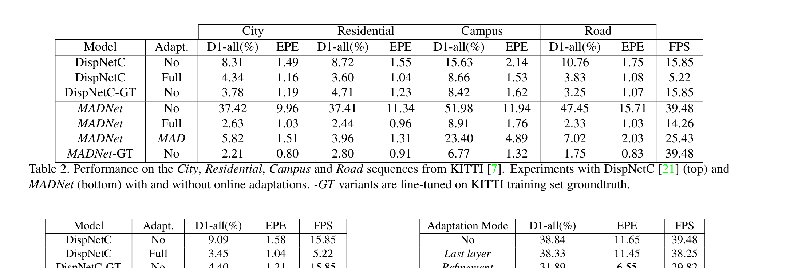
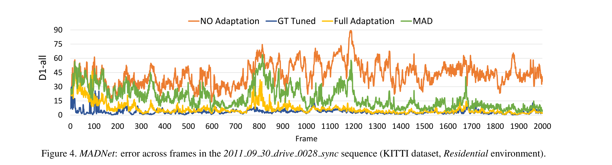

# MADNet: Real-Time Self-Adaptive Deep Stereo

**Authors:** Alessio Tonioni, Fabio Tosi, Matteo Poggi, Stefano Mattoccia, Luigi di Stefano (University of Bologna)
**Venue:** CVPR 2019 (Oral) — arXiv 1810.05424
**Priority:** 9/10 — **foundational online-adaptation paper**; every subsequent work on test-time stereo adaptation cites it; directly relevant to deploying stereo on edge devices that encounter unseen domains

---

## Core Problem & Motivation

Deep stereo networks have a crippling deployment problem: the **synthetic-to-real domain gap**. State-of-the-art networks in 2018 (DispNetC, GC-Net, PSMNet) are trained on Scene Flow (synthetic), and their accuracy *collapses* when exposed to real scenes. DispNetC on KITTI-Residential goes from **~1.55 EPE** (with GT fine-tuning) up to **~1.55 EPE** (zero-shot, similar) but D1-all rises from 4.71% to 8.72%. On MADNet without adaptation, zero-shot performance on KITTI is catastrophic: **D1-all = 37.41%, EPE = 11.34** — the network is essentially broken outside its training domain.



### The Standard Fix (And Why It's Inadequate)

The textbook solution is **offline fine-tuning** — collect labeled stereo pairs from the target domain and continue training. But:

1. **Ground-truth labels in the target domain are prohibitively expensive.** KITTI labels require LiDAR + manual cleanup. Most deployment domains (warehouses, construction sites, disaster zones, novel weather conditions) have no such labels.

2. **Unsupervised fine-tuning** (Zhou, Godard, Tonioni, etc.) exists — it uses photometric warping loss between left/right pairs — but **it's still offline**. It requires collecting a representative batch of target-domain stereo pairs, running an offline training session, then deploying the fine-tuned model. You can't pre-collect every possible road, lighting, or weather condition.

3. **Domains drift continuously.** A stereo camera on a drone moves from sunny park → cloudy forest → rainy highway in a single mission. No offline dataset captures this.

### MADNet's Proposal

> **"Cast adaptation as a continuous learning process whereby a stereo network can evolve online based on the images gathered by the camera during its real deployment."**

Concretely:
- Deploy the network trained only on synthetic data.
- For each incoming stereo pair, run forward + compute photometric self-supervised loss + backward + weight update, **then** predict disparity for the next frame.
- The network is **always in training mode**.

**The catch:** a full forward + backward + update cycle is **3× slower** than forward alone, dropping MADNet from 40 FPS to 15 FPS and DispNetC from 16 FPS to 5 FPS. For many robotics applications this is too slow. MADNet's core contribution is a method that enables adaptation at **25 FPS** while keeping most of the benefit.

---

## Architecture



MADNet is a **pyramidal stereo network** inspired by PWC-Net for optical flow, redesigned for adaptation-friendliness.

### Feature Pyramid Towers

Two shared-weight encoder towers process left and right images through **6 downsampling blocks**, producing features $F_1, F_2, F_3, F_4, F_5, F_6$ at resolutions $1/2, 1/4, 1/8, 1/16, 1/32, 1/64$. Each block is:
- 3×3 conv, stride 2 (downsample) + Leaky ReLU
- 3×3 conv, stride 1 + Leaky ReLU

Channel counts: 16, 32, 64, 96, 128, 192. Very lean — the network has roughly **1/10 the parameters of DispNetC**.

### Pyramidal Disparity Estimation (top-down)

Starting at the coarsest level $F_6$ (1/64 resolution):

1. **Correlation at [-2, 2] range.** Left and right features are cross-correlated in a small 5-entry window.
2. **Disparity decoder $D_k$** (5 layers of 3×3 conv + Leaky ReLU) outputs disparity $D_k$ at level $k$.
3. Upsample $D_k$ to level $k-1$ by bilinear interpolation.
4. **Warp right features** at level $k-1$ using the upsampled disparity to pre-align with left features.
5. Correlate the **warped** right features with left features (again [-2, 2] window).
6. Concatenate (correlation, left features, upsampled disparity) and feed into next decoder $D_{k-1}$, which outputs a **residual** that updates the disparity.

This repeats from $F_6 \to F_5 \to F_4 \to F_3 \to F_2$ (stop at 1/4 resolution). The [-2, 2] correlation window works because most of the disparity has already been "absorbed" by the warping step at the lower level — residuals are small.

### Refinement Module

At the $D_2$ output (1/4 resolution), MADNet appends a **dilated convolution refinement module**:

- 7 layers of 3×3 conv with dilation factors [1, 2, 4, 8, 16, 1, 1] and channels [128, 128, 128, 96, 64, 32, 1].
- Enlarges receptive field at minimal cost.

Final bilinear upsample to full resolution.

### Key Architectural Consequence: Modularity

Each pair $(F_k, D_k)$ can be grouped into a **module $M_k$** — feature extraction at scale $k$ plus disparity estimation at scale $k$. Since each $M_k$ outputs a disparity $y_k$ at its own resolution, **each module can be trained independently** with its own loss computed on $y_k$.

This modularity is **the entire architectural precondition** for MAD. It's not just an architecture; it's a substrate for decoupled training.

### Runtime (1080 Ti, KITTI resolution)
- **Forward pass: 40 FPS** (25 ms).
- **Full online adaptation: 15 FPS** (66 ms, forward + full backprop + update).
- **MAD adaptation: 25 FPS** (40 ms) — the key contribution.

---

## The MAD Algorithm (Modular Adaptation by Distillation)



### The Naive Approach and Why It Fails

The simplest way to speed up adaptation: freeze the early layers, back-prop only through the last $k$ layers. Table 4 in the paper:

| Adapt strategy | D1-all | EPE | FPS |
|-|-|-|-|
| No adaptation | 38.84 | 11.65 | 39.48 |
| Last layer only | 38.33 | 11.45 | 38.25 |
| Refinement module only | 31.89 | 6.55 | 29.82 |
| $D_2$ + Refinement | 18.84 | 2.87 | 25.85 |
| **MAD (full proposal)** | **3.37** | **1.11** | **25.43** |
| Full back-prop (upper bound) | 2.17 | 0.91 | 14.26 |
| GT-finetuned (upper bound) | 2.67 | 0.89 | 39.48 |

**Lesson:** Freezing early layers leaves the network brittle to real-world input statistics. Even unfreezing the last 13 layers gets D1-all only to 18.84 — four times worse than MAD.

MAD's insight: we must train **different modules at different frames**, so every module gets updated over time, but each frame only pays the cost of training one module.

### MAD Formulation

Split the network $N$ into $p$ non-overlapping modules $M_1, \ldots, M_p$ such that $N = [M_1, M_2, \ldots, M_p]$. For MADNet, $p = 5$ (modules $M_2, \ldots, M_6$). Each module outputs a disparity prediction $y_i$ at its own resolution.

**Per-frame MAD iteration:**

1. Forward pass → get all predictions $y_1, \ldots, y_p$.
2. Sample module index $\theta_t$ from a probability distribution over modules (Eq. 1).
3. Compute loss $L^{\theta_t}_t$ using the selected module's output $y^{\theta_t}$.
4. Back-prop only through $M_{\theta_t}$.
5. Update weights of $M_{\theta_t}$.
6. Update the sampling distribution using a reward signal (Eqs. 2–4).

### Module Sampling — Softmax over Rewards (Eq. 1)

Maintain a histogram $H \in \mathbb{R}^p$ (one bin per module), initialized to zero. At each frame:

$$\theta_t \sim \text{softmax}(H) \quad \text{(1)}$$

- **$\theta_t$** — module index chosen to be updated at time $t$.
- **$H$** — running-reward histogram; $H[i]$ is the "goodness score" of module $i$.
- **softmax** — converts scores to sampling probabilities.

### Reward Signal — Loss Extrapolation (Eqs. 2–3)

At time $t$, compute the full-resolution loss $L_t$ (e.g., SSIM+L1 photometric reprojection loss). Compare it to the **linearly extrapolated prediction** from $L_{t-1}$ and $L_{t-2}$:

$$L_{\text{exp}} = 2 \cdot L_{t-1} - L_{t-2} \quad \text{(2)}$$

- **$L_{\text{exp}}$** — what the loss *would have been* at time $t$ if the trend from times $t-2, t-1$ continued.
- **$L_{t-1}, L_{t-2}$** — photometric losses at the previous two frames.

Quantify the "effectiveness" of the *previous* adaptation step:

$$\gamma = L_{\text{exp}} - L_t \quad \text{(3)}$$

- If adaptation helped, $L_t < L_{\text{exp}}$, so $\gamma > 0$ (reward).
- If adaptation hurt or drifted, $L_t > L_{\text{exp}}$, so $\gamma < 0$ (punishment).

### Histogram Update Rule (Eq. 4)

$$H \leftarrow 0.99 \cdot H$$
$$H[\theta_{t-1}] \leftarrow H[\theta_{t-1}] + 0.01 \cdot \gamma \quad \text{(4)}$$

- The $0.99$ temporal decay prevents stale modules from dominating.
- Only the **last-selected** module's bin is updated by $\gamma$ — this is a reinforcement-learning credit assignment: we reward the module we just trained.
- The $0.01$ step size prevents any single frame from over-influencing the distribution.

### Why This Works

MAD is essentially a **multi-armed bandit** where each arm is a module. Softmax sampling + reward tracking = Thompson-sampling-style exploration of which module to train. Modules that consistently yield loss decreases get sampled more; modules that don't get sampled less, but still occasionally (thanks to softmax) — so no module ever stops receiving updates entirely.

Fig. 3 in the paper illustrates: at time $t$, $M_3$ is the top-sampled module. If updating $M_3$ at time $t$ gives $\gamma = -0.05$ (loss went up), and updating $M_4$ at time $t+1$ gives $\gamma = -0.03$ (loss also up but less bad), then at $t+2$ $M_4$ overtakes $M_3$ as the most-sampled.

### MAD Variants Compared (Table 4)

| Variant | D1-all | Notes |
|-|-|-|
| MAD-SEQ (round-robin) | 3.62 | Deterministic sweep |
| MAD-RAND (uniform random) | 3.56 (±0.05) | Random sampling |
| **MAD-FULL (reward-based)** | **3.37 (±0.1)** | Best |
| Full back-prop (upper bound) | 2.17 | No speed benefit |

Reward-based MAD outperforms round-robin and random, showing the heuristic is doing meaningful work — not just lucky module selection.

---

## Key Equations

**Module selection (softmax over reward histogram):**

$$\theta_t \sim \text{softmax}(H) \quad \text{(1)}$$

- **$\theta_t$** — index of module to train at time $t$.
- **$H \in \mathbb{R}^p$** — running-reward histogram with $p$ bins (one per module).
- **$p = 5$** for MADNet ($M_2, \ldots, M_6$).

**Expected loss via linear extrapolation:**

$$L_{\text{exp}} = 2 \cdot L_{t-1} - L_{t-2} \quad \text{(2)}$$

- **$L_{\text{exp}}$** — loss we'd expect at time $t$ if the recent trend continued.
- **$L_{t-1}, L_{t-2}$** — photometric losses at prior two frames.

**Reward signal:**

$$\gamma = L_{\text{exp}} - L_t \quad \text{(3)}$$

- **$\gamma > 0$** ⇒ adaptation helped (reward).
- **$\gamma < 0$** ⇒ adaptation hurt or was neutral (punishment).
- **$L_t$** — actual loss measured at time $t$.

**Histogram update with decay:**

$$H \leftarrow 0.99 \cdot H, \quad H[\theta_{t-1}] \leftarrow H[\theta_{t-1}] + 0.01 \cdot \gamma \quad \text{(4)}$$

- **$0.99$** — temporal decay factor, prevents histogram staleness.
- **$0.01$** — learning rate of the bandit, small enough to smooth noise.

### Self-Supervised Photometric Loss

The loss $L_t$ used for online adaptation is the **photometric reprojection error** between the left frame and the right frame warped into the left viewpoint using the predicted disparity. Following Godard et al. 2017, it combines SSIM and L1:

$$L_t = 0.85 \cdot \frac{1 - \text{SSIM}(I_L, \tilde{I}_R)}{2} + 0.15 \cdot \Vert I_L - \tilde{I}_R\Vert_1$$

- **$I_L$** — left image.
- **$\tilde{I}_R$** — right image warped to left viewpoint using predicted disparity.
- **SSIM** — structural similarity, robust to illumination.
- **L1** — per-pixel intensity difference.
- Weights (0.85, 0.15) tilt toward SSIM because photometric L1 alone over-penalizes illumination changes.

This loss requires **no ground-truth** — only the stereo pair itself. That's what makes online adaptation possible.

---

## Training & Deployment Protocol

### Synthetic Pretraining

- **Data:** Scene Flow (FlyingThings3D + Driving + Monkaa) — the standard synthetic stereo dataset.
- **Loss:** supervised L1 on disparity, plus multi-scale supervision on each pyramid level.
- Pre-train MADNet on Scene Flow until convergence. This is the checkpoint used as the "no adaptation" starting point for all online experiments.

### Online Deployment (Core Contribution)

For each incoming stereo pair at deployment:
1. **Forward** → predict disparity $\hat{y}$.
2. **Record prediction** (this is what gets reported as the model's output for frame $t$).
3. **Compute photometric loss** on the frame.
4. **Choose module** $\theta_t \sim \text{softmax}(H)$.
5. **Backward + update** only on $M_{\theta_t}$.
6. **Update $H$** using $\gamma$ from the previous frame.
7. Move to next frame.

Crucially, **the metrics reported at frame $t$ are computed on the prediction made *before* that frame's adaptation step** — so the reported accuracy reflects the model's state at the start of the frame, not after.

### Evaluation Sequences

- **KITTI raw** (43k frames) split into City, Residential, Campus, Road — traversing different sub-domains.
- **Sintel**, **Middlebury** — additional cross-domain tests.

---

## Results



### Main Table (KITTI raw, 43k frames, 4 environments)

| Model | Adaptation | City D1 / EPE | Residential D1 / EPE | Campus D1 / EPE | Road D1 / EPE | FPS |
|-|-|-|-|-|-|-|
| DispNetC | None | 8.31 / 1.49 | 8.72 / 1.55 | 15.63 / 2.14 | 10.76 / 1.75 | 15.85 |
| DispNetC | Full | 4.34 / 1.16 | 3.60 / 1.04 | 8.66 / 1.53 | 3.83 / 1.08 | 5.22 |
| DispNetC-GT | Offline | 3.78 / 1.19 | 4.71 / 1.23 | 8.42 / 1.62 | 3.25 / 1.07 | 15.85 |
| MADNet | None | 37.42 / 9.96 | 37.41 / 11.34 | 51.98 / 11.94 | 47.45 / 15.71 | 39.48 |
| MADNet | Full | **2.63 / 1.03** | **2.44 / 0.96** | 8.91 / 1.76 | **2.33 / 1.03** | 14.26 |
| **MADNet** | **MAD** | **5.82 / 1.51** | **3.96 / 1.31** | 23.40 / 4.89 | **7.02 / 2.03** | **25.43** |
| MADNet-GT | Offline | 2.21 / 0.80 | 2.80 / 0.91 | 6.77 / 1.32 | 1.75 / 0.83 | 39.48 |

### Key Findings

**1. Full online adaptation surpasses GT fine-tuning on long sequences.** On the full 43k-frame sequence (Table 3 in the paper), MADNet with full online adaptation hits D1-all = **2.17**, beating MADNet-GT at 2.67 — despite using *no ground truth*. Unsupervised learning over 43k target-domain frames beats supervised learning over 400 ground-truth frames.

**2. MAD approximates full adaptation at 1.8× the speed.** On the full 43k sequence, MAD reaches D1-all = 3.37 at 25.43 FPS, vs full back-prop at 2.17 at 14.26 FPS. The gap is 1.2 D1-all points — a reasonable trade for nearly 2× throughput.

**3. MAD needs time to converge.**



On the Residential sequence, MADNet reaches GT-tuned performance after ~900 frames under full adaptation and ~1600 frames under MAD (about 1 minute of driving).

**4. Short-sequence hurt.** On Campus (1149 frames only), MAD reaches D1-all = 23.40 vs MADNet-GT at 6.77 — MAD simply didn't have enough frames to adapt. This is a fundamental limitation.

**5. MAD beats all naive freeze-some-layers strategies.** Table 4 shows freezing early layers and training only the last 13 layers gives D1-all = 18.84, vs MAD at 3.37. You *have to* update early features to handle domain shift — but you only need to update them once every $p$ frames.

**6. Jetson TX2 (embedded).** MADNet runs at **0.26 s per forward pass** on TX2 vs StereoNet's 0.76–0.96 s — MADNet is both faster and more accurate on embedded hardware.

### KITTI 2015 Benchmark Without Adaptation (Offline Fine-tuned)

| Model | D1-all | Time (s) |
|-|-|-|
| GWCNet | 2.11 | 0.32 |
| DispNetC | 4.34 | 0.06 |
| StereoNet | 4.83 | 0.02 |
| **MADNet** | **4.66** | **0.02** |

MADNet ranks 90th but beats StereoNet (the only other real-time method at the time). The paper's point isn't MADNet's raw accuracy — it's that MADNet **paired with MAD** reaches DispNetC-GT-quality on unseen domains in real time.

---

## Why It Works

1. **The network outputs 5 disparity predictions** (one per pyramid module), and each is independently trainable. This is a **structural property**, not a loss trick.

2. **Softmax sampling + reward-driven updating** = multi-armed bandit over modules. Avoids the local minima of round-robin scheduling and the noise of random selection.

3. **Temporal loss extrapolation** is a cheap, unbiased estimator of "did the last update help?" — it needs only three losses ($L_{t-2}, L_{t-1}, L_t$) and no gradient analysis.

4. **Photometric self-supervision requires zero labels.** Combined with always-on training, the network effectively performs domain-adaptive learning on an endless stream.

5. **Aggressive architectural lightness.** Pyramid towers with [-2, 2] correlation at each scale give massive compute savings; warping absorbs most of the disparity so residuals stay small.

6. **The cascade architecture amplifies early fixes.** When $M_3$ adapts to a new domain, its output feeds $M_2$ which feeds the refinement — one module's adaptation benefits all downstream modules even in the same frame.

---

## Limitations / Failure Modes

- **Short-sequence collapse.** On sequences < ~1000 frames, MAD under-performs. The reward-based sampling needs enough frames to converge.

- **Sudden domain shifts.** If the scene changes abruptly (e.g., entering a tunnel), the photometric loss itself becomes unreliable — dark pixels give weak gradients, and MAD's update history is polluted. No explicit mechanism handles this.

- **Photometric loss blind spots.** The SSIM+L1 loss breaks in:
  - **Occlusion regions** where no correspondence exists.
  - **Textureless regions** where reprojection error is near-zero for many disparities.
  - **Non-Lambertian surfaces** (reflections, specular highlights).
  MADNet inherits all of monocular self-supervised depth's failure cases.

- **Forgetting.** Continuous adaptation to the current domain means the network can **forget** its earlier capability. If the drone returns to a previously-adapted domain, performance may be worse than when it first visited.

- **No explicit safeguard against drift.** MAD's update rule has no regularization anchoring the weights to the synthetic pretrain. If the photometric loss reward drives weights into a bad basin, there's no recovery.

- **Campus sequence shows 23.4 D1-all** under MAD — MAD clearly failed here. Paper attributes this to sequence length but doesn't rule out Campus being structurally harder (narrow streets, more pedestrians).

- **Only 5 modules.** The granularity of MAD is limited by the number of pyramid levels. Finer module splits (e.g., layer-level) might help but the paper doesn't test.

- **Non-deterministic results.** MAD's sampling is stochastic; Tab 4 reports ±0.1 D1-all variance across 5 runs.

- **Not tested on truly extreme domain shifts** — all experiments stay within "driving-like" scenarios (KITTI → Sintel → Middlebury). Real deployment might see radar-derived stereo, night-vision stereo, underwater stereo, etc.

- **Computation still high for strict edge devices.** 25 FPS on 1080 Ti translates to much lower FPS on Jetson TX2 / Orin Nano. MAD's relative speedup is preserved but absolute throughput may be too low for 60+ FPS pipelines.

---

## Relevance to Our Edge Model

MADNet is the **canonical paper for any deployment scenario where the target domain is not known in advance**. For an edge-optimized stereo model meant to run on drones, robots, or automotive systems, online adaptation is potentially transformative.

### Directly adoptable

1. **MAD algorithm is architecture-agnostic.** The paper emphasizes: any multi-scale network with independently-trainable disparity outputs at each scale supports MAD. Our edge model — which will have multi-scale disparity predictions from iterative GRU updates or from a pyramid — can apply MAD directly.

2. **Photometric self-supervised loss (SSIM+L1 with warping)** is the standard loss for online adaptation. No changes needed.

3. **Modular design principle.** Structure our edge network so that each "module" (e.g., each GRU iteration, or each decoder scale) has its own disparity output. This is consistent with Selective-IGEV / Pip-Stereo outputs at each GRU step.

4. **Bandit-style module selection.** The reward/punishment mechanism is cheap — three scalar losses per frame plus a 5-bin histogram. Trivial overhead.

### Hybrid Strategy for Our Edge Model

1. **Deploy with knowledge-distilled monocular priors frozen** (from Pip-Stereo MPT) — these shouldn't adapt, they're our "anchor" to good behavior.
2. **Enable MAD on the GRU update weights only** — those are the cheapest to retrain (smaller parameter count than the backbone).
3. **Maintain a "synthetic checkpoint"** and revert if the photometric loss diverges by more than a threshold — prevents catastrophic drift.
4. **Use MAD selectively** — e.g., only when the photometric loss exceeds a threshold (suggesting domain shift) rather than every frame.

### Cautions

- **MAD exposes stereo to photometric-loss failures.** Our edge model should include **confidence masking** to exclude occlusion/textureless regions from the loss.
- **Catastrophic forgetting is real.** Consider **elastic weight consolidation** (EWC) or **parameter drift regularization** — regularize the adapted weights toward the synthetic-pretrained ones.
- **Not all hardware supports online training.** Coral Edge TPU, Hexagon DSP, some SNPE backends have inference-only hardware paths. MAD only works on hardware with full differentiable training support (Orin Nano CUDA: yes; Coral: no).
- **Timing budget.** On Orin Nano at 30 FPS budget (33 ms), adaptation must fit within ~5 ms overhead. Our model must be lean enough for forward + partial backward to fit.

### Proposed Integration Sketch

```
Our edge stereo model (Orin Nano, 33 ms budget):

Inference path:
  Stereo Pair → [RepViT + distilled mono priors]
              → [Lightweight GEV at 1/8]
              → [1–4 iterations of SRU with PIP]
              → Disparity

Adaptation path (every N frames, based on photometric loss):
  For each of the iterations, have a disparity head output d_k.
  Compute photometric loss for d_full.
  Choose iteration k* via MAD-style softmax(H) + reward.
  Back-prop ONLY through iteration k* weights.
  Update H and move on.

Safeguards:
  - Regularize adapted weights toward synthetic checkpoint (EWC).
  - Exclude occlusion/low-texture pixels from the photometric loss.
  - Revert to synthetic checkpoint if loss diverges >2σ over 30 frames.
```

### Research Direction: Combining MAD with Foundation Models

The modern paradigm (DEFOM-Stereo, MonSter, FoundationStereo) uses large monocular depth foundation models as priors. These are **too big to online-adapt**. MADNet's recipe plays perfectly here:

- **Freeze the foundation model branch** entirely.
- **MAD-adapt only the stereo matching branch** (GRU updates, cost volume filters).

This gives us MAD's deployment robustness *without* the catastrophic-forgetting risk that would come from adapting the 300M-parameter Depth Anything ViT.

---

## Connections to Other Papers

| Paper | Relationship |
|-|-|
| **DispNetC** (Mayer 2016) | Baseline architecture that MADNet compares against |
| **PWC-Net** (Sun 2018) | Optical-flow pyramid architecture that directly inspired MADNet's pyramid-with-warping design |
| **StereoNet** (Khamis 2018) | Other real-time baseline; MADNet is both faster and more adaptable |
| **Godard et al. 2017** | Source of the SSIM+L1 photometric loss that MADNet uses for self-supervision |
| **Tonioni et al. 2017** (Unsupervised adaptation) | Same first author's prior work — offline unsupervised adaptation that MADNet extends to online |
| **Zoom and Learn** (Pang 2018) | Offline iterative adaptation method MADNet contrasts against |
| **Learning2Adapt** (Tonioni 2019) | Follow-up: meta-learning for faster online adaptation |
| **Continual Adaptation** (Poggi 2021) | Later follow-up addressing forgetting in online stereo adaptation |
| **NeRF-Supervised Stereo** (Tosi 2023) | Same research group; uses NeRF-rendered views as supervision — conceptually close to MAD's self-supervision |
| **DKT-Stereo** (Zhang 2024) | Modern test-time adaptation for stereo, explicitly builds on MAD |
| **FoundationStereo / DEFOM-Stereo** | Do not do online adaptation, but could benefit — MAD + frozen foundation model is a natural extension |
| **IGEV-Stereo / RAFT-Stereo** | Multi-iteration architectures; natural substrates for MAD-style partial updates (one iteration at a time) |
