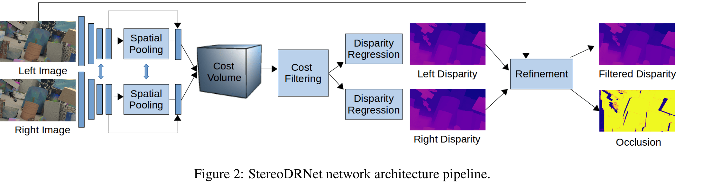
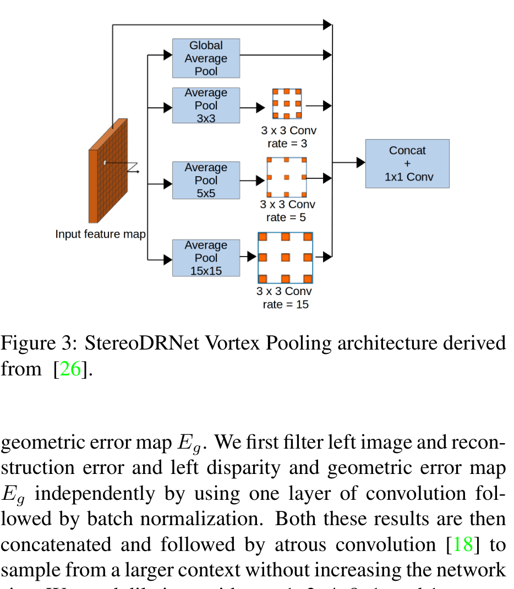
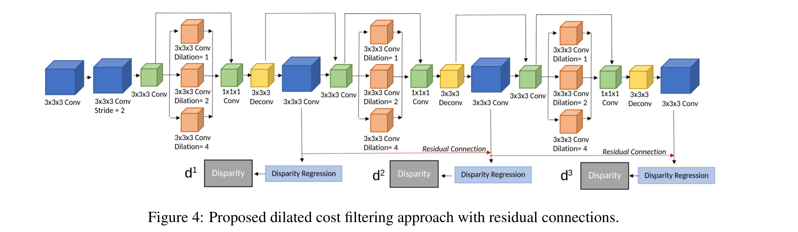
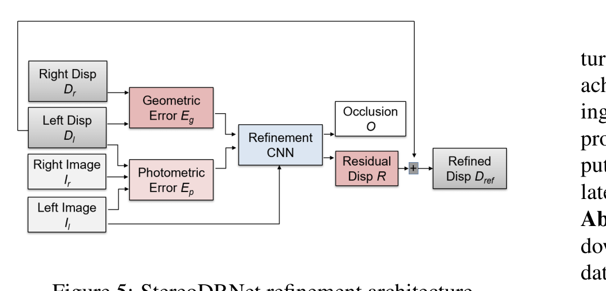
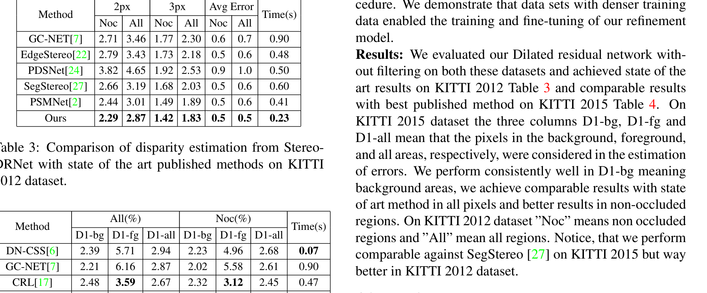

# StereoDRNet: Dilated Residual Stereo Net

**Authors:** Rohan Chabra, Julian Straub, Chris Sweeney, Richard Newcombe, Henry Fuchs (UNC Chapel Hill + Facebook Reality Labs)
**Venue:** CVPR 2019
**Priority:** 7/10 — dilated residual 3D cost filtering + Vortex pooling + view-consistency refinement; direct precursor to GA-Net / GwcNet efficient-regularization line

---

## Core Problem & Motivation

StereoDRNet targets **3D scene reconstruction** (not just KITTI benchmark numbers). The use case is AR/VR spatial mapping: stereo cameras feeding a TSDF-fusion system like KinectFusion. Traditional depth sensors (structured light, ToF) fail in direct sunlight and consume power/space budgets unsuitable for mobile AR. Passive stereo is attractive but suffers in texture-less and occluded regions.

Prior SOTA (PSMNet, GC-Net, CRL) produces **visually plausible disparity maps that are not geometrically consistent** — surface normals computed from their depth maps have significant noise, which KinectFusion's weighted TSDF fusion is extremely sensitive to. The authors observe that this geometric inconsistency degrades downstream reconstruction, even when per-pixel EPE looks good.

### Three Core Contributions

1. **Dilated Residual 3D Cost Filtering**: replaces PSMNet's stacked hourglass regularizer with a cascade of dilated 3D convolutional residual blocks — **halves compute (1.4 TMac vs PSMNet's 2.6 TMac)** while lowering SceneFlow EPE from 1.09 to 0.98.
2. **Vortex Pooling** for multi-scale context aggregation, replacing PSMNet's spatial pyramid pooling; improves EPE (1.17 → 1.13) at similar cost.
3. **View-consistent refinement network**: warps right disparity to the left frame, computes both **photometric** and **geometric** error maps, and uses these as inputs to a lightweight refinement CNN that predicts a residual disparity and an explicit **occlusion map** — trained jointly, it fixes the geometric inconsistency that degrades fusion quality.

The paper culminates in a system that produces 1.3 – 2.1 cm RMSE 3D reconstructions of indoor scenes (scanned with structured-light ground truth), outperforming PSMNet-based reconstructions.

---

## Architecture



High-level data flow:

```
Left, Right images
      ↓
[Siamese Feature Extractor + Vortex Pooling]   →  32-channel features (1/4 res)
      ↓
[Cost Volume via feature difference]           →  D_max × 32 × H/4 × W/4
      ↓
[Dilated Residual 3D Cost Filtering]           →  3 disparity predictions d^1, d^2, d^3 (L and R)
      ↓
[Soft Argmin Regression]                       →  Left + Right disparity
      ↓
[Refinement CNN with Ep, Eg inputs]            →  Refined disparity + occlusion map
      ↓
Final disparity D_ref
```

### Feature Extraction & Vortex Pooling

A small shared-weight Siamese CNN downsamples to $1/4$ resolution via two stride-2 blocks (each is three stacked $3\times3$ convs instead of one $5\times5$, à la VGG). Feature dimension is kept tight at 32 throughout for memory efficiency.

**Vortex Pooling** (adapted from Xie et al.) replaces PSMNet's Spatial Pyramid Pooling (SPP). It captures multi-scale context via parallel branches with increasing pooling kernel + matching dilation rates:



- **Branch 0:** Global Average Pool (entire feature map).
- **Branch 1:** $3\times3$ avg-pool → $3\times3$ conv with dilation 3.
- **Branch 2:** $5\times5$ avg-pool → $3\times3$ conv with dilation 5.
- **Branch 3:** $15\times15$ avg-pool → $3\times3$ conv with dilation 15.

Outputs are concatenated and fused by $1\times1$ conv. The pooling + matching-dilation design avoids "grid artifacts" that pure dilated convolutions produce (atrous convolution misses intermediate pixels for large dilations; the prior pooling locally averages first).

Ablation: SPP → Vortex shifts SceneFlow EPE from 1.17 to 1.13 and KITTI-15 val error from 2.28% to 2.14% at negligible extra cost.

### Cost Volume Construction

Unlike GC-Net (concat) and DispNet (dot product), StereoDRNet uses **feature difference**:

$$C(d, x, y) = \vert f_L(x, y) - f_R(x - d, y)\vert$$

- **$f_L, f_R$** = 32-channel feature maps of left and right images
- **$d$** = candidate disparity, $d \in [0, D_{\max}/4]$
- Result: a 4D tensor $C \in \mathbb{R}^{D_{\max}/4 \times 32 \times H/4 \times W/4}$

The paper constructs **cost volumes for both left and right views** (symmetric matching) and concatenates them before filtering — so that the filtering network sees both viewpoints simultaneously and can learn view-consistency implicitly.

### Dilated Residual 3D Cost Filtering



This is the paper's most important structural contribution. PSMNet and GC-Net use **stacked 3D hourglass** networks (multiple encoder-decoder 3D conv blocks), which are accurate but very expensive ($\sim$2.4 TMac of 3D convs in PSMNet).

StereoDRNet replaces the hourglass with a cascade of **dilated residual blocks**. One block structure:

1. $3\times3\times3$ conv over $(H, W, D)$ (spatial + disparity dimension).
2. Stride-2 conv → halves resolution in disparity and spatial dims.
3. **Parallel branches** with $3\times3\times3$ convs at dilations 1, 2, 4.
4. Concatenate branches → $3\times3\times3$ conv to fuse.
5. Up-conv → add residual from pre-downsampled input.
6. $1\times1\times1$ conv → predict disparity $d^k$ at that stage.

The design produces $k=3$ disparity predictions $d^1, d^2, d^3$ — an explicit coarse-to-fine residual refinement (each block refines the previous). Every block has a residual connection.

Why dilated 3D convs? The cost volume has a long-range "disparity dimension" where receptive field is crucial: correct disparity at pixel $x$ often requires context from distant $d$ values (to resolve multiple cost minima). Dilated 3D convs expand receptive field **along all three axes** ($H, W, D$) **without downsampling**, preserving disparity resolution.

**Complexity payoff:**

| Method | Total FLOPs | 3D-conv FLOPs | FPS | SF EPE |
|---|---|---|---|---|
| GC-Net | 8789 GMac | 8749 GMac | 1.1 | 2.51 |
| PSMNet | 2594 GMac | 2362 GMac | 2.3 | 1.09 |
| **StereoDRNet (no refine)** | **1410 GMac** | **1119 GMac** | **4.3** | **0.98** |
| StereoDRNet (+refine) | 1711 GMac | 1356 GMac | 3.6 | 0.86 |

Without refinement, StereoDRNet has **~47% fewer 3D-conv FLOPs than PSMNet** and is nearly **2× faster** while already below PSMNet's EPE.

### Disparity Regression (Soft Argmin)

Following GC-Net, disparity is the expectation over the negative-cost softmax:

$$d_i = \sum_{d=1}^{N} d \cdot \frac{e^{-C_i(d)}}{\sum_{d'=1}^{N} e^{-C_i(d')}} \quad \text{(1)}$$

- **$C_i(d)$** = scalar cost at pixel $i$ for disparity candidate $d$ (after the filtering network)
- **$N$** = maximum disparity index (typically 192/4 = 48 at $1/4$ resolution)
- **$d_i$** = regressed sub-pixel disparity at pixel $i$
- The softmax with $-C_i(d)$ turns cost minima into probability maxima.

Per-prediction loss uses **Huber (smooth-L1) loss $\rho$**:

$$\mathcal{L}_k = \sum_{i=1}^{M} \rho\bigl(d_i^k, \hat{d}_i\bigr) \quad \text{(2)}$$

- **$d_i^k$** = predicted disparity at pixel $i$ from the $k$-th cost-filtering stage
- **$\hat{d}_i$** = ground-truth disparity
- **$M$** = total pixels
- **$\rho$** = Huber loss (quadratic for small errors, linear for large — robust to noisy GT edges)

Total data loss sums the three stages with monotonically increasing weights:

$$\mathcal{L}_d = \sum_{k=1}^{3} w_k \mathcal{L}_k \quad \text{(3)}$$

- $w_1 = 0.2,\, w_2 = 0.4,\, w_3 = 0.6$ — later stages weigh more (deep supervision with coarse-to-fine emphasis).

### View-Consistency Refinement



The third stage disparity predictions $D_l, D_r$ (left and right) feed a refinement network that explicitly uses cross-view consistency signals.

**Photometric error** (warp right image to left via left disparity):

$$E_p = \vert I_l - \mathcal{W}(I_r, D_r)\vert \quad \text{(4)}$$

- **$I_l, I_r$** = left and right RGB images
- **$D_r$** = right-view disparity prediction
- **$\mathcal{W}(I_r, D_r)$** = warps right image back to left frame using $D_r$ (backward warp: for pixel $x$ in the left frame, sample $I_r$ at $x - D_r(x)$)
- **$E_p$** = per-pixel photometric residual (large in occluded regions, small where stereo is consistent)

**Geometric consistency error** (warp right disparity to left and check agreement):

$$E_g = \vert D_l - \mathcal{W}(D_r, D_l)\vert \quad \text{(5)}$$

- **$D_l$** = left-view disparity prediction
- **$\mathcal{W}(D_r, D_l)$** = warps the right-view disparity to the left frame using $D_l$ as sampling offset
- If stereo is consistent, $D_l(x) = D_r(x - D_l(x))$, so $E_g(x) \to 0$; occlusions / mismatches produce large $E_g$.

Critical design choice: rather than minimize $E_p, E_g$ directly as losses, the paper feeds them as **inputs** to the refinement network. Rationale: these errors are meaningful only in non-occluded pixels, so using them as guidance (with a learned mask) is more robust than as a raw loss.

**Refinement architecture:** two parallel $1\times1$ conv branches — one on $(I_l, E_p)$, one on $(D_l, E_g)$ — concatenated, then atrous conv stack with dilations $(1, 2, 4, 8, 1, 1)$, then a final $3\times3$ conv with **two heads**:

- **Occlusion map $O$** (binary mask, cross-entropy loss): $\mathcal{L}_o = H(O, \hat{O})$ — eq. (6), where $\hat{O}$ is GT occlusion (pixels where $\vert D_l - D_r\text{-warp}\vert > 1$ px).
- **Disparity residual $R$** (added to $D_l$) producing refined disparity $D_{\text{ref}}$.

Refinement loss (Huber on refined output):

$$\mathcal{L}_r = \sum_{i=1}^{M} \rho\bigl(d_i^r, \hat{d}_i\bigr) \quad \text{(7)}$$

- **$d_i^r$** = refined disparity at pixel $i$
- Same Huber form as stage losses.

**Total training loss:**

$$\mathcal{L} = \mathcal{L}_d + \lambda_1 \mathcal{L}_r + \lambda_2 \mathcal{L}_o \quad \text{(8)}$$

- **$\lambda_1 = 1.2$, $\lambda_2 = 0.3$** — refinement weight highest; occlusion smaller because the map is per-pixel binary.

The refinement is critical for 3D reconstruction: without it, disparity discontinuities at surface edges introduce ripples in reconstructed normals; the occlusion map tells TSDF fusion which pixels to down-weight.

---

## Key Equations Summary

**Soft argmin disparity regression (Eq. 1)** — feature difference → softmin → expectation gives sub-pixel disparity.

**Multi-stage Huber loss (Eq. 2, 3)** — 3 cost-filtering stages each supervised, with weights $(0.2, 0.4, 0.6)$.

**Photometric error (Eq. 4)** — $E_p = \vert I_l - \mathcal{W}(I_r, D_r)\vert$: pixel-wise reconstruction residual from warped right image.

**Geometric error (Eq. 5)** — $E_g = \vert D_l - \mathcal{W}(D_r, D_l)\vert$: cross-view disparity agreement.

**Occlusion cross-entropy (Eq. 6)** — $\mathcal{L}_o = H(O, \hat{O})$: binary mask supervision.

**Refinement Huber (Eq. 7)** — $\mathcal{L}_r = \sum_i \rho(d_i^r, \hat{d}_i)$.

**Total loss (Eq. 8)** — $\mathcal{L} = \mathcal{L}_d + \lambda_1 \mathcal{L}_r + \lambda_2 \mathcal{L}_o$ with $\lambda_1 = 1.2, \lambda_2 = 0.3$.

---

## Training

- **Framework:** PyTorch.
- **Optimizer:** Adam, $\beta_1 = 0.9$, $\beta_2 = 0.999$; input images normalized.
- **Crop:** 512$\times$256.
- **Batch:** 8 across 2 Titan-Xp GPUs.
- **Loss weights:** $w_1 = 0.2, w_2 = 0.4, w_3 = 0.6$; $\lambda_1 = 1.2$, $\lambda_2 = 0.3$.
- **Pretraining:** SceneFlow (35K pairs). Occlusion GT generated from left-right disparity inconsistency threshold of 1 px.
- **Fine-tuning:** KITTI 2012/2015 with 80%/20% train/val split. Exclusion masks filter non-confident GT pixels (sparse LIDAR + projection noise).
- **Indoor fine-tuning:** 250 stereo pairs from a custom scanning rig with structured-light GT; model adapts quickly due to the strong SceneFlow prior.

---

## Results

### SceneFlow (Table 1)

Already shown above — StereoDRNet (unrefined): **EPE 0.98** vs PSMNet 1.09, at 54% of PSMNet's total FLOPs. With refinement: **EPE 0.86** — state-of-the-art at the time.

### KITTI 2012

| Method | 3px Noc | 3px All | Reflective | Avg Error | Time |
|---|---|---|---|---|---|
| GC-Net | 1.77 | 2.30 | 10.80 | 0.6 | 0.90s |
| EdgeStereo | 1.73 | 2.18 | — | 0.5 | 0.48s |
| PSMNet | 1.49 | 1.89 | — | 0.5 | 0.41s |
| **StereoDRNet** | **1.42** | **1.83** | — | **0.5** | **0.23s** |

### KITTI 2015



| Method | D1-all (All) | D1-all (Noc) | Time |
|---|---|---|---|
| GC-Net | 2.87 | 2.61 | 0.90s |
| CRL | 2.67 | 2.45 | 0.47s |
| EdgeStereo | 2.59 | 2.40 | 0.27s |
| PSMNet | 2.32 | 2.14 | 0.41s |
| SegStereo | 2.25 | 2.08 | 0.60s |
| **StereoDRNet** | **2.26** | **2.06** | **0.23s** |

StereoDRNet is **faster than every published competitor** on 960$\times$540 inputs and matches / beats PSMNet accuracy.

### ETH3D

| Method | 1px All | 2px All | RMSE All |
|---|---|---|---|
| PSMNet | 5.41 | 1.31 | 0.75 |
| DN-CSS | 3.00 | 0.96 | 0.56 |
| **StereoDRNet** | 4.84 | **0.96** | **0.55** |

### Ablation (Table 2 highlights)

| Pooling | Cost Filter | Refinement | SF EPE | KITTI-15 Val % |
|---|---|---|---|---|
| SPP | Dilated ✓ | — | 1.17 | 2.28 |
| Vortex | Dilated ✓ | — | 1.13 | 2.14 |
| Vortex | Dilated ✓ + Residual | — | 0.99 | 1.88 |
| Vortex | Full ✓ | — | 0.98 | 1.74 |
| Vortex | Full | $E_p$ only | 1.03 | — |
| Vortex | Full | $E_g$ only | 0.95 | — |
| Vortex | Full | $E_p + E_g$ | 0.93 | — |
| Vortex | Full | $E_p + E_g + O$ | **0.86** | — |

**Takeaways:**
- Dilated residual cost filtering is the biggest single contributor (1.13 → 0.99).
- Photometric error **alone hurts** (1.03 > 0.98 unrefined) — occlusion pixels corrupt supervision.
- Geometric error alone helps (0.95).
- Combining $E_p + E_g$ + explicit occlusion map is best (0.86) — occlusion head lets the network learn which regions' errors to trust.

### 3D Reconstruction

On three custom indoor scenes scanned with structured-light GT and fused via KinectFusion, StereoDRNet achieves **1.3 – 2.1 cm RMSE** — comparable to active depth sensors and significantly sharper than PSMNet-based reconstructions. This validates the "geometric consistency matters for fusion" hypothesis.

---

## Why It Works

1. **Dilated 3D convs expand receptive field without losing disparity resolution.** The disparity axis is short relative to the spatial axes, so downsampling it (as hourglass decoders do) loses sub-pixel precision. Dilation preserves resolution while still aggregating long-range cost context.
2. **Residual 3D blocks stabilize gradient flow** through the deep 3D regularizer — the original PSMNet stacked hourglass is hard to train deeper without residuals.
3. **Feature difference + double-view cost volume** (left and right) forces the network to be view-symmetric — essential for the downstream refinement step.
4. **Vortex Pooling** produces multi-scale context without dilation's grid artifacts and without SPP's fixed pooling scale mismatch. Pre-pooling + matched-dilation convs gives dense context at every scale.
5. **Refinement with $E_p, E_g$ as inputs (not losses)** is the key photometric insight: the photometric residual is semantically meaningful but unreliable at occlusion boundaries; making the network explicitly consume the error maps (along with an occlusion head) lets it learn *which* residuals to trust. This is a structural design, not just a loss trick.
6. **Occlusion co-prediction** acts as a learned weight on the reconstruction error — the network discovers that geometric inconsistency indicates occlusion and uses this as an inductive bias.

---

## Limitations / Failure Modes

1. **Still relies on 3D convolutions.** Even with dilated residual savings, the 3D-conv regularizer consumes ~1.1 TMac — infeasible for Jetson Orin Nano class devices. The paper's efficiency gains are relative to PSMNet/GC-Net, not absolute edge budgets.
2. **Four-stage supervision (3 filter stages + 1 refinement)** is sensitive to loss-weight tuning; $w_k$ and $\lambda_i$ were hand-chosen on validation.
3. **Refinement helps on dense-GT SceneFlow and ETH3D but gives marginal gains on KITTI** because sparse LIDAR GT doesn't cover boundaries where refinement has the most effect — the view-consistency signal is strongest exactly where GT is missing.
4. **No occlusion handling in cost volume itself.** Occlusion is a downstream fix; cost volume still carries wrong matches for occluded pixels, which propagate into all three filter stages.
5. **Single-scale refinement.** Only one refinement pass (vs. iterative refinement in RAFT-Stereo / IGEV). A single pass can miss fine-detail improvements.
6. **Evaluated pre-foundation-model era.** No monocular depth prior, no cross-domain zero-shot evaluation — generalization to out-of-distribution imagery is unclear.
7. **Feature difference cost volume is lossy** vs. modern gwc / IGEV concatenation — loses discriminative information when feature magnitudes are unequal between views.

---

## Relevance to Our Edge Model

StereoDRNet is a good lesson in **efficient 3D regularization** and **view-consistency refinement** — both are relevant for our edge DEFOM variant.

### Directly adoptable

1. **Dilated residual 3D blocks** as the cost volume regularization template. Our edge model's GEV (geometry-encoded volume) regularization can adopt dilation instead of downsampling — saving sub-pixel disparity precision that IGEV's hourglass tends to blur.
2. **Vortex pooling** as a drop-in replacement for SPP in the feature encoder. Minimal extra compute, clear EPE gain.
3. **Photometric + geometric + occlusion co-prediction** as a self-supervised auxiliary loss — particularly attractive because it needs **no extra labels**. Our edge model can use this during training as a regularizer for zero-shot generalization (domains without dense GT).
4. **Coarse-to-fine staged supervision with increasing weights** $(0.2, 0.4, 0.6)$ — good default for any multi-stage prediction.
5. **Feature-difference cost volume** is cheap and effective; our edge model can use it at the lowest-resolution stage if latency demands it (vs. full concatenation).

### Cautions

- **3D convs are still too expensive** even dilated-residual — at 1.1 TMac, StereoDRNet is ~30$\times$ our Orin Nano 33ms budget. We need either 2D stereo (DispNet-style, BGNet-style bilateral grid) or heavily-compressed 3D (BGNet bilateral grid sampling, LightStereo's small 3D regularizer).
- **The view-consistency refinement pass adds $\sim 300$ GMacs** — affordable in a data-center model but not edge. We should absorb its ideas into the initial disparity head, not run a second forward pass.
- **Feature difference has less discriminative capacity than gwc/groupwise correlation** — for highest accuracy we should prefer gwc at 1/8 resolution rather than difference at 1/4.

### Specific Integration Proposal

Our edge pipeline:

```
Encoder (NAS-searched, MPT-distilled)
    ↓
[Vortex Pooling @ 1/4 res]      ←  from StereoDRNet
    ↓
[Groupwise correlation + GEV @ 1/8]  ←  from IGEV
    ↓
[Dilated Residual 3D Regularizer, shallow: 2 blocks @ 1/8]  ← from StereoDRNet
    ↓
[Initial disparity (soft argmin)]
    ↓
[GRU with PIP-compressed iterations @ 1/4]  ← from Pip-Stereo
    ↓
[View-consistency auxiliary loss (Ep + Eg + O)]  ← from StereoDRNet, TRAIN-TIME ONLY
    ↓
[Bilateral-grid convex upsample to full res]  ← from BGNet + RAFT
    ↓
Disparity Map
```

**Train-time photometric/geometric losses are free at inference** — pure regularization improvement, strongly recommended.

---

## Connections to Other Papers

| Paper | Relationship |
|---|---|
| **PSMNet** | Direct baseline; stacked hourglass → dilated residual is the core replacement. |
| **GC-Net** | The soft argmin formulation (Eq. 1) originates here. |
| **CRL (Pang et al.)** | Cascaded residual learning for refinement — the multi-stage residual idea StereoDRNet generalizes with $E_p, E_g$. |
| **Vortex Pooling (Xie et al.)** | Source of the multi-scale pooling design. |
| **KinectFusion** | Downstream TSDF consumer — motivates the geometric-consistency refinement. |
| **EdgeStereo** | Contemporary; both use residual refinement but EdgeStereo uses edge supervision instead of photometric/geometric. |
| **GA-Net / GwcNet** | Next-generation efficient 3D regularization — further refines the "shrink 3D cost volume cost" thread. |
| **IGEV-Stereo** | Modern version of cost-volume regularization + iterative refinement; our edge model combines IGEV with StereoDRNet's dilated-residual blocks and view-consistency losses. |
| **LightStereo / BGNet** | Pure-2D efficient stereo; alternative path when 3D convs are infeasible. |
