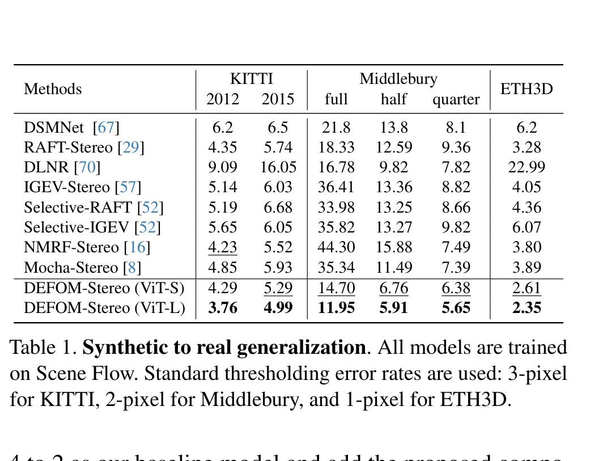
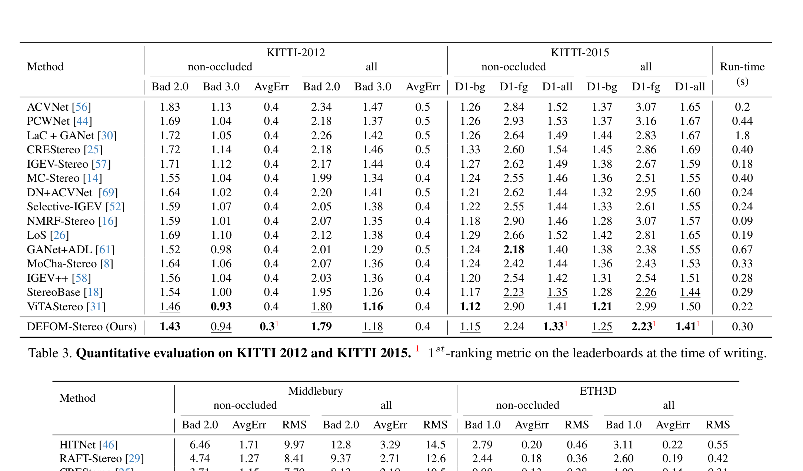

# DEFOM-Stereo: Depth Foundation Model Based Stereo Matching

**Authors:** Hualie Jiang, Zhiqiang Lou, Laiyan Ding, Rui Xu, Minglang Tan, Wenjie Jiang, Rui Huang
**Affiliations:** Insta360 Research + Chinese University of Hong Kong, Shenzhen
**Venue:** CVPR 2025
**Priority:** 10/10 — our primary model inspiration
**Code:** https://github.com/Insta360-Research-Team/DEFOM-Stereo

---

## Core Problem & Motivation

Despite years of progress, stereo matching still struggles with:
- **Textureless regions** — no distinctive features to match
- **Reflective/transparent surfaces** — violate brightness constancy
- **Occlusions** — pixels visible in one view but not the other
- **Domain shift** — models trained on synthetic data fail on real scenes

Meanwhile, **monocular depth foundation models** (Depth Anything V2) have achieved remarkable zero-shot generalization — they can estimate relative depth on virtually any image. But they have a critical limitation: they predict **relative depth** (up to unknown scale and shift), not **metric depth**.

**DEFOM-Stereo's key insight:** Combine the best of both worlds:
- **Stereo matching** provides accurate *metric* depth from geometry (known baseline + disparity → depth)
- **Monocular foundation model** provides robust *relative* depth priors that generalize across domains
- The stereo network uses the foundation model to handle difficult regions, while a **Scale Update module** corrects the foundation model's scale ambiguity using stereo geometry

---

## Architecture Overview

DEFOM-Stereo builds on RAFT-Stereo by incorporating Depth Anything V2 at two integration points:

The pipeline has two stages:

### Stage 1: Feature Extraction + Correlation Pyramid

**Input:** Left and right stereo images

**Two parallel encoders:**

1. **Combined Feature Encoder (CFE):**
   - A CNN extracts matching features $\mathbf{f}^l, \mathbf{f}^r$ from left and right images at 1/4 resolution
   - Simultaneously, the frozen Depth Anything V2 ViT backbone extracts dense feature maps via its DPT (Dense Prediction Transformer) head
   - A **new trainable DPT** head is initialized to predict ViT features (not depth) — this is trainable, unlike the frozen depth prediction DPT
   - A convolutional block aligns ViT features to CNN feature dimensions
   - CNN features and aligned ViT features are **simply added** together → combined feature map

   $$\mathbf{f}_{combined} = \mathbf{f}_{CNN} + \text{Conv}_{align}(\text{DPT}_{trainable}(\text{ViT}_{frozen}))$$

   - **$\mathbf{f}_{CNN}$** = features from the plain CNN encoder (applied to both left and right images)
   - **$\text{ViT}_{frozen}$** = frozen Depth Anything V2 backbone (ViT-S or ViT-L) — NOT fine-tuned
   - **$\text{DPT}_{trainable}$** = a new DPT head initialized fresh, trained to produce features (not depth)
   - **$\text{Conv}_{align}$** = convolutional block for channel/spatial alignment
   - The addition is the simplest possible fusion — the paper shows this works as well as more complex alternatives

2. **Combined Context Encoder (CCE):**
   - Applied only to the **left image** (the reference view)
   - CNN context features at 1/4, 1/8, 1/16 resolutions
   - ViT context features from the DPT's $\text{Reassemble}_4$, $\text{Reassemble}_8$, $\text{Reassemble}_{16}$ layers
   - Again, aligned via conv blocks and added together
   - Provides the initial hidden state for the GRU and monocular context at each iteration

**Correlation Pyramid Construction:**

$$\mathbf{C}^1_{ijk} = \sum_h \mathbf{f}^l_{hij} \cdot \mathbf{f}^r_{hik}, \quad \mathbf{C}^1 \in \mathbb{R}^{h \times w \times w} \quad \text{(1)}$$

- **$\mathbf{C}^1_{ijk}$** = correlation between pixel $(i,j)$ in the left image and pixel $(i,k)$ in the right image
- **$\mathbf{f}^l_{hij}$** = left combined feature at position $(i,j)$, channel $h$
- **$\mathbf{f}^r_{hik}$** = right combined feature at position $(i,k)$, channel $h$
- **$\sum_h$** = dot product across feature channels — single matrix multiplication per row
- **$h = H/4, w = W/4$** = feature spatial size (1/4 of input resolution)

Multi-level pyramid $\{\mathbf{C}^l\}$ obtained by repeated 1D average pooling along the last dimension.

### Stage 2: Iterative Disparity Update (Scale Update + Delta Update)

This is the core innovation. RAFT-Stereo uses a single update step per iteration. DEFOM-Stereo splits this into **two sequential updates:**

#### 2a. Monocular Depth Initialization

Instead of starting from zero disparity (like RAFT-Stereo), DEFOM-Stereo initializes disparity from the DEFOM depth prediction:

$$\mathbf{d}_0 = \frac{\eta w \ast \mathbf{z}}{\max(\mathbf{z})} + \epsilon \quad \text{(4)}$$

Every element:
- **$\mathbf{d}_0$** = the initial disparity map used to start the iterative refinement
- **$\mathbf{z}$** = depth map predicted by the frozen Depth Anything V2 model (relative depth, arbitrary scale)
- **$\max(\mathbf{z})$** = the maximum depth value in the prediction — used to normalize to [0, 1] range
- **$\frac{\mathbf{z}}{\max(\mathbf{z})}$** = normalized relative depth map (values between 0 and 1)
- **$w$** = image width in pixels — since disparity is proportional to image width (wider images have larger disparities), this scales the normalized depth to a reasonable disparity range
- **$\eta$** = a controlling ratio (set to 1/2) — further scales the initialization. Set conservatively so the initial disparity doesn't overshoot.
- **$\ast$** = element-wise multiplication
- **$\epsilon$** = a tiny positive bias (set to 0.05) — ensures the initial disparity is never exactly zero, which would cause problems in the scale update

**Why this matters:** Starting from a reasonable initial disparity (from DEFOM) instead of zero means the iterative updates need to make smaller corrections, leading to faster convergence and better results on challenging regions where the monocular prior is strong.

#### 2b. Scale Update (SU) — THE key innovation

The DEFOM depth initialization has the right *structure* (correct relative depth ordering) but wrong *scale* (unknown mapping from relative depth to metric disparity). The Scale Update module corrects this:

$$\mathbf{d}_n = s \cdot \mathbf{d}_{n-1} \quad \text{(5)}$$

- **$\mathbf{d}_{n-1}$** = disparity map from the previous iteration
- **$s$** = a **dense scale map** (per-pixel scale factor) predicted by a ConvGRU
- **$\mathbf{d}_n$** = the scale-corrected disparity — the previous disparity multiplied pixel-wise by the learned scale
- **$s$** is predicted as a dense map, meaning different regions of the image can have different scale corrections — this handles the scale inconsistency where Depth Anything V2 assigns different implicit scales to different image regions

**Scale Lookup (SL):** To give the ConvGRU information for predicting $s$, DEFOM-Stereo introduces a Scale Lookup that indexes the correlation volume at **multiple pre-defined scales:**

Given disparity $\mathbf{d}_n$ and a set of scale factors $s^m$:
- Sample correlations at $\mathbf{C}^1(s^m \mathbf{d}_n)$, $\mathbf{C}^1(s^m \mathbf{d}_n - 1)$, and $\mathbf{C}^1(s^m \mathbf{d}_n + 1)$
- Scale factors: $s^m \in \{1, 2, 4, 6, 8, 10, 12, 16\}/8$ — i.e., from 0.125x to 2x
- This retrieves **24 correlation values** per pixel, covering a wide range of possible scale corrections
- Unlike the standard Pyramid Lookup (which has limited search range), Scale Lookup has a **global** search range because multiplying disparity by a scale factor can reach any disparity level

**Why SL works better than PL for scale recovery:** The standard Pyramid Lookup in RAFT-Stereo samples nearby correlation values (radius $r$ around the current disparity). Its effective search range is $2^L \times 2 \times r$ where $L$ is the pyramid level. For a 4-level pyramid with $r=4$: max range = 128 pixels. But the scale correction might need to reach disparities 2-3x the current estimate — Scale Lookup achieves this by sampling at scaled positions.

#### 2c. Delta Update (DU) — standard RAFT-Stereo refinement

After scale correction, the standard RAFT-Stereo delta update runs:

$$\mathbf{d}_n = \mathbf{d}_{n-1} + \Delta\mathbf{d} \quad \text{(2)}$$

- **$\mathbf{d}_{n-1}$** = disparity from previous iteration (after scale update)
- **$\Delta\mathbf{d}$** = residual disparity update predicted by the ConvGRU
- Uses standard **Pyramid Lookup (PL)** to retrieve local correlation features
- Focuses on **fine local details** — the scale is already approximately correct from the SU step

#### The ConvGRU Update Equations

Both SU and DU use ConvGRUs. The hidden state update at 1/4 resolution:

$$x_n = [\text{Encoder}_c(\mathbf{c}), \text{Encoder}_d(\mathbf{d}_{n-1}), \text{Up}^2(h_n^{1/8})]$$

$$z_n = \sigma(\text{Conv}([h_{n-1}, x_n], W_z) + c_z)$$

$$r_n = \sigma(\text{Conv}([h_{n-1}, x_n], W_r) + c_r) \quad \text{(3)}$$

$$\bar{h}_n = \tanh(\text{Conv}([r_n \odot h_{n-1}, x_n], W_h) + c_h)$$

$$h_n = (1 - z_n) \odot h_{n-1} + z_n \odot \bar{h}_n$$

Every element:
- **$x_n$** = input features at iteration $n$, concatenation of:
  - **$\text{Encoder}_c(\mathbf{c})$** = encoded correlation features retrieved from the correlation pyramid via SL or PL
  - **$\text{Encoder}_d(\mathbf{d}_{n-1})$** = encoded current disparity estimate
  - **$\text{Up}^2(h_n^{1/8})$** = upsampled hidden state from the 1/8 resolution GRU (multi-scale context)
- **$h_{n-1}$** = hidden state from previous iteration (carries memory across iterations)
- **$z_n$** = **update gate** — controls how much of the old state to keep vs. replace. $\sigma$ = sigmoid → values in [0,1]
- **$r_n$** = **reset gate** — controls how much of the old state influences the candidate new state
- **$\bar{h}_n$** = **candidate hidden state** — proposed new state based on current input and (optionally reset) old state
- **$h_n$** = **new hidden state** — weighted combination of old state and candidate
- **$W_z, W_r, W_h$** = learned convolutional weights for each gate
- **$c_z, c_r, c_h$** = context features from the Combined Context Encoder (injected at each iteration — this is how monocular context from DEFOM influences every update step)
- **$\odot$** = element-wise (Hadamard) product

**After the GRU update:** $h_n$ is used to predict $\Delta\mathbf{d}$ (for DU) or $s$ (for SU) via two convolutional layers. It also predicts a **convex weight map** for upsampling from 1/4 to full resolution.

### Training Loss

$$\mathcal{L} = \sum_{i=n}^{N} \gamma^{N-n} ||\mathbf{d}_{gt} - \mathbf{d}_n||_1, \quad \text{where } \gamma = 0.9 \quad \text{(6)}$$

- **$\mathcal{L}$** = total training loss
- **$N$** = total number of update iterations (18 in training, 32 in evaluation)
- **$\mathbf{d}_{gt}$** = ground-truth disparity map
- **$\mathbf{d}_n$** = predicted disparity at iteration $n$ (after both SU and DU for that iteration)
- **$||\cdot||_1$** = L1 (absolute value) loss — robust to outliers
- **$\gamma = 0.9$** = exponential weighting — later iterations get higher weight ($\gamma^{N-n}$ is larger for larger $n$). This encourages the network to produce good results at every iteration, but cares most about the final iterations.
- The sum starts from $i=n$ (not from 0) — early iterations before the network has converged get lower weight

---

## Ablation Study Results

| Component Added | SceneFlow EPE | KITTI 2012 | Middlebury-half | ETH3D | Params (M) | Time (s) |
|-----------------|---------------|-----------|----------------|-------|------------|----------|
| Baseline (RAFT-Stereo) | 0.56 | 4.65 | 10.67 | 3.45 | 11.11 | 0.222 |
| +CCE | 0.49 | 4.40 | 8.42 | 2.82 | 12.10 | 0.242 |
| +CFE | 0.50 | 4.13 | 10.45 | 2.83 | 13.89 | 0.243 |
| +CCE+CFE | 0.49 | 4.02 | 8.31 | 2.53 | 14.11 | 0.246 |
| +DI only | 0.57 | 4.57 | 12.40 | 2.77 | 11.11 | 0.242 |
| +DI+SU | 0.50 | 4.15 | 8.15 | 2.67 | 11.11 | 0.242 |
| **Full (ViT-S)** | **0.46** | **4.29** | **6.76** | **2.61** | **15.51** | **0.255** |
| **Full (ViT-L)** | **0.42** | **3.76** | **5.91** | **2.35** | **47.30** | **0.316** |

**Key ablation insights:**
1. **CCE is more impactful than CFE** — context features from DEFOM matter more than matching features. This makes sense: the monocular depth prior provides global scene understanding (context), while matching features are already strong from CNN correlation.
2. **Depth Initialization alone doesn't help** — DI without SU actually hurts on some datasets. The scale inconsistency of Depth Anything V2 means raw DEFOM depth is misleading without correction.
3. **DI + SU is very effective** — once the scale is corrected, the DEFOM initialization provides a huge boost, especially on Middlebury (8.15 vs 10.67 = 24% improvement).
4. **Full model combines all benefits** — CCE + CFE + DI + SU working together yields the best results across all datasets.

---

## Benchmark Results

### Zero-Shot Generalization (trained only on SceneFlow)

**This is the most important result.** DEFOM-Stereo's zero-shot generalization is dramatically better than all competitors, even those specifically designed for generalization.

### Fine-tuned Benchmarks

---

## Qualitative Results

---

## Two Model Variants

| Variant | ViT Backbone | Parameters | Inference Time (960x540) | Best For |
|---------|-------------|------------|-------------------------|----------|
| **DEFOM-Stereo (ViT-S)** | ViT-Small | 15.5M | 0.255s (~4 fps) | Balanced accuracy/speed |
| **DEFOM-Stereo (ViT-L)** | ViT-Large | 47.3M | 0.316s (~3 fps) | Maximum accuracy |

**Critical observation for our edge model:** Even ViT-S at 15.5M params and 0.255s is too slow for edge deployment (<50ms target). We need to:
1. Replace ViT-S with an even lighter backbone (MobileNetV4, EfficientViT)
2. Distill the DEFOM features rather than running the full foundation model
3. Reduce GRU iterations (they use 18 SU+DU iterations in training, 32 in eval)

---

## Strengths & Limitations

**Strengths:**
- SOTA zero-shot generalization — the foundation model prior makes it robust across domains
- SOTA fine-tuned performance — ranks 1st on multiple benchmarks
- Simple fusion strategy (addition) works — no complex attention or gating needed
- Ablation is thorough — each component's contribution is clear

**Limitations:**
- **Heavy inference** — ViT backbone is expensive. Even ViT-S at 0.255s is 10x slower than our edge target
- **Frozen foundation model** — the ViT backbone is not fine-tuned, meaning its features might not be optimal for stereo
- **Scale inconsistency is a fundamental issue** — SU addresses it but doesn't eliminate it entirely. The paper notes "scale inconsistency across different image regions exists, particularly for synthetic ones"
- **No explicit confidence output** — the model doesn't tell you where it's uncertain

---

## Relevance to Our Edge Model

DEFOM-Stereo is our blueprint. The edge model should preserve these core ideas while cutting compute:

| DEFOM Component | Edge Model Adaptation |
|----------------|----------------------|
| ViT-S/L backbone (frozen) | Replace with distilled lightweight encoder (MobileNetV4 / EfficientViT-M4) |
| Full DPT head for feature extraction | Lightweight single-scale feature extraction |
| CNN + ViT feature addition | Same (cheap operation) |
| Correlation pyramid (2 levels) | Same or bilateral grid (BGNet) |
| Scale Update with Scale Lookup (8 scale factors) | Reduce to 4 scale factors, fewer SU iterations |
| Delta Update with Pyramid Lookup | Same but fewer iterations (3-5 vs 18-32) |
| ConvGRU at 1/4, 1/8, 1/16 resolutions | Single-resolution GRU at 1/8 |
| 18 SU+DU iterations (training) | 4-6 total iterations with better initialization |
| 47.3M params (ViT-L) / 15.5M (ViT-S) | Target: <15M params |
| 0.255-0.316s inference | Target: <0.05s (50ms) |

**Key design decisions to validate:**
1. Can we **distill** the DEFOM features offline into a lightweight encoder, rather than running the full ViT at inference?
2. Can fewer SU iterations work if the initialization is better (e.g., from a distilled mono model)?
3. Is the bilateral grid (BGNet) compatible with the Scale Lookup mechanism?

---

## Connections to Other Papers

| Paper | Relationship |
|-------|-------------|
| **RAFT-Stereo** | Direct baseline — DEFOM-Stereo is RAFT-Stereo + foundation model features + scale update |
| **Depth Anything V2** | The foundation model providing features and depth initialization (used frozen) |
| **FoundationStereo** | Concurrent work — different approach to foundation stereo (trains its own large model) |
| **MonSter** | Concurrent work — also fuses mono depth with stereo but via 3D cost volume (IGEV-based) |
| **Stereo Anywhere** | Concurrent work — uses mono priors for robustness in failure regions |
| **Fast-FoundationStereo** | Addresses DEFOM's speed limitation — real-time foundation stereo |
| **BGNet** | Bilateral grid approach — potential efficiency technique for our edge adaptation |
| **Separable-Stereo** | Depthwise separable 3D convs — relevant if we use any 3D processing |
| **IGEV-Stereo** | Combined geometry encoding that DEFOM-Stereo's SU+DU conceptually extends |
