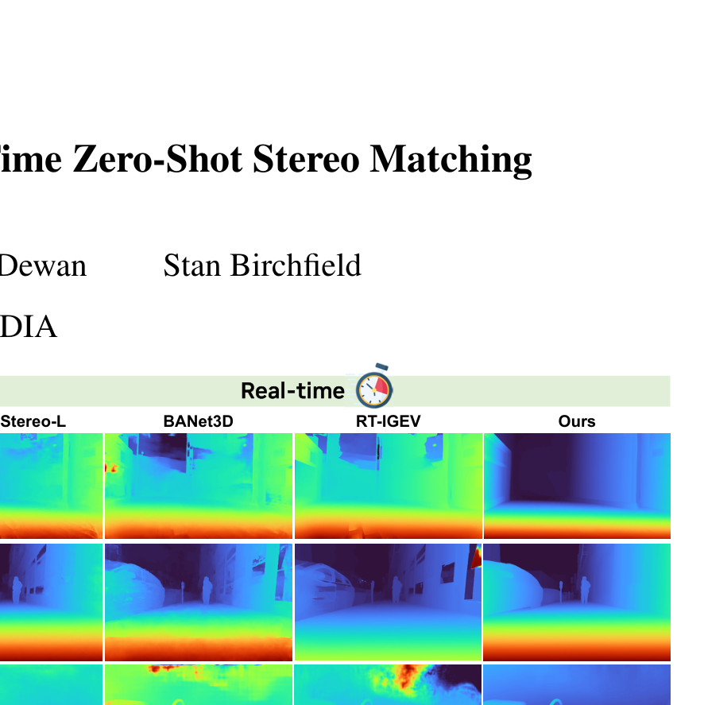

# Fast-FoundationStereo: Real-Time Zero-Shot Stereo Matching

**Authors:** Bowen Wen et al. (NVIDIA Labs)
**Venue:** CVPR 2026
**Priority:** 9/10 — **closest existing work to our edge model goal**
**Code:** https://github.com/NVlabs/Fast-FoundationStereo

---

## Core Problem & Motivation

Foundation stereo models (FoundationStereo, MonSter, DEFOM-Stereo) achieve strong zero-shot generalization but run at ~2 FPS. Real-time stereo models run fast but lack foundation model priors and fail out-of-distribution. **No method achieves both.** Fast-FoundationStereo bridges this gap via systematic compression of FoundationStereo.

## Architecture: Divide-and-Conquer Compression

### Strategy A: Feature Backbone Distillation
- **Teacher:** FoundationStereo's dual ViT+CNN backbone
- **Student:** Single lightweight CNN from `timm` library (e.g., EdgeNeXt, MobileNetV2)
- **Distillation:** MSE loss between teacher and student multi-level feature pyramids $f^{(i)}$
- Linear projection handles channel mismatches
- **Key finding:** Distillation from foundation model priors is essential — ImageNet-only pretraining is dramatically worse (Table 3: BP-2 rises from 2.20 to 2.87 on Middlebury)

### Strategy B: Blockwise NAS for Cost Filtering
- Cost filtering module (3D hourglass + Disparity Transformer) divided into N=8 blocks
- ~200 candidate replacement blocks per position using 5 layer types: 3D conv, 3D deconv, APC, residual 3D conv, feature-guided excitation
- Each candidate independently distilled against its teacher counterpart
- **Integer Linear Programming (ILP)** finds optimal combination under runtime budget:
$$\min_E \sum_{i=1}^{N} (\Delta m_i)^T e_i, \quad \text{s.t.} \sum_{i=1}^{N} (\Delta t_i)^T e_i \leq \Delta\tau$$
- **$\Delta m_i$** = error metric changes for candidates at block $i$
- **$\Delta t_i$** = runtime changes for candidates at block $i$
- **$e_i$** = one-hot selection vector (choose one candidate per block)
- **$\Delta\tau$** = total runtime budget
- Training complexity: O(n) instead of O(n^N) — only 2584 blocks need training
- **Critical finding:** Direct pruning of cost filtering is ineffective (small channel dimensions). NAS is necessary.

### Strategy C: Structured Pruning for Refinement
- **Recurrent dependency graph** captures inter-layer dependencies unique to GRU's recurrent structure
- Three stereo-specific pruning constraints (fixed output channels, joint input/output pruning, fixed motion encoder inputs)
- First-order Taylor expansion ranks parameter importance; prune at ratio $\alpha$
- **Retraining loss:**
$$\mathcal{L} = \sum_{k=1}^{K} \gamma^{K-k} \Vert d_k - \bar{d}\Vert _1 + \lambda \sum_{i=1}^{L} \Vert x_i - \bar{x}_i\Vert _2^2$$
- **$\lambda = 0.1$** = weight for feature distillation from teacher's per-layer activations
- **Sweet spot:** Pruning ratio 0.6 — aggressive enough for speedup, recoverable with retraining. 8 iterations needed.

### Pseudo-Labeling Pipeline
- 1.4M in-the-wild stereo pairs curated from Stereo4D internet videos
- FoundationStereo generates disparity pseudo-labels; UniDepthV2 generates mono depth
- **Normal-consistency filtering:** Both converted to normal maps; cosine similarity produces consistency mask
- Open-vocabulary segmentation excludes sky regions

## Results: The Pareto Frontier

### Zero-Shot Generalization

| Method | Midd-H BP-2 | ETH3D BP-1 | KITTI-15 D1 | Runtime (ms) |
|--------|-------------|------------|-------------|-------------|
| FoundationStereo | 2.49 | 0.30 | 2.95 | 496 |
| MonSter | 9.33 | 0.99 | 3.41 | 336 |
| DEFOM-Stereo | 8.84 | 1.01 | 4.58 | 371 |
| RT-IGEV | 12.75 | 1.63 | 4.00 | 45 |
| **Fast-FoundationStereo** | **4.80** | **0.62** | **3.25** | **49** |

**Best real-time method by a large margin on every dataset.** 10x faster than FoundationStereo with modest accuracy loss.

## Compression Ratios

| Metric | FoundationStereo | Fast-FoundationStereo | Ratio |
|--------|-----------------|----------------------|-------|
| Parameters | 374.5M | **14.6M** | **25.6x** smaller |
| MACs | 5413.9G | **309.9G** | **17.5x** fewer |
| Runtime (3090) | 496ms | **49ms** | **10.1x** faster |
| Runtime (TensorRT) | — | **21ms** (~47 FPS) | — |
| Peak memory | — | **0.63 GB** | Fits edge GPUs |

## Relevance to Our Edge Model

**This is the closest prior art to our project.** Key lessons:

### Directly Adoptable
1. **Backbone distillation from foundation model to lightweight CNN** — MSE on multi-level pyramids
2. **Structured pruning of GRU** with recurrent dependency graph and stereo-specific constraints
3. **Pseudo-labeling pipeline** — Stereo4D + normal consistency
4. **Efficient GWC volume construction** — fused PyTorch implementation gives 6x speedup

### Gaps We Must Fill
1. **No actual edge device benchmarks** — all tested on 3090/4090/A100. We must profile on Jetson Orin Nano
2. **No quantization** — explicitly left as future work. INT8/FP16 is a core opportunity
3. **17.65M params still large** for Orin Nano (4GB). Target sub-5M designs
4. **DEFOM-Stereo's Scale Update not explored** — they distill from FoundationStereo. We should explore whether SU can be preserved in compressed form
5. **More aggressive cost volume design** — bilateral grids (BGNet) and sparse sampling beyond blockwise NAS

### Our Differentiation

| Aspect | Fast-FoundationStereo | Our Edge Model |
|--------|----------------------|----------------|
| Teacher | FoundationStereo | DEFOM-Stereo |
| Target HW | Desktop GPU (3090) | Jetson Orin Nano |
| Target latency | ~50ms (20 FPS) | ~33ms (30 FPS) on Jetson |
| Quantization | Not explored | Core contribution |
| Backbone | timm CNNs (~17M) | MobileNetV4/EfficientViT (<5M) |
| Cost volume | Full 4D correlation+concat | Sparse/bilateral grids |
| Export | TensorRT mentioned | Full ONNX → TensorRT pipeline |
