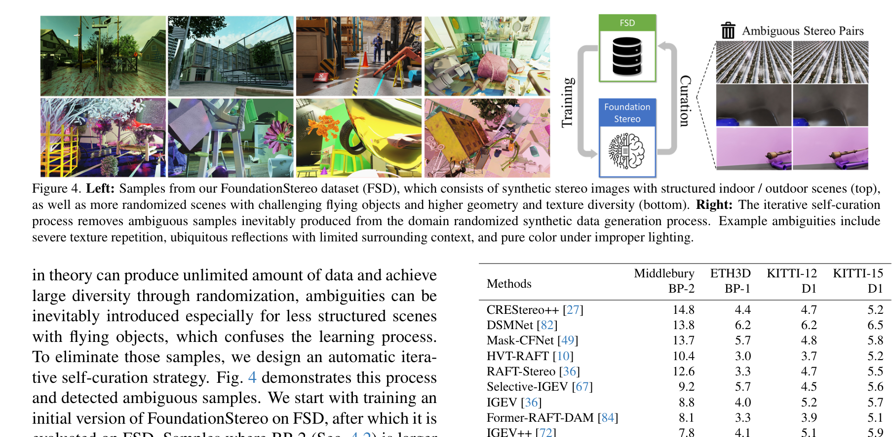

# FoundationStereo: Zero-Shot Stereo Matching

**Authors:** Bowen Wen et al. (NVIDIA Labs)
**Venue:** CVPR 2025
**Priority:** 10/10
**Code:** https://github.com/NVlabs/FoundationStereo

---

## Core Problem & Motivation

Despite strong benchmark performance, stereo networks fail to generalize zero-shot to unseen domains. Two root causes: (1) insufficient training data (most use ~40K SceneFlow pairs), and (2) architectural limitations — standard 3D CNNs lack long-range context along the disparity dimension. FoundationStereo aims to be the first true "foundation model" for stereo — one that generalizes zero-shot without per-domain fine-tuning.

## Architecture

### Three-Pillar Design

**1. Side-Tuning Adapter (STA)** — Feature extraction:
- Frozen Depth Anything V2 ViT backbone produces multi-level features
- A lightweight CNN (EdgeNeXt-S) adapts ViT features for stereo via side-tuning
- **Key design choice:** The ViT is frozen to preserve internet-scale priors; unfreezing degrades generalization (BP-2 rises from 1.97 to 3.94 in ablation)

**2. Attentive Hybrid Cost Filtering (AHCF)** — Cost volume processing:
- **Axial-Planar Convolution (APC):** Factorizes 3D conv into spatial $(K_s \times K_s \times 1)$ + disparity $(1 \times 1 \times K_d)$ components. Enables disparity kernel size up to $K_d = 17$ without OOM (a full $5 \times 5 \times 5$ 3D conv causes OOM on 80GB GPUs)
- **Disparity Transformer (DT):** Full self-attention over the disparity dimension of the cost volume. 4 transformer blocks with FlashAttention and RoPE positional encoding. Provides global reasoning across the entire disparity range.
- APC and DT run in parallel within a hourglass network, outputs summed

**3. Hybrid Cost Volume:**
- **Group-wise correlation** $V_{gwc}$ — dot product between L2-normalized feature groups (G=8)
- **Concatenation volume** $V_{cat}$ — preserves rich unary features that pure correlation discards
- Combined: $V_C = [V_{gwc}, V_{cat}]$

### Key Equations

**Soft-argmin for initial disparity:**
$$d_0 = \sum_{d=0}^{D-1} d \cdot \text{Softmax}(V'_C)(d)$$

**Loss function:**
$$\mathcal{L} = |d_0 - \bar{d}|_{smooth} + \sum_{k=1}^{K} \gamma^{K-k} \|d_k - \bar{d}\|_1$$

- **$|d_0 - \bar{d}|_{smooth}$** = smooth L1 loss on initial disparity (from cost volume)
- **$d_k$** = disparity at GRU iteration $k$; **$\bar{d}$** = ground truth
- **$\gamma = 0.9$** = exponential weight favoring later iterations

### Foundation Stereo Dataset (FSD)
- **1M synthetic stereo pairs** from NVIDIA Omniverse with domain randomization
- Varying baselines, focal lengths, lighting, materials, indoor/outdoor
- **Self-curation:** Automatically removes ambiguous samples (BP-2 > 60%), alternated twice

## Benchmark Results

| Config | Middlebury BP-2 | ETH3D BP-1 | KITTI-12 D1 | KITTI-15 D1 |
|--------|----------------|------------|-------------|-------------|
| SceneFlow only | 5.5 | 1.8 | 3.2 | 4.9 |
| **Realistic (mixed)** | **1.1** | **0.5** | **2.3** | **2.8** |

Ranks **1st** on ETH3D and Middlebury leaderboards when fine-tuned.

## Model Size & Speed

| Metric | Value |
|--------|-------|
| Parameters | ~380-450M (dominated by ViT-L at 335M) |
| Inference (A100, 375x1242) | **0.7s** |
| Full-res Middlebury | 8.14s, 18.5 GB memory |

**Very slow and heavy** — explicitly acknowledged as a limitation.

## Key Insight vs DEFOM-Stereo

FoundationStereo uses ViT **latent features** (not the depth output) embedded into the cost volume, avoiding scale ambiguity entirely. DEFOM-Stereo uses the explicit depth prediction and must correct its scale. Both approaches work, but FoundationStereo's is architecturally cleaner while DEFOM-Stereo's is more modular.

## Relevance to Edge Model

- **STA concept is reusable:** Distill ViT features into a lightweight CNN backbone — the core of Fast-FoundationStereo's approach
- **APC factorization:** Inherently efficient, directly applicable to edge
- **FSD dataset:** Can be used to train our edge model
- **What must change:** Replace ViT-L (335M params), reduce DT (4 transformer blocks), fewer GRU iterations
