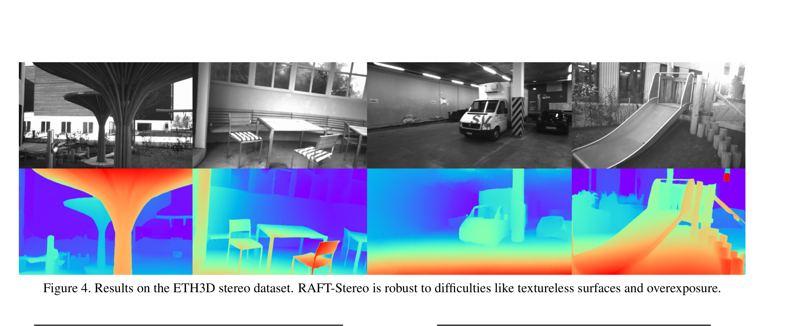
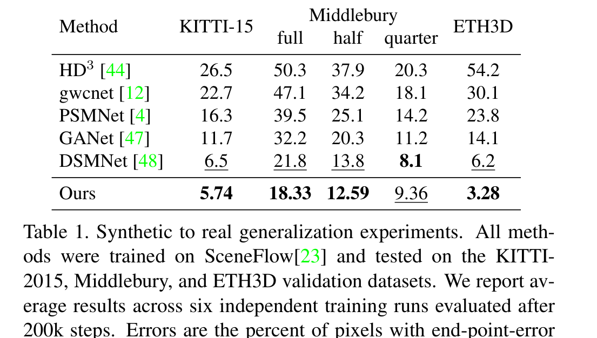

# RAFT-Stereo: Multilevel Recurrent Field Transforms for Stereo Matching

**Authors:** Lahav Lipson, Zachary Teed, Jia Deng (Princeton University)
**Venue:** 3DV 2021
**Priority:** 10/10 — THE paradigm shift of the 2020s
**Code:** https://github.com/princeton-vl/RAFT-Stereo

---

## Core Problem & Motivation

By 2021, stereo matching was dominated by 3D cost-volume architectures (GC-Net, PSMNet, GA-Net, GWCNet). These methods:
- Build a 4D cost volume $H \times W \times D \times F$
- Process it with expensive **3D convolutions**
- Suffer from high memory and compute, limiting them to small images or coarse disparity
- Require a **predefined maximum disparity** baked into the architecture
- Generalize poorly across datasets (trained on SceneFlow, fails on Middlebury's high-res images)

Meanwhile, optical flow had recently shifted to **iterative refinement** with RAFT (Teed & Deng, ECCV 2020). The insight: instead of regressing flow in one shot from a huge cost volume, iteratively refine an estimate using correlation lookups from a cheap all-pairs correlation volume.

**RAFT-Stereo's contribution:** Adapt RAFT's iterative paradigm to stereo matching, exploiting the 1D disparity constraint (no vertical offset needed) for a much cheaper cost volume, and adding multi-level GRUs for better global propagation.

---

## Architecture Overview

![Figure 1: RAFT-Stereo architecture. A feature encoder (blue) extracts features from both images, which are used to build the correlation pyramid. A context encoder (separate CNN, applied to left image only) produces both "context" features (white) and an initial hidden state. The disparity field starts at 0. At each iteration, the GRU (green) samples from the correlation pyramid at the current disparity estimate, and uses sampled correlation features, initial image features, and current hidden state to predict an update to the disparity.](../../../figures/RAFTStereo_fig1_architecture.png)

Three main components:

### 1. Feature Extraction

Two CNNs process the input images:

**Feature encoder:** Shared-weight CNN applied to both left image $I_L$ and right image $I_R$, producing 256-channel feature maps at 1/4 resolution (or 1/8 in the efficient variant). Outputs:
- $\mathbf{f}^l$ = feature map from left image, shape $C \times H/4 \times W/4$
- $\mathbf{f}^r$ = feature map from right image, shape $C \times H/4 \times W/4$

**Context encoder:** Identical architecture (different weights), applied **only to the left image**. Produces:
- **Initial hidden states** $h_0$ at multiple resolutions (1/4, 1/8, 1/16) for the multi-level GRU
- **Context features** that get injected at every GRU update step

### 2. Correlation Pyramid

Instead of the expensive 4D cost volume, RAFT-Stereo builds an **all-pairs 1D correlation volume** by computing similarity between every pixel in the left row and every pixel in the same row of the right image:

$$\mathbf{C}_{ijk} = \sum_h \mathbf{f}^l_{hij} \cdot \mathbf{f}^r_{hik}, \quad \mathbf{C} \in \mathbb{R}^{H/4 \times W/4 \times W/4} \quad \text{(1)}$$

Every element explained:
- **$\mathbf{C}_{ijk}$** = correlation score between pixel at row $i$, column $j$ in the left image and pixel at row $i$, column $k$ in the right image
- **$i$** = row index (height dimension) — both pixels must be on the same row because the images are rectified
- **$j$** = column index in the left image
- **$k$** = column index in the right image (candidate matching position)
- **$\mathbf{f}^l_{hij}$** = left feature vector component at row $i$, column $j$, feature channel $h$
- **$\mathbf{f}^r_{hik}$** = right feature vector component at row $i$, column $k$, feature channel $h$
- **$\sum_h$** = dot product across all feature channels — measures feature similarity
- **$\mathbf{C} \in \mathbb{R}^{H/4 \times W/4 \times W/4}$** = the output volume — for each row and each left column, a similarity profile across all right columns

**Critical efficiency insight:** Unlike optical flow (where the displacement is 2D and the correlation volume is 4D), stereo only needs 1D displacements. The correlation volume can be computed in a **single matrix multiplication** — effectively a batched row-wise matmul. No 3D convolutions, no big memory footprint.

**Multi-level correlation pyramid:** The volume $\mathbf{C}^1$ is then repeatedly downsampled along the last dimension (disparity axis) by 1D average pooling, producing a pyramid $\{\mathbf{C}^1, \mathbf{C}^2, \mathbf{C}^3, \mathbf{C}^4\}$ with levels at 1x, 2x, 4x, 8x scales. Each level has the same spatial resolution but progressively coarser disparity resolution.

### 3. Iterative Update Operator (GRU)

The core loop. Starting from initial disparity $\mathbf{d}_0 = \mathbf{0}$ everywhere, RAFT-Stereo iterates for $N$ steps (22 during training, 32 at inference):

**At iteration $n$:**

**Step A — Correlation lookup:**

Given the current disparity estimate $\mathbf{d}_n$, look up correlation values from the pyramid around this disparity:

At each pyramid level $l$, sample correlation values at positions $\mathbf{d}_n + r$ for $r \in \{-R, -R+1, ..., R-1, R\}$ where $R = 4$ is the lookup radius. Linear interpolation handles non-integer positions. Concatenating across all 4 pyramid levels gives $4 \times (2R+1) = 36$ correlation values per pixel.

**Effective receptive field:** With $R=4$ and 4 pyramid levels, the max reachable disparity relative to current estimate is $2^{L-1} \times R = 32$ pixels. But because iterations refine progressively, the network can still reach much larger disparities by moving its estimate step by step.

**Step B — GRU update:**

The current disparity, correlation features, and context features are fed into a convolutional GRU that maintains a hidden state:

$$x_n = [\text{Enc}_{\text{corr}}(\text{lookup}(\mathbf{C}, \mathbf{d}_n)), \text{Enc}_{\text{disp}}(\mathbf{d}_n), \mathbf{c}]$$

$$z_n = \sigma(\text{Conv}([h_{n-1}, x_n], W_z))$$

$$r_n = \sigma(\text{Conv}([h_{n-1}, x_n], W_r))$$

$$\bar{h}_n = \tanh(\text{Conv}([r_n \odot h_{n-1}, x_n], W_h))$$

$$h_n = (1 - z_n) \odot h_{n-1} + z_n \odot \bar{h}_n$$

Every variable:
- **$x_n$** = input features at iteration $n$, the concatenation of:
  - **$\text{Enc}_{\text{corr}}(\cdot)$** = 2 conv layers that encode the retrieved correlation values
  - **$\text{Enc}_{\text{disp}}(\mathbf{d}_n)$** = 2 conv layers that encode the current disparity estimate
  - **$\mathbf{c}$** = context features from the context encoder (constant across iterations)
- **$h_{n-1}$** = previous hidden state — carries memory across iterations
- **$z_n$** = **update gate** (values in [0,1] via sigmoid $\sigma$) — controls how much of the old state to keep vs. replace
- **$r_n$** = **reset gate** — controls how much of the old state influences the new candidate
- **$\bar{h}_n$** = **candidate new hidden state** — proposed update based on current input and reset-modulated old state
- **$h_n$** = **new hidden state** — weighted blend of old state and candidate
- **$W_z, W_r, W_h$** = learned convolutional weights for each GRU gate
- **$\odot$** = element-wise (Hadamard) product

After the GRU update, two conv layers decode $h_n$ into a **disparity increment** $\Delta\mathbf{d}$.

**Step C — Disparity update:**

$$\mathbf{d}_{n+1} = \mathbf{d}_n + \Delta\mathbf{d}$$

The estimate accumulates refinements. Because updates are **residual**, the network doesn't need to re-learn the whole disparity each time — it only predicts corrections.

---

## Multi-Level GRU (Key Innovation Over RAFT Flow)

A single-resolution GRU would have a limited receptive field: information propagates slowly across the image as iterations progress. For large textureless regions (walls, skies), this is problematic — the network doesn't know what's happening far away.

**Solution:** Run 3 GRUs in parallel at 1/4, 1/8, and 1/16 resolutions, **cross-connected** so information flows between them.

At each iteration:
- All three GRU levels update their hidden states
- Adjacent levels exchange information via upsampling/downsampling
- Only the **highest-resolution GRU** (finest level) performs the correlation lookup and predicts the disparity update
- The coarser GRUs provide **global context** — their large receptive fields help resolve ambiguous regions

**Why this matters:** At iteration $n$, the 1/16 GRU has an effective receptive field that's 4x larger than the 1/4 GRU. After a few iterations, each pixel has "seen" information from very far away in the image, enabling proper handling of textureless and repetitive regions.

---

## Slow-Fast GRU (Efficiency Variant)

A GRU update at 1/8 resolution costs approximately **4x more FLOPs** than at 1/16 resolution. To exploit this, the efficient variant:
- Updates the 1/16 and 1/32 resolution hidden states **several times** before updating the 1/8 hidden state once
- On KITTI at 32 iterations, this reduces runtime from **0.132s to 0.05s** (52% faster)
- Modest accuracy trade-off

This is what enables the "fast" variant to compete with real-time methods.

---

## Disparity Upsampling

The predicted disparity is at 1/4 (or 1/8) of input resolution. To get full resolution, RAFT-Stereo uses **convex upsampling** (from original RAFT):
- At each full-resolution pixel, the disparity is a **convex combination** of 9 disparity values from its coarse-resolution 3×3 neighborhood
- The 9 convex combination weights are **predicted by the highest-resolution GRU**
- This produces sharp edges and sub-pixel precision

---

## Training Loss

$$\mathcal{L} = \sum_{i=1}^{N} \gamma^{N-i} \Vert\mathbf{d}_{gt} - \mathbf{d}_i\Vert_1, \quad \text{where } \gamma = 0.9 \quad \text{(2)}$$

Every element:
- **$\mathcal{L}$** = total training loss — sum over all iterations
- **$N$** = total number of GRU iterations during training (22)
- **$i$** = iteration index (1 to $N$)
- **$\mathbf{d}_i$** = predicted disparity at iteration $i$
- **$\mathbf{d}_{gt}$** = ground-truth disparity
- **$\Vert\cdot\Vert_1$** = L1 norm (sum of absolute differences) — robust to outliers vs L2
- **$\gamma = 0.9$** = exponential weight — the final iteration $i=N$ has weight $\gamma^0 = 1$, earlier iterations decay by $\gamma^{N-i}$. Later iterations matter more, but earlier ones still contribute gradient.

---

## Experimental Results

### Zero-Shot Generalization (trained on SceneFlow only)

| Method | KITTI-15 | Middlebury full | Middlebury half | Middlebury quarter | ETH3D |
|--------|---------|----------------|-----------------|-------------------|-------|
| HD³ | 26.5 | 50.3 | 37.9 | 20.3 | 54.2 |
| gwcnet | 22.7 | 47.1 | 34.2 | 18.1 | 30.1 |
| PSMNet | 16.3 | 39.5 | 25.1 | 14.2 | 23.8 |
| GANet | 11.7 | 32.2 | 20.3 | 11.2 | 14.1 |
| DSMNet | 6.5 | 21.8 | 13.8 | 8.1 | 6.2 |
| **RAFT-Stereo** | **5.74** | **18.33** | **12.59** | **9.36** | **3.28** |

**RAFT-Stereo is the best on 4 of 5 settings**, and it's the first method to process full-resolution Middlebury (previous methods OOM).

### KITTI-2015 Leaderboard

At the time of publication, RAFT-Stereo ranked **2nd** on the KITTI-2015 leaderboard among published methods — the first non-3D-cost-volume method to break into the top.

### Middlebury Leaderboard

**Ranked #1** on Middlebury at time of submission — the first architecture since HSMNet (2019) capable of processing full-resolution Middlebury images, and by far the best.

---

## Why RAFT-Stereo Changed Everything

RAFT-Stereo is widely credited as the **paradigm shift** that defined stereo matching for the 2020s. Five reasons:

1. **No expensive 3D convolutions** — the correlation volume is cheap (1D, single matmul), and all operations are 2D
2. **No fixed disparity range** — the iterative nature handles any disparity magnitude by incrementally building up the estimate
3. **Strong generalization** — the light architecture + correlation-based features transfer across datasets much better than 3D cost volume methods
4. **Handles high resolution** — first method to process full-resolution Middlebury and megapixel images
5. **Flexible speed-accuracy trade-off** — early stopping works perfectly; 4 iterations give reasonable results, 32 iterations give SOTA

**Virtually every stereo paper from 2022 onward uses RAFT-Stereo as its baseline.** DEFOM-Stereo, FoundationStereo, MonSter, Stereo Anywhere, Selective-Stereo — all build directly on the RAFT-Stereo framework, replacing or augmenting specific components while keeping the iterative GRU update core intact.

---

## Relevance to Our Edge Model

**RAFT-Stereo is the architectural skeleton** for our edge model. Almost every Tier 1 foundation model paper is a RAFT-Stereo variant. What we inherit:

| RAFT-Stereo Component | Keep / Modify for Edge |
|----------------------|----------------------|
| 1D correlation volume (Eq. 1) | **Keep** — already very efficient |
| Multi-level GRU (3 levels) | **Reduce to single level** (1/8) — simpler, less compute |
| 22-32 iterations | **Reduce to 4-6** — with better initialization from distilled mono prior |
| Convex upsampling | **Keep** — cheap and effective |
| Slow-fast GRU variant | **Apply by default** — update coarse levels more often |
| Feature encoder (256 channels) | **Shrink to ~128 channels** via distillation |
| Context encoder (separate CNN) | **Share with feature encoder** — save params |

**Target efficiency gains:**
- Single GRU level instead of 3: ~3x fewer ops per iteration
- 5 iterations instead of 32: ~6x fewer total iterations
- Combined: ~18x theoretical speedup before backbone changes
- Should comfortably hit <33ms on Jetson Orin Nano when combined with distilled lightweight backbone

---

## Connections to Other Papers

| Paper | Relationship |
|-------|-------------|
| **RAFT (ECCV 2020)** | Direct ancestor — optical flow network that invented the recurrent correlation lookup framework |
| **CREStereo (2022)** | First major extension — adds adaptive group correlation + cascaded recurrent refinement |
| **IGEV-Stereo (2023)** | Combines RAFT's iterative updates with a pre-built geometry encoding volume (hybrid approach) |
| **Selective-Stereo (2024)** | Replaces the GRU with a Selective Recurrent Unit that fuses multi-frequency branches |
| **IGEV++ (2025)** | IGEV with multi-range volumes and adaptive patch matching |
| **DEFOM-Stereo (2025)** | Adds foundation model features + Scale Update on top of RAFT-Stereo base |
| **FoundationStereo (2025)** | Combines RAFT-Stereo iteration with a Disparity Transformer for cost filtering |
| **MonSter (2025)** | Uses IGEV backbone + bidirectional refinement with monocular depth |
| **Fast-FoundationStereo (2026)** | Compresses FoundationStereo (and by extension RAFT-Stereo) for real-time |
