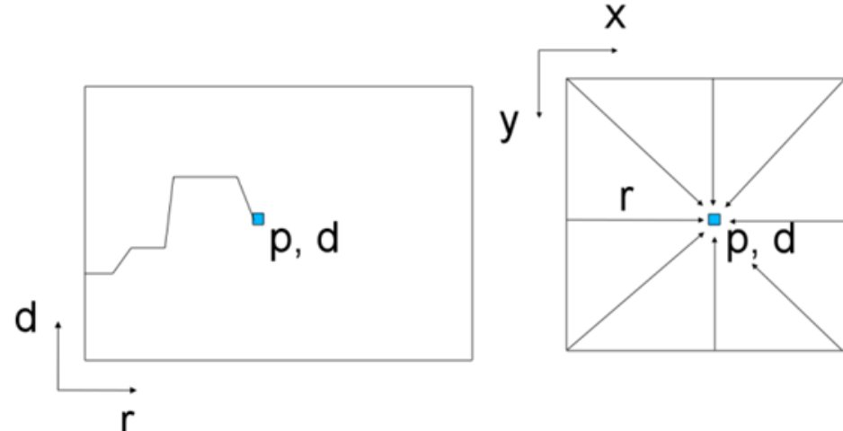

# Semi-Global Matching (SGM) — Motivation, Developments and Applications

**Authors:** Heiko Hirschmuller (DLR — German Aerospace Center)
**Venue:** TPAMI 2007 (this is the extended 2011 survey version covering SGM's evolution)
**Priority:** 9/10
**Cited by:** 5,000+ — the most widely used classical stereo algorithm, still a baseline today

---

## Core Problem & Motivation

The stereo matching field in the mid-2000s had a fundamental dilemma:

- **Local (correlation-based) methods** were fast but produced poor results at object boundaries and in textureless regions. The core issue: a fixed correlation window inevitably includes pixels from both sides of a depth discontinuity, corrupting the match.
- **Global methods** (graph cuts, belief propagation) produced much better results by jointly optimizing all pixels, but were extremely slow and didn't scale to large images.

**SGM's insight:** You can get *nearly* global-quality results at *nearly* local-method speed by decomposing the intractable 2D optimization problem into multiple 1D problems solved along different directions, then combining their results.

---

## The Problem with 1D Optimization Alone

Recall from Scharstein & Szeliski that global methods minimize an energy function:

$$E(D) = \sum_{p} C(p, D_p) + \sum_{q \in N_p} P \cdot T[|D_p - D_q| \geq 1] \quad \text{(1)}$$

Let's break this down completely:

- **$E(D)$** = total energy of disparity image $D$ — the quantity we want to minimize. Lower energy = better disparity map.
- **$D$** = the entire disparity image (a disparity value $D_p$ assigned to every pixel $p$)
- **$p$** = a pixel in the reference image
- **$D_p$** = the disparity assigned to pixel $p$ — this is what we're optimizing
- **$C(p, D_p)$** = the pixel-wise matching cost for assigning disparity $D_p$ to pixel $p$. This comes from Step 1 (matching cost computation). Low $C$ means the left and right images agree well at this disparity.
- **$\sum_p C(p, D_p)$** = the **data term** — sum of matching costs across all pixels. Ensures the solution is consistent with image evidence.
- **$q \in N_p$** = the set of neighboring pixels of $p$ (typically 4-connected: up, down, left, right)
- **$T[\cdot]$** = an indicator function: equals 1 if the condition inside is true, 0 otherwise
- **$|D_p - D_q| \geq 1$** = true when neighboring pixels $p$ and $q$ have *different* disparities
- **$P$** = the penalty for assigning different disparities to adjacent pixels — controls smoothness strength
- **$\sum_{q \in N_p} P \cdot T[|D_p - D_q| \geq 1]$** = the **smoothness term** — penalizes disparity jumps between neighbors. This is what makes the result spatially coherent.

**The problem:** Minimizing Eq. 1 over the full 2D image is NP-complete. Graph cuts and belief propagation approximate it, but they're slow (seconds to minutes per image) and memory-hungry.

**What if we solve it along just one scanline?** Dynamic programming can find the exact global optimum along a single 1D path in $O(W \times D)$ time (linear in image width $W$ and disparity range $D$). But optimizing each scanline independently produces **horizontal streaking artifacts** — there's no vertical consistency.

---

## SGM's Key Innovation: Pathwise Aggregation from Multiple Directions

SGM's brilliant solution: instead of solving one 2D problem or many independent 1D problems, solve **8 (or 16) 1D problems along paths from different directions** and combine the results.

### The SGM Energy Function

SGM uses a refined version of Eq. 1 with **two penalty levels** to handle both slanted surfaces and true discontinuities:

$$E(D) = \sum_{p} C(p, D_p) + \sum_{q \in N_p} P_1 \cdot T[|D_p - D_q| = 1] + \sum_{q \in N_p} P_2 \cdot T[|D_p - D_q| > 1] \quad \text{(2)}$$

Every element explained:

- **$P_1$** = **small penalty** applied when the disparity changes by exactly 1 pixel between neighbors. This accommodates **slanted surfaces** — a surface receding smoothly from the camera will have gradually changing disparity, and these small changes shouldn't be heavily penalized. Typical value: $P_1 \approx 10-20$.
- **$P_2$** = **large penalty** applied when the disparity changes by more than 1 pixel between neighbors. This penalizes true **depth discontinuities** (object borders) but still allows them if the matching evidence is strong enough (i.e., when the data term benefit of the jump outweighs the $P_2$ penalty). Typical value: $P_2 \approx 100-200$.
- **$T[|D_p - D_q| = 1]$** = 1 when disparity changes by exactly 1 (small step)
- **$T[|D_p - D_q| > 1]$** = 1 when disparity changes by more than 1 (big jump)
- If $D_p = D_q$ (same disparity), neither penalty applies — no cost for smooth flat surfaces

**Why two penalties?** With only one penalty $P$ (Eq. 1), the algorithm can't distinguish between a gentle slope (many 1-pixel steps) and a sharp edge (one big jump). The two-penalty scheme:
- **Slanted surface** ($|D_p - D_q| = 1$ at many points): pays $P_1$ per step — cheap, so slopes are preserved
- **Depth discontinuity** ($|D_p - D_q| \gg 1$ at one point): pays one $P_2$ — expensive but allowed if data supports it
- **Noisy disparity** ($|D_p - D_q| > 1$ at many points): pays $P_2$ per jump — very expensive, effectively suppressed

### Pathwise Cost Aggregation: The Core Algorithm

SGM doesn't directly minimize Eq. 2. Instead, it defines a **path cost** $L_\mathbf{r}(p, d)$ that accumulates along a 1D path in direction $\mathbf{r}$:

$$L_\mathbf{r}(p, d) = C(p, d) + \min \begin{cases} L_\mathbf{r}(p - \mathbf{r}, d) \\ L_\mathbf{r}(p - \mathbf{r}, d-1) + P_1 \\ L_\mathbf{r}(p - \mathbf{r}, d+1) + P_1 \\ \min_i L_\mathbf{r}(p - \mathbf{r}, i) + P_2 \end{cases} - \min_k L_\mathbf{r}(p - \mathbf{r}, k)$$

Every element explained:

- **$L_\mathbf{r}(p, d)$** = the aggregated (accumulated) cost of assigning disparity $d$ to pixel $p$, considering all evidence along the path from direction $\mathbf{r}$
- **$\mathbf{r}$** = path direction vector (one of 8 or 16 directions: left-to-right, top-to-bottom, diagonal, etc.)
- **$p - \mathbf{r}$** = the previous pixel along the path (one step back in direction $\mathbf{r}$)
- **$C(p, d)$** = raw matching cost at pixel $p$ for disparity $d$ (from Step 1 — Census, MI, etc.)
- **$L_\mathbf{r}(p - \mathbf{r}, d)$** = cost of the previous pixel having the *same* disparity $d$ — no penalty (flat surface)
- **$L_\mathbf{r}(p - \mathbf{r}, d \pm 1) + P_1$** = cost of the previous pixel having disparity $d \pm 1$ — small penalty for gentle slope
- **$\min_i L_\mathbf{r}(p - \mathbf{r}, i) + P_2$** = cost of the previous pixel having *any* disparity — large penalty for a jump (discontinuity)
- **$- \min_k L_\mathbf{r}(p - \mathbf{r}, k)$** = normalization term — subtract the minimum cost of the previous pixel to prevent path costs from growing unboundedly. This is crucial for numerical stability.
- **$\min\{\cdot\}$** = take the minimum of all four options — choose the transition that gives the lowest total cost

**Intuition:** As you walk along a path pixel by pixel, you accumulate cost. At each new pixel, you consider: "what was the cheapest way to reach the *previous* pixel for each disparity?" and add the appropriate transition penalty. This is a form of dynamic programming.

### Combining Multiple Paths

After computing $L_\mathbf{r}(p, d)$ for all directions $\mathbf{r}$, SGM sums them:

$$S(p, d) = \sum_\mathbf{r} L_\mathbf{r}(p, d)$$

- **$S(p, d)$** = the final aggregated cost at pixel $p$ for disparity $d$, combining evidence from all 8 (or 16) directions
- Each direction contributes its accumulated cost — this approximates the 2D optimization because every pixel receives smoothness information from all surrounding directions

The final disparity is then chosen by WTA on the aggregated cost:

$$D_p = \arg\min_d S(p, d)$$

- Simply pick the disparity with the lowest total aggregated cost at each pixel

---

## Matching Cost: Census Transform

The original SGM (2005) used **Mutual Information (MI)** as matching cost, but the paper identifies **Census transform** as more practical:

**How Census works:**
1. For each pixel, look at its $N \times N$ neighborhood (e.g., 9x7)
2. Compare each neighbor to the center pixel: if neighbor < center, write 1, else write 0
3. This produces a **bit string** encoding the local intensity pattern
4. Match pixels by computing the **Hamming distance** between their Census bit strings (count differing bits)

**Why Census is robust:**
- **Illumination invariant:** Only relative orderings matter, not absolute intensities. A global brightness change doesn't affect the bit string at all.
- **Handles local radiometric changes:** Vignetting, different exposure times, shadows — as long as local intensity *rankings* are preserved
- **Non-parametric:** No assumptions about noise distribution

**Census vs. MI trade-off:**
- MI handles *global* radiometric differences better (different sensors, completely different imaging characteristics)
- Census handles *local* radiometric changes better (shadows, reflections — more common in practice)
- Census is much simpler to implement and faster to compute

---

## Post-Processing Pipeline

After obtaining the raw disparity from WTA on $S(p, d)$:

1. **Sub-pixel refinement:** Fit a quadratic curve to the cost values at $d-1$, $d$, $d+1$ around the winner, find the sub-pixel minimum
2. **Uniqueness check:** If the winning cost isn't significantly lower than the second-best (across disparities), mark as uncertain
3. **Left-right consistency check:** Compute disparity from both left and right views. If they disagree by more than 1 pixel → mark as occluded/invalid
4. **Median filter:** Remove isolated errors
5. **Peak filter:** Remove small isolated disparity regions (likely noise)

---

## Computational Complexity & Hardware

| Platform | Resolution | Disparity Range | Speed | Power |
|----------|-----------|----------------|-------|-------|
| **CPU** (Intel X5570) | 640x480 | 128 | ~1 fps | ~100W |
| **GPU** (GTX 275) | 640x480 | 128 | 4.5 fps | ~180W |
| **FPGA** (Virtex 6) | 2048x2048 | 1024 | 0.22 fps | **54W** |

**Key insight for our edge model:** SGM's regular computation pattern (independent per direction, only local memory access along paths) makes it highly parallelizable. This is why it was the first stereo algorithm deployed on FPGAs and in automotive systems (Daimler). Modern edge stereo networks must match this deployability.

---

## Practical Impact

SGM became the **de facto standard** for practical stereo matching:
- **Daimler/Mercedes** driver assistance systems (FPGA, real-time)
- **DLR** Mars surface reconstruction (HRSC camera on Mars Express)
- **Aerial/satellite mapping** — processed 100+ TB of aerial imagery
- **Robotics** — DLR crawler for planetary exploration

---

## Why SGM Matters for Deep Stereo (The Bridge)

SGM is the conceptual bridge between classical methods and modern deep stereo:

| SGM Component | Modern Deep Learning Equivalent |
|---------------|-------------------------------|
| Census/MI matching cost | Learned CNN feature extraction |
| Pathwise cost aggregation along 8-16 directions | 3D convolutions over cost volume (GC-Net, PSMNet) |
| $P_1$/$P_2$ penalties | Learned smoothness via loss functions and network architecture |
| Two-penalty scheme (slope vs. discontinuity) | Robust/truncated losses, edge-aware attention |
| WTA on aggregated cost | Soft argmin / learned disparity regression |
| Sub-pixel refinement | Continuous disparity prediction, refinement networks |
| Left-right consistency check | Still used in evaluation of RAFT-Stereo, IGEV, etc. |

**Critical connection to MC-CNN (2016):** The famous MC-CNN paper by Zbontar & LeCun kept SGM as the *optimization backend* — they only replaced the matching cost (Step 1) with a learned CNN, then fed the CNN costs into standard SGM. This was the first step toward full deep stereo.

**Connection to GA-Net (2019):** GA-Net explicitly replaced SGM's pathwise aggregation with **learnable** semi-global aggregation layers — a direct neural reimplementation of SGM's core idea.

---

## Relevance to Our Project

### For the Review Paper
- SGM is the **mandatory bridge chapter** between classical (Scharstein taxonomy) and deep learning. Our review must explain how SGM solved the local-vs-global trade-off and how deep methods absorbed its ideas.
- The two-penalty scheme ($P_1$/$P_2$) is a conceptually important precursor to modern edge-aware smoothness.

### For the Edge Model
- SGM's design philosophy — **approximate global optimization via multiple efficient local operations** — is exactly what edge-deployed models need. RAFT-Stereo's iterative GRU updates are a learned analog.
- The observation that SGM runs on FPGAs at 54W with good quality sets a practical bar. Our edge model must be competitive with SGM's quality while being faster via learned features.
- SGM + Census is still a strong baseline for edge deployment. Our model must clearly beat it to justify the complexity.

---

## Connections to Other Papers

| Paper | Relationship |
|-------|-------------|
| **Scharstein & Szeliski 2002** | SGM implements Steps 1-4 of their taxonomy. It's the best classical instantiation of the full pipeline. |
| **MC-CNN (Zbontar, 2016)** | Replaced SGM's Census/MI cost with a learned CNN. SGM remained as the optimization backbone — proving deep features + classical optimization works. |
| **GA-Net (Zhang, 2019)** | Directly replaced SGM's pathwise aggregation with learnable semi-global aggregation layers inside a neural network. |
| **SGM-Nets (Seki, 2017)** | Learned the SGM penalty parameters ($P_1$, $P_2$) instead of setting them manually. |
| **RAFT-Stereo (2021)** | Conceptually similar philosophy: combine local evidence (correlation lookup) via iterative recurrent updates from multiple spatial contexts. |
| **DEFOM-Stereo (2025)** | Inherits RAFT-style iteration, but adds foundation model features — further replacing SGM's hand-crafted components with learned equivalents. |
