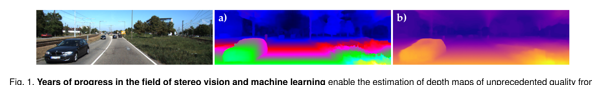
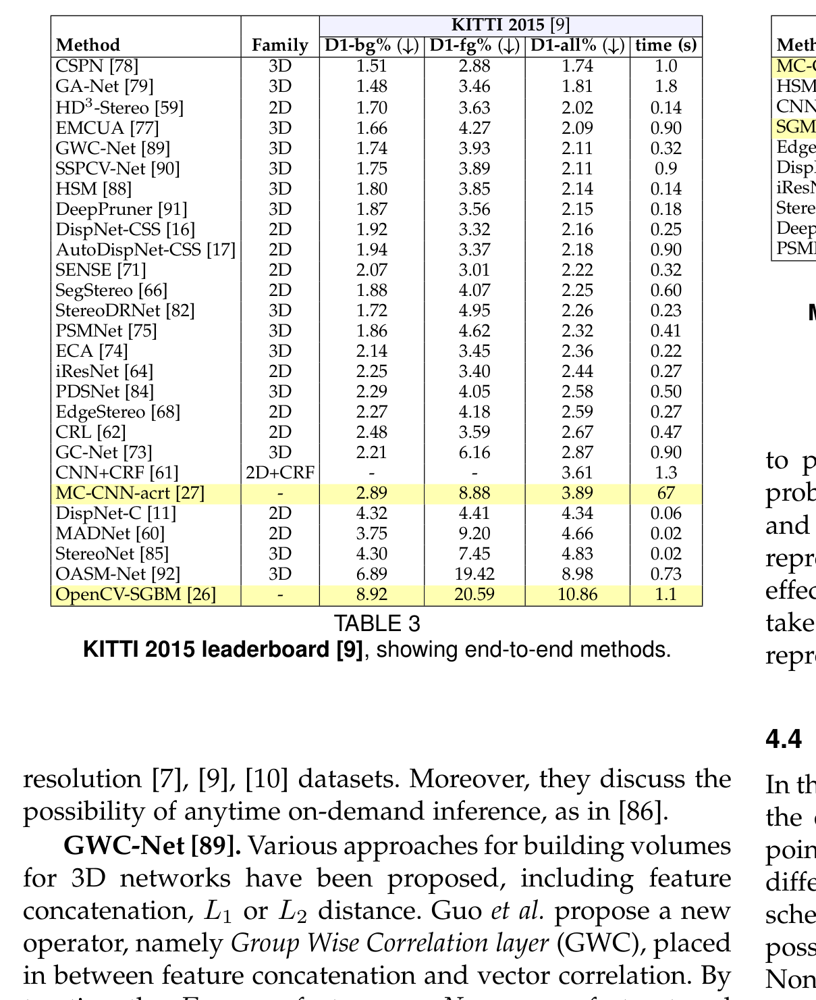
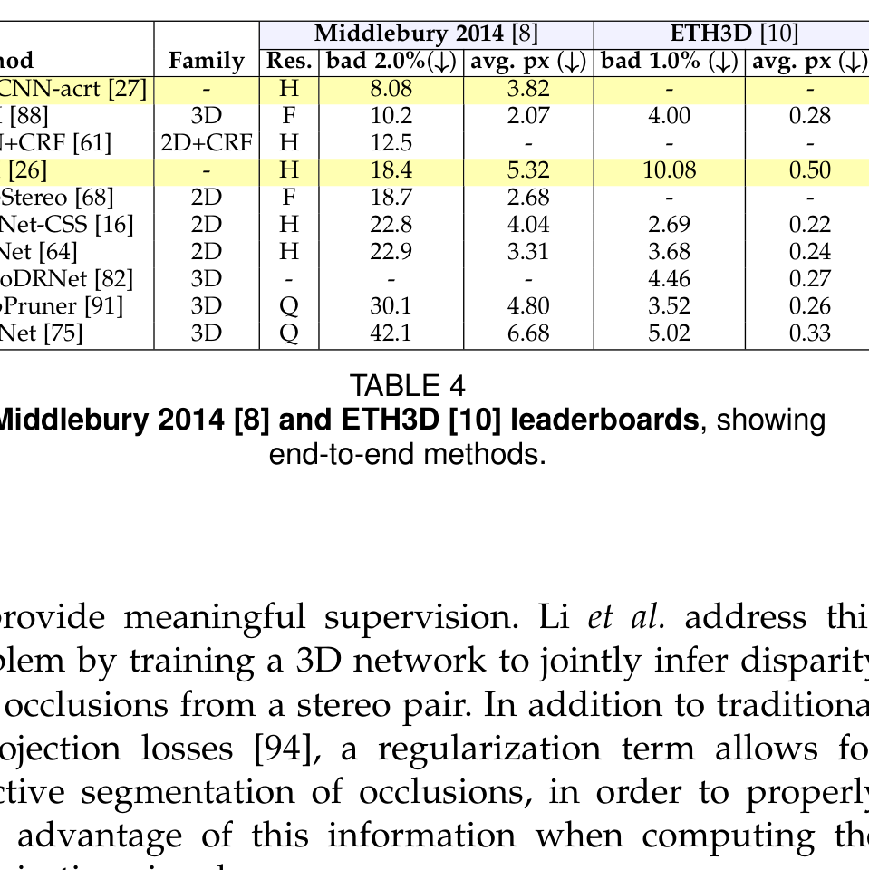
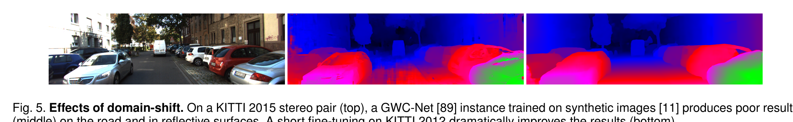

# On the Synergies between Machine Learning and Binocular Stereo for Depth Estimation from Images: a Survey

**Authors:** Matteo Poggi, Fabio Tosi, Konstantinos Batsos, Philippos Mordohai, Stefano Mattoccia
**Venue:** IEEE Transactions on Pattern Analysis and Machine Intelligence (TPAMI), 2021
**Priority:** 9/10
**Pages:** 20 (153 references)
**Covers:** The complete evolution from classical stereo through end-to-end deep stereo (up to 2020), plus monocular depth via stereo supervision

---

## Why This Paper Matters

This is the **direct predecessor** to Tosi et al. IJCV 2025. While Tosi 2025 focuses on the 2020s (iterative methods, transformers, foundation models), Poggi 2021 provides the essential coverage of:

1. **How deep learning entered stereo** — the step-by-step replacement of each pipeline component
2. **The transition from pipeline-based to end-to-end** — why and how it happened
3. **The bidirectional stereo-mono synergy** — stereo supervises monocular depth, and monocular depth improves stereo. This insight directly foreshadows the foundation-model era (DEFOM-Stereo, MonSter)
4. **Confidence estimation** — a topic Tosi 2025 covers only briefly

**Relationship to Tosi 2025:** There is significant overlap in the 2D/3D architecture sections. Poggi 2021 covers pre-2020 methods in more depth (GC-Net, PSMNet, GA-Net, etc.), while Tosi 2025 covers post-2020 methods (RAFT-Stereo, IGEV, etc.). Together they form a complete picture.

---

## The Central Thesis: Bidirectional Synergy

The paper's key argument is that the relationship between stereo matching and machine learning is **two-way**:

```
Direction 1: ML improves Stereo
  Classical pipeline → learned costs (MC-CNN) → end-to-end (GC-Net) → SOTA

Direction 2: Stereo improves ML
  Stereo geometry provides free supervision for monocular depth estimation
  (MonoDepth, etc.) — no expensive ground truth needed
```

This bidirectional insight is **prophetic** for our project: DEFOM-Stereo (2025) takes it to the logical conclusion — monocular depth *foundation models* (trained partly via stereo supervision) now *feed back into* stereo matching as powerful priors.



---

## Section 3: Learning Within the Stereo Pipeline

Before end-to-end models, researchers replaced **individual steps** of the Scharstein & Szeliski pipeline with learned components. This section traces that progression:

### 3.1 Learned Matching Costs (Step 1)

**MC-CNN** (Zbontar & LeCun, 2016) — the breakthrough:
- A **Siamese CNN** extracts features from left and right image patches
- Features are compared via a fully connected network → matching score
- Two variants:
  - **MC-CNN-acrt:** Concatenates features, requires $D$ forward passes (slow but accurate)
  - **MC-CNN-fst:** Uses dot product for comparison, single forward pass (fast)
- The learned cost volume is then processed by **standard SGM** for optimization
- First to clearly beat hand-crafted costs on KITTI

**Key equation — correlation layer:**

$$c(x_1, x_2) = \sum_{o \in [-k,k] \times [-k,k]} \langle f_1(x_1 + o), \ f_2(x_2 + o) \rangle \tag{1}$$

- **$c(x_1, x_2)$** = correlation (similarity score) between position $x_1$ in left image and $x_2$ in right image
- **$f_1, f_2$** = learned feature maps from a shared-weight (Siamese) CNN encoder
- **$o$** = offset within a local $(2k+1) \times (2k+1)$ patch
- **$\langle \cdot, \cdot \rangle$** = dot product measuring feature similarity
- This is the same operation used in DispNet-C and later RAFT-Stereo — the correlation layer has survived every paradigm shift

**Other learned matching costs covered:** Deep Embed, Content CNN, SDC, CBMV, per-pixel pyramid pooling.

### 3.2 Learned Optimization (Step 3)

Methods that improve SGM's optimization with learning:

- **GCP:** Learn ground control points to constrain SGM optimization
- **LevStereo / O1:** Learn confidence measures to modulate SGM penalties
- **PBCP:** Patch-based confidence for SGM penalty adjustment
- **SGM-Net:** Learn the $P_1$, $P_2$ penalty parameters of SGM itself (rather than setting them manually)
- **SGM-Forest:** Random forest to fuse proposals from multiple SGM scanline directions

**Key insight:** These methods showed that even small learned improvements to SGM produced significant accuracy gains. But they were quickly superseded by end-to-end approaches that didn't need SGM at all.

### 3.3 Learned Refinement (Step 4)

- **GDN (L-ResMatch):** Multi-stage architecture with learned cost volume refinement + confidence prediction
- **DRR:** Detect errors → replace with predictions → refine residuals
- **RecResNet:** Recurrent residual network for disparity map enhancement
- **LRCR:** Left-right comparative recurrent model
- **VN:** Variational refinement network with collaborative denoising


---

## Section 4: End-to-End Deep Learning

The paper provides the definitive pre-2020 account of the **paradigm shift** from pipeline-based to end-to-end stereo.

### 4.1 Taxonomy: 2D vs 3D Architectures

The fundamental distinction:

| Aspect | 2D Architectures | 3D Architectures |
|--------|-----------------|-----------------|
| **Cost volume** | Correlation-based (dot product between features) | Concatenation/difference of features at all disparities |
| **Processing** | 2D convolutions (encoder-decoder) | 3D convolutions over $H \times W \times D \times F$ volume |
| **Geometry** | Implicit — network must learn disparity structure from 2D data | Explicit — 3D convolutions reason along the disparity dimension |
| **Speed** | Fast (no 3D ops) | Slow (3D conv is expensive) |
| **Accuracy** | Lower (circa 2020) | Higher (encodes geometry explicitly) |
| **Memory** | Lower | Much higher ($O(H \times W \times D \times F)$) |
| **Key examples** | DispNet-C, CRL, iResNet, AANet, MADNet | GC-Net, PSMNet, GA-Net, GWCNet, DeepPruner |

### 4.2 Key 2D Architectures

- **DispNet-C** (Mayer et al., 2016): First end-to-end stereo network. U-Net encoder-decoder with correlation layer. Introduced SceneFlow dataset. Milestone, even though initially worse than MC-CNN+SGM.
- **CRL** (Pang et al., 2017): Two-stage cascade — DispNet-C for initial estimate, DispResNet for residual correction. First 2D architecture to top KITTI leaderboard.
- **MADNet** (Tonioni et al., 2019): Modularly Adaptive Network for real-time self-adaptive stereo. Coarse-to-fine with selective backpropagation for online adaptation.

### 4.3 Key 3D Architectures

- **GC-Net** (Kendall et al., 2017): First 3D cost volume architecture. Concatenate features at all disparities → 3D encoder-decoder → soft argmin. First end-to-end model to beat hand-crafted pipelines on KITTI.
- **PSMNet** (Chang & Chen, 2018): Added Spatial Pyramid Pooling (SPP) for multi-scale context + stacked hourglass 3D encoder-decoder. Significant accuracy boost.
- **GA-Net** (Zhang et al., 2019): Replaced 3D convolutions with two novel layers: (1) a locally guided aggregation (LGA) layer and (2) a semi-global aggregation (SGA) layer — a **differentiable approximation of SGM**. Outperformed models with dozens of 3D convolutions using just a few GA layers.
- **GWCNet** (Guo et al., 2019): Group-wise correlation — splits features into $N$ groups and computes $N$ correlation scores instead of a single dot product. Reduces compute of the first 3D convolutions while providing better feature representation.
- **DeepPruner** (Duggal et al., 2019): Differentiable PatchMatch to prune the disparity search space, computing costs only for promising candidates. First adaptive cost volume.

### 4.4 Benchmark Comparison (as of 2020)





**Key observations (as of 2020):**
- 3D architectures dominated KITTI but **MC-CNN+SGM remained competitive** on Middlebury and ETH3D
- Most end-to-end methods couldn't process full-resolution Middlebury images
- The gap between fast methods (DispNet-C, StereoNet, MADNet) and accurate methods (CSPN, GA-Net) was still large
- **RAFT-Stereo (2021) would change all of this** — it handled full resolution AND achieved top accuracy

---

## Section 5: Confidence Estimation

A unique contribution of this survey — confidence estimation for stereo is covered in detail:

**What is confidence?** A per-pixel score indicating how reliable the estimated disparity is. High confidence = likely correct, low confidence = likely wrong (occlusion, textureless area, etc.)


**Two families:**
1. **Disparity/image-based:** Operate on the output disparity map and/or the input image (CCNN, LGC-Net)
2. **Cost volume-based:** Operate on the internal cost volume, which encodes richer multi-hypothesis information (Reflective Confidence, LAF-Net)

**Why this matters for our project:** Confidence estimation is important for edge deployment — knowing when the model is uncertain allows downstream systems (robot navigation, ADAS) to fall back to safer behaviors. Our edge model should include a lightweight confidence head.

---

## Section 6: Domain Shift



**Three approaches identified:**
1. **Self-supervised adaptation** (offline): Use photometric consistency loss to fine-tune on unlabeled target domain data (Confidence-guided Adaptation, Zoom and Learn)
2. **Online adaptation:** Adapt during deployment in real-time (MADNet, Learning to Adapt). The network continuously updates itself using self-supervised signals.
3. **Guided deep learning:** Use external depth hints (e.g., sparse LiDAR) to overcome domain shift without retraining

**Key insight:** The survey identifies domain shift as the #1 open problem. Four years later, the foundation-model approach (DEFOM-Stereo, FoundationStereo) largely solves this by using monocular priors that generalize naturally.

---

## Section 7: Monocular Depth via Stereo Supervision

This section is **critical for understanding the DEFOM-Stereo lineage:**

**The key idea:** Stereo geometry provides a free supervisory signal for monocular depth estimation. If you have a stereo pair, you can train a network to predict depth from a *single* image by using the other image as supervision (via view synthesis / photometric loss). No ground-truth depth needed.

**MonoDepth** (Godard et al., 2017): The seminal work. Train a monocular depth CNN using:
1. Left-right photometric consistency loss
2. SSIM-based appearance matching loss
3. Left-right disparity consistency regularization

This created a **virtuous cycle:**
```
Stereo pairs → train monocular depth networks (no GT needed)
    → monocular depth models get better and better
        → eventually become "foundation models" (Depth Anything V2)
            → these foundation models feed back into stereo (DEFOM-Stereo, 2025)
```

**Other methods covered:** Geometry to the Rescue, MonoDepth2, 3Net, SuperDepth, PyDNet (real-time on CPU), Depth-Hints, monoResMatch, Semi-supervised MonoDepth, etc.

---

## Section 8: Discussion — Four Take-Home Messages

1. **End-to-end networks dominate** — the paradigm shift from pipeline-based to end-to-end is complete. Classical design knowledge (correlation layer, 3D cost volumes) persists inside the networks.

2. **Classical knowledge lives on inside deep networks** — the correlation layer (from optical flow), 3D cost aggregation (from SGM), and geometric reasoning are all embedded in modern architectures. They didn't disappear — they became differentiable.

3. **Data hunger and domain shift** are the main unsolved problems. Self-supervised and adaptation techniques are promising but not sufficient.

4. **Stereo and monocular depth are deeply synergistic** — stereo provides supervision for mono, and mono will eventually provide priors for stereo. (This prediction came true with DEFOM-Stereo.)

---

## Relevance to Our Project

### For the Review Paper

Poggi 2021 + Tosi 2025 together provide **complete temporal coverage:**

| Period | Covered by | Key paradigm |
|--------|-----------|-------------|
| Pre-2016 | Scharstein 2002, Hirschmuller 2007 | Classical pipeline + SGM |
| 2016-2020 | **Poggi 2021** | MC-CNN → end-to-end (2D/3D) |
| 2020-2024 | Tosi 2025 | Iterative (RAFT-Stereo) + transformers |
| 2025-2026 | **Our review paper** | Foundation models + edge deployment |

Our review should **not re-survey** the 2016-2020 methods in detail (Poggi already did this). Instead, we should:
- Cite Poggi 2021 for comprehensive pre-2020 coverage
- Focus our original contribution on the foundation-model era and edge deployment

### For the Edge Model

- **The mono-stereo synergy (Section 7)** is the theoretical foundation for our approach: monocular depth foundation models provide priors, stereo matching corrects their scale.
- **Confidence estimation (Section 5)** should be included in our edge model as a lightweight head — important for safety-critical deployment.
- **Online adaptation (Section 6.1.2)** via MADNet's approach could complement our edge model for continuous improvement after deployment.

---

## Connections to Other Papers

| Paper | Relationship |
|-------|-------------|
| **Scharstein & Szeliski 2002** | Poggi traces how each step of their 4-step pipeline was replaced by learning |
| **Hirschmuller SGM 2007** | SGM appears as the baseline and optimization backend for MC-CNN. GA-Net reimplements SGM differentiably. |
| **Tosi et al. IJCV 2025** | Direct successor — Tosi 2025 picks up where Poggi 2021 leaves off |
| **MC-CNN (2016)** | Covered in detail as the breakthrough in learned matching costs |
| **GC-Net, PSMNet, GA-Net** | Covered as the key 3D architecture evolution |
| **MonoDepth (2017)** | Covered as the seminal mono-via-stereo work — ancestor of Depth Anything V2 |
| **DEFOM-Stereo (2025)** | The logical culmination of Poggi's "bidirectional synergy" thesis — mono priors feeding back into stereo |
| **MADNet (2019)** | Covered as real-time self-adaptive stereo — relevant for edge deployment with online adaptation |
