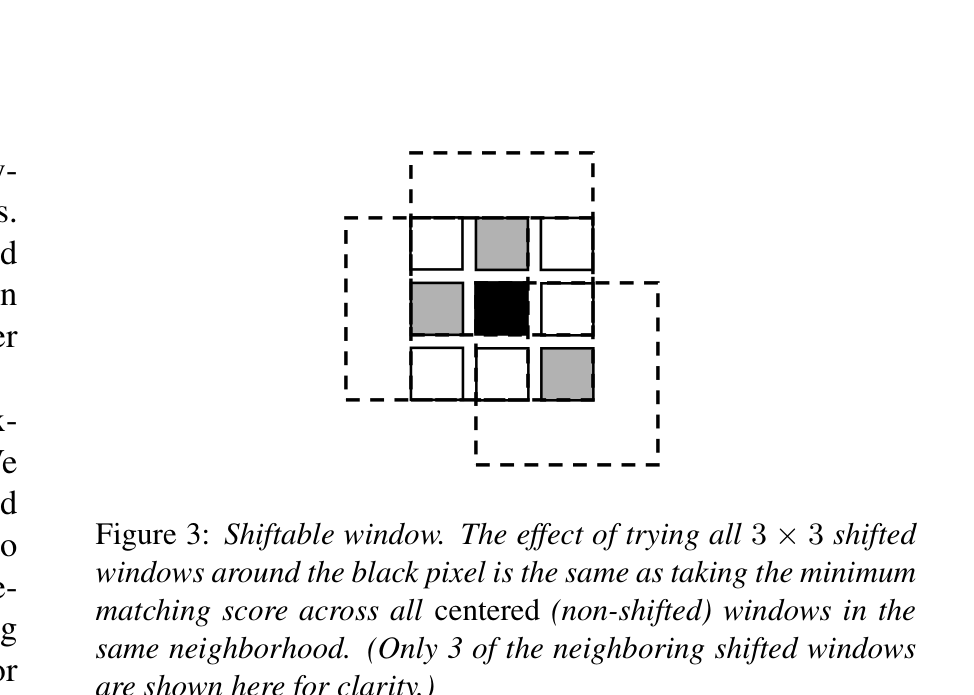
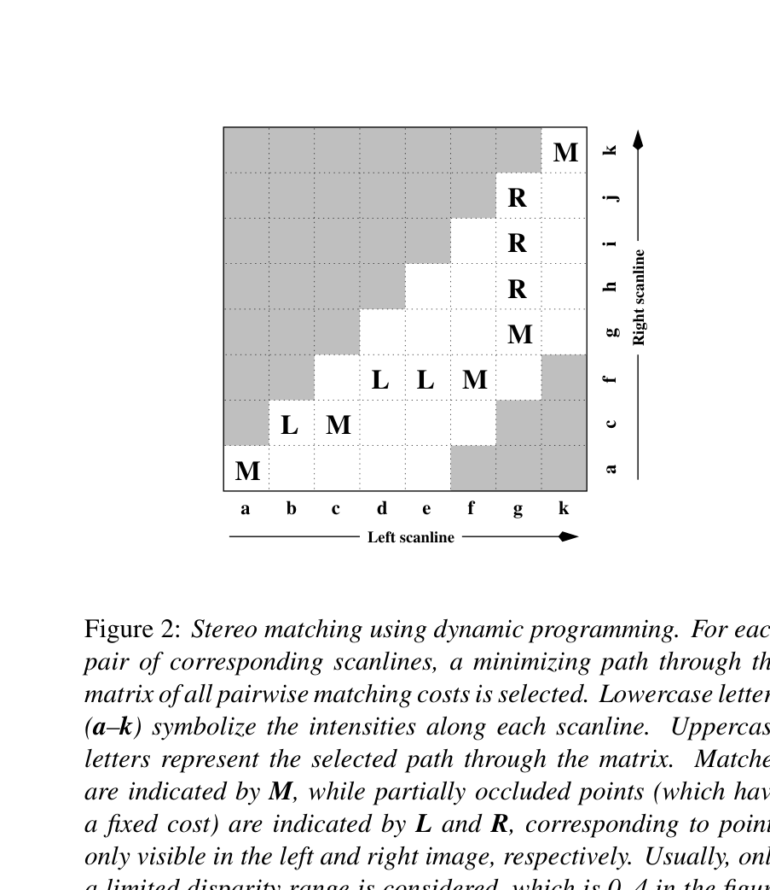
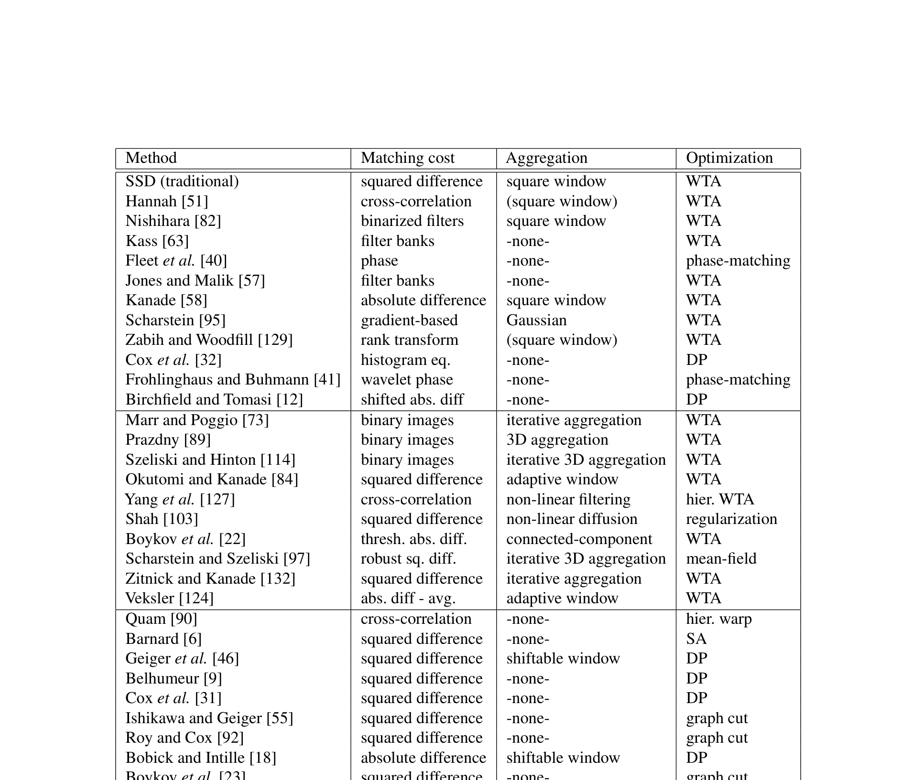
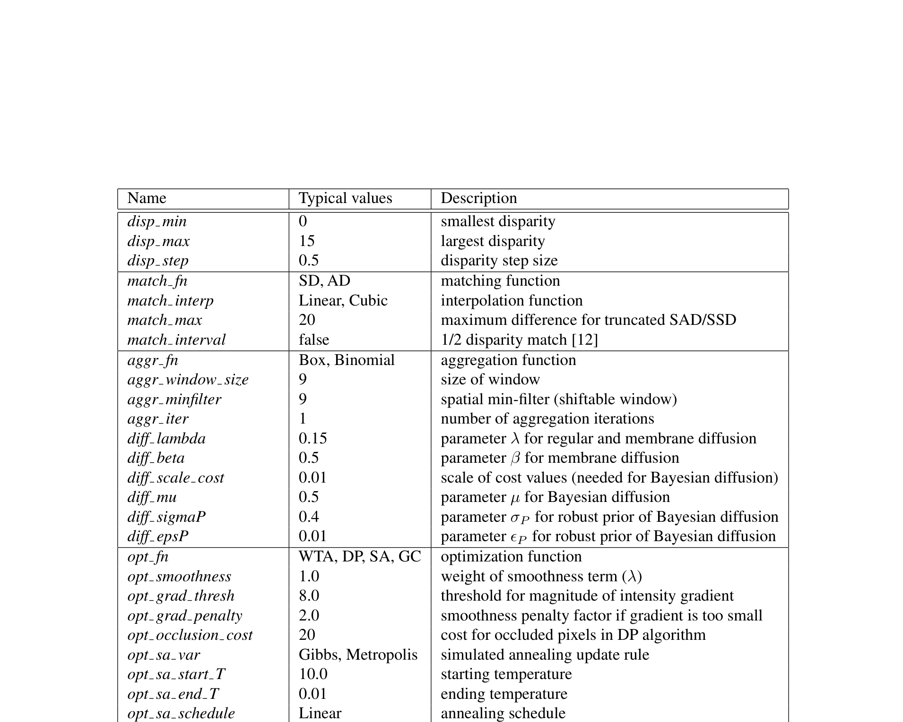

# A Taxonomy and Evaluation of Dense Two-Frame Stereo Correspondence Algorithms

**Authors:** Daniel Scharstein (Middlebury College), Richard Szeliski (Microsoft Research)
**Venue:** International Journal of Computer Vision (IJCV), 2002
**Priority:** 10/10
**Cited by:** 10,000+ (one of the most cited papers in computer vision)

---

## Core Problem & Motivation

Before this paper, stereo matching research was fragmented. Each paper proposed a complete algorithm and compared against a few competitors using different datasets and metrics. There was no common framework to understand *why* one method worked better than another, or which *component* was responsible for improvements.

**Two goals:**
1. Provide a **taxonomy** that decomposes stereo algorithms into interchangeable building blocks
2. Provide a **test bed** (Middlebury benchmark) for standardized evaluation

---

## Foundational Concepts

### What is Stereo Matching?

Given two images of the same scene taken from slightly different viewpoints (a **stereo pair**), the goal is to find, for every pixel in the left (reference) image, the corresponding pixel in the right (matching) image. The horizontal offset between these corresponding pixels is called **disparity**, and it is inversely proportional to depth:

$$\text{depth} = \frac{f \cdot B}{d}$$

- **f** = focal length of the camera (in pixels)
- **B** = baseline — the physical distance between the two cameras
- **d** = disparity — the horizontal pixel shift between corresponding points

So larger disparity = closer object, smaller disparity = farther object.

### Disparity Map

The output of a stereo algorithm is a **disparity map** $d(x, y)$ — a single-channel image where each pixel stores the estimated disparity at that location. This is what every stereo network ultimately predicts.

### Pixel Correspondence

The paper formalizes how pixels correspond between the two images. For a pixel at position $(x, y)$ in the reference image, its corresponding pixel in the matching image is at:

$$x' = x + s \cdot d(x,y), \quad y' = y \quad \text{(1)}$$

- **$(x, y)$** = pixel coordinates in the reference (left) image
- **$(x', y')$** = corresponding pixel coordinates in the matching (right) image
- **$d(x, y)$** = disparity at this pixel (always positive)
- **$s = \pm 1$** = sign convention ($+1$ if matching image is to the right, $-1$ if to the left)
- **$y' = y$** because the images are rectified — corresponding points lie on the same horizontal scanline

### Disparity Space Image (DSI)

A central data structure in stereo matching. The DSI is a 3D volume:

$$C_0(x, y, d)$$

- **$x, y$** = spatial pixel coordinates
- **$d$** = candidate disparity value (integer from $d_{min}$ to $d_{max}$)
- **$C_0(x, y, d)$** = the matching cost for pixel $(x,y)$ if its true disparity were $d$

Think of it as: for every pixel, we try every possible disparity and record how well the two images match at that shift. The DSI has size $H \times W \times D_{max}$.

**This is the precursor to the "cost volume" in all modern deep stereo networks** (GC-Net, PSMNet, RAFT-Stereo, DEFOM-Stereo). The deep learning versions add a feature dimension $f$, making it $H \times W \times D \times F$.

### Visualizing the DSI

The DSI is best understood through its different views:

![The Disparity Space Image (DSI) visualized from 6 perspectives. Top-left: the 3D volume C(x,y,d) with a red line showing one pixel's cost profile through all disparities (the star marks the winning disparity). Top-center/right: (x,y) slices at d=5 and d=14 — green regions have low cost (good matches at that disparity). Bottom-left: an (x,d) scanline slice — the dark valley traces the correct disparity, and SGM finds optimal paths through this. Bottom-center: per-pixel cost curves showing how the minimum identifies the correct disparity. Bottom-right: the output disparity map from argmin along d.](../../../figures/DSI_visualization.png)

**How to read this figure:**
- **Top-left (3D box):** The full volume. Each point C(x,y,d) stores a matching cost. The red vertical line shows all disparity candidates for one pixel — the star marks where cost is lowest (the winner).
- **Top-center/right (horizontal slices):** Cut the volume at a fixed disparity. Green = low cost = pixels that match well at this disparity. At d=5 the background matches; at d=14 the foreground object matches.
- **Bottom-left (vertical slice along a scanline):** This is what SGM's dynamic programming operates on — it finds the optimal path through the dark cost valley, enforcing smoothness via $P_1$/$P_2$ penalties.
- **Bottom-center (cost curves):** For each pixel, plot cost vs. disparity. The minimum gives the disparity estimate. Foreground pixel (red) has minimum at d=14; background pixel (blue) at d=5.
- **Bottom-right (output):** Apply argmin at every pixel → the disparity map. Bright = close, dark = far.


---

## The Four-Step Taxonomy

This is the paper's most important contribution. Every stereo algorithm — classical or deep — can be decomposed into four steps:

```
Step 1: Matching Cost Computation    "How similar are these two pixels?"
         |
Step 2: Cost Aggregation             "What do the neighbors think?"
         |
Step 3: Disparity Optimization       "Pick the best disparity for each pixel"
         |
Step 4: Disparity Refinement         "Clean up and improve"
```

### Step 1: Matching Cost Computation

**Purpose:** For each pixel $(x,y)$ and each candidate disparity $d$, compute how well the pixel in the left image matches the pixel at offset $d$ in the right image.

**Common matching costs:**

| Cost Function | Formula | Properties |
|---------------|---------|------------|
| **Squared Difference (SD)** | $(I_L(x,y) - I_R(x+d, y))^2$ | Simple, sensitive to illumination changes |
| **Absolute Difference (AD)** | $\Vert I_L(x,y) - I_R(x+d, y)\Vert $ | More robust to outliers than SD |
| **Truncated costs** | $\min(|I_L - I_R|, T)$ | Caps maximum cost at threshold $T$, robust to occlusions |
| **Normalized Cross-Correlation** | $\frac{\sum (I_L - \bar{I}_L)(I_R - \bar{I}_R)}{\sigma_L \cdot \sigma_R}$ | Insensitive to camera gain and bias |
| **Rank / Census transform** | Compare relative orderings of pixel intensities | Non-parametric, very robust to illumination |
| **Gradient-based** | Compare image gradients instead of raw intensities | Insensitive to additive brightness changes |

**Why this matters for deep learning:** MC-CNN (2016) was the first to replace this entire step with a learned CNN. In modern networks, the "feature encoder" + "correlation/cost volume construction" replaces Step 1. But the output is still a cost volume $C(x, y, d)$.

### Step 2: Cost Aggregation

**Purpose:** The raw per-pixel matching cost is noisy. Aggregation smooths it by combining evidence from neighboring pixels, implicitly assuming that nearby pixels have similar disparities.

$$C(x, y, d) = w(x, y, d) * C_0(x, y, d) \quad \text{(2)}$$

- **$C_0(x, y, d)$** = raw (unaggregated) matching cost from Step 1
- **$w(x, y, d)$** = aggregation kernel / support weight (defines which neighbors contribute)
- **$*$** = convolution operation
- **$C(x, y, d)$** = aggregated cost — smoother, more reliable

**Aggregation strategies:**

| Method | How it works | Trade-off |
|--------|-------------|-----------|
| **Square window** | Average costs in a fixed $N \times N$ window | Fast but blurs depth edges |
| **Gaussian window** | Weighted average, closer pixels contribute more | Slightly better edges |
| **Shiftable window** | Try all window positions, keep the best one | Better at boundaries, more compute |
| **Adaptive window** | Change window size/shape based on local image content | Edge-preserving but complex |
| **Iterative diffusion** | Repeatedly blend costs with neighbors | Mimics global optimization |



**Why this matters for deep learning:** The 3D convolutions in GC-Net and PSMNet are the learned equivalent of cost aggregation. The bilateral grid in BGNet is a modern efficiency-oriented aggregation. RAFT-Stereo's correlation lookup replaces explicit aggregation with a learned lookup + GRU update.

### Step 3: Disparity Computation / Optimization

**Purpose:** Given the (aggregated) cost volume, determine the final disparity at each pixel.

#### Local Methods: Winner-Take-All (WTA)

The simplest approach — at each pixel, pick the disparity with the lowest cost:

$$d(x,y) = \arg\min_d C(x, y, d)$$

- Fast (just find the minimum along the disparity dimension)
- But noisy, because each pixel is decided independently
- No spatial consistency — neighboring pixels might get wildly different disparities

#### Global Methods: Energy Minimization

Global methods formulate stereo as finding the disparity map $d$ that minimizes a global energy function:

$$E(d) = E_{data}(d) + \lambda \cdot E_{smooth}(d) \quad \text{(3)}$$

- **$E(d)$** = total energy of disparity map $d$ — lower is better
- **$E_{data}(d)$** = data term — how well the disparity map agrees with the observed matching costs (fidelity to the images)
- **$E_{smooth}(d)$** = smoothness term — penalizes abrupt changes in disparity between neighbors (regularization)
- **$\lambda$** = balancing weight — controls the trade-off between fitting the data vs. enforcing smoothness. Higher $\lambda$ = smoother result but may lose fine detail.

**Data term (Eq. 4):**

$$E_{data}(d) = \sum_{(x,y)} C(x, y, d(x,y)) \quad \text{(4)}$$

- Sum the matching cost at each pixel's chosen disparity
- This just says: "the total data cost is the sum of how well each pixel matches at its assigned disparity"
- Low $E_{data}$ means the disparity map is consistent with image evidence

**Smoothness term (Eq. 5):**

$$E_{smooth}(d) = \sum_{(x,y)} \rho(d(x,y) - d(x+1,y)) + \rho(d(x,y) - d(x,y+1)) \quad \text{(5)}$$

- **$d(x,y) - d(x+1,y)$** = disparity difference between horizontally adjacent pixels
- **$d(x,y) - d(x,y+1)$** = disparity difference between vertically adjacent pixels
- **$\rho(\cdot)$** = penalty function — penalizes disparity jumps between neighbors

The choice of $\rho$ is critical:

| Penalty $\rho$ | Formula | Behavior |
|----------------|---------|----------|
| **Quadratic** | $\rho(\Delta d) = \Delta d^2$ | Heavily penalizes large jumps — over-smoothes object boundaries |
| **Linear (L1)** | $\rho(\Delta d) = |\Delta d|$ | Moderate penalty — somewhat edge-preserving |
| **Truncated** | $\rho(\Delta d) = \min(|\Delta d|, T)$ | Caps penalty at threshold $T$ — discontinuity-preserving. Once the jump exceeds $T$, there's no additional penalty, so sharp depth edges are allowed |
| **Potts model** | $\rho(\Delta d) = [|\Delta d| > 0]$ | Binary: either matching or not. Used in graph cuts. |

**Gradient-dependent smoothness (Eq. 6):**

$$\rho_d(d(x,y) - d(x+1,y)) \cdot \rho_I(\Vert I(x,y) - I(x+1,y)\Vert ) \quad \text{(6)}$$

- **$\rho_d(\cdot)$** = disparity penalty function (same as $\rho$ above)
- **$\rho_I(\cdot)$** = intensity-dependent modulation — a monotonically **decreasing** function of image gradient magnitude
- **$\Vert I(x,y) - I(x+1,y)\Vert $** = intensity difference between neighboring pixels (image edge strength)

**Key idea:** Where the image has a strong edge (large intensity difference), $\rho_I$ is small, which *lowers* the smoothness penalty. This encourages depth discontinuities to align with image edges — a physically sensible prior because object boundaries typically create both intensity edges and depth jumps simultaneously.

**This is one of the most important insights in stereo matching** and persists in modern methods: edge-aware losses, attention mechanisms that attend to image boundaries, and the guidance signal in GA-Net all implement this principle.

**Optimization algorithms:**

| Method | How it works | Quality | Speed |
|--------|-------------|---------|-------|
| **WTA** | Pick min cost per pixel independently | Low | Very fast |
| **Dynamic Programming (DP)** | Find optimal path through each $(x,d)$ scanline slice | Medium | Fast |
| **Scanline Optimization (SO)** | Like DP but without ordering constraint | Medium | Fast |
| **Simulated Annealing (SA)** | Random perturbations, accept if energy decreases | High | Very slow |
| **Graph Cut (GC)** | Find minimum cut in a graph encoding the energy | Highest (2002) | Slow |



**Why this matters for deep learning:** Modern iterative methods (RAFT-Stereo) replace explicit energy minimization with learned recurrent updates (GRU). But they're implicitly minimizing a similar objective — the GRU learns to perform optimization steps in a learned cost volume. SGM (next paper) is the key bridge between these classical global methods and modern approaches.

### Step 4: Disparity Refinement

**Purpose:** Post-process the raw disparity map to fix errors and increase precision.

**Common refinement techniques:**
1. **Sub-pixel refinement:** Fit a parabola to the 3 cost values around the winning disparity → achieve sub-pixel precision without increasing the disparity search range
2. **Left-right consistency check:** Compute disparity from *both* directions (left→right and right→left). Pixels where the two estimates disagree by more than 1 pixel are flagged as **occluded** or **unreliable**
3. **Median filtering:** Replace each disparity with the median of its neighborhood — removes isolated errors ("salt-and-pepper noise")
4. **Hole filling:** Interpolate disparity in occluded regions using nearby reliable values

**Why this matters for deep learning:** Modern refinement modules (NDR, DEFOM-Stereo's Scale Update Module) are learned versions of Step 4. The left-right consistency check is still used in RAFT-Stereo's evaluation pipeline.

---

## The Local vs. Global Distinction

A fundamental categorization that every survey since has used:

| Aspect | Local Methods | Global Methods |
|--------|--------------|----------------|
| **Key step** | Cost aggregation (Step 2) | Optimization (Step 3) |
| **How smoothness works** | Implicitly via window size | Explicitly via energy function |
| **Speed** | Fast — independent per pixel | Slow — must optimize jointly |
| **Quality at edges** | Blurry (window includes both sides) | Sharp (robust penalty allows jumps) |
| **Failure mode** | Bad at textureless + edges | Streak artifacts (DP), slow (SA/GC) |
| **Modern equivalent** | 2D cost volume + WTA | 3D cost volume + iterative updates |

**In-between:** "Cooperative" algorithms iteratively perform local operations that mimic global behavior. This is conceptually a precursor to the iterative paradigm (RAFT-Stereo) — local correlation lookups refined by recurrent global updates.

---

## Taxonomy Summary Table

This table decomposes 30+ classical methods into their building blocks — the core contribution of the paper:



---

## Algorithm Parameters

The paper's implementation exposes all components as configurable parameters, enabling controlled experiments:



---

## Relevance to Our Project

### For the Review Paper

This taxonomy IS the organizing framework for our entire survey. Every method we review — from GC-Net to DEFOM-Stereo — can be mapped onto this four-step pipeline. Deep learning progressively replaced each step:

| Era | Step 1 (Cost) | Step 2 (Aggregation) | Step 3 (Optimization) | Step 4 (Refinement) |
|-----|---------------|---------------------|-----------------------|--------------------|
| **Classical** | Hand-crafted (SD, AD, Census) | Window / diffusion | WTA / DP / GC | Sub-pixel + median |
| **MC-CNN (2016)** | **Learned CNN** | Hand-crafted | SGM | Sub-pixel |
| **GC-Net (2017)** | **Learned features** | **3D convolutions** | **Soft argmin** | — |
| **PSMNet (2018)** | **SPP features** | **Stacked hourglass 3D** | **Soft argmin** | — |
| **RAFT-Stereo (2021)** | **Learned features** | **Correlation volume** | **Recurrent GRU** | **Context network** |
| **DEFOM-Stereo (2025)** | **CNN + Foundation model** | **Fused cost volume** | **Recurrent GRU** | **Scale correction module** |

### For the Edge Model

The taxonomy helps us identify where to cut compute per step:
- **Step 1:** Replace heavy ViT backbone with efficient encoder (MobileNetV4, EfficientViT)
- **Step 2:** Use bilateral grid (BGNet) instead of full 4D cost volume
- **Step 3:** Fewer GRU iterations (3-5 vs. 12-32) with better initialization from monocular prior
- **Step 4:** Lightweight scale correction instead of expensive iterative refinement

---

## Connections to Other Papers

| Paper | Relationship |
|-------|-------------|
| **Hirschmuller 2007 (SGM)** | Bridges local and global — aggregates DP paths from 8-16 directions. Elegant compromise that dominated for a decade. |
| **MC-CNN (2016)** | First paper to replace Step 1 with a learned CNN |
| **GC-Net (2017)** | First paper to replace Steps 1-3 end-to-end with deep learning |
| **RAFT-Stereo (2021)** | Replaces Step 3 with learned iterative updates — the modern paradigm |
| **DEFOM-Stereo (2025)** | Adds foundation model features to Step 1, keeps RAFT-style Step 3 |
| **All modern methods** | Still operate on a cost volume / disparity space — the DSI this paper formalized |
