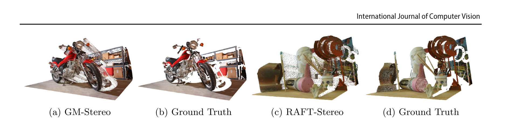
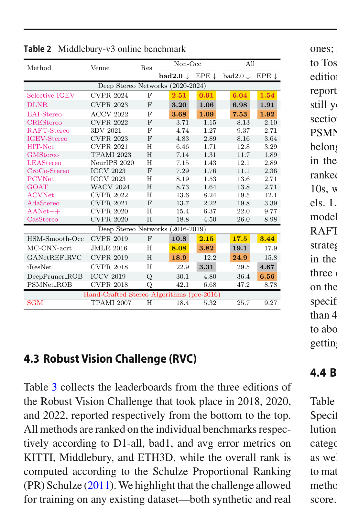

# A Survey on Deep Stereo Matching in the Twenties

**Authors:** Fabio Tosi, Luca Bartolomei, Matteo Poggi (University of Bologna)
**Venue:** International Journal of Computer Vision (IJCV), 2025
**Priority:** 10/10
**Pages:** 26 (including appendices on theory, datasets, metrics)
**Covers:** 100+ methods from 2020-2024, building on prior surveys (Poggi 2021, Laga 2020)

---

## Why This Paper Matters

This is the **definitive modern reference** for our review paper. It covers the last 5 years of deep stereo matching — precisely the period where the field shifted from 3D cost volume methods to iterative and foundation-model approaches. Our review will build on top of this survey's framework while adding the 2025-2026 foundation-model era papers.

---

## The Tosi Taxonomy: Two-Axis Organization

The survey organizes 100+ methods along two axes:

**Axis 1 — Architectural Paradigm (Section 2):** How the network is designed
**Axis 2 — Challenge Addressed (Section 3):** What problem the method solves

---

## Section 2: Deep Stereo Frameworks

### 2.1 Foundational Architectures

#### 2.1.1 CNN-Based Cost Volume Aggregation

The survey groups these into **2D** and **3D** architectures:

**2D architectures** (DispNet, AANet, WaveletStereo, CFNet):
- Build a 3D cost volume by correlating left and right features
- Process the cost volume using **2D convolutions** via encoder-decoder
- Faster than 3D but don't explicitly reason about geometry along the disparity dimension
- **Key equation for 2D correlation volume:**

$$c(x_1, x_2) = \sum_{o \in [-k,k] \times [-k,k]} \langle f_1(x_1 + o), \ f_2(x_2 + o) \rangle \tag{Appendix Eq. 2}$$

- **$c(x_1, x_2)$** = correlation score between position $x_1$ in the left image and $x_2$ in the right image
- **$f_1, f_2$** = learned feature maps from the left and right images respectively
- **$o$** = offset within a local patch of size $(2k+1) \times (2k+1)$
- **$\langle \cdot, \cdot \rangle$** = dot product (inner product) measuring feature similarity
- **$k$** = patch radius — determines how much local context is used for matching

**3D architectures** (GC-Net, PSMNet, GA-Net, GWCNet, ACVNet, PCW-Net):
- Concatenate or compute differences between left and right features at **all disparities** to build a 4D cost volume: $H \times W \times D \times F$
- Process with **3D convolutions** that explicitly encode geometry along the disparity dimension
- Final disparity via **soft argmin:**

$$\text{soft-argmin} = \sum_{d=0}^{D} d \cdot \sigma(-c_d) \tag{Appendix Eq. 3}$$

- **$d$** = disparity level (integer from 0 to $D$)
- **$c_d$** = predicted cost at disparity level $d$ (from the cost volume)
- **$\sigma(\cdot)$** = softmax operation applied along the disparity dimension — converts costs into a probability distribution
- **$\sigma(-c_d)$** = probability that the true disparity is $d$ (negative because lower cost = higher probability)
- The sum computes the **expected value** of disparity under this distribution — yielding a continuous, sub-pixel disparity estimate
- **Problem:** If the distribution is bimodal (foreground+background at a depth edge), the expected value falls *between* the two modes — causing the "bleeding/over-smoothing" artifact

**Key takeaway:** 3D architectures dominated 2017-2021 but are being superseded by iterative methods.

#### 2.1.2 Neural Architecture Search (NAS)

**LEAStereo** (NeurIPS 2020) and **EASNet** (ECCV 2022) use NAS to automatically design stereo architectures rather than hand-crafting them. LEAStereo searches over both the 2D feature net and 3D matching net structures. EASNet addresses scalability by searching architectures that can be deployed at varying resource levels.

**Key insight:** NAS-designed architectures haven't overtaken hand-designed ones — RAFT-Stereo and IGEV were both hand-designed and outperform NAS approaches. The search space is too constrained for the paradigm shifts needed.

#### 2.1.3 Iterative Optimization-Based Architectures (THE paradigm shift)

The survey identifies this as the **game-changing paradigm** of the 2020s:

**RAFT-Stereo** (Lipson et al., 2021) — the foundation:
- Constructs a **correlation pyramid** (not a full 4D cost volume) — efficient, no 3D convolutions needed
- **Correlation volume construction:**

$$\mathbf{C}_{ijk} = \sum_h \mathbf{f}_{ijh} \cdot \mathbf{g}_{ikh}, \quad \mathbf{C} \in \mathbb{R}^{H \times W \times W} \tag{Eq. 1}$$

- **$\mathbf{C}_{ijk}$** = correlation between pixel $(i, j)$ in the left image and pixel $(i, k)$ in the right image
- **$\mathbf{f}_{ijh}$** = feature vector at position $(i, j)$ in the left feature map, at channel $h$
- **$\mathbf{g}_{ikh}$** = feature vector at position $(i, k)$ in the right feature map, at channel $h$
- **$\sum_h$** = dot product across all feature channels — a single matrix multiplication per row
- **$\mathbf{C} \in \mathbb{R}^{H \times W \times W}$** = the full all-pairs correlation volume (one $W \times W$ correlation matrix per image row)
- This is computed **once** and then indexed into during iterative updates — no 3D convolutions needed

**Iterative update mechanism:**
- Start with disparity initialized to **zero** everywhere
- At each iteration, the GRU:
  1. **Looks up** local correlation values from the pyramid around the current disparity estimate
  2. Combines this with **context features** and the **current hidden state**
  3. Outputs a **disparity update** $\Delta d$ and an updated hidden state
- Repeat for $N$ iterations (typically 12-32)
- **Key advantage:** accuracy improves with more iterations — flexible speed/accuracy trade-off

**Successors covered by the survey:**

| Method | Key Innovation | Over RAFT-Stereo |
|--------|--------------|-----------------|
| **CREStereo** (CVPR 2022) | Adaptive group correlation (AGCL), cascaded recurrent refinement | Better at large disparities, deformable search |
| **EAI-Stereo** (ACCV 2022) | Error-aware refinement + left-right warping | Learns to correct its own errors |
| **IGEV-Stereo** (CVPR 2023) | Combined Geometry Encoding Volume (CGEV) — 3D regularization + all-pairs correlation | Best of both worlds: geometry encoding + iterative |
| **DLNR** (CVPR 2023) | High-frequency preservation via Decouple LSTM + normalization refinement | Preserves fine detail during iteration |
| **CREStereo++** (ICCV 2023) | Uncertainty-guided adaptive correlation + warping | Adaptive to scene difficulty |
| **Selective-Stereo** (CVPR 2024) | Selective Recurrent Unit (SRU) with frequency-adaptive GRU branches + contextual spatial attention | Multi-frequency fusion, SOTA on multiple benchmarks |
| **MC-Stereo** (3DV 2024) | Multi-peak lookup + cascade search range | Handles multi-modal matching |
| **MoCha-Stereo** (CVPR 2024) | Motif channel attention for geometric edge details | Edge detail recovery |
| **ICGNet** (CVPR 2024) | Intra-view + cross-view geometric constraints via keypoints | Explicit geometric reasoning |

**Key insight from the survey:** RAFT-Stereo and its descendants dominate **5 of the top 6 positions** on Middlebury v3 leaderboard. The iterative paradigm is the clear winner of the 2020s.

#### 2.1.4 Vision Transformer-Based

**STTR** (ICCV 2021): First transformer for stereo — formulates matching as sequence-to-sequence with self-attention and cross-attention. No fixed disparity range needed.

**CroCo v2** (ICCV 2023): Large-scale pre-training via cross-view completion task → fine-tune for stereo. Doesn't use traditional cost volumes.

**GMStereo** (TPAMI 2023): Unified transformer for flow, stereo, and depth.

**GOAT** (WACV 2024): Global occlusion-aware transformer for robust matching in occluded regions.

**Key insight:** Pure transformers haven't beaten iterative methods on benchmarks, but pre-training (CroCo) and unified models (GMStereo) show the value of transformers for representation learning.

#### 2.1.5 Markov Random Field-Based

**LBPS** (CVPR 2020): Belief Propagation as differentiable layers inside a neural network.

**NMRF** (CVPR 2024): Fully data-driven MRF — learned potential functions and message passing. Achieves competitive results by combining the structural inductive bias of graphical models with learned components.

### 2.2 Efficiency-Oriented Architectures

The survey organizes efficiency approaches into three strategies:

**Compact cost volume representations** (Sec 2.2.1):
- **Fast DS-CS:** Cost signatures instead of full volumes
- **ACVNet:** Attention-based filtering for compact volumes
- **IINet:** Implicit 2D network replacing explicit 3D volumes

**Efficient cost volume processing** (Sec 2.2.2):
- **CasStereo:** Cascade from coarse to fine — progressively narrow the disparity search range
- **BGNet:** Bilateral grid for edge-preserving cost volume upsampling — **key for our edge model**
- **TemporalStereo:** Exploit temporal redundancy in video

**Compact architectures** (Sec 2.2.3):
- **StereoVAE:** VAE-based lightweight approach
- **MobileStereoNet:** MobileNet-based 2D and 3D variants
- **PBCStereo:** Fully binarized stereo network (extreme compression)
- **HITNet:** Planar tile representation, no 3D cost volume
- **CoEX:** Guided cost volume excitation with MobileNetV2 backbone
- **AAFS:** Depthwise separable convolutions for edge devices
- **FADNet:** Fast disparity with stacked residual blocks
- **MADNet 2:** RAFT-Stereo simplified for continual adaptation

### 2.3 Multi-Task Architectures

Covers joint stereo+semantics, stereo+normals, stereo+flow, and scene flow estimation. Less relevant to our main goals but worth noting:
- **Semantic stereo** (RTS²Net, SGNet): Jointly predict segmentation and disparity
- **Normal-assisted** (HITNet, NA-Stereo): Surface normals regularize depth
- **Stereo+flow** (DWARF, RAFT-3D): Joint scene flow estimation

### 2.4 Beyond Visible Spectrum

Covers event cameras, LiDAR-guided, active stereo, gated stereo, cross-spectral. Low priority for our project but important for review completeness.

---

## Section 3: Challenges and Solutions

### 3.1 Domain Shift

The **most critical open problem.** Networks trained on synthetic data (SceneFlow) perform poorly on real-world scenes due to:
- Illumination, contrast, texture differences
- Camera baseline, focal length, sensor property differences
- Disparity range variations (indoor vs. outdoor)

**Three approaches:**
1. **Zero-shot generalization:** Build domain-invariant features (DSMNet, FCStereo, GraftNet, HVT, MRL-Stereo, ITSA), use non-parametric cost volumes (MS-Nets, ARStereo), or generate synthetic training data from real monocular images (LSSI, NeRF-Supervised)
2. **Offline adaptation:** Fine-tune on target domain with self-supervision (Flow2Stereo, Reversing-Stereo, AdaStereo, StereoGAN) or pseudo-labels (UCFNet)
3. **Online adaptation:** Continually adapt during deployment (MadNet, FedStereo, PointFix)

**Key insight for our project:** The foundation-model era papers (DEFOM-Stereo, FoundationStereo) essentially bypass domain shift by using monocular depth priors that generalize naturally across domains. This is the most promising direction.

### 3.2 Over-Smoothing

The **soft argmin** operation that predicts disparity as an expected value inherently smoothes depth discontinuities:

**Solutions:**
- **Unimodal modeling** (SM-CDE, AcfNet, LaC): Force the distribution to be unimodal → sharper edges
- **Multi-modal modeling** (SMD-Nets, ADL): Model bimodal distributions explicitly, pick the dominant mode
- **Iterative methods** inherently help — they don't use soft argmin, instead iteratively refining a single disparity value

### 3.3 Transparent and Reflective Surfaces (ToM)

Non-Lambertian materials violate the brightness constancy assumption. Methods: TA-Stereo (segmentation-based), Depth4ToM (in-painting), and specialized datasets like Booster.

### 3.4 Asymmetric Stereo

When left and right cameras have different resolutions/characteristics. NDR handles this by refining in a continuous formulation.

---

## Section 4: Benchmark Results

### KITTI 2015

**Key observations from KITTI:**
- **KITTI is saturated** — top methods differ by <0.1%
- Iterative methods (RAFT-Stereo descendants) dominate the top
- Efficient methods (TemporalStereo at 1.81%, CoEX at 2.00%) are **within striking distance** of SOTA — critical for our edge model design
- Even classical SGM achieves 9.27% — deep methods are ~6x better

### Middlebury v3

**Key observations from Middlebury:**
- **RAFT-Stereo was the game-changer here** — first to handle full resolution
- 5 of top 6 positions are RAFT-Stereo derivatives
- Error rates dropped from 45% (2018 winner) to 16.5% (latest edition) over Robust Vision Challenge editions

### Robust Vision Challenge (Cross-Dataset)

---

## Section 5: Discussion and Future Directions

The survey identifies several key messages:

1. **RAFT-Stereo is the paradigm shift** — iterative refinement with correlation pyramids has proven more effective than 3D cost volume processing
2. **Efficient methods are catching up** — the gap between SOTA and real-time methods is shrinking rapidly
3. **Domain shift remains open** — but foundation models show the most promise
4. **Foundation models are the next frontier** — the survey explicitly calls for a "foundational model for stereo matching" (Section 5), which arrived months later with DEFOM-Stereo, FoundationStereo, and MonSter

---

## Evaluation Metrics (Appendix C)

The metrics every stereo paper reports, defined precisely:

**End-Point Error (EPE):**

$$\text{EPE} = \frac{1}{N} \sum_p |D_p - D_p^{gt}| \tag{Eq. 4}$$

- **$D_p$** = predicted disparity at pixel $p$
- **$D_p^{gt}$** = ground-truth disparity at pixel $p$
- **$N$** = total number of valid pixels
- This is the **mean absolute error** in disparity — lower is better. Measured in pixels.

**Root Mean Squared Error (RMSE):**

$$\text{RMSE} = \sqrt{\frac{1}{N} \sum_p (D_p - D_p^{gt})^2} \tag{Eq. 5}$$

- Same variables as EPE, but uses squared error — penalizes large errors more heavily

**Bad-$\tau$ (percentage of bad pixels):**

$$\text{bad-}\tau = \frac{1}{N} \sum_p \delta(|D_p - D_p^{gt}| > \tau) \tag{Eq. 6}$$

- **$\tau$** = error threshold in pixels (commonly $\tau = 1.0$ for Middlebury, $\tau = 2.0$ for Booster)
- **$\delta(\cdot)$** = indicator function (1 if true, 0 if false)
- Reports the **percentage** of pixels whose error exceeds $\tau$ — lower is better

**D1 metric (KITTI 2015):**

$$\text{D1} = \frac{1}{N} \sum_p \delta(|D_p - D_p^{gt}| > 3 \wedge |D_p - D_p^{gt}| > 0.05 \cdot D_p^{gt}) \tag{Eq. 7}$$

- A pixel is "bad" if its error exceeds **both** 3 pixels **and** 5% of the ground-truth disparity
- **$\wedge$** = logical AND — both conditions must be satisfied
- This dual threshold means close-range objects (large disparity) allow larger absolute errors but require small relative errors, while far-range objects (small disparity) are judged by absolute error
- Reported in three variants: **D1-bg** (background), **D1-fg** (foreground), **D1-all** (all pixels)

---

## Relevance to Our Project

### For the Review Paper

This survey IS our structural blueprint. Our review should:
1. **Extend** Tosi's taxonomy with the 2025-2026 foundation-model category
2. **Deepen** the iterative and efficiency sections since those are our focus
3. **Add** an edge deployment perspective that Tosi doesn't cover
4. Use the same benchmark tables but add the latest results (DEFOM-Stereo, FoundationStereo, MonSter, etc.)

### For the Edge Model

Key insights from the benchmark analysis:
- **Efficient methods are within 0.3-0.5% of SOTA on KITTI** — the accuracy gap is smaller than expected
- **RAFT-Stereo's correlation pyramid** is already much cheaper than 3D cost volumes — iterative is inherently more efficient
- The **foundation-model direction** (identified as future work in Sec 5) is exactly where DEFOM-Stereo sits — our edge model makes this practical on constrained hardware

---

## Connections to Other Papers

| Paper | Relationship |
|-------|-------------|
| **Scharstein & Szeliski 2002** | Tosi's taxonomy extends Scharstein's 4-step pipeline into the deep learning era |
| **Poggi et al. TPAMI 2021** | Tosi's direct predecessor survey — covers pre-2020 methods |
| **RAFT-Stereo** | Identified as the paradigm shift; architecture diagram (Fig 2) is central |
| **IGEV-Stereo** | Highlighted as combining the best of 3D volumes and iterative refinement |
| **Selective-Stereo** | Current SOTA on multiple benchmarks as of survey publication |
| **DEFOM-Stereo, FoundationStereo** | The survey's "future direction" — arrived months after publication |
| **BGNet, HITNet, CoEX** | Efficient methods that inform our edge model design |
