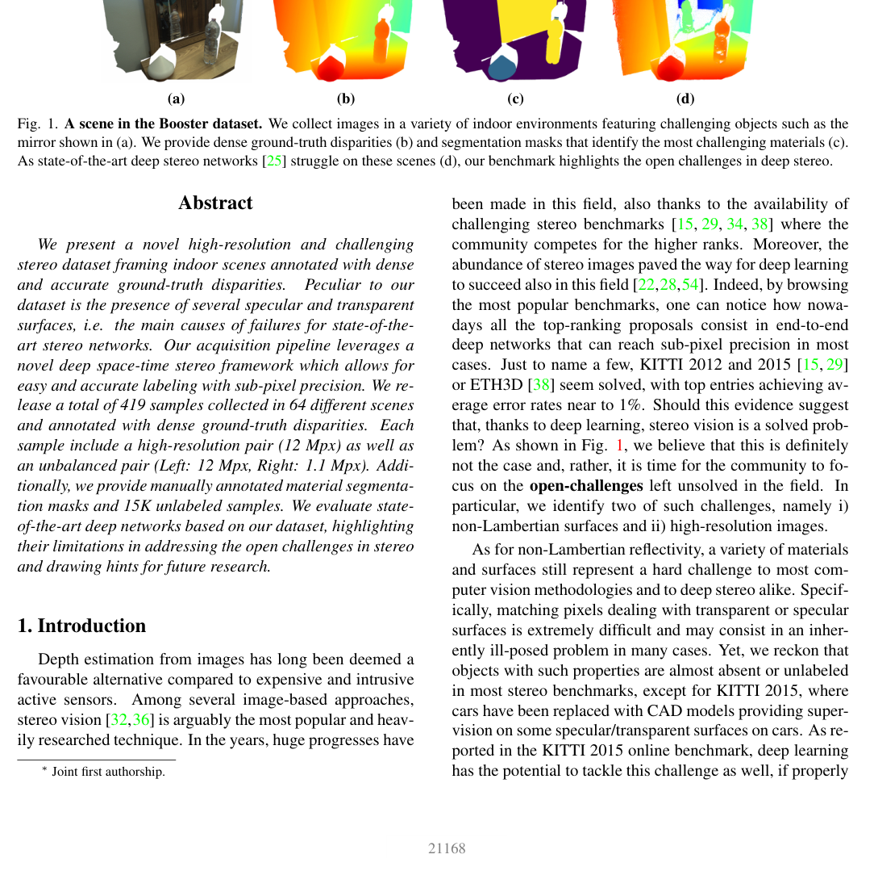

# Booster: Open Challenges in Deep Stereo — The Booster Dataset

**Authors:** Pierluigi Zama Ramirez, Fabio Tosi, Luigi Di Stefano, Radu Timofte, Alessio Tonioni, Matteo Poggi, Samuele Salti, Stefano Mattoccia (University of Bologna)
**Venue:** CVPR 2022
**Tier:** 2 (non-Lambertian surfaces benchmark)

---

## Dataset Overview

| Property | Value |
|----------|-------|
| **Scene type** | **Indoor scenes with transparent, reflective, and non-Lambertian objects** |
| **Size** | 85 scenes (53 train + 32 test, ~600 image pairs) |
| **Resolution** | 12MP (4112×3008) at full resolution |
| **GT acquisition** | Active stereo (Intel RealSense D455) + **structured light** calibration |
| **GT density** | Dense |
| **Unique features** | **Specifically targets non-Lambertian surfaces** (glass, mirrors, transparent plastics) |

## Main Challenges
**The hardest stereo benchmark for non-Lambertian surfaces:**
- **Transparent objects** (glass, plastic bottles, windows)
- **Mirrors and highly reflective surfaces**
- **Specular reflections** on polished metal
- **Glossy surfaces** that violate the brightness constancy assumption

**Stereo methods fundamentally fail on these surfaces** — photometric matching is meaningless when the surface doesn't have a consistent appearance across views. Ground truth is acquired via **active stereo with structured light** that CAN measure depth on transparent/reflective surfaces.

## Evaluation Metrics
- **bad-2 / bad-4 / bad-6 / bad-8:** error thresholds (bad-2 is primary)
- **EPE** and **RMS**
- **Per-class evaluation:** Class 0 (easy), Class 1, Class 2, Class 3 (most challenging transparent/reflective)

**Class 3 (transparent + reflective) is the hardest evaluation regime in stereo matching.**

## Role in the Ecosystem
**THE benchmark for non-Lambertian surface handling.** Published in 2022 by the University of Bologna group, Booster exposed that:
- **All existing stereo methods failed catastrophically** on transparent/reflective surfaces
- **Monocular depth methods** (Depth Anything) could actually handle these better
- **Motivated the foundation-model era** of stereo (DEFOM-Stereo, MonSter, Stereo Anywhere, D-FUSE, BridgeDepth)

**D-FUSE (ICCV 2025)** and **Stereo Anywhere (CVPR 2025)** explicitly target Booster as their primary improvement axis.

## Relevance to Our Edge Model
**High for robustness validation.** Non-Lambertian surfaces are common in real-world robotics (glass doors, windows, polished floors, metal surfaces). Our edge model should:
- **Report Booster numbers** — demonstrates non-Lambertian robustness
- **Target bad-2 All < 15%** (zero-shot) — would place us competitive with 2024-era methods
- **Leverage monocular priors** (via MPT distillation from DEFOM-Stereo) — essential for Booster performance

**Booster is the benchmark where pure stereo methods fail and monocular-augmented methods shine.** This is a direct argument for our edge model to include distilled monocular priors.
