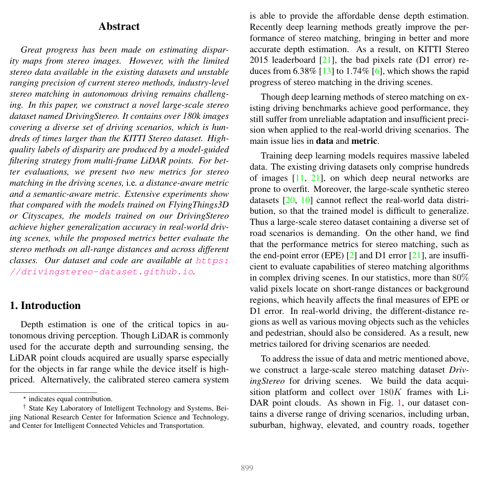

# DrivingStereo: A Large-Scale Dataset for Stereo Matching in Autonomous Driving Scenarios

**Authors:** Guorun Yang, Xiao Song, Chaoqin Huang, Zhidong Deng, Jianping Shi, Bolei Zhou
**Venue:** CVPR 2019
**Tier:** 2 (large-scale driving + weather variations)

---

## Dataset Overview

| Property | Value |
|----------|-------|
| **Scene type** | **Outdoor driving** (various Chinese cities) |
| **Size** | **182,000+ stereo pairs** (by far the largest driving stereo dataset) |
| **Resolution** | 1762×800 |
| **GT acquisition** | **Multi-frame LiDAR accumulation** for denser ground truth |
| **GT density** | Denser than KITTI (accumulated LiDAR) |
| **Unique features** | **Weather variations** (sunny, cloudy, foggy, rainy) |

## Main Challenges
- **Large-scale** — 500× larger than KITTI
- **Weather variations** — sunny, cloudy, foggy, rainy subsets for domain-shift evaluation
- **Night driving** conditions
- **Real-world driving** — traffic, pedestrians, diverse urban/suburban scenes
- **Accumulated LiDAR ground truth** provides denser supervision than single-scan KITTI

## Evaluation Metrics
- **EPE** (end-point error)
- **D1 metrics** (same as KITTI): D1-bg, D1-fg, D1-all
- **Per-weather evaluation:** sunny / cloudy / foggy / rainy subsets separately reported

## Role in the Ecosystem
**The largest driving stereo dataset by a wide margin.** Used for:
- **Large-scale training** — particularly effective for data-hungry methods (FoundationStereo, Stereo Anything)
- **Weather robustness evaluation** — the rainy/foggy subsets test methods' ability to handle adverse conditions
- **Cross-domain evaluation** — training on SceneFlow and testing on DrivingStereo is a standard zero-shot benchmark

**Pip-Stereo (CVPR 2026)** uses DrivingStereo for its headline zero-shot result showing non-iterative real-time methods catastrophically fail (HITNet: 93.52 D1-all) while Pip-Stereo achieves 4.35 D1-all at same latency.

## Relevance to Our Edge Model
**Critical for cross-domain robustness validation.** DrivingStereo is:
- **Directly aligned with target deployment** (autonomous driving / ADAS)
- **Weather variation testing** is essential for real-world edge deployment
- **Large-scale training resource** — should be part of our training data mix (following StereoAnything's approach)

**Pip-Stereo's finding is the critical insight:** non-iterative efficient methods (HITNet, LightStereo) score 13-93 D1-all on DrivingStereo weather subsets, while iterative methods score <10. **This is direct evidence that our edge model MUST preserve iterative refinement** (via Pip-Stereo's PIP compression) rather than switching to non-iterative efficiency.

**Target for our edge model:** DrivingStereo weather D1-all < 10% — competitive with Pip-Stereo at similar latency.
