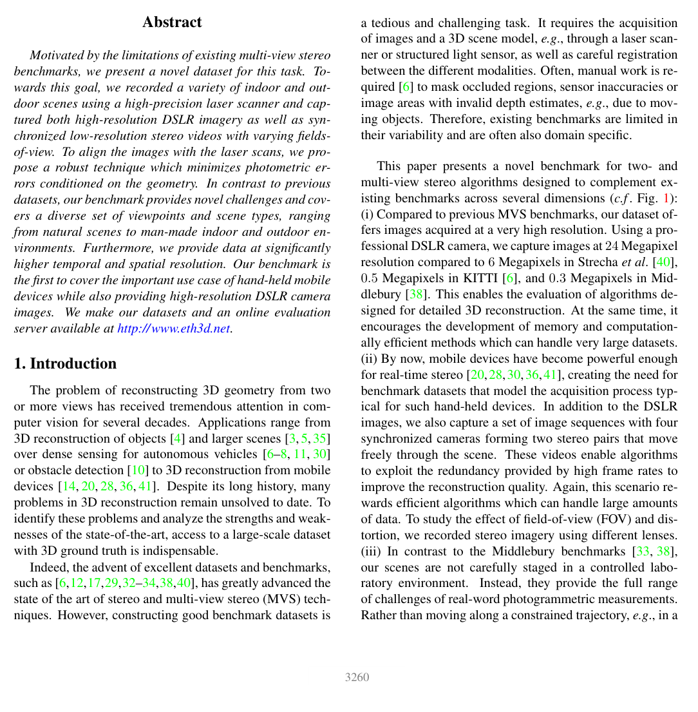

# ETH3D: A Multi-View Stereo Benchmark with High-Resolution Images and Multi-Camera Videos

**Authors:** Thomas Schöps, Johannes L. Schönberger, Silvano Galliani, Torsten Sattler et al. (ETH Zurich, Microsoft)
**Venue:** CVPR 2017
**Tier:** 2 (multi-view + two-view stereo benchmark)

---

## Dataset Overview

| Property | Value |
|----------|-------|
| **Scene type** | **Indoor + outdoor** — diverse high-res photography |
| **Size** | 47 stereo scenes (27 train + 20 test) |
| **Resolution** | **Grayscale** at up to 6048×4032 |
| **GT acquisition** | **Laser scanner** (Faro Focus 3D X330) |
| **GT density** | Dense (from laser scan) |
| **Unique features** | Grayscale-only, both two-view and multi-view tasks |

## Main Challenges
- **Grayscale images only** — no color cues, pure intensity matching
- **Mixed indoor/outdoor** — diverse scene types
- **High resolution** — most methods downsample
- **Small disparity range** — typically < 64 pixels (very different from KITTI)
- **Laser scan ground truth** — very accurate but sometimes sparse on fine structures
- **Reflective surfaces** (painted metal, polished wood)

## Evaluation Metrics
- **bad-0.5 / bad-1 / bad-2 / bad-4:** percentage of pixels with error > N pixels (uses even stricter thresholds than KITTI)
- **AvgErr:** average absolute disparity error
- **Two-view** and **multi-view** leaderboards

**bad-1 is the primary stereo metric** — same as Middlebury.

## Role in the Ecosystem
**Complementary to KITTI (driving) and Middlebury (indoor props)** — provides a third distinct distribution for cross-domain evaluation:
- **Grayscale** eliminates color-based shortcuts
- **Mixed scenes** (indoor/outdoor) tests generalization
- **Small disparity range** tests precision at subpixel level

The **Robust Vision Challenge (RVC)** uses ETH3D together with KITTI and Middlebury — methods must generalize across all three with a single model. **CFNet won RVC 2020** by explicitly targeting this cross-domain challenge.

## Relevance to Our Edge Model
**Key cross-domain test.** The small-disparity, grayscale distribution is **very different** from our target driving deployment but serves as:
- **A stress test** for overfitting to training distribution
- **Part of RVC evaluation** — our model should ideally target robustness across KITTI + Middlebury + ETH3D simultaneously
- **Small disparity range** means our model can use much lower disparity search budget here

**ETH3D is where foundation-model methods (DEFOM-Stereo, FoundationStereo, BridgeDepth) shine** — they achieve bad-1 < 1% because mono priors help in these scenes. A competitive edge model should target **bad-1 < 3%** zero-shot.
