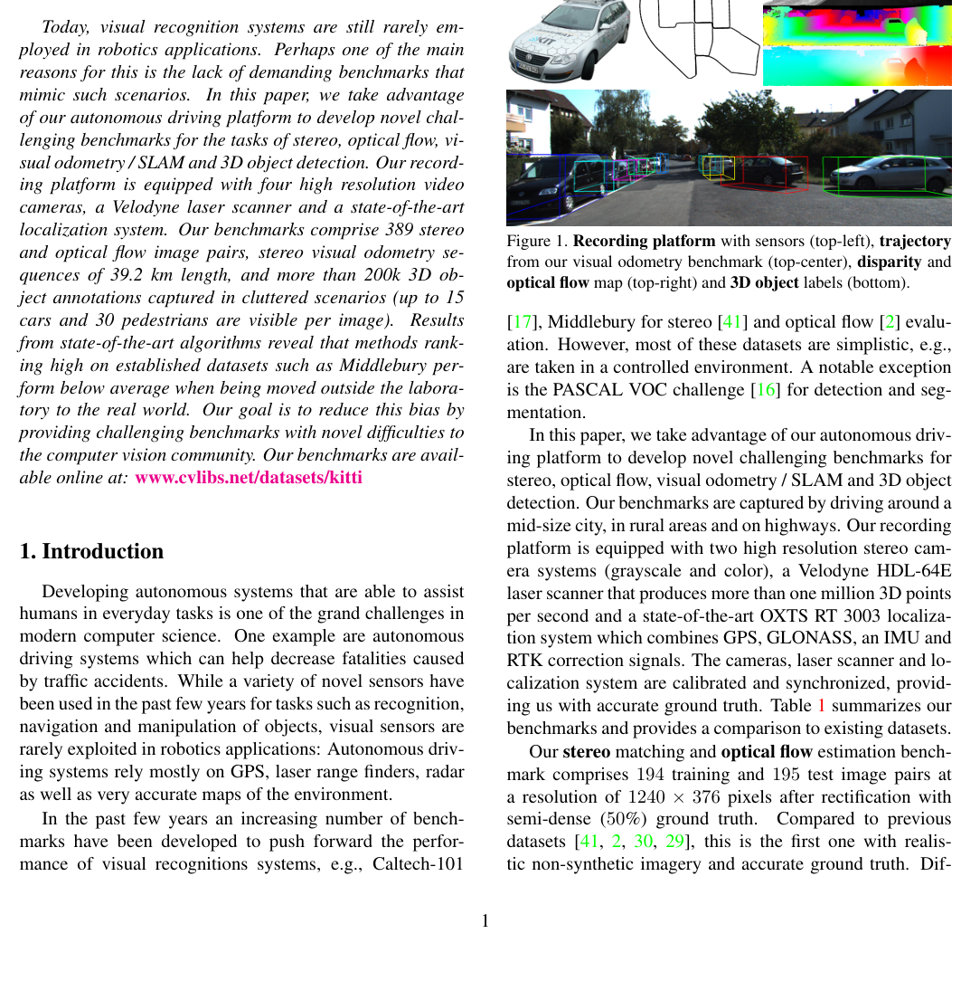

# KITTI 2012: Are We Ready for Autonomous Driving? The KITTI Vision Benchmark Suite

**Authors:** Andreas Geiger, Philip Lenz, Raquel Urtasun (Karlsruhe Institute of Technology, Toyota Technological Institute)
**Venue:** CVPR 2012
**Tier:** 2 (THE foundational driving stereo benchmark)

---

## Dataset Overview

| Property | Value |
|----------|-------|
| **Scene type** | Outdoor driving (Karlsruhe, Germany) |
| **Size** | 194 training + 195 testing image pairs |
| **Resolution** | 1242×375 |
| **Sensor** | Stereo rig on top of a vehicle |
| **GT acquisition** | **Velodyne LiDAR** projected onto stereo images |
| **GT density** | **Sparse** (~50% of pixels have ground truth) |
| **Outdoor / Indoor** | Outdoor only |

## Main Challenges
- **Outdoor driving conditions** with natural illumination variation, shadows, reflections
- **Large depth range** — from nearby vehicles (large disparity) to distant buildings (small disparity)
- **Sparse LiDAR ground truth** — no dense depth on vehicles, sky, or textureless regions
- **Dynamic scenes** — moving vehicles, pedestrians

## Evaluation Metrics
- **bad-2 / bad-3 / bad-4 / bad-5:** percentage of pixels with error > N pixels
- **Out-Noc (non-occluded):** error rate in non-occluded regions
- **Out-All:** error rate in all regions
- **EPE (End-Point Error):** average absolute disparity error

Split into "Noc" (non-occluded) and "All" (including occlusions) subsets.

## Role in the Ecosystem
**THE canonical outdoor stereo benchmark for 13+ years.** Every stereo paper reports KITTI 2012 numbers. The sparse LiDAR ground truth and challenging outdoor conditions make it particularly useful for evaluating robustness to:
- Reflections (car windshields)
- Thin structures (signs, poles)
- Large disparity jumps (car boundaries)

## Relevance to Our Edge Model
**Mandatory benchmark.** Our edge model must report KITTI 2012 numbers for comparison with all prior work. The driving scene distribution is also directly relevant to the target deployment scenario (autonomous driving / ADAS).
