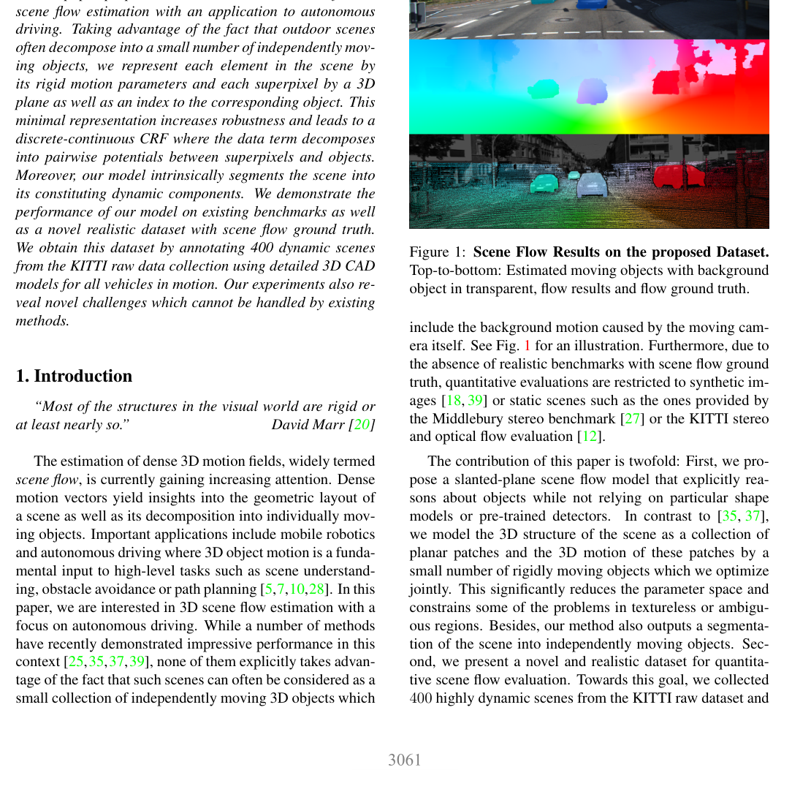

# KITTI 2015: Object Scene Flow for Autonomous Vehicles

**Authors:** Moritz Menze, Andreas Geiger (KIT, MPI Intelligent Systems)
**Venue:** CVPR 2015
**Tier:** 2 (updated KITTI with dynamic objects + denser GT)

---

## Dataset Overview

| Property | Value |
|----------|-------|
| **Scene type** | Outdoor driving with **moving objects** |
| **Size** | 200 training + 200 testing image pairs |
| **Resolution** | 1242×375 |
| **Sensor** | Stereo rig + LiDAR |
| **GT acquisition** | LiDAR + **fitted 3D CAD models** on moving vehicles |
| **GT density** | **Denser than KITTI 2012** — dense on vehicles via CAD model fitting |
| **Unique feature** | **Scene flow ground truth** (disparity + optical flow) |

## Main Challenges
- **Dynamic objects** — moving vehicles with fitted 3D CAD models provide dense disparity on objects
- **Reflective surfaces** (car windshields, painted metal) — notoriously difficult
- **Large disparity range** in outdoor driving
- **Diverse weather and lighting** (compared to KITTI 2012 which is sunnier)

## Evaluation Metrics
- **D1-all:** percentage of erroneous pixels (all regions), error > 3 px AND > 5% of ground truth
- **D1-bg:** D1 in background (static scene)
- **D1-fg:** D1 in foreground (moving vehicles)
- **D1-noc:** non-occluded only

**KITTI 2015's D1 metric is the single most cited benchmark number in stereo matching.**

## Role in the Ecosystem
**THE primary stereo benchmark for autonomous driving research.** Every published stereo paper reports KITTI 2015 D1-all. The foreground/background split is particularly useful:
- **D1-bg:** tests texture and shadow handling
- **D1-fg:** tests reflective surfaces and fine object details

The CAD-model-fitted dense ground truth on vehicles is particularly valuable for evaluating:
- Reflective windshield handling
- Object boundary preservation
- Thin structures (bumpers, spoilers)

## Relevance to Our Edge Model
**THE most important benchmark for our edge model.** Target:
- **KITTI 2015 D1-all < 2.0%** (competitive with real-time methods)
- **D1-fg < 3.5%** (robust to reflective surfaces)
- **Inference time < 33ms** on Jetson Orin Nano

Our model **must** report KITTI 2015 numbers. The driving scene distribution directly matches the primary deployment target (ADAS, robotics).
