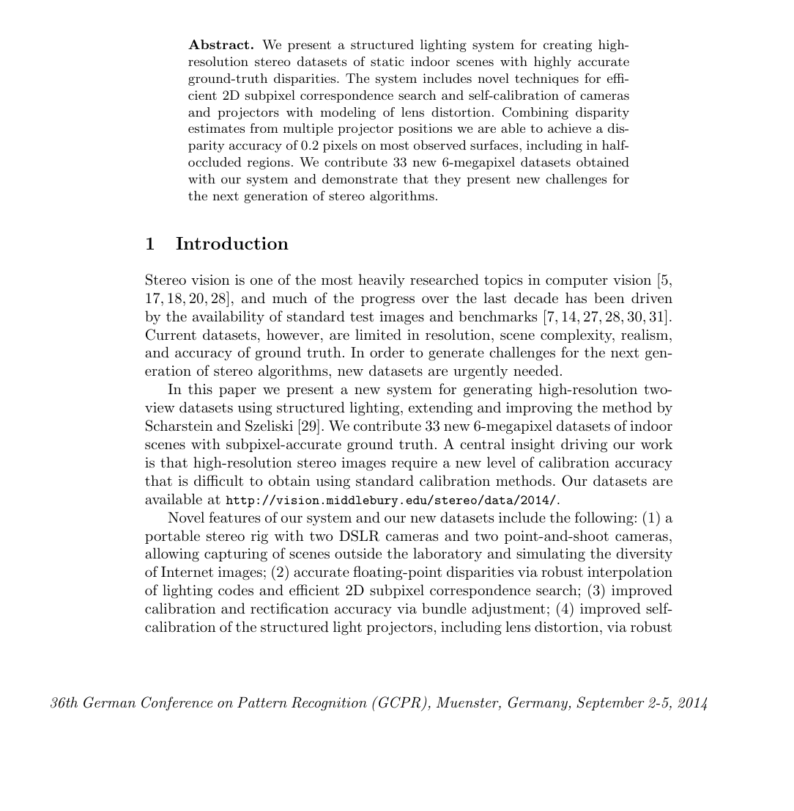

# Middlebury v3: High-Resolution Stereo Datasets with Subpixel-Accurate Ground Truth

**Authors:** Daniel Scharstein, Heiko Hirschmüller, York Kitajima et al.
**Venue:** GCPR 2014
**Tier:** 2 (the gold-standard indoor benchmark)

---

## Dataset Overview

| Property | Value |
|----------|-------|
| **Scene type** | Indoor (controlled scenes with props, tools, figurines) |
| **Size** | ~30 training + 15 testing scenes |
| **Resolution** | **Up to 6 megapixels** (full-res 3000×2000+) |
| **GT acquisition** | **Structured light** (multi-pattern projection) |
| **GT density** | **Dense, subpixel-accurate** (~1/8 pixel precision) |
| **Disparity range** | **Very large** — up to 800+ pixels at full resolution |

## Main Challenges
- **Very high resolution** — most methods can only process at quarter or half resolution
- **Large disparity range** — up to 800 pixels makes fixed-disparity-range methods fail
- **Fine details** — thin structures, textured objects, complex geometries
- **Textureless regions** — walls, floors, uniform surfaces
- **Reflective and specular surfaces** — notoriously difficult
- **Indoor-only** — very different distribution from driving scenes

## Evaluation Metrics
- **bad-0.5 / bad-1 / bad-2 / bad-4:** percentage of pixels with error > N pixels (much stricter than KITTI)
- **AvgErr:** average absolute disparity error
- **RMS:** root mean squared error
- **Non-occluded (Noc)** vs **All** subsets

**Middlebury uses bad-1 as the primary metric** — much stricter than KITTI's 3-pixel threshold.

## Role in the Ecosystem
**THE gold standard for stereo matching precision and cross-domain generalization.** Training on KITTI/SceneFlow and testing on Middlebury is the most common zero-shot generalization benchmark. Known for:
- **Catching methods that overfit to KITTI's sparse LiDAR ground truth**
- **Exposing failures on large disparity ranges** (IGEV++'s multi-range motivation)
- **Revealing fine-detail handling** (thin structures, edges)

**RAFT-Stereo was the first method** to process full-resolution Middlebury without downsampling — IGEV++ and DEFOM-Stereo are the current leaders.

## Relevance to Our Edge Model
**Critical for cross-domain evaluation.** Our edge model must generalize from training (Scene Flow) to Middlebury without finetuning. Target:
- **bad-2 All < 10%** (zero-shot) would place us in the top tier
- **Must handle quarter-resolution at minimum** (full-res may be too expensive for edge)
- **Indoor distribution** tests whether our model overfits to outdoor driving

The large-disparity challenge is a key driver for our architecture choice — we cannot use fixed-disparity-range methods.
