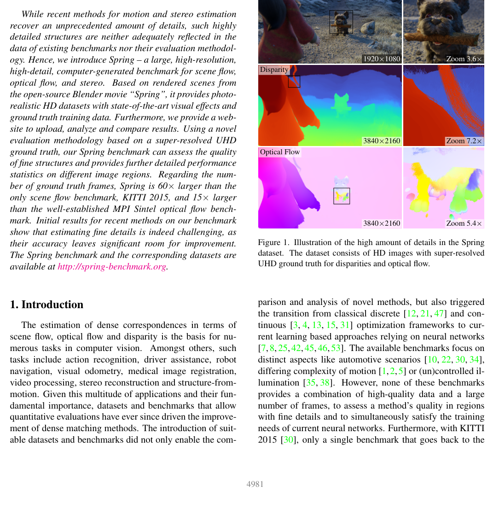

# Spring: A High-Resolution, High-Detail Dataset and Benchmark for Scene Flow, Optical Flow, and Stereo

**Authors:** Lukas Mehl, Jenny Schmalfuss, Azin Jahedi, Yaroslava Nalivayko, Andrés Bruhn (University of Stuttgart)
**Venue:** CVPR 2023
**Tier:** 2 (modern high-resolution synthetic benchmark)

---

## Dataset Overview

| Property | Value |
|----------|-------|
| **Scene type** | **Synthetic** — rendered from a Blender animated movie ("Spring") |
| **Size** | 6000 stereo frames (5000 train + 1000 test) |
| **Resolution** | **1920×1080** (true 2K) |
| **GT acquisition** | **Synthetic rendering** — perfect ground truth |
| **GT density** | Dense |
| **Unique features** | **Highest-resolution** synthetic benchmark, animated scenes |

## Main Challenges
- **2K resolution** — most methods cannot process full-res
- **Animated scenes** with diverse content (outdoor fantasy environments, creatures, water, foliage)
- **Fine details** — fur, grass, leaves, thin structures
- **Large disparity range**
- **Photorealistic rendering** but still synthetic
- **Scene flow + optical flow + stereo** — joint task evaluation

## Evaluation Metrics
- **EPE (end-point error)** for disparity
- **Outlier rate** at various thresholds
- **Scene flow metrics** (disparity + optical flow jointly)
- **Multiple evaluation subsets**: low-detail, high-detail, sky, non-rigid, unmatched regions

## Role in the Ecosystem
**The modern successor to Scene Flow** — much higher resolution and more visually diverse. Designed to:
- **Stress-test high-resolution stereo methods**
- **Provide fine-detail evaluation** (catches methods that blur edges)
- **Enable scene flow joint evaluation** (stereo + optical flow)

At publication (2023), almost no methods could process Spring at full resolution — RAFT-Stereo was one of the first capable of it.

## Relevance to Our Edge Model
**Mid-priority evaluation.** Spring is:
- **Too high-resolution** for typical edge deployment (edge models work at 320×640 to 640×480)
- **Still useful** as a diversity stress test for generalization
- **Scene flow capability** is relevant if our edge model needs joint stereo + flow for ADAS

**Not a primary target** but our model should ideally report Spring numbers for completeness. If we process at half resolution (960×540), the targets would be competitive with desktop methods.
