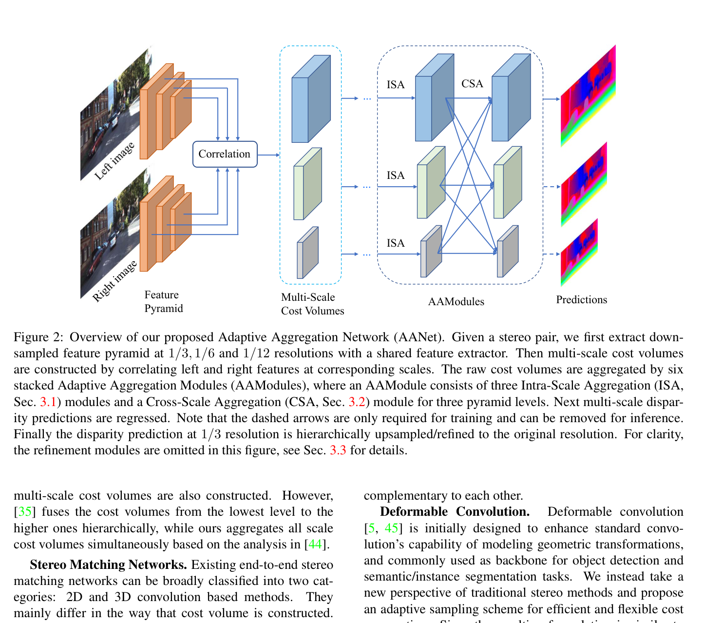
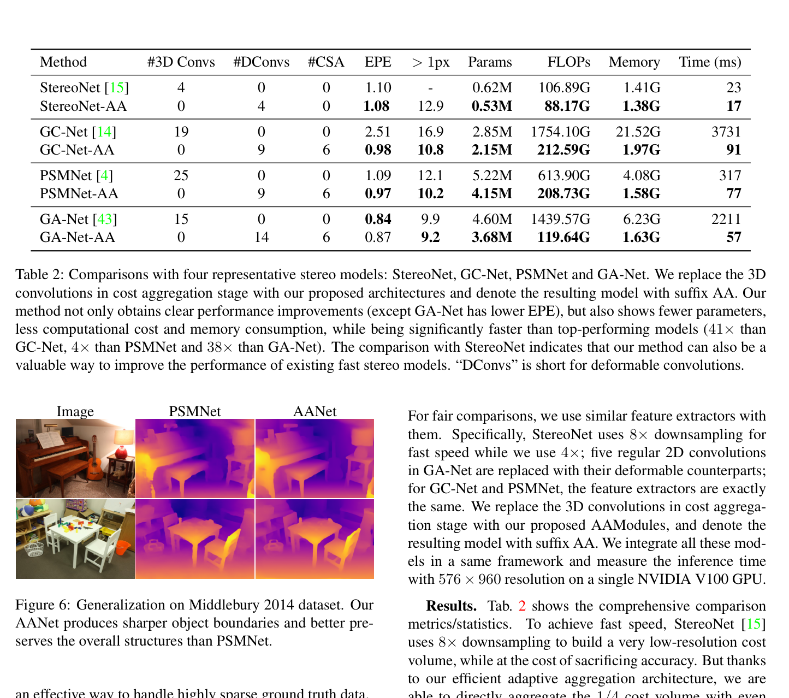

# AANet: Adaptive Aggregation Network for Efficient Stereo Matching

**Authors:** Haofei Xu, Juyong Zhang (USTC)
**Venue:** CVPR 2020
**Tier:** 2 (proved 3D convolutions are not necessary — 4-41× speedup over PSMNet/GANet)

---

## Core Idea
**Completely replace 3D convolutions** in cost aggregation with two lightweight, complementary modules:
- **Intra-Scale Aggregation (ISA):** deformable conv for adaptive sampling
- **Cross-Scale Aggregation (CSA):** HRNet-style multi-scale fusion

Achieves comparable accuracy to PSMNet/GC-Net/GA-Net at **4-41× faster speed**.

## Architecture Highlights
- **ResNet-like 40-layer feature extractor** with 6 regular 2D convolutions replaced by **deformable counterparts**
- **Feature Pyramid Network (FPN)** outputs pyramids at 1/3, 1/6, 1/12 resolutions
- **Multi-scale 3D correlation volumes** (DispNet-C-style inner product) at each pyramid scale
- **Intra-Scale Aggregation (ISA):** bottleneck-style (1×1, deformable 3×3, 1×1) — deformable conv adaptively samples 9 points from cost volume, learns offsets + modulation weights → addresses edge-fattening at discontinuities
- **Cross-Scale Aggregation (CSA):** HRNet-inspired, builds multi-scale cost volume interactions simultaneously (NOT coarse-to-fine) → addresses textureless regions
- **6 stacked AAModules** (each = 3 ISA + 1 CSA); first 3 use regular 2D convs
- **Two StereoDRNet refinement modules** to upsample 1/3 disparity to full res

## Main Innovation
**Proved that heavy 3D convolutions are not necessary.** The deformable conv for ISA allows **content-aware sampling** that respects object boundaries (sampling points cluster within the same depth layer), while CSA handles textureless areas through cross-scale information exchange without any 3D operations.

**Computational breakthrough:** A deformable conv layer costs **< 1/130** of a 3D conv layer. Also introduced **pseudo ground-truth supervision** (using pretrained GA-Net to densify sparse KITTI ground truth) — became influential training trick.

## Benchmark Numbers
| Method | Scene Flow EPE | KITTI 2015 D1-all | Runtime |
|--------|---------------|-------------------|---------|
| GC-Net | 2.51 | 2.87% | 900ms |
| PSMNet | 1.09 | 2.32% | 410ms |
| GA-Net-deep | 0.84 | 1.93% | 1500ms |
| **AANet** | 0.87 | 2.55% | **62ms** |
| **AANet★** | 0.83 | **2.24%** | 142ms |

**Speed vs 3D-conv replacements:** 41× faster than GC-Net, 4× faster than PSMNet, 38× faster than GA-Net at comparable or better accuracy.

## Historical Significance
**Demonstrated convincingly that the "3D conv bottleneck" was an architectural choice, not a necessity.** Unlocked real-time stereo without sacrificing much accuracy. Popularized:
- **Deformable convolutions** for stereo cost aggregation
- **Parallel multi-scale aggregation** (vs coarse-to-fine cascades)
- **Pseudo-GT supervision** for sparse KITTI labels

## Relevance to Edge Stereo
**Directly relevant and high priority.**
- **AANet's ISA + CSA modules are a ready blueprint** for edge-efficient aggregation
- At 62ms on server GPU, AANet-style aggregation (no 3D conv at all) would likely run **<100ms on Jetson Orin Nano**
- The **multi-scale correlation volume** approach (avoiding 4D concatenation) aligns perfectly with edge deployment constraints
- **ACVNet explicitly benchmarks against AANet+** and achieves better accuracy at similar speed, suggesting the ISA/CSA approach can be further improved with attention filtering

## Connections
| Paper | Relationship |
|-------|-------------|
| **GC-Net / PSMNet / GA-Net** | The 3D-conv baselines AANet replaces with deformable 2D |
| **HRNet** | Inspired the CSA multi-scale fusion pattern |
| **Deformable ConvNets** | Core operation used in ISA |
| **ACVNet** | Direct successor — adds attention filtering on top of AANet-style cost volume |
| **LightStereo, BANet** | Continue the "eliminate 3D convs" direction with different techniques |
| **CREStereo** | Uses deformable search in its correlation layer (related concept) |
