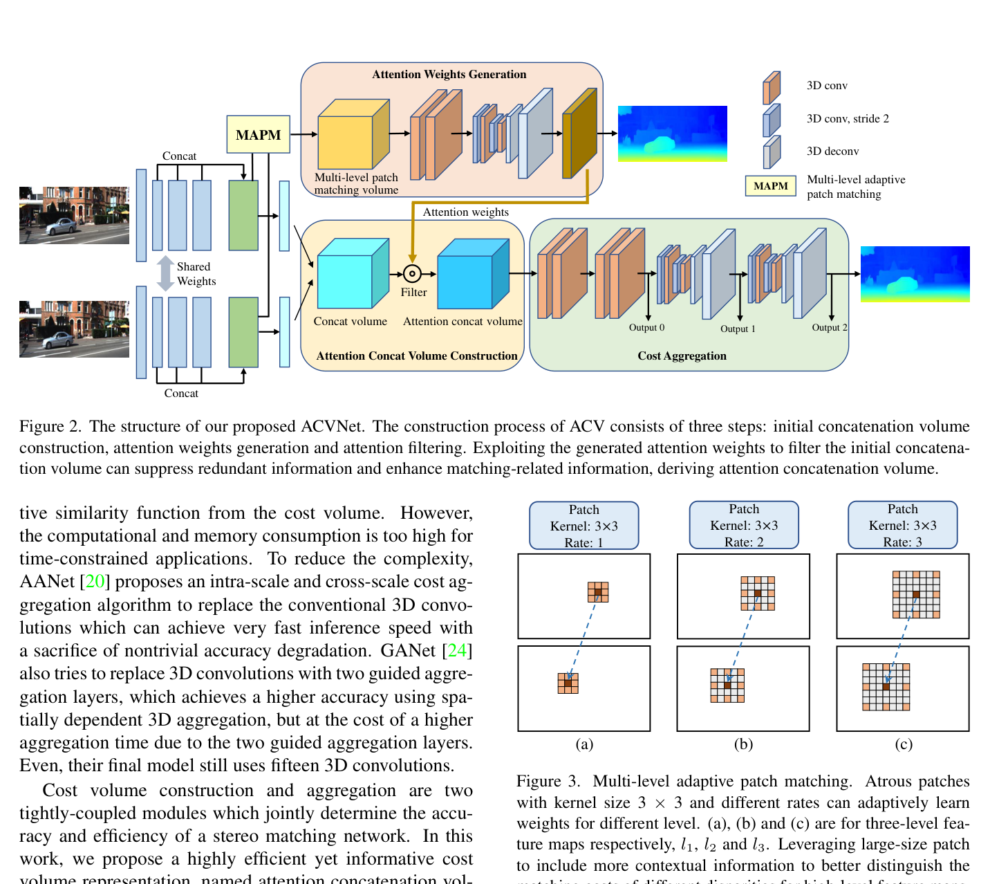
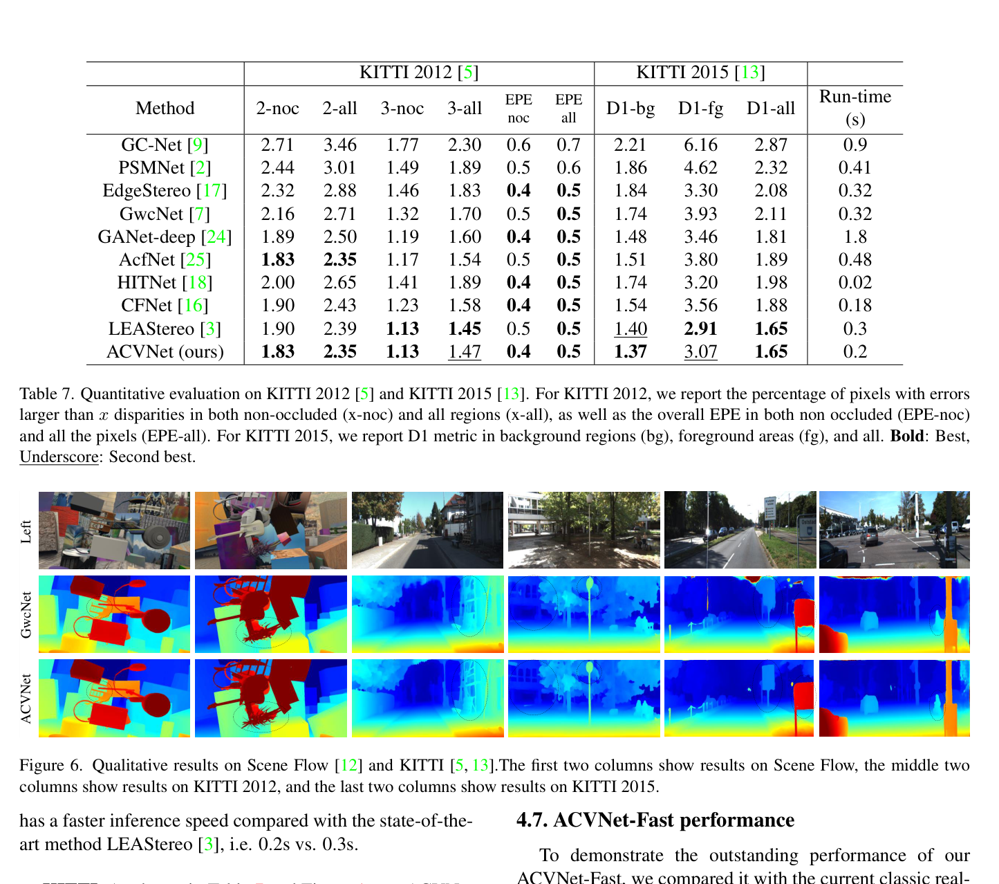

# ACVNet: Attention Concatenation Volume for Accurate and Efficient Stereo Matching

**Authors:** Gangwei Xu, Junda Cheng, Peng Guo, Xin Yang (HUST)
**Venue:** CVPR 2022
**Tier:** 2 (the culmination of the 3D cost volume era)

---

## Core Idea
Use a **correlation-derived attention map to filter a concatenation volume** — suppressing redundant information in the 4D cost volume so the subsequent aggregation network can be dramatically lighter. Achieves higher accuracy than GwcNet with **1/25 of aggregation parameters**.

## Architecture Highlights
- **Three-level ResNet feature extractor** producing 320-channel features for attention generation; compressed to 32 channels for concatenation volume
- **Multi-level Adaptive Patch Matching (MAPM):** atrous 3×3 patches with rates 1, 2, 3 at three feature levels; 40 groups (GwcNet-style) with adaptive per-pixel patch weights → matching volume
- **Attention weights generation:** matching volume → 2 × 3D conv + 3D hourglass → compressed to 1-channel 4D volume **A** via sigmoid, **directly supervised with GT disparity** (smooth L1)
- **Attention filtering:** element-wise product of A with each channel of the concatenation volume → **Attention Concatenation Volume (ACV)**
- **Cost aggregation:** pre-hourglass (4 × 3D conv) + 2 stacked 3D hourglass networks
- **ACVNet-Fast variant:** attention at 1/8 resolution + 6 disparity hypotheses near predicted disparity + sparse ACV at 1/2 resolution

## Main Innovation
**Resolves the correlation-vs-concatenation trade-off that had been open since GC-Net (2017):**
- **Concatenation volumes:** rich content but need expensive 3D aggregation to learn similarity from scratch
- **Correlation volumes:** measure similarity efficiently but lose content
- **GWCNet's fix:** concatenate both (still expensive)
- **ACVNet's fix:** use correlation signal as an **attention gate** on the concatenation volume — each disparity slice of the concatenation volume is multiplicatively weighted by learned attention scores

**Informationally prunes the 4D volume before aggregation** → a much shallower aggregation network suffices. Remarkably, the model with **zero hourglass networks (Gwc-acv-0) still outperforms the full GwcNet (3 hourglasses)**, proving the ACV alone carries most of the discriminative power. MAPM further strengthens the attention signal in textureless regions.

## Benchmark Numbers
| Dataset | ACVNet | ACVNet-Fast |
|---------|--------|-------------|
| Scene Flow EPE | **0.48** | 0.77 |
| KITTI 2012 3-noc | **1.13%** | — |
| KITTI 2015 D1-all | **1.65%** | 2.34% |
| ETH3D bad 1.0 | **2.58%** | — |
| Runtime | 0.2s | **48ms** |

**Plug-in gains (applying ACV to other networks):**
- PSMNet + ACV: D1 reduces from 3.89% → **2.17%** (42% improvement)
- GwcNet + ACV: D1 reduces from 2.71% → **1.55%** (39% improvement)

**Only method in top-5 across all four benchmarks simultaneously.**

## Historical Significance
**The most complete consolidation of the 3D cost-volume era.** Cleanly solves the correlation-vs-concatenation trade-off. Achieves top-3 across **all four major benchmarks simultaneously** (a first). Introduces a drop-in module (ACV) that improves any concatenation-based network. **Represents the performance ceiling of the pre-iterative, non-transformer 3D CNN paradigm.**

## Relevance to Edge Stereo
**High.**
- **ACV module is directly applicable** to edge design — the attention filtering reduces the burden on aggregation
- **ACVNet-Fast (48ms on server GPU)** is a strong baseline for an edge-efficient variant
- **Sparse hypothesis sampling** (6 hypotheses around predicted disparity) is analogous to iterative refinement but computationally cheaper
- The **MAPM adaptive patch matching** provides textureless-region robustness without a heavy transformer
- For our edge model: **ACV plug-in could combine with a lightweight backbone** (MobileNetV4, EfficientViT) to achieve target efficiency while retaining ACVNet's accuracy insights

## Connections
| Paper | Relationship |
|-------|-------------|
| **GC-Net, PSMNet** | Concatenation volume baselines that ACVNet can enhance |
| **GwcNet** | Direct predecessor — ACVNet resolves the group-wise correlation + concat trade-off differently |
| **AANet** | Compared baseline for ACVNet-Fast |
| **IGEV-Stereo** | Successor — uses group-wise correlation + 3D UNet (GEV), similar philosophy |
| **LightStereo, BANet** | Alternative efficient aggregation approaches |
| **Fast-FoundationStereo** | Distillation from large teacher — ACVNet's efficiency lessons relevant |
