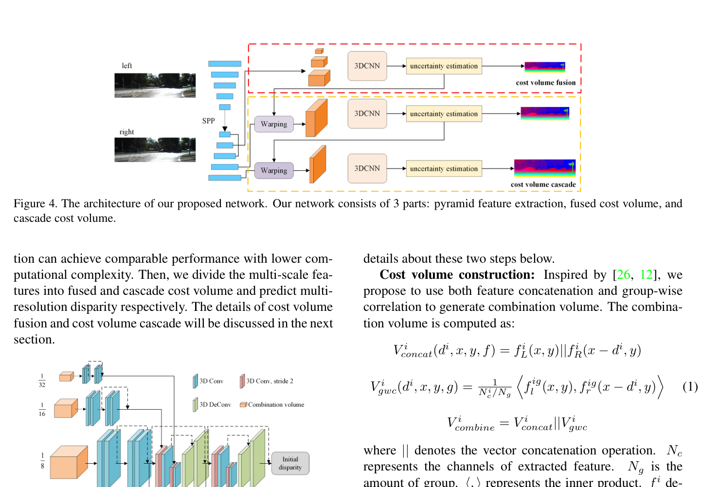
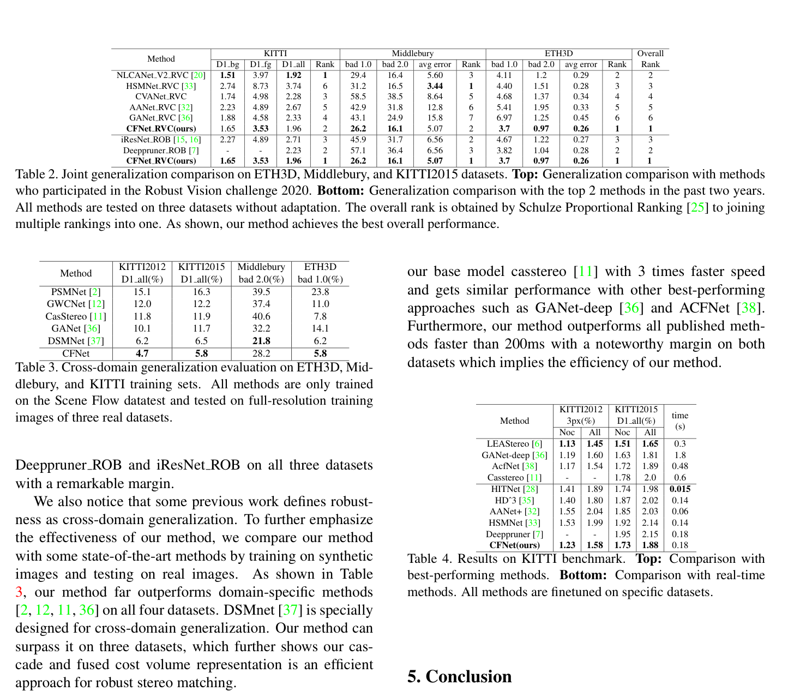

# CFNet: Cascade and Fused Cost Volume for Robust Stereo Matching

**Authors:** Zhelun Shen, Yuchao Dai, Zhibo Rao (NPU / Peking University)
**Venue:** CVPR 2021
**Tier:** 2 (transition paper from accuracy to cross-domain generalization)

---

## Core Idea
Addresses the cross-domain generalization failure of 3D cost volume networks through two complementary mechanisms: a **fused cost volume** (multi-scale low-resolution volumes fused) for robust initial estimation, and a **cascade cost volume with variance-based uncertainty** to adaptively narrow the disparity search range across datasets with wildly different disparity distributions.

## Architecture Highlights
- **Siamese U-Net feature extractor** with 5 residual blocks + SPP module (similar to HSMNet)
- **Fused cost volume:** three low-resolution combination volumes (scales 3/4/5, all below 1/8 of input) each using concatenation + group-wise correlation; fused via 3D encoder-decoder → initial disparity $D_3$
- **Variance-based uncertainty:** $U_i = \sum_d [(d - \hat{d})^2 \cdot \text{softmax}(-c_d)]$ — measures multimodality of the cost distribution; high uncertainty = unreliable pixel
- **Cascade cost volume:** given $D_3$ and $U_3$, computes per-pixel disparity search range $[d_{min}, d_{max}]$ using learned scaling of $\sqrt{U}$; sparse high-resolution cost volumes at stages 2 and 1 via warping
- **Three-stage coarse-to-fine refinement** with intermediate supervision

## Main Innovation
**Prior networks fail cross-domain for two separable reasons:**
1. **Limited receptive field** → features are domain-specific. Fused low-resolution volumes capture global/structural invariants across scene types.
2. **Fixed maximum disparity at training time** → cannot cover different disparity ranges across datasets. Cascade with uncertainty-adaptive search space solves this.

**Elegant uncertainty measure:** $U_i$ equals zero for a perfectly unimodal cost distribution and grows with multimodality — directly quantifies confidence without any auxiliary head. Regions with high uncertainty (occlusions, textureless areas) receive **wider search ranges** at the next stage.

**Won 1st place at Robust Vision Challenge 2020** by generalizing simultaneously to KITTI, Middlebury, and ETH3D with a single model.

## Benchmark Numbers
| Metric | Value |
|--------|-------|
| **KITTI 2015 D1-all** (finetuned) | 1.88% |
| **KITTI 2012 3-px All** | 1.58% |
| Runtime | 0.18s (best under 200ms among published) |

**Cross-domain (trained on SceneFlow only):**

| Test dataset | CFNet | PSMNet |
|--------------|-------|--------|
| KITTI 2015 D1-all | **5.8%** | 16.3% |
| ETH3D bad1.0 | **5.8%** | 23.8% |
| Middlebury bad2.0 | **28.2%** | 39.5% |

## Historical Significance
**Marks the transition from domain-specific performance racing (KITTI leaderboard) to generalization as a first-class objective.** Its cascade cost volume framework directly anticipates the RAFT-Stereo family's iterative refinement paradigm — both progressively narrow the search space, though RAFT uses recurrent GRUs rather than explicit cascade stages. The uncertainty-guided search range is conceptually similar to confidence-based iteration weighting in IGEV-Stereo and Selective-Stereo.

## Relevance to Edge Stereo
**Highly relevant** in two ways:
1. **Efficient pyramid feature extractor** (U-Net style, no heavy ResNet) achieves PSMNet-level accuracy at lower compute
2. **Cascade paradigm** (coarse cheap estimation → targeted fine-grained search) is the right approach for edge devices where running a full-resolution cost volume at maximum disparity is prohibitive
3. **Uncertainty mechanism** provides a natural basis for confidence-gated early exit — skipping further refinement for already-confident pixels

## Connections
| Paper | Relationship |
|-------|-------------|
| **PSMNet** | Baseline with domain-specific failure that CFNet fixes |
| **HSMNet** | Inspired the U-Net feature extractor |
| **RAFT-Stereo** | CFNet's cascade anticipates RAFT's iterative refinement |
| **IGEV-Stereo** | Uses CFNet's uncertainty/variance concept in different form |
| **UCFNet** | Direct successor that extends CFNet's uncertainty mechanism |
