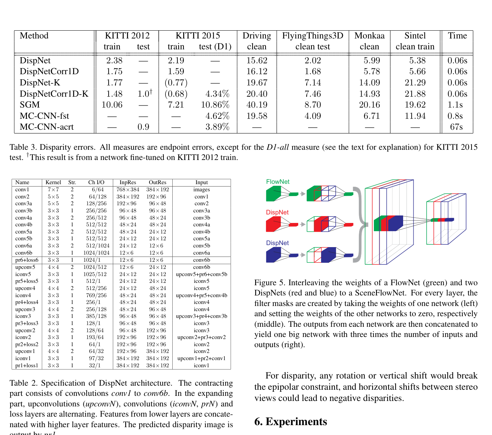
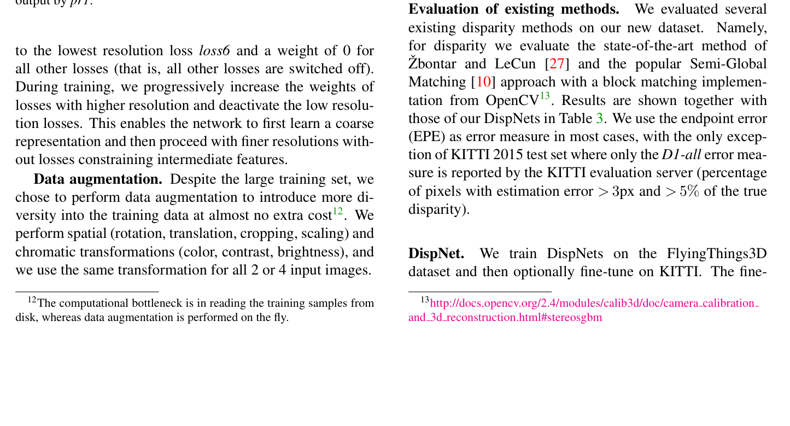

# DispNet-C: A Large Dataset to Train Convolutional Networks for Disparity, Optical Flow, and Scene Flow Estimation

**Authors:** Nikolaus Mayer, Eddy Ilg, Philip Hausser, Philipp Fischer, Daniel Cremers, Alexey Dosovitskiy, Thomas Brox (Freiburg / TUM)
**Venue:** CVPR 2016
**Tier:** 2 (the first end-to-end 2D stereo network + introduced SceneFlow dataset)

---

## Core Idea
**Dual contribution:** (1) Introduced the **SceneFlow synthetic dataset** (FlyingThings3D, Monkaa, Driving) — 35K+ stereo pairs with dense ground-truth disparity that became the universal pretraining set. (2) Introduced **DispNet-C**, the first end-to-end CNN for disparity estimation — fully differentiable from image pair to disparity map, orders of magnitude faster than MC-CNN.

## Architecture Highlights
- **Encoder-decoder with skip connections** (adapted from FlowNet): contracting path of strided convolutions (conv1-conv6, 64× downsampling) + expanding path of upconvolutions
- **DispNet (basic):** single U-Net-like encoder-decoder on concatenated stereo pair, 26 layers
- **DispNet-C (correlation variant):** the two images are processed separately through shared conv1/conv2, then a **1D horizontal correlation layer** computes similarities up to ±40 px (160 px input), yielding a compact 3D cost volume $(D \times H/4 \times W/4)$
- **Multi-scale supervision:** 6 disparity predictions at decreasing resolutions (pr6 → pr1), loss weights scheduled coarse-to-fine
- **Smoother output:** additional convolutions between upconvolutions (key distinction from FlowNet)

## Main Innovation
**The 1D correlation layer for stereo** — computes dot-product feature similarities along the horizontal epipolar line for all disparity hypotheses. Produces a compact 3D cost volume that feeds the decoder. This was **~1000× faster than MC-CNN** at comparable or better accuracy, enabling true real-time inference (0.06s, ~15 fps on Titan X).

The **SceneFlow dataset** was equally important: 35,454 stereo pairs with dense ground truth for disparity, optical flow, and disparity change. Became the de facto pretraining benchmark for the **entire field for nearly a decade**.

## Benchmark Numbers
| Metric | DispNet | DispNet-C | DispNet-C (KITTI FT) |
|--------|---------|-----------|----------------------|
| KITTI 2012 EPE (train) | 2.38 | 1.75 | — |
| KITTI 2012 EPE (test) | — | — | **1.00** |
| KITTI 2015 D1-all | — | — | **4.34%** |
| FlyingThings3D EPE | 2.02 | 1.68 | — |
| Runtime | — | **0.06s (~15 FPS)** | — |

## Historical Significance
**The first fully end-to-end trainable stereo network** — abolished SGM post-processing and demonstrated that a single network could learn the entire correspondence problem. Together with the SceneFlow dataset, this paper:
- Defined the **SceneFlow pretrain → KITTI finetune** paradigm still standard in 2025
- Enabled the shift from patch-comparison to full-image processing
- Made real-time stereo feasible

Every subsequent stereo paper (RAFT-Stereo, IGEV, DEFOM-Stereo) **pretrains on SceneFlow**.

## Relevance to Edge Stereo
**Very high.** The DispNet-C correlation volume is the conceptual predecessor of **all modern correlation-based cost volumes** (including RAFT-Stereo, AANet, ACVNet-Fast). Its encoder-decoder with skip connections is the template for lightweight stereo encoders. For edge models:
- **1D correlation** (avoiding expensive 4D concatenation volumes) is the dominant paradigm in fast networks (AANet, BGNet, Fast-ACVNet, LightStereo)
- SceneFlow remains the universal **pretraining dataset** — our edge model should use it

## Connections
| Paper | Relationship |
|-------|-------------|
| **FlowNet** | Direct inspiration — DispNet-C adapts FlowNet's correlation layer for 1D stereo |
| **MC-CNN** | Direct competitor — DispNet-C is 1000× faster at comparable accuracy |
| **GC-Net** | Used concatenation volume instead (more expensive but more accurate) |
| **RAFT-Stereo** | Still uses 1D correlation (now all-pairs instead of local) |
| **AANet, BGNet, LightStereo** | All use DispNet-C-style correlation volumes |
| **Every stereo paper** | Pretrains on SceneFlow introduced here |
