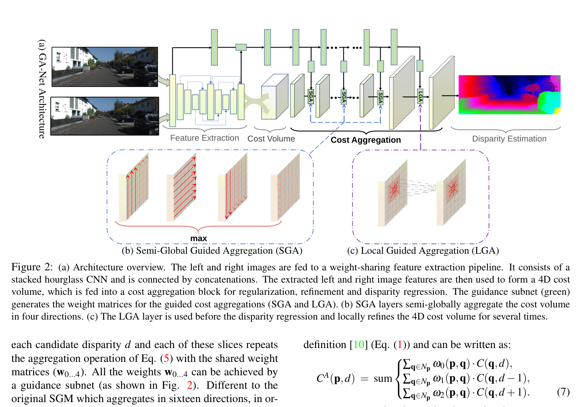
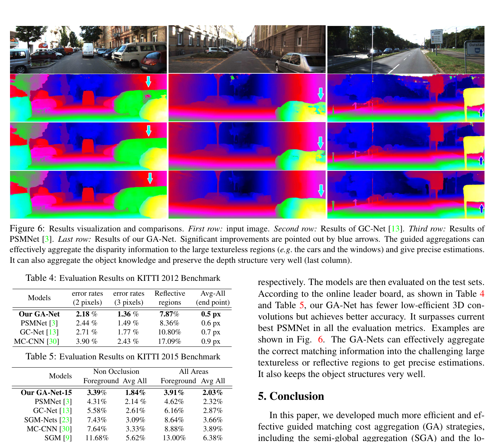

# GA-Net: Guided Aggregation Net for End-to-End Stereo Matching

**Authors:** Feihu Zhang, Victor Prisacariu, Ruigang Yang, Philip H.S. Torr (Oxford / Baidu)
**Venue:** CVPR 2019
**Tier:** 2 (the efficiency breakthrough for cost aggregation)

---

## Core Idea
Replaces computationally expensive 3D convolutions for cost volume regularization with two novel differentiable layers — **Semi-Global Aggregation (SGA)** and **Local Guided Aggregation (LGA)** — that are each **~1/100th the FLOPs** of a 3D conv while achieving better accuracy. A principled revival of classical SGM inside a differentiable framework.

## Architecture Highlights
- **Stacked hourglass feature extractor** (same base as PSMNet) with dense concatenation between layers
- **4D cost volume** (concatenation approach, same as GC-Net/PSMNet)
- **Guidance subnet:** fast 2D CNN on the reference image produces adaptive weight matrices for the GA layers
- **Semi-Global Aggregation (SGA) layer:** differentiable approximation of SGM — weighted recursive aggregation in 4 directions (left, right, up, down), $O(4KN)$ complexity vs 3D conv's $O(K^3 C N)$
- **Local Guided Aggregation (LGA) layer:** learned local guided filter with $K \times K \times 3$ weight matrices — refines thin structures and object edges
- **Soft argmin** regression, smooth L1 loss

## Main Innovation
**The 3D convolution bottleneck in cost aggregation is not fundamental.** GA-Net shows that learned directional aggregation inspired by SGM can outperform 3D convs at far lower cost:

- Traditional 3D convs: $O(K^3 C N)$ — only aggregate within a local kernel neighborhood
- **SGA aggregates semi-globally across the entire image in one pass at $O(4KN)$** — less than 1/100th the FLOPs
- Aggregation weights are **learned per-pixel** via the guidance subnet (vs SGM's fixed $P_1$/$P_2$)
- **LGA** handles fine-detail recovery (thin structures, edges) that global aggregation blurs

**A minimal GA-Net-2 (two GA layers + two 3D convs) outperforms GC-Net with 19 3D convs.**

## Benchmark Numbers
| Metric | GA-Net-15 | GA-Net-deep |
|--------|-----------|-------------|
| **KITTI 2015 D1-all** | 2.03% | 1.93% |
| **KITTI 2012 3-px All** | 1.36% | — |
| Scene Flow EPE | 0.84 px | 0.78 px |
| Runtime | 1.5s | ~1.8s |
| Real-time variant | 15-20 fps | — |

## Historical Significance
**Demonstrated that the 3D conv bottleneck in cost aggregation is not fundamental.** Opened the door to real-time stereo networks and directly influenced efficient aggregation work (BGNet, AANet, CFNet's hourglass design). Also reunited classical SGM wisdom with deep learning in a principled differentiable framework — SGM's decades of intuition are not obsolete, just need to become learnable.

## Relevance to Edge Stereo
- **Highly relevant** — SGA and LGA provide semi-global context at a fraction of 3D conv cost and are highly parallelizable
- The **guidance subnet pattern** (2D conv producing adaptive weights for aggregation) is directly applicable to lightweight edge stereo models
- Similar in spirit to GGEV's Depth-aware Dynamic Cost Aggregation (DDCA), which generates content-adaptive kernels from depth features
- SGM-Nets and SGM-Forest use related ideas but GA-Net is the end-to-end differentiable version

## Connections
| Paper | Relationship |
|-------|-------------|
| **SGM (Hirschmuller 2007)** | Classical ancestor — SGA is its differentiable neural version |
| **PSMNet** | Direct baseline — GA-Net replaces PSMNet's 3D convs with GA layers |
| **CoEx** | Uses guided cost volume excitation (related concept) |
| **GGEV** | DDCA generates content-adaptive kernels like GA-Net's guidance subnet |
| **CFNet** | Influenced by GA-Net's efficient aggregation philosophy |
