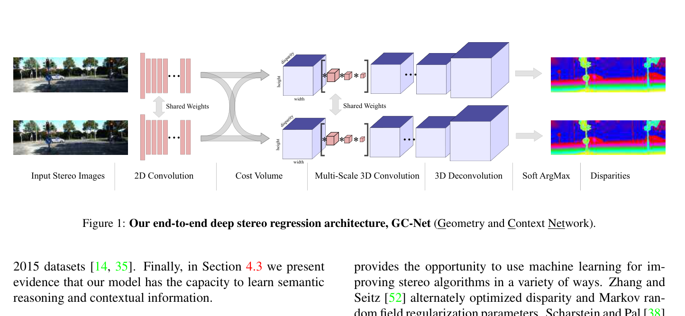
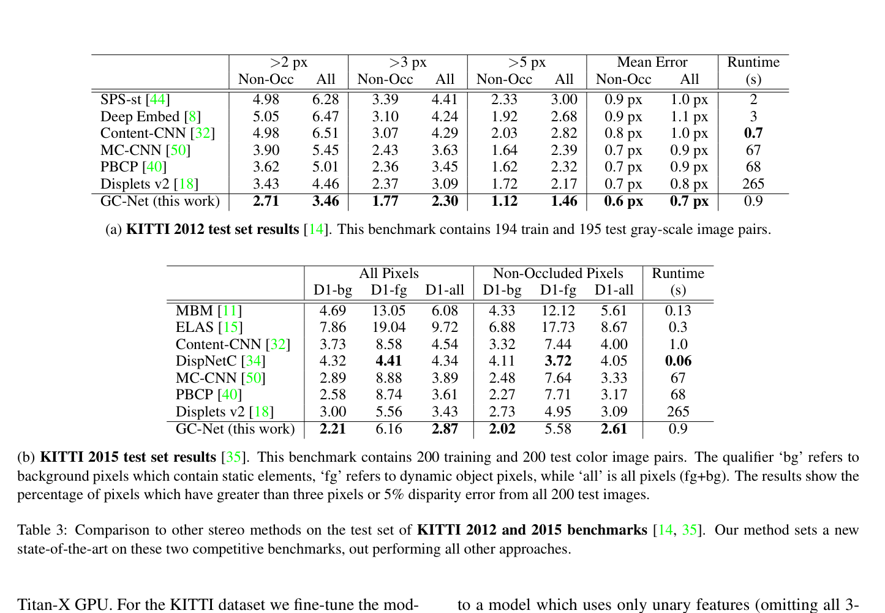

# GC-Net: End-to-End Learning of Geometry and Context for Deep Stereo Regression

**Authors:** Alex Kendall, Hayk Martirosyan, Saumitro Dasgupta et al. (Skydio Research)
**Venue:** ICCV 2017
**Tier:** 2 (foundational — the first true end-to-end 3D cost volume stereo network)

---

## Core Idea
The first fully end-to-end stereo network that builds a **4D concatenation cost volume** from learned features and regularizes it with **3D convolutions** in an encoder-decoder, eliminating all hand-crafted post-processing (SGM, refinement, etc.).

## Architecture Highlights
- **Siamese 2D CNN encoder:** 1 stride-2 conv + 8 residual blocks → 32-channel features at 1/2 resolution
- **4D cost volume by concatenation:** concatenates full left and right feature vectors at each disparity (preserves all feature information, unlike correlation which collapses to scalar)
- **3D hourglass encoder-decoder** with 4 down-sampling levels + skip connections for cost volume regularization
- **Differentiable soft argmin** for continuous sub-pixel disparity: $\hat{d} = \sum_d d \cdot \sigma(-c_d)$
- **End-to-end L1 loss** trained from scratch — no post-processing

## Main Innovation
GC-Net introduced two foundational ideas:
1. **Full-feature concatenation cost volumes** (vs. scalar correlation) — the network can learn semantic context, not just local similarity
2. **Soft argmin** — makes disparity regression fully differentiable and enables sub-pixel accuracy without discrete argmax or SGM

The hierarchical 3D CNN with 32× effective receptive field proved the network can learn semantic context (e.g., using a car's body to infer depth at its reflective windshield).

## Benchmark Numbers
| Metric | Value |
|--------|-------|
| **KITTI 2015 D1-all** | 2.87% |
| **KITTI 2012 3-px All** | 2.30% |
| Scene Flow EPE | 2.51 px |
| Parameters | 3.5M |
| Runtime | ~0.9s |

## Historical Significance
**The foundational paper of the modern 3D cost volume era.** Directly superseded patch-based methods (MC-CNN + SGM) by eliminating post-processing. Every subsequent paper in this era (PSMNet, GA-Net, GWCNet, ACVNet, IGEV) builds on the cost volume + soft argmin paradigm it established.

## Relevance to Edge Stereo
GC-Net's concatenation volume is expensive compared to correlation — this motivated the shift toward group-wise correlation (GWCNet) and correlation pyramids (RAFT-Stereo). However, its soft argmin regression is still universally used, and its hierarchical 3D encoder-decoder pattern persists in modern methods (though with far fewer layers and efficient alternatives like BGNet's bilateral grid).

## Connections
| Paper | Relationship |
|-------|-------------|
| **MC-CNN** | Direct predecessor (patch-based + SGM), which GC-Net eliminated |
| **PSMNet** | Direct successor — added SPP + stacked hourglass |
| **GA-Net** | Replaces GC-Net's 3D convs with efficient SGA/LGA layers |
| **GWCNet** | Replaces GC-Net's concatenation with group-wise correlation |
| **IGEV-Stereo** | Still uses soft argmin + 3D cost volume concepts introduced here |
