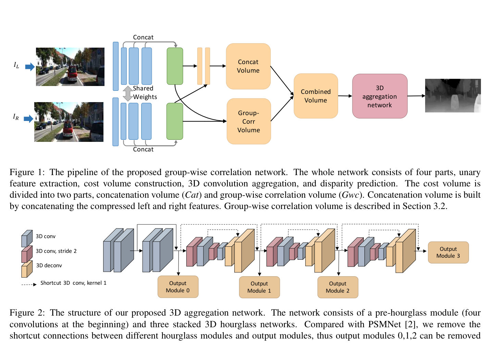
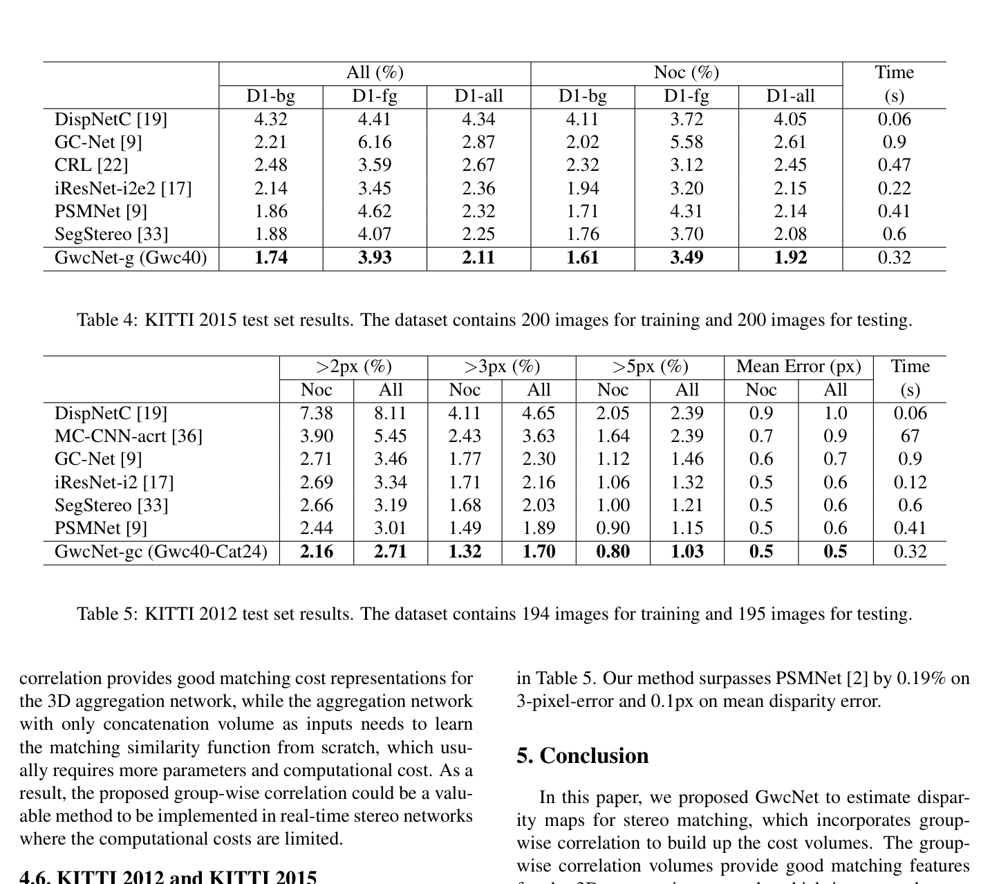

# GWCNet: Group-wise Correlation Stereo Network

**Authors:** Xiaoyang Guo, Kai Yang, Wukui Yang, Xiaogang Wang, Hongsheng Li (CUHK / SenseTime)
**Venue:** CVPR 2019
**Tier:** 2 (the cost volume innovation that became the modern standard)

---

## Core Idea
Introduces **group-wise correlation** — split left/right features into $N_g$ channel groups and compute inner-product correlation per group. Bridges the gap between information-rich concatenation volumes (GC-Net/PSMNet) and computationally efficient correlation volumes (DispNet-C).

## Architecture Highlights
- **ResNet-like feature extractor** (same as PSMNet, without SPP); multi-scale features from conv2/conv3/conv4 → 320-channel descriptors
- **Group-wise correlation volume:** features split into $N_g = 40$ groups of 8 channels each; inner product per group across all disparity levels → 4D volume of shape $[D/4, H/4, W/4, N_g]$
- **Optional concatenation volume** (12-channel compressed features) combined with group-wise volume
- **Improved 3D stacked hourglass aggregation** with 1×1×1 shortcut convolutions
- **4 output modules** with intermediate supervision, smooth L1 loss, soft argmin regression

## Main Innovation
**The principled middle ground of cost volume design.** GWCNet identifies a fundamental trade-off:
- **Full correlation (DispNetC):** efficient but collapses all feature channels to a single similarity score — loses rich feature information
- **Concatenation (GC-Net, PSMNet):** retains all information but requires the 3D aggregation network to learn matching similarity from scratch — expensive
- **Group-wise correlation:** each group of feature channels provides an independent matching cost proposal, capturing rich multi-dimensional similarity while providing explicit matching signal to the 3D aggregation network

**Key finding:** When the 3D aggregation network's parameter budget is reduced, group-wise correlation **degrades much more gracefully than concatenation** — it's intrinsically more parameter-efficient. This is why edge methods (MobileStereoNet, BANet, IGEV-Stereo) all use group-wise correlation.

## Benchmark Numbers
| Metric | GwcNet-g | GwcNet-gc |
|--------|----------|-----------|
| **KITTI 2015 D1-all** | 2.11% | — |
| **KITTI 2012 3-px All** | 1.70% | 1.70% |
| Scene Flow EPE | 0.76 px | 0.76 px |
| Runtime | 0.32s | 0.32s |

## Historical Significance
**Established group-wise correlation as the dominant cost volume approach for the next generation.** Direct predecessor of ACVNet, IGEV-Stereo, IGEV++, and many other high-performance methods that use group correlation as their cost volume backbone. The insight that explicit similarity signals improve parameter efficiency under budget constraints is especially relevant to mobile/edge design.

## Relevance to Edge Stereo
**Critical for edge model design.** GWCNet's explicit demonstration that group-wise correlation maintains accuracy under reduced 3D network capacity is the foundational finding for edge models. Using group-wise correlation (even with fewer groups like $N_g = 8$) with a lightweight aggregation backbone is the direct recipe for edge-optimized architectures. Adopted by:
- **IGEV-Stereo's GEV** construction (via group-wise correlation)
- **IGEV++'s small-range cost volume** 
- **BANet, LightStereo, LiteAnyStereo** — all use group-wise correlation
- **CREStereo** — uses group-wise correlation inside its local window

## Connections
| Paper | Relationship |
|-------|-------------|
| **DispNet-C** | Correlation-volume baseline that GWCNet generalizes |
| **GC-Net, PSMNet** | Concatenation-volume baselines; GWCNet is the efficient alternative |
| **IGEV-Stereo, IGEV++** | Direct successors — use group-wise correlation in the GEV construction |
| **BANet, LightStereo, LiteAnyStereo** | All adopt group-wise correlation for edge efficiency |
| **CREStereo** | Uses group-wise correlation within its local correlation window |
