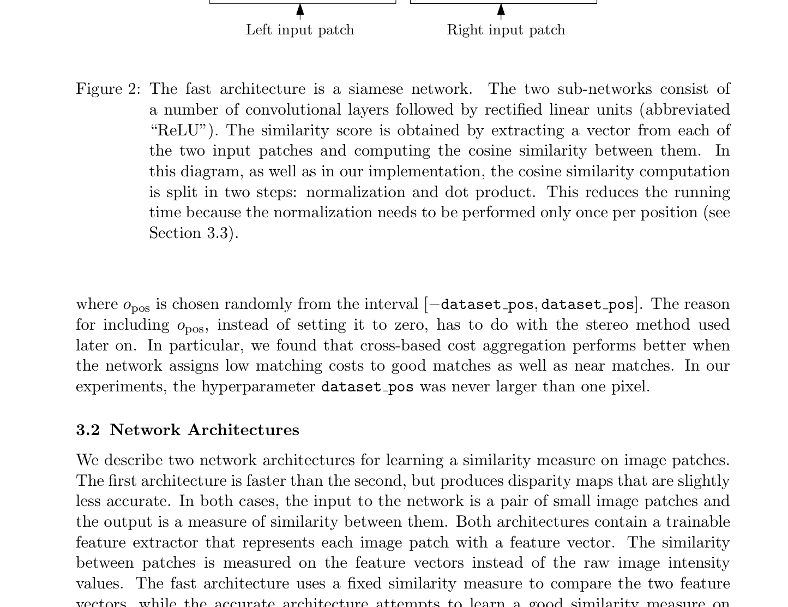
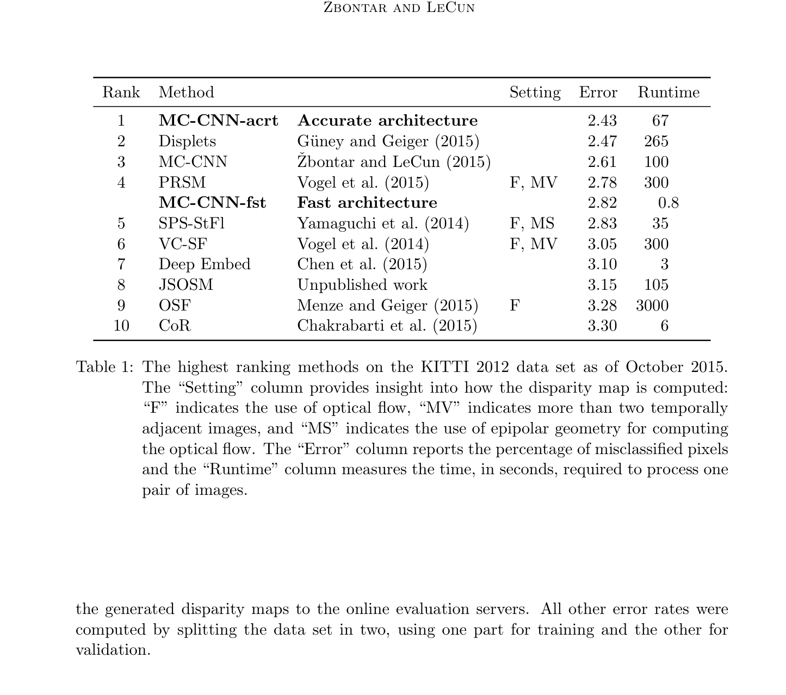

# MC-CNN: Stereo Matching by Training a Convolutional Neural Network to Compare Image Patches

**Authors:** Jure Zbontar, Yann LeCun (NYU / Facebook AI Research)
**Venue:** JMLR 17 (2016), expanded from CVPR 2015
**Tier:** 2 (the first learned matching cost)

---

## Core Idea
Train a CNN purely as a **patch-similarity oracle** (the matching cost step) and feed its output into a classical **SGM optimization pipeline**. The CNN replaces hand-crafted cost functions but does NOT do end-to-end disparity estimation.

## Architecture Highlights
- **MC-CNN-fst (fast):** Siamese network, 4 conv layers, 64 channels, 3×3 kernels, **cosine similarity** at the top, **hinge loss**
- **MC-CNN-acrt (accurate):** Same Siamese towers, features **concatenated** + 4 FC layers + sigmoid, trained with **binary cross-entropy**
- **Input:** 9×9 patches (KITTI) or 11×11 (Middlebury) → scalar similarity score
- **Classical post-processing** (not learned): Cross-based Cost Aggregation (CBCA) → SGM → left-right consistency → subpixel enhancement → median + bilateral filter
- **Efficiency trick:** Siamese features computed **once per pixel**, reused across all disparities

## Main Innovation
**The first demonstration that deep learning could replace hand-crafted matching costs** and achieve SOTA on all major stereo benchmarks simultaneously. Decoupled "learned cost + classical optimization" paradigm was the stepping stone between traditional stereo and fully end-to-end networks. The Siamese feature reuse trick reduced combinatorial cost vs naive patch comparison.

## Benchmark Numbers
| Dataset | MC-CNN-acrt | MC-CNN-fst |
|---------|-------------|------------|
| KITTI 2012 | **2.43%** (rank 1) | 2.82% (67s / 0.8s) |
| KITTI 2015 D1-all | **3.89%** (rank 1) | 4.62% (rank 2) |
| Middlebury | **8.29%** (rank 1 vs MeshStereo 13.4%) | — |

## Historical Significance
**Catalyzed the field's shift to learned representations.** Directly inspired:
- **DispNet-C's correlation layer** (2016) — Siamese features + correlation
- **GC-Net's concatenation volume** (2017) — features fed into the cost volume
- Every modern method's feature extraction stage

## Relevance to Edge Stereo
**Low direct relevance** as an architecture — two-stage (learned cost + SGM) was superseded by end-to-end networks. However:
- The **Siamese feature-extraction trick** (compute features once per image, reuse across disparities) is still universal
- The **cost-volume-then-aggregation decomposition** still underpins ACVNet and modern methods
- For extreme edge scenarios where you want classical reliability with learned components, MC-CNN's hybrid approach remains viable

## Connections
| Paper | Relationship |
|-------|-------------|
| **SGM (Hirschmuller 2007)** | Classical optimizer that MC-CNN feeds |
| **DispNet-C** | First end-to-end learner, inspired by MC-CNN's Siamese feature extraction |
| **GC-Net** | Eliminated SGM post-processing entirely |
| **All modern methods** | Use Siamese features, just with different similarity operations |
