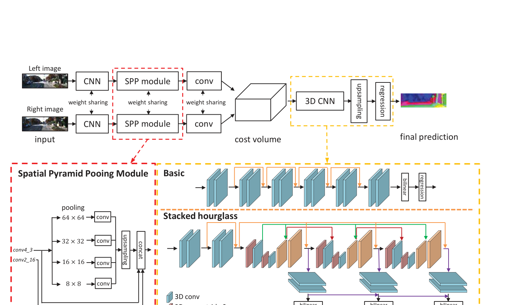
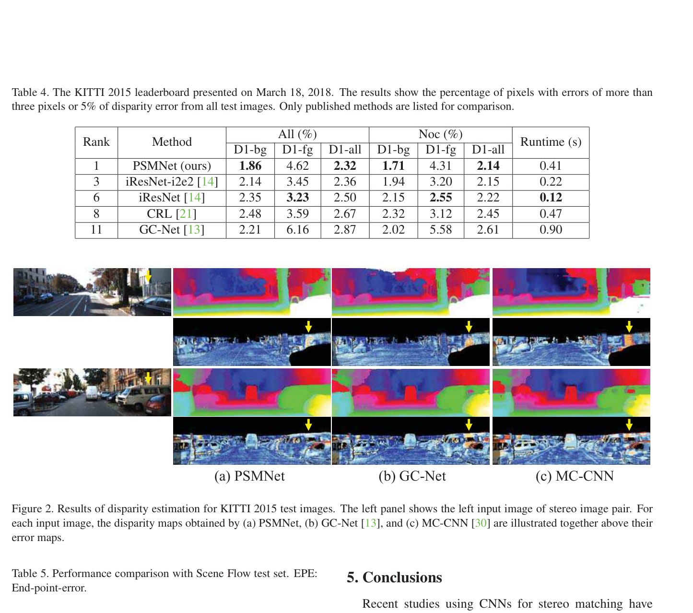

# PSMNet: Pyramid Stereo Matching Network

**Authors:** Jia-Ren Chang, Yong-Sheng Chen (National Chiao Tung University, Taiwan)
**Venue:** CVPR 2018
**Tier:** 2 (the 2018-era baseline that defined the stacked hourglass paradigm)

---

## Core Idea
Augments GC-Net's framework with **Spatial Pyramid Pooling (SPP)** for multi-scale global context before cost volume construction, and three **stacked hourglass 3D CNNs** with intermediate supervision for more powerful cost volume regularization.

## Architecture Highlights
- **ResNet-like feature extractor** with **dilated convolutions** (conv3_x: dilation 2, conv4_x: dilation 4) at 1/4 resolution
- **SPP module:** four parallel average-pooling branches (64×64, 32×32, 16×16, 8×8) upsampled + concatenated with conv2/conv4 features → 320-channel context-rich descriptors
- **4D concatenation cost volume** (inherited from GC-Net)
- **Stacked hourglass 3D CNN:** 3 encoder-decoder modules with intermediate disparity outputs
- **Intermediate supervision** at all 3 hourglass outputs; loss weights 0.5/0.7/1.0; smooth L1 loss
- **Soft argmin** disparity regression

## Main Innovation
While GC-Net's 3D encoder-decoder captures global context *within* the cost volume, PSMNet provides global context at the **feature level** — so the matching cost itself already encodes region-level relationships across the whole image. The stacked hourglass 3D CNN with intermediate supervision progressively refines the cost volume top-down/bottom-up, which significantly improved performance in ill-posed regions (occlusions, textureless surfaces, reflections) over GC-Net.

## Benchmark Numbers
| Metric | Value |
|--------|-------|
| **KITTI 2015 D1-all** | **2.32%** (rank #1 at submission, March 2018) |
| **KITTI 2012 3-px All** | 1.89% (rank #1) |
| Scene Flow EPE | 1.09 px |
| Parameters | ~5.2M |
| Runtime | 0.41s |

## Historical Significance
**The de-facto baseline for all 3D cost volume stereo networks from 2018-2021.** The SPP + stacked hourglass combination raised the bar over GC-Net and established the pattern that subsequent papers (GANet, GWCNet, ACVNet, IGEV) incrementally improved upon. Still widely used as a backbone in later works (e.g., MobileStereoNet, BANet's feature extractor).

## Relevance to Edge Stereo
- **SPP is directly relevant** — multi-scale pooling provides global context very cheaply (almost zero additional compute)
- The **three stacked hourglass 3D CNNs** (25 3D conv layers total) are too heavy for edge deployment
- The iterative/cascade paradigm (RAFT-Stereo, CFNet) emerged partly as a response to this computational cost
- PSMNet remains the **reference backbone** many edge papers compare against (e.g., "X% fewer FLOPs than PSMNet")

## Connections
| Paper | Relationship |
|-------|-------------|
| **GC-Net** | Direct predecessor — PSMNet adds SPP + stacked hourglass |
| **GA-Net** | Successor — uses PSMNet feature extractor, replaces 3D convs with GA layers |
| **GWCNet** | Successor — uses PSMNet-style feature extractor + group-wise correlation |
| **BANet, LightStereo** | Compare against PSMNet as a baseline |
| **IGEV-Stereo** | Uses PSMNet/MobileNetV2 style feature extraction + modern cost volume innovations |
