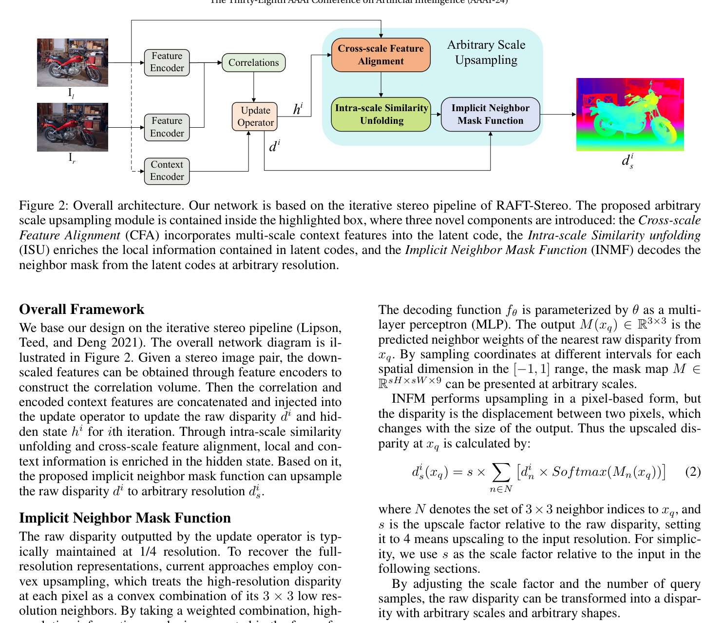
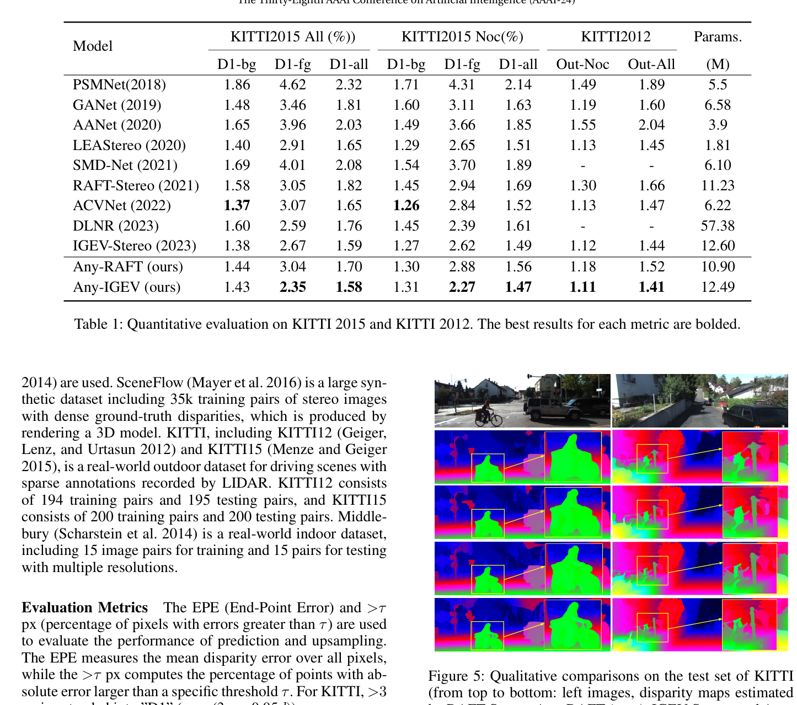

# Any-Stereo: Arbitrary Scale Disparity Estimation for Iterative Stereo Matching

**Authors:** Zhaohuai Liang, Changhe Li (CUG Wuhan, Anhui University of S&T)
**Venue:** AAAI 2024
**Tier:** 2 (plug-in INR upsampling)

---

## Core Idea
The standard **convex upsampling** in RAFT-style iterative models loses high-frequency detail and is locked to a fixed output scale. Any-Stereo replaces it with an **implicit neural representation (INR)** that models disparity as a continuous function over 2D coordinates, enabling **arbitrary-scale output** while recovering finer details than convolution-based upsampling.

## Architecture Highlights
- **Base pipeline unchanged:** any RAFT-Stereo or IGEV-Stereo backbone (feature encoder, correlation pyramid, multi-level ConvGRU). Any-Stereo is a **drop-in module only**
- **Implicit Neighbor Mask Function (INMF):** MLP $f_\theta$ mapping (hidden state $h^*$, relative query coordinate $x_q - x^*$) → 3×3 neighbor mask weights. Scale factor $s$ varies query coordinate sampling density for **arbitrary output resolution**
- **Intra-scale Similarity Unfolding (ISU):** computes self-similarity scores between each pixel and its $P \times P$ neighborhood (P=5), appending low-cost local descriptor channels to the hidden state
- **Cross-scale Feature Alignment (CFA):** separate encoder branch on left image using Spatial Downsampling Blocks (PixelUnshuffle + Simplified Channel Attention) producing multi-scale feature maps at 1/2 and 1/4 res
- **Multi-scale training:** randomly samples scale factor $s \in [1\times, 3\times]$ during training

## Main Innovation
**Diagnoses a specific and previously under-addressed bottleneck:** convolutional upsampling from GRU hidden states cannot recover high-frequency disparity details because (a) convolutions have limited expressiveness for high-frequency info, (b) downsampling in the encoder discards context that would help align upsampled disparity with fine image structures.

**The INR formulation** treats disparity as a **continuous 2D signal**: by querying the MLP at any spatial coordinate with the latent code + relative position, the model produces disparity at scales not seen during training. Practical consequences:
- **Robust to input resolution changes** (nearly no degradation down to 75% resolution, ~50% improvement at 25% scale)
- **Sharper boundaries at full scale**
- **Nearly parameter-neutral** (reduces RAFT's 11.23M → 10.90M)
- Adds only **1.7% runtime overhead**

## Benchmark Numbers
| Model | KITTI 2015 D1-all | KITTI 2015 D1-fg (Noc) |
|-------|-------------------|------------------------|
| IGEV-Stereo baseline | 1.59% | 2.62% |
| **Any-IGEV** | **1.58%** | **2.27%** (13.4% improvement) |
| RAFT-Stereo baseline | 1.82% | — |
| **Any-RAFT** | **1.70%** | — |

**Downsampled robustness (25% input scale):**
- IGEV-Stereo: 18.2% D1
- **Any-IGEV: 11.5% D1** (37% better)

**Runtime (960×540):** 0.422s vs RAFT 0.415s (**only 1.7% overhead**)

## Relation to RAFT-Stereo / IGEV-Stereo Baseline
**Pure plug-in** that wraps around RAFT-Stereo or IGEV-Stereo without touching the iterative core. Not a competing architecture but an enhancement module. Explicitly demonstrates that **RAFT/IGEV's bottleneck is in the upsampling stage, not the GRU iterations themselves**.

## Relevance to Edge Stereo
**Arguably the most directly edge-relevant paper** of the iterative variants. Core insight (lightweight MLP-based INR upsampling replacing heavyweight convolutional decoding) directly reduces parameters while improving quality.

**Ideal edge deployment pattern:** Run the GRU at very low resolution (1/8 or 1/16) and use Any-Stereo's INR to upsample directly to full resolution → dramatically cuts memory and compute in the backbone while maintaining output fidelity. The arbitrary-scale capability is useful for mobile NPU deployments where input resolution may vary. **Multi-scale robustness** is directly valuable for embedded systems that may need to downsample inputs to fit memory budgets.
