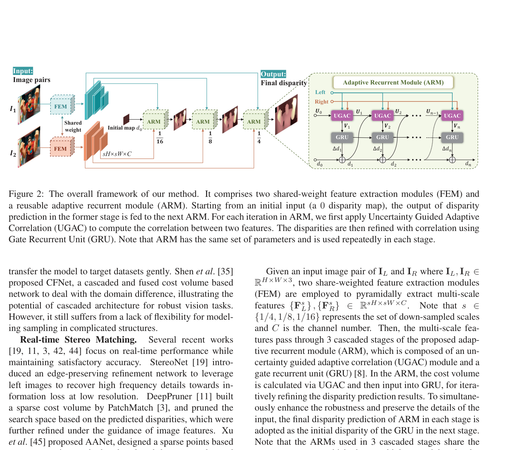
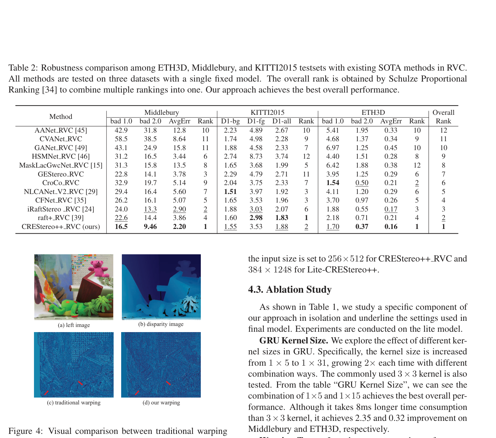

# CREStereo++: Uncertainty Guided Adaptive Warping for Robust and Efficient Stereo Matching

**Authors:** Junpeng Jing, Jiankun Li, Pengfei Xiong, Jiangyu Liu et al.
**Venue:** ICCV 2023
**Tier:** 2 (direct successor to CREStereo)

---

## Core Idea
Replaces the standard fixed-weight warping operation in iterative stereo with an **uncertainty-guided content-adaptive warping module (UGAC)**, dramatically improving cross-domain robustness without per-dataset fine-tuning. Won **RVC 2022**.

## Architecture Highlights
- **Feature Extraction Modules (FEM)** with shared weights → multi-scale pyramidal features at 1/4, 1/8, 1/16
- **Adaptive Recurrent Module (ARM):** 3 cascaded stages **sharing weights**, each stage uses UGAC + GRU refinement
- **UGAC module (the key innovation):** content-aware warping layer (group-wise deformable convolutions, position-specific weights) + variance-based uncertainty estimator + correlation layer
- **Convex upsampling** at final stage (RAFT-style)
- **Lite variant:** reduced to 64 channels + super-kernel 1×15 convolutions in GRU

## Main Innovation
**Replaces position-agnostic bilinear warping.** In standard warping, right features are shifted by the current disparity using fixed weights — this corrupts features in textureless/occluded/edge regions. UGAC solves this in two steps:
1. **Variance-based uncertainty map** computed from the cost volume at each iteration, identifying ill-posed pixels
2. **Uncertainty-guided deformable offset** — widens the sampling neighborhood specifically where matching is unreliable

Done **before cost volume construction** — eliminates the blur at the source.

## Benchmark Numbers
| Metric | Value |
|--------|-------|
| **KITTI 2015 D1-all** (RVC) | **1.88%** |
| **Middlebury bad 2.0** (RVC) | **9.46%** (rank 1 overall) |
| Cross-domain KITTI 2015 | **5.2%** (trained on Scene Flow only) |
| Cross-domain Middlebury | **14.8%** (trained on Scene Flow only) |
| **Lite-CREStereo++** | 2.08% D1, 0.6M params, 56ms |

## Relation to RAFT-Stereo / CREStereo Baseline
**Direct extension of CREStereo.** The cascaded recurrent structure with shared-weight ARMs is inherited. The change is entirely in **how the cost volume is constructed each iteration** — standard warping is replaced by the deformable, uncertainty-guided warp. GRU update and convex upsampling are unchanged.

## Relevance to Edge Stereo
**High.** The lightweight variant (**0.6M params, 56ms**) is directly applicable to edge deployment. Weight-sharing across ARM stages = highly memory-efficient. Uncertainty mechanism adds robustness without domain-specific retraining. Deformable warping adds only ~15ms over bilinear. **One of the more edge-friendly papers in the iterative cohort.**
