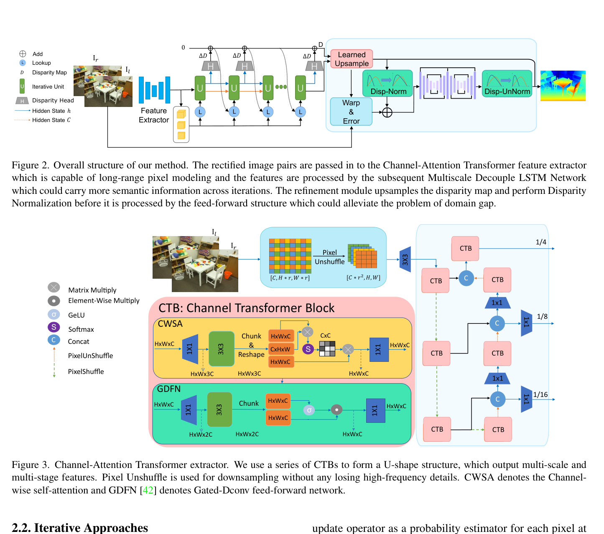
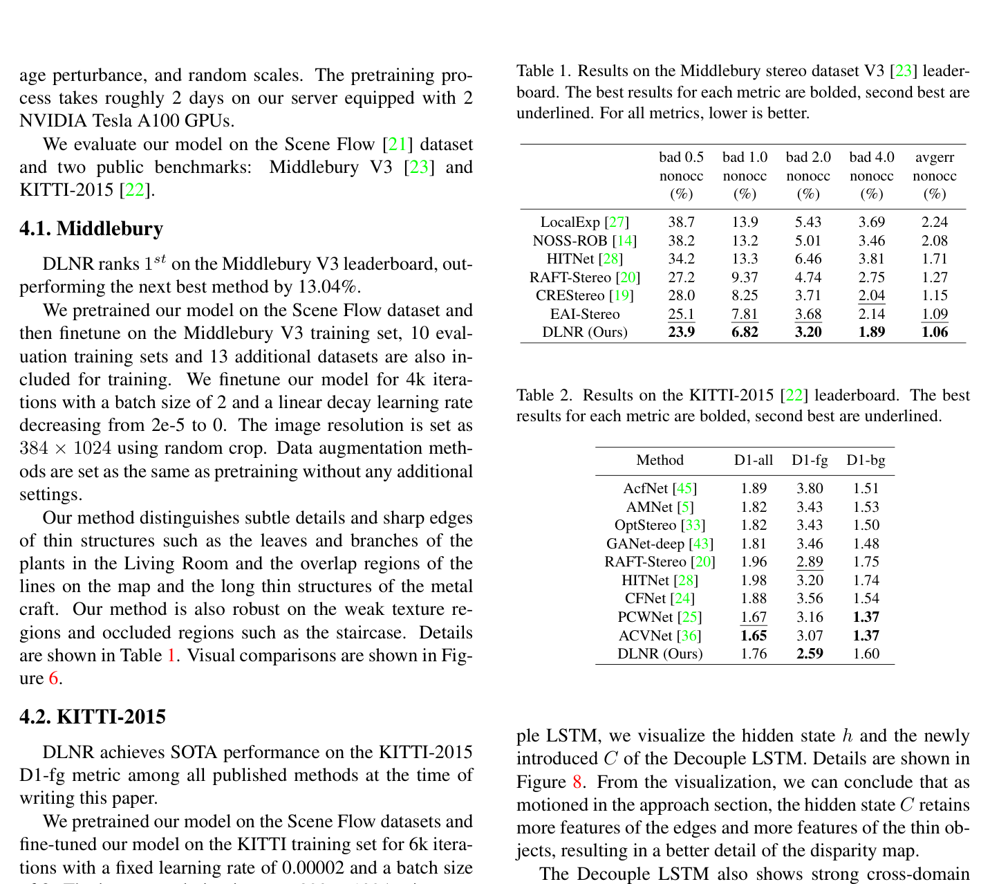

# DLNR: High-Frequency Stereo Matching Network

**Authors:** Haoliang Zhao, Huizhou Zhou, Yongjun Zhang et al.
**Venue:** CVPR 2023
**Tier:** 2 (addresses detail loss in iterative methods)

---

## Core Idea
Identifies that iterative methods (RAFT-Stereo, CREStereo) lose **high-frequency detail** through two failure modes — information coupling in the GRU hidden state and domain-gap failure in the refinement module — and proposes targeted fixes: **Decouple LSTM** + **Disparity Normalization Refinement** + **Channel-Attention Transformer** feature extractor.

## Architecture Highlights
- **Channel-Attention Transformer (CAT) feature extractor:** U-shape structure with Channel Transformer Blocks using **channel-wise self-attention (linear complexity)** and Gated-Dconv feed-forward networks; Pixel Unshuffle for lossless downsampling
- **Multiscale Decouple LSTM** (replaces GRU): operates at 1/4, 1/8, 1/16 resolution simultaneously; introduces a **second hidden state C** dedicated to carrying semantic info across iterations, decoupling it from the hidden state h that drives the disparity update head
- **Disparity Normalization Refinement (DNR):** hourglass at full resolution; **normalizes disparities to [0,1]** as a fraction of image width before refinement, then unnormalizes → distribution-agnostic

## Main Innovation
**Decouple LSTM addresses a fundamental conflict in GRU-based iteration.** Standard GRUs conflate two roles: generating the disparity update (output role) and carrying info to next iteration (memory role). These conflict — the update head forces the hidden state toward immediate update residuals, suppressing subtle edge features needed for memory. Adding a **dedicated cell state C** (LSTM-style) breaks this coupling, allowing fine-grained edge/thin-structure features to persist across iterations.

**DNR's normalization trick** prevents module collapse when refinement encounters disparity distributions very different from training — normalizing to image width fractions makes the module distribution-agnostic.

## Benchmark Numbers
| Metric | Value |
|--------|-------|
| **KITTI 2015 D1-all** | **1.76%**, D1-fg **2.59%** (SOTA fg at publication) |
| **Middlebury V3** | bad 2.0 **3.20%** (rank 1 — 13% better than next) |
| Scene Flow EPE | 0.477 (32 iters), 0.502 (10 iters at 135ms) |

**Decouple LSTM ablation:** Scene Flow D1-error reduces by 9.73%, cross-domain generalization improves by 22.16%.

## Relation to RAFT-Stereo Baseline
**RAFT-Stereo variant with three changes:**
1. ResNet → CAT transformer feature extractor
2. GRU update cell → Decouple LSTM
3. Convex upsampling → full-resolution DNR refinement with explicit warping error

All-pairs 3D correlation pyramid is **retained unchanged**.

## Relevance to Edge Stereo
**Mixed.**
- **CAT's channel-wise self-attention** (linear complexity) is an efficiency technique worth adapting
- **Decouple LSTM concept** (separate memory vs update states) is architecturally valuable and transferable — could reduce iterations needed while maintaining detail quality
- **DNR normalization trick** is a low-cost addition worth including for cross-domain robustness
- DLNR itself runs at 131ms on A100 with 10 iterations — **not edge-lightweight** as presented
