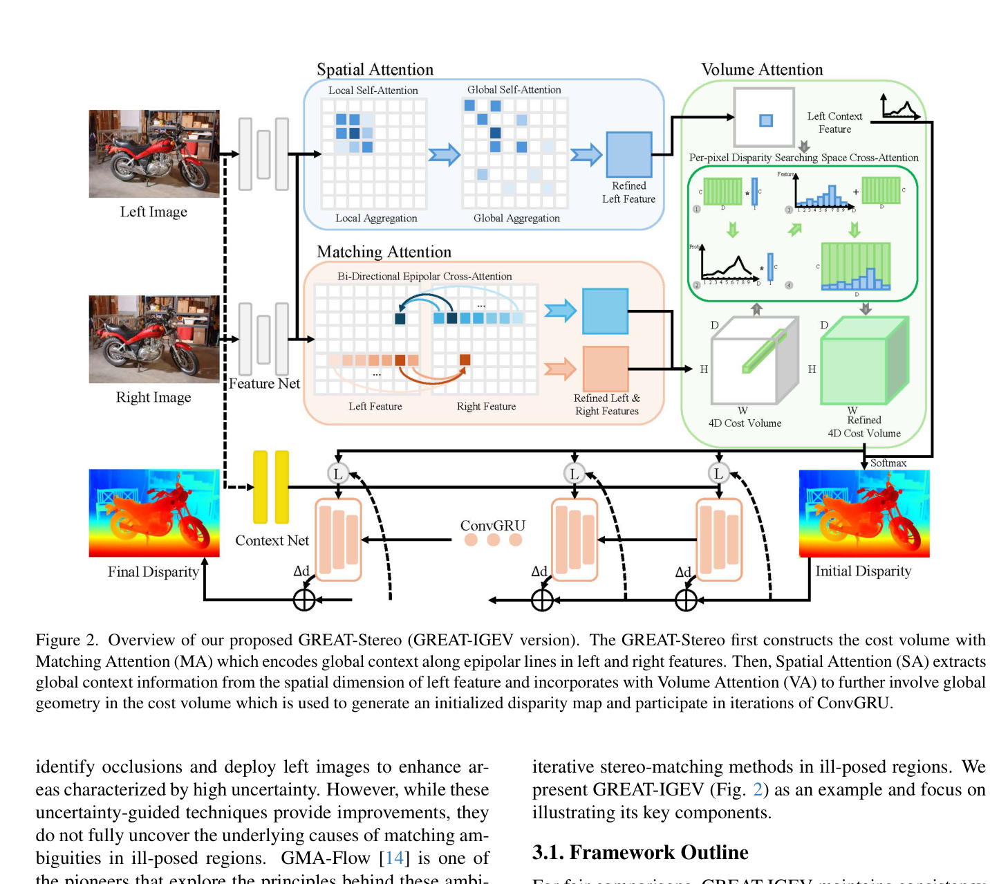
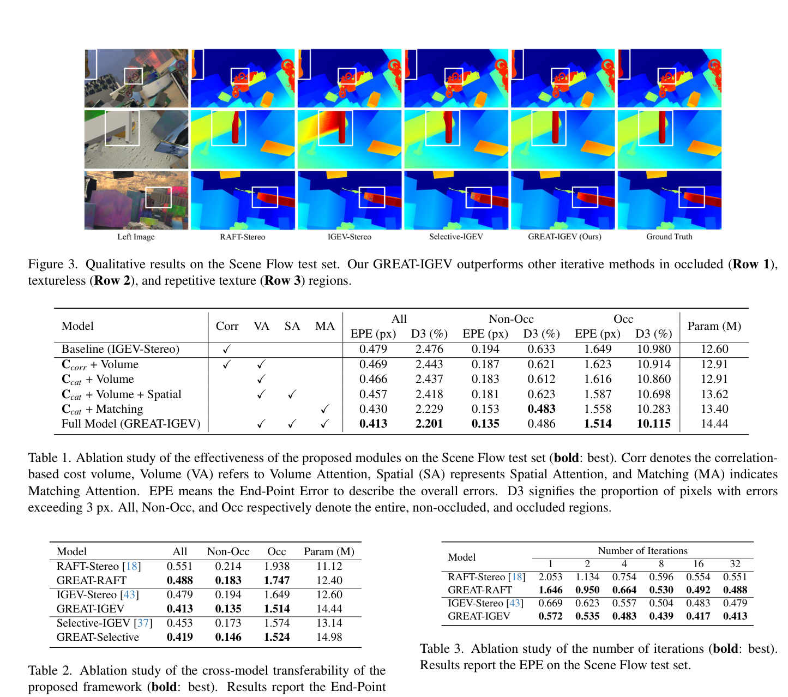

# GREAT-Stereo: Global Regulation and Excitation via Attention Tuning for Stereo Matching

**Authors:** Jiahao Li, Xinhong Chen, Zhengmin Jiang, Qian Zhou, Yung-Hui Li, Jianping Wang (CityU HK, Hon Hai Research)
**Venue:** ICCV 2025
**Tier:** 2 (global-context attention plug-in)

---

## Core Idea
Iterative methods (RAFT-Stereo, IGEV-Stereo, Selective-IGEV) fail in **ill-posed regions** (occlusions, textureless areas, repetitive textures) because cost volumes and update operators are **inherently local**. GREAT-Stereo proposes a universal plug-in framework of **three attention modules** that inject global context into cost volume construction and refinement without redesigning the iterative backbone.

## Architecture Highlights
- **Spatial Attention (SA):** captures global spatial context from left feature maps using two attention mechanisms at 4 scales (stride 4/8/16/32):
  - **Local Self-Attention (LSA)** via Outlook Attention on K×K windows
  - **Global Self-Attention (GSA)** via Shifted Window Self-Attention (SWSA, Swin Transformer)
- **Matching Attention (MA):** Bi-Directional Epipolar Cross-Attention (BECA) aggregating global context along epipolar lines using both left and right features; two CNNs with kernels 3 (local) and 5 (global) fuse features before cross-attention
- **Volume Attention (VA):** Per-pixel Disparity Searching Space Cross-Attention (PDCA) integrated into each UNet scale of IGEV; excites global context within the cost volume by cross-attending the disparity searching space matrix against spatial features from SA
- **Backbone:** MobileNetV2 (lighter than IGEV's default)
- **ConvGRU** standard IGEV-Stereo with 22 iterations; largest scale uses 4 MA blocks

## Main Innovation
**Addresses a fundamental limitation of iterative methods:** their update operators see only fixed local receptive fields in the cost volume, making them blind to complementary **global geometric structure** that would resolve ambiguities in ill-posed regions.

**Three-module design, decomposed by context type:**
- **SA:** spatial non-local dependencies in image features (propagating info from non-occluded to occluded regions)
- **MA:** cross-view global correspondence along epipolar lines (critical for textureless areas)
- **VA:** synthesizes global signals inside the cost volume via cross-attention over the disparity search space

**Universally transplantable** — validated on RAFT-Stereo (GREAT-RAFT), IGEV-Stereo (GREAT-IGEV), Selective-IGEV (GREAT-Selective).

## Benchmark Numbers
| Metric | GREAT-IGEV | IGEV baseline |
|--------|-----------|---------------|
| **Scene Flow EPE** | **0.413** | 0.479 (13.8% improvement) |
| **Scene Flow Occluded EPE** | **1.514** | 1.649 |
| **KITTI 2012 2-noc** | **1.51%** | — |
| **KITTI 2015 D1-all** | **1.50%** | 1.59% (5.7% improvement) |
| **ETH3D bad 0.5** | **5.2%** | — (38.1% better than IGEV) |
| Parameters | 14.44M | 12.60M (+1.84M) |

**Critical efficiency finding:** **GREAT-IGEV with only 4 iterations matches IGEV-Stereo with 22 iterations** — 5.5× iteration reduction.

## Relation to RAFT-Stereo / IGEV-Stereo Baseline
**Universal enhancement layer on top of existing iterative backbones**, not a standalone model. For RAFT-Stereo, only MA is transplanted (RAFT lacks multi-scale spatial features required for SA/VA). Key finding: **global context is the main bottleneck for ill-posed regions**, and adding it requires **fewer iterations to converge**.

## Relevance to Edge Stereo
**Moderate-to-high, with nuance.** The iteration efficiency result is directly compelling for edge: if GREAT-IGEV achieves IGEV's accuracy in 4 iterations instead of 22, GRU compute cost drops ~5×.

**However:** the attention modules themselves (particularly SWSA global attention and PDCA volume attention) are computationally expensive and memory-intensive, potentially offsetting iteration savings on edge hardware.

**Most edge-relevant lesson:** the **MA module alone** adds only ~1.84M parameters but delivers disproportionate gains. A lightweight version of MA (e.g., depthwise-separable convolutions for epipolar aggregation) could be a tractable addition to an edge model. MobileNetV2 backbone is already edge-portable.
