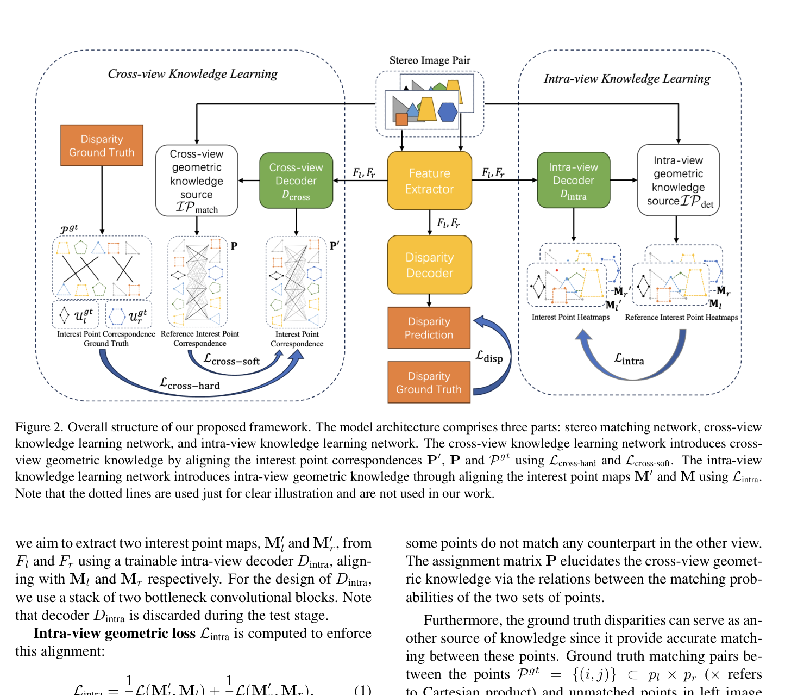
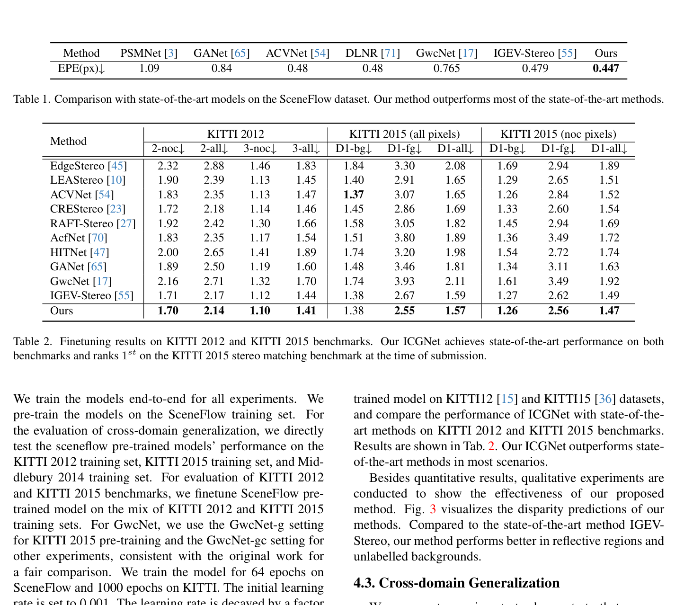

# ICGNet: Learning Intra-view and Cross-view Geometric Knowledge for Stereo Matching

**Authors:** Rui Gong, Weide Liu, Zaiwang Gu, Xulei Yang, Jun Cheng
**Venue:** CVPR 2024
**Tier:** 2 (a training framework, not a standalone architecture)

---

## Core Idea
**A training framework that supplements any stereo backbone with geometric knowledge** from a pre-trained local feature matcher, using both **intra-view structure** (interest point detection) and **cross-view correspondences** (matching) as auxiliary supervision signals. **Zero inference overhead** — both auxiliary decoders are discarded at test time.

## Architecture Highlights
- **Any stereo backbone** (demonstrated on GwcNet and IGEV-Stereo) — unchanged at inference
- **Intra-view Geometric Knowledge Decoder (D_intra):** two bottleneck convolutional blocks; takes left/right features; trained to produce **interest point heatmaps** consistent with pretrained SuperPoint; **discarded at test time**
- **Cross-view Geometric Knowledge Decoder (D_cross):** MLP encoder + 4 alternating self/cross-attention layers; takes interest point sets; produces **assignment matrix** matching points between views; supervised by pretrained interest point matcher; **discarded at test time**
- **Loss:** $\mathcal{L}_{intra}$ (focal loss on point heatmaps) + $\mathcal{L}_{cross-soft}$ (KL-divergence on assignment matrices) + $\mathcal{L}_{cross-hard}$ (NLL on matched/unmatched GT pairs)

## Main Innovation
**Existing stereo methods fail in two geometric regimes:** textureless areas (lack intra-view structure) and occlusions (lack cross-view correspondences). Rather than modifying cost volume or update operator, ICGNet **injects geometric knowledge purely through auxiliary training supervision**.

A pretrained interest point detector (SuperPoint) provides:
- **Intra-view structure** — what edges/corners look like in each image independently
- **Cross-view correspondence** — which of those points actually match across views

Forces the backbone's feature extractor to encode both types of geometric knowledge simultaneously with disparity prediction → backbone features become richer **without any architectural change at inference**.

## Benchmark Numbers
| Dataset | ICGNet (on IGEV-Stereo) | IGEV Baseline |
|---------|------------------------|---------------|
| **Scene Flow EPE** | **0.447** | 0.479 |
| **KITTI 2015 D1-all** | **1.57%** | 1.59% |
| Cross-domain KITTI 2012 EPE | **0.99** | — |
| Cross-domain KITTI 2015 EPE | **1.16** | — |
| Cross-domain Middlebury EPE | **0.82** | 0.91 |

## Relation to IGEV-Stereo Baseline
**Training-time wrapper** compatible with any stereo network. When applied to IGEV-Stereo, improves Scene Flow EPE from 0.479 → 0.447 (6.5% gain). The IGEV architecture, cost volume design, and GRU update operator are **completely unchanged**. Improvement comes entirely from **richer feature representations learned during training**.

## Relevance to Edge Stereo
**Highly relevant and underutilized.** Because both auxiliary decoders are discarded at inference, ICGNet adds **exactly zero overhead** to a deployed edge model. Pure training-time enhancement:
- **Lightweight backbone** (MobileNetV4, EfficientViT) trained with ICGNet-style geometric supervision → accuracy approaching heavy models at no additional inference cost
- **Improves cross-domain generalization** — critical for edge deployment across diverse real-world environments
- **Model-agnostic** — can be applied to any future efficient architecture
- Should be a **standard component** of our edge model training pipeline
