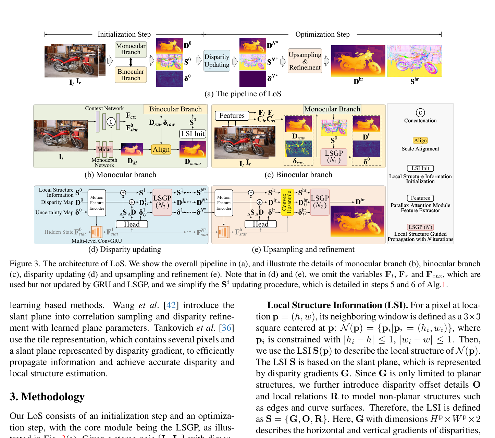
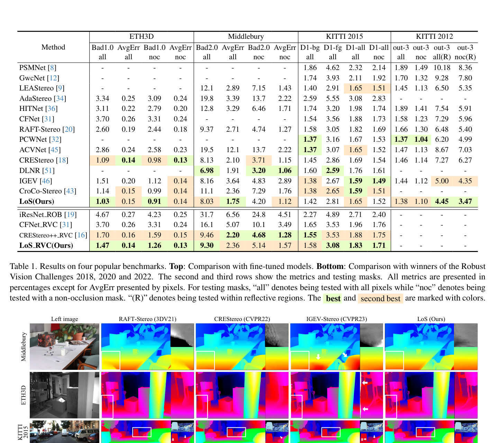

# LoS: Local Structure-guided Stereo Matching

**Authors:** Kunhong Li, Longguang Wang, Ye Zhang et al. (SYSU, NUDT, Huawei Cloud)
**Venue:** CVPR 2024
**Tier:** 2 (structure-guided propagation replaces correlation lookup)

---

## Core Idea
Challenging stereo regions (occlusions, textureless areas, curved surfaces, boundaries) require **geometric priors beyond appearance matching**. LoS bootstraps **Local Structure Information (LSI)** — a slant-plane representation encoding disparity gradients, offsets, and neighbor relations — from a monocular depth network (MiDaS), then refines it iteratively using a novel **Local Structure-Guided Propagation (LSGP)** module instead of standard GRU + correlation lookup.

## Architecture Highlights
- **Two-branch initialization:** Monocular Branch (MiDaS-derived depth scaled to raw disparity) + Binocular Branch (PAM-based parallax attention → raw disparity + uncertainty)
- **LSI representation:** per-pixel $S = \{G, O, R\}$ where G = disparity gradients ($H \times W \times 2$), O = local disparity offsets, R = local relations between neighboring pixels
- **LSGP module:** propagates disparity and uncertainty maps guided by LSI **without feature warping**; operates in neighbor-graph fashion using constrained weights from uncertainty and local relations R
- **Multi-level ConvGRU updating** (1/8, 1/16, 1/32); LSGP replaces the correlation-sampling step inside each GRU update
- **Upsampling:** convex upsampling + 2nd LSGP pass at $sH \times sW$ (s=4)

## Main Innovation
**LoS is architecturally distinct from RAFT/IGEV** — it replaces the correlation volume lookup entirely with structure-guided propagation.

Rather than asking "what does the cost volume say near my current estimate?", LSGP asks **"given the local geometric structure (slant plane), how should I propagate the disparity of reliable pixels to uncertain neighbors?"** LSI is initialized once from MiDaS (monocular geometry prior) and continuously refined.

**Dramatically faster than GRU correlation sampling:**
- LoS LSGP: **0.010s per iteration**
- RAFT-Stereo: 0.297s per iteration
- CREStereo: 0.400s per iteration

## Benchmark Numbers
| Metric | Value |
|--------|-------|
| **ETH3D** | bad 1.0 **0.91%** (rank 1), AvgErr 0.13 |
| **Middlebury bad 2.0** | **8.03%** (rank 1 fine-tuned) |
| **KITTI 2015 D1-all** | **1.42%**, D1-fg 2.81% |
| **Runtime** | **0.31s** (960×640, RTX 4090) — 3× faster than CREStereo (0.96s) and IGEV (1.09s) at 1920×1080 |

## Relation to RAFT-Stereo / IGEV-Stereo Baseline
**Fundamental departure from RAFT paradigm**, not incremental improvement. RAFT queries a fixed correlation pyramid; LoS propagates structure constraints through a neighbor graph. Both produce iterative disparity refinement through mechanistically different processes.

**Monocular depth initialization** (MiDaS bootstrap of LSI) shares conceptual DNA with DEFOM-Stereo's use of monocular priors, but LoS uses it only for **geometric structure initialization**, not as a full feature encoder.

## Relevance to Edge Stereo
**High.** LSGP's per-iteration cost is **~30× lower** than GRU+correlation sampling, making it one of the most edge-friendly high-accuracy methods. The monocular prior bootstrapping (MiDaS) could be replaced with a lighter depth estimator. **Absence of a large cost volume** + structure-guided propagation is directly compatible with sparse/adaptive cost volume strategies for edge deployment. The explicit LSI representation is also interpretable and could be hard-coded with inductive biases for constrained environments.
