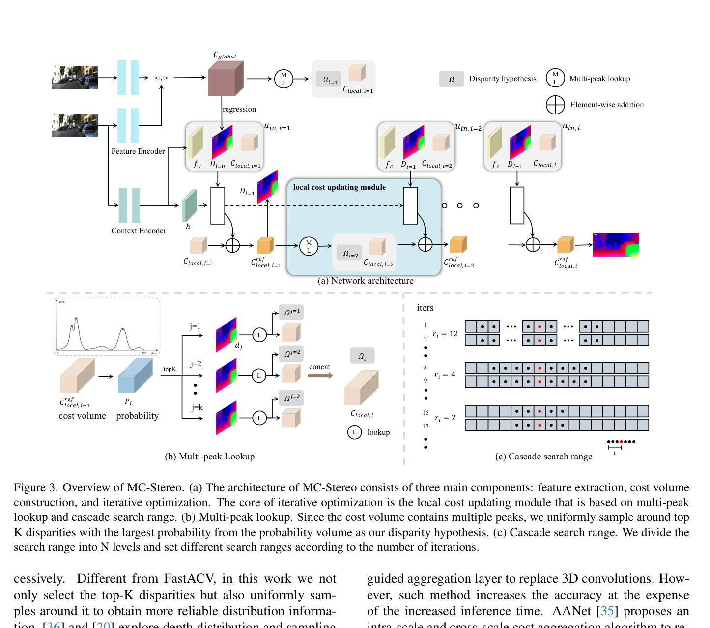
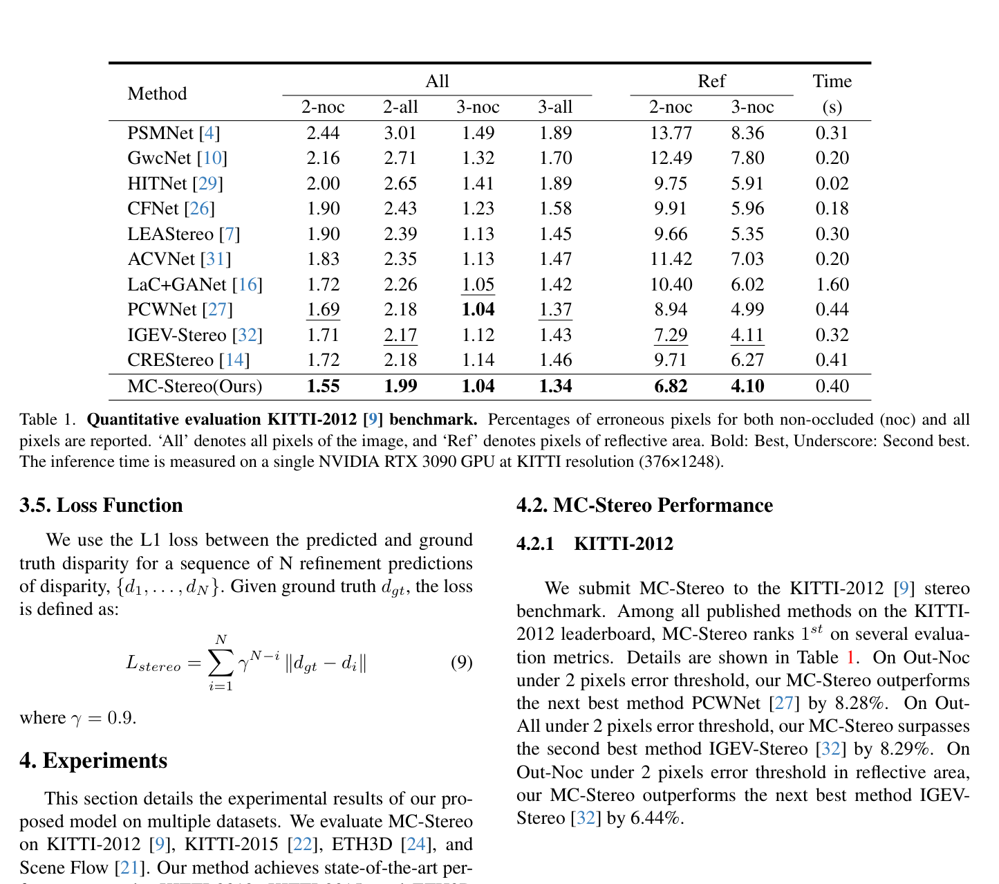

# MC-Stereo: Multi-Peak Lookup and Cascade Search Range for Stereo Matching

**Authors:** Miaojie Feng, Junda Cheng, Hao Jia, Longliang Liu, Gangwei Xu, Qingyong Hu, Xin Yang (HUST)
**Venue:** 3DV 2024
**Tier:** 2 (RAFT-Stereo refinement)

---

## Core Idea
Standard RAFT-style iterative matching uses a **single-peak cost lookup** with fixed search radius, which fails when cost volumes have **multi-modal distributions** (reflective surfaces, repetitive textures). MC-Stereo introduces a **multi-peak lookup** tracking top-K peaks + **cascade search range** shrinking coarse-to-fine across iterations.

## Architecture Highlights
- **Feature encoder:** ConvNeXt (pretrained ImageNet), first two stages, U-Net upsampling to 1/4 resolution (C=256)
- **Context encoder:** same ConvNeXt, left image only → hidden state h
- **Cost volume:** inner-product correlation pyramid (2 levels via avg pooling along disparity), $D_{max}=192$
- **Iterative optimizer:** GRU with **Multi-peak Lookup (ML)** + **Cascade Search Range**
- **Cascade schedule:** 32 iterations total, split into 3 stages — r=12 for iters 1-6, r=4 for iters 7-16, r=2 for iters 17-32

## Main Innovation
**Multi-peak lookup** selects top-K=3 disparity hypotheses with highest probability at each iteration, then uniformly samples ±r points around **each peak** to construct a richer local cost volume. Directly addresses multi-peak distribution problem that single-peak RAFT-style lookup misses — crucial for reflective and textureless areas where multiple plausible disparities coexist.

**Cascade search range** complements this: wide radius early (fast convergence, avoids local minima) → narrowing late (fine precision).

**ConvNeXt feature extractor** replaces hand-designed encoders used in prior work, yielding substantial front-end quality boost.

## Benchmark Numbers
| Metric | Value |
|--------|-------|
| **KITTI 2012 Out-Noc 2px** | **1.55%** (rank 1 at submission) |
| **KITTI 2015 D1-all** | **1.55%** (rank 1) |
| **Scene Flow EPE** | **0.45** |
| **ETH3D bad 4.0** | 0.10% |
| Runtime | 0.40s (RTX 3090) |
| Parameters | ~21.4M |

## Relation to RAFT-Stereo / IGEV-Stereo Baseline
**Direct evolutionary refinement of RAFT-Stereo.** Keeps the same pipeline but surgically fixes two known flaws: single-peak lookup and fixed search radius. Does **not** use IGEV's geometry encoding volume. Instead, improves the lookup mechanism itself. ConvNeXt replaces hand-crafted feature extractors used in both baselines.

## Relevance to Edge Stereo
**Moderate.** The cascade search range idea is architecturally lightweight and directly applicable to any iterative model. Multi-peak lookup adds minimal parameter overhead (21.2M → 21.4M for K=3). Main edge concern: **ConvNeXt encoder is heavier than MobileNet alternatives**. The 0.40s inference time is too slow for real-time edge without optimization, but the lookup mechanism itself could be ported to a lighter backbone.
