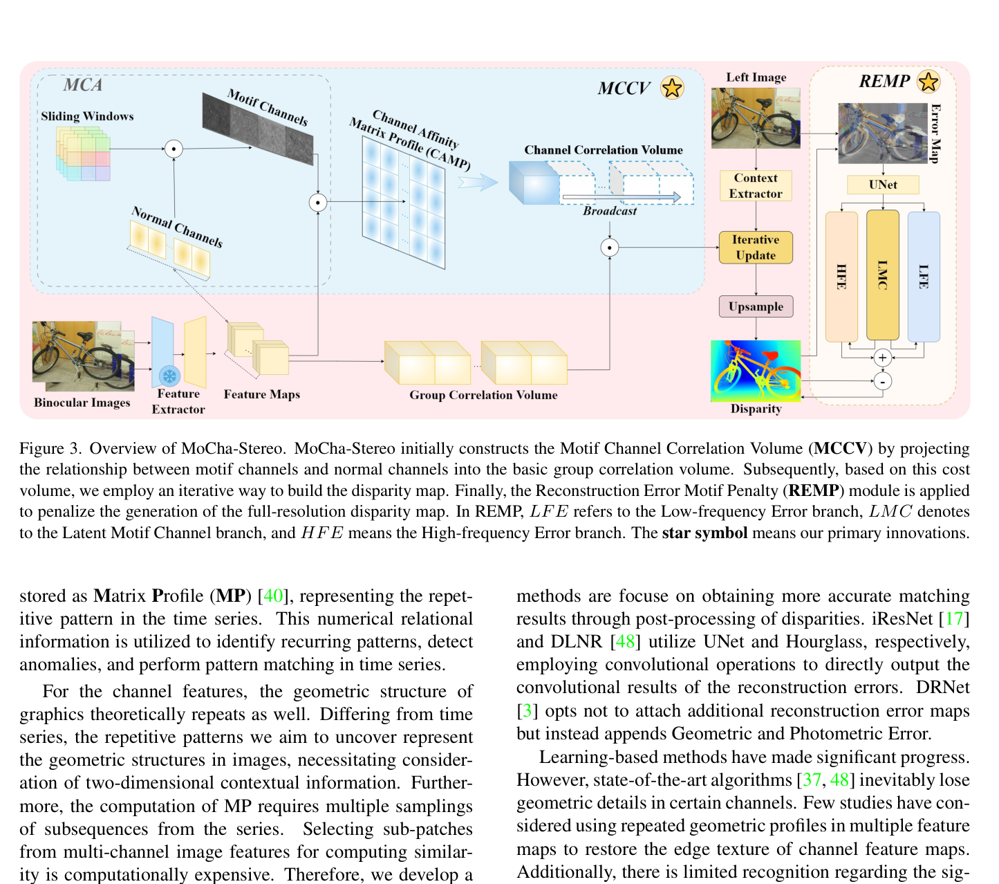
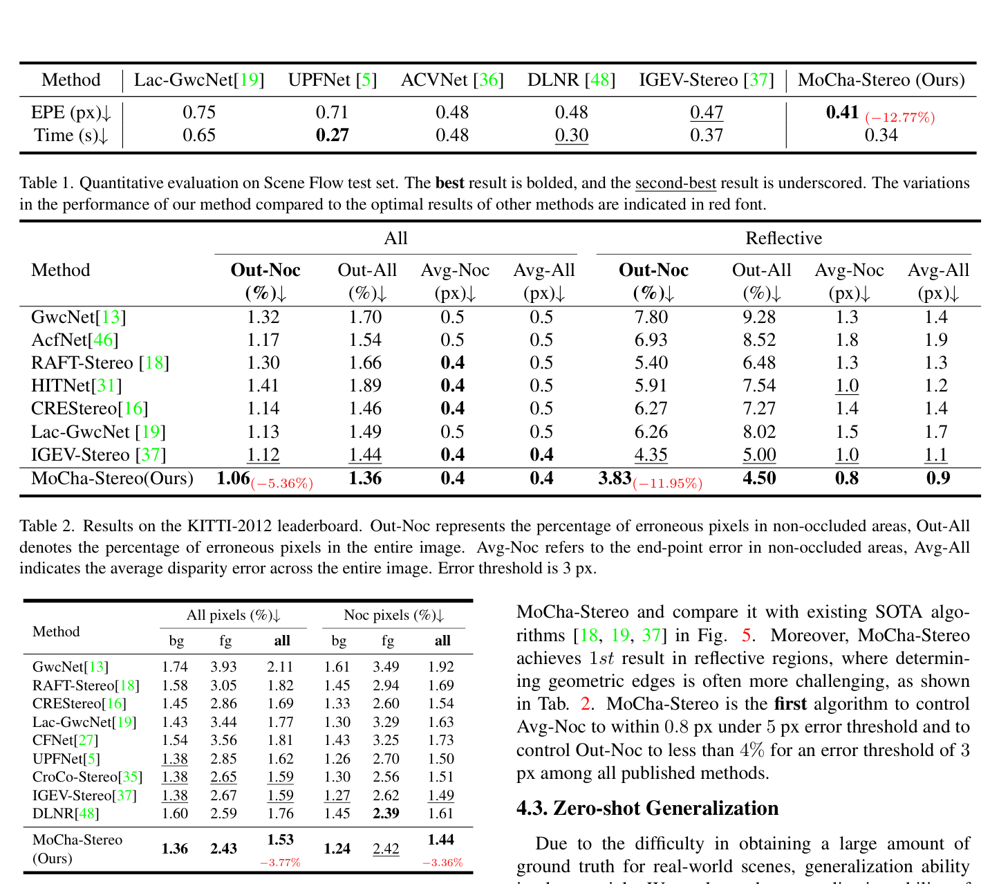

# MoCha-Stereo: Motif Channel Attention Network for Stereo Matching

**Authors:** Ziyang Chen, Wei Long, He Yao, Yongjun Zhang et al.
**Venue:** CVPR 2024
**Tier:** 2 (IGEV-Stereo extension for edge detail)

---

## Core Idea
Mines **"motif channels"** — patterns of repeated geometric contours — in feature maps and uses them to modulate cost volume construction and refinement. Addresses geometric edge-detail loss in CNN feature channels by treating recurring structures (motifs) as stable representations of edges.

## Architecture Highlights
- **Feature extractor** follows IGEV-Stereo (EfficientNet frozen from ImageNet)
- **Motif Channel Attention (MCA):** 4 sets of adaptive-weight 3×3 sliding windows applied to **frequency-domain feature maps** (Fourier + Gaussian high-pass) → accumulated and normalized to produce **motif channels** capturing recurring geometric structure
- **Motif Channel Correlation Volume (MCCV):** Channel Affinity Matrix Profile (CAMP) computed from motif vs normal channel affinity; 3D-convolved and broadcast as a **multiplicative modulator** on the standard GWC group correlation volume
- **Reconstruction Error Motif Penalty (REMP):** full-resolution refinement; UNet extracts features from reconstruction error + last disparity; three branches (Low-Freq Error via pooling, Latent Motif Channel via CNN, High-Freq Error passthrough) combined as penalties on the disparity map
- **Iterative update operator** inherits from IGEV-Stereo

## Main Innovation
**Recurring patterns (motifs) in spatial feature channels are more stable edge representations than individual blurred channels** — insight borrowed from time-series analysis. MCA extracts these motifs in the **frequency domain** (making it sensitive to high-frequency edges), then CAMP creates a channel-to-motif affinity matrix that modulates the GWC correlation volume — essentially **reweighting cost by how well local geometry aligns with recurring templates**.

Critically, MCCV does NOT add extra channel groups but **multiplies existing groups by a geometry-aware coefficient**, keeping parameter cost minimal (only +0.03s, +0.04M params over baseline).

## Benchmark Numbers
| Metric | Value |
|--------|-------|
| **KITTI 2015 D1-all** | **1.53%** (rank 1 at submission) |
| **KITTI 2012 Out-Noc 3px** | **1.06%** (rank 1, reflective rank 1 at 3.83%) |
| **Scene Flow EPE** | **0.41** (vs IGEV 0.47, 12.77% improvement) |
| Zero-shot ETH3D bad 1.0 | 3.2% |

## Relation to IGEV-Stereo Baseline
**Direct IGEV-Stereo extension.** Retains the Combined Geometry Encoding Volume (GWC + APC), EfficientNet backbone, and iterative update operator. Two additions as modular overlays:
- **MCCV** multiplies the GWC volume by CAMP-derived geometric coefficient before iterative update
- **REMP** replaces standard convex upsampling with frequency-decomposed refinement

## Relevance to Edge Stereo
**Moderate.** MCCV adds only 0.03M parameters and 0.01s latency — **essentially zero-cost enhancement**. The core idea (extracting recurring geometric templates via frequency-domain sliding windows) is **architecture-agnostic** and could plug into a lightweight backbone. With just 4 iterations, MoCha-Stereo beats IGEV-Stereo's full 16-iteration result — **iteration-efficient**. REMP uses a UNet refinement module that is potentially costly on NPUs.
