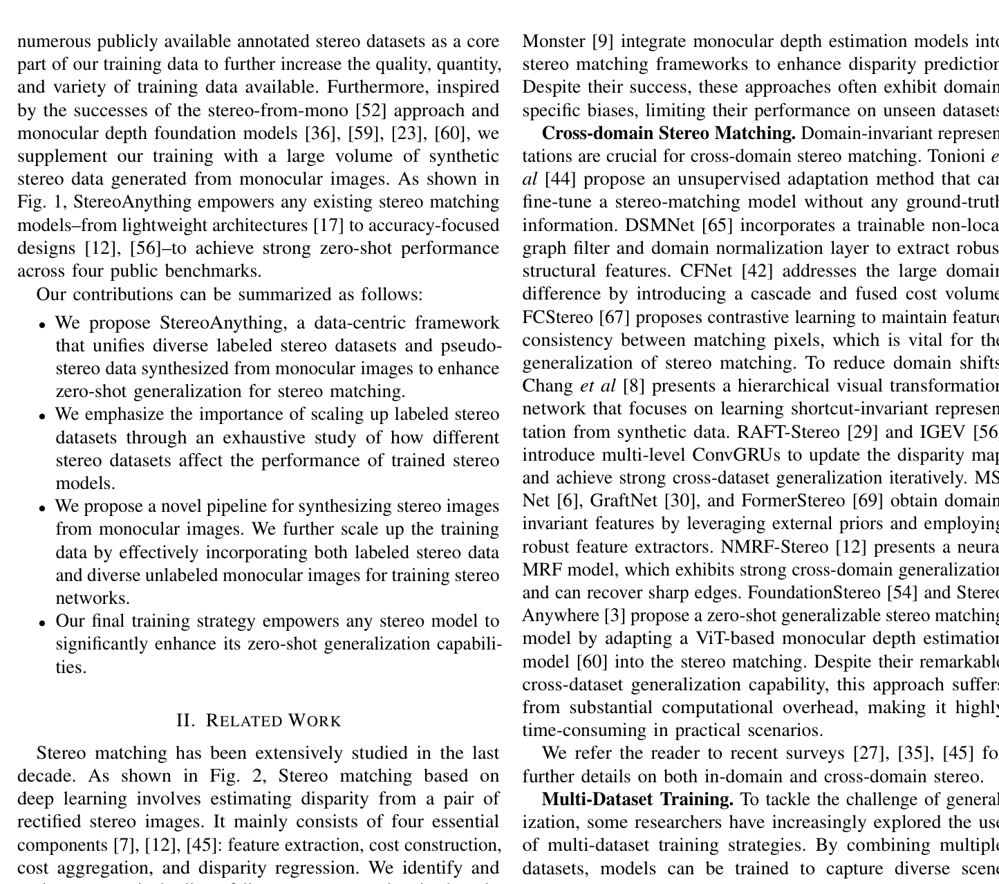
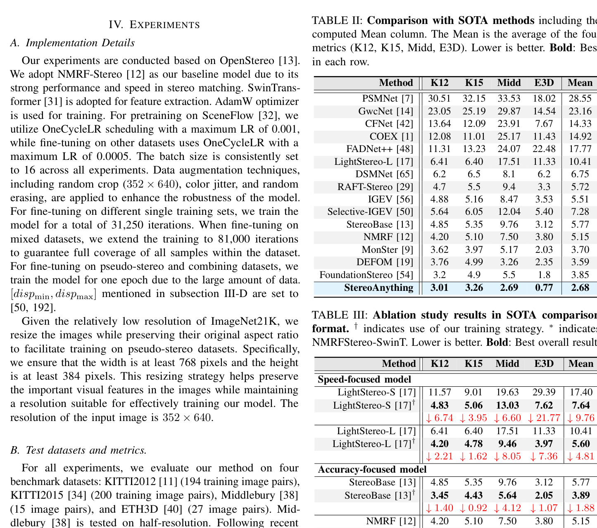

# Stereo Anything: Unifying Stereo-shot Matching with Large-Scale Mixed Data

**Authors:** Xianda Guo et al.
**Venue:** arXiv 2024 (v2: Sep 2025)
**Tier:** 2 (data-centric training strategy, not architecture)

---

## Core Idea
**Data-centric training strategy** — not a new architecture — that unifies diverse labeled and unlabeled stereo datasets (including **monocular-depth-generated pseudo-stereo pairs**) through a principled data mixing curriculum. Enables zero-shot generalization across any stereo image with **any existing backbone**.

## Architecture Highlights
**No novel architecture** — evaluated on existing models:
- LightStereo-S/L (speed-focused)
- StereoBase (accuracy)
- FDStereo (efficient)
- FoundationStereo (foundation model)

**Monocular-to-stereo synthesis pipeline:**
1. DepthAnythingV2 estimates depth from left image
2. Scale-normalized disparity computed
3. Forward warping produces right image
4. **RealFill inpainting** fills occluded gaps in the warped right image
5. All images resized to ≥384×640 before synthesis

**Data mixing strategy:** datasets ranked by cross-dataset generalization metric MIX (mean across 4 benchmarks); greedy addition of datasets while improving MIX; 11 mixing configurations tested.

**Training data:** 53.01M unlabeled monocular images (LSUN, ImageNet-21K, Objects365) converted to pseudo-stereo pairs.

## Main Innovation
**The community has been training on a small number of clean synthetic datasets (SceneFlow, FallingThings) that poorly cover the disparity/scene diversity of real-world stereo.** StereoAnything's answer:

**Three key findings:**
1. **Dataset diversity matters more than dataset size** — mixing labeled stereo datasets from multiple domains beats single-dataset training
2. **Pseudo-stereo from monocular images** (DepthAnythingV2 + RealFill) provides powerful additional signal, especially for textureless/occluded regions — the monocular model has seen millions of diverse images
3. **Optimal mixing includes both labeled stereo + pseudo-stereo** — MIX 10 configuration gives best mean metric 3.49 across KITTI 12/15, Middlebury, ETH3D (StereoBase baseline: 5.81)

## Benchmark Numbers
| Model | Baseline Mean | StereoAnything Mean | Improvement |
|-------|--------------|---------------------|-------------|
| StereoBase | 5.81 | **3.49** | **40%** |
| FoundationStereo | — | **3.01** | Reference |
| LightStereo-S | 29.39 (ETH3D) | **7.64** | **74%** |
| LightStereo-L | — | **5.60** | — |
| FDStereo | — | **3.56** | — |

## Relation to RAFT-Stereo / IGEV-Stereo Baseline
**No direct architectural relationship** — applied on top of existing models as a training strategy. When applied to StereoBase (IGEV-style), the data strategy alone closes ~40% of the gap to FoundationStereo. **Orthogonal to any architectural innovation** — can be applied to RAFT-Stereo, IGEV, or any future efficient architecture.

## Relevance to Edge Stereo
**Directly and critically relevant.** Demonstrates that a **small, efficient model (LightStereo-S) trained with the right data curriculum** achieves dramatically better zero-shot performance — ETH3D metric drops from 29.39 → 7.64. For edge deployment this is transformative: **an edge model does not need a heavy ViT backbone to generalize** — it needs the right training data.

The **monocular-to-stereo synthesis pipeline** is a practical recipe for generating large-scale diverse training data at low cost. 53M pseudo-stereo images from unlabeled monocular collections are now essentially free. **Any edge model in this project should incorporate this data strategy.**
