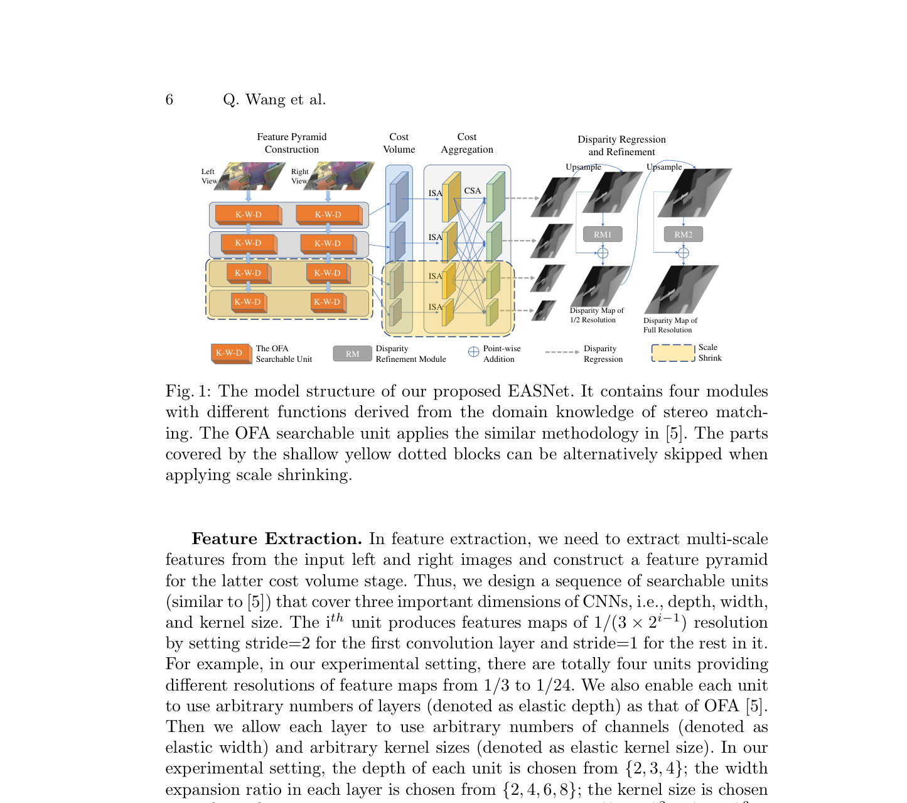
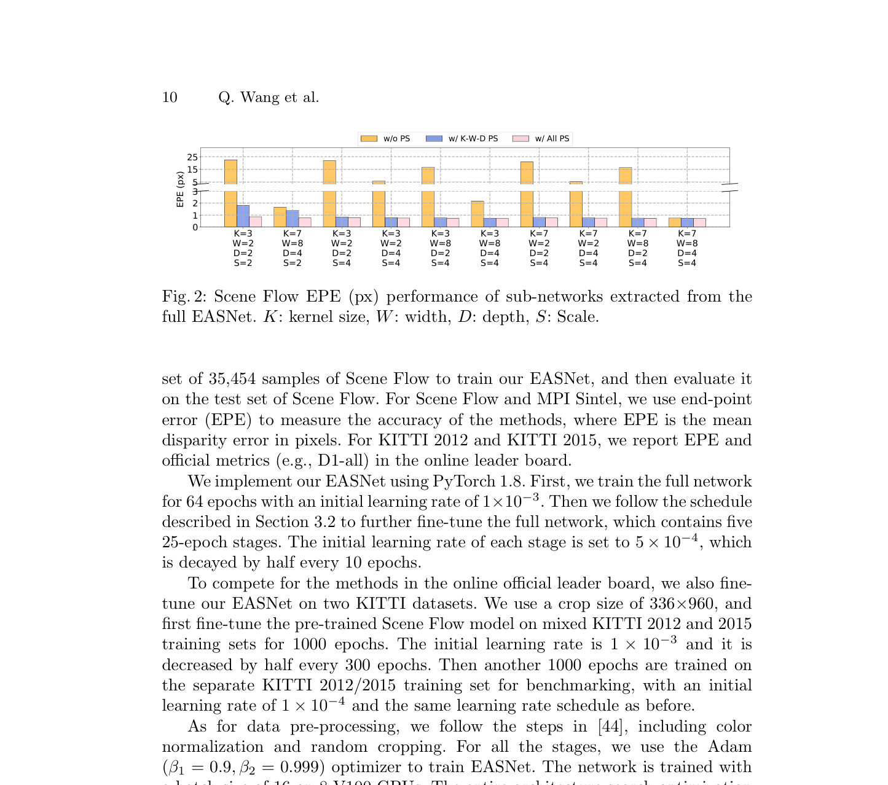

# EASNet: Searching Elastic and Accurate Network Architecture for Stereo Matching

**Authors:** Qiang Wang, Shaohuai Shi, Kaiyong Zhao, Xiaowen Chu (HIT Shenzhen / HKBU / HKUST)
**Venue:** ECCV 2022
**Tier:** 2 (once-for-all NAS for stereo)

---

## Core Idea
Trains a single **"supernet"** for stereo matching whose **sub-networks** — obtained by slicing along **four elastic dimensions** (kernel size K, depth D, width W, scale S) — can be **directly deployed on devices with different compute constraints without any re-training or re-searching**. Yields an accuracy-latency Pareto front from a single training run.

## Architecture Highlights
**Four-module pipeline (CVA-Conv3D style):**

1. **Feature Pyramid Construction:** 4 searchable OFA-style units
   - Elastic kernel size $K \in \{3, 5, 7\}$
   - Elastic depth $D \in \{2, 3, 4\}$
   - Elastic width expansion ratio $W \in \{2, 4, 6, 8\}$
   - Kernel transformation matrices share weights across kernel sizes
2. **Cost Volume:** point-wise inner product correlation (AANet-style) at $S$ pyramid scales; elastic scale $S \in \{2, 3, 4\}$
3. **Cost Aggregation:** stacked AAModules — each with $S$ Intra-Scale Aggregation (ISA) units + 1 Cross-Scale Aggregation (CSA) unit. Elastic scale also applies here
4. **Disparity Regression and Refinement:** soft-argmin at each scale + 2 refinement modules (RM1, RM2) from StereoDRNet

**Progressive shrinking training strategy** (extended from OFA): train full network first (K=7, D=4, W=8, S=4), then 4 sequential fine-tuning stages for elastic K, D, W, S respectively. **Search cost:** 48 GPU days on 8×V100.

## Main Innovation
**First application of Once-For-All (OFA) paradigm to dense stereo matching.**

Key technical challenges vs OFA for classification:
- **3D cost volume operations** are far more memory-intensive than classification
- **Multi-scale disparity pyramid outputs** fundamentally different from sparse classification

**EASNet overcomes this by:**
- Designing a stereo-specific **elastic scale dimension** that simultaneously shrinks feature pyramid, cost volume, AND cost aggregation
- Using 5-stage progressive shrinking to prevent accuracy degradation across the vast sub-network combinatorial space (~$10^{13}$ architectures)

**Result:** the fastest EASNet sub-network is **4.5× faster than LEAStereo with better EPE**.

## Benchmark Numbers
| Metric | Value |
|--------|-------|
| **Scene Flow full network EPE** | **0.73 px** at 100ms |
| Scene Flow vs LEAStereo | **4.5× faster, lower EPE** (0.73 vs 0.78) |
| Sub-network EPE range | 1.5 px (smallest) to 0.73 px (full) — all without retraining |
| Validated hardware | Tesla V100, GTX 2070, Tesla P40 |

## Historical Position
**Direct follow-on to LEAStereo (NeurIPS 2020) — its explicit target for improvement.** Represents the NAS-for-stereo field's maturation from "find one optimal architecture" (LEAStereo) to **"find a family of architectures for heterogeneous deployment"** (EASNet).

Arrived at ECCV 2022 just as the RAFT-Stereo iterative paradigm was taking over accuracy benchmarks. **The last major NAS-stereo paper before iterative methods rendered pure volumetric approaches secondary for accuracy.** Remains SOTA for deployable-across-devices stereo NAS.

## Relevance to Edge Stereo
**Directly and highly relevant to our edge stereo goal.**

**EASNet's elastic scale dimension is the most valuable idea:** a single stereo model that can run at S=2 on a Jetson Orin Nano and S=4 on a server GPU, **without retraining**, is exactly what edge deployment requires.

**Directly applicable techniques:**
- **Progressive shrinking training strategy** for our edge model
- **ISA+CSA cost aggregation modules** (efficient) can be combined with **depthwise separable 3D convolutions** (Separable-Stereo approach) for further savings
- **EASNet's path** (AANet cost volume + OFA elastic training) is a strong blueprint

**Refinement opportunity:** substitute the ViT-based monocular prior injection (DEFOM-Stereo's insight) into the EASNet framework to get generalization + elasticity.
