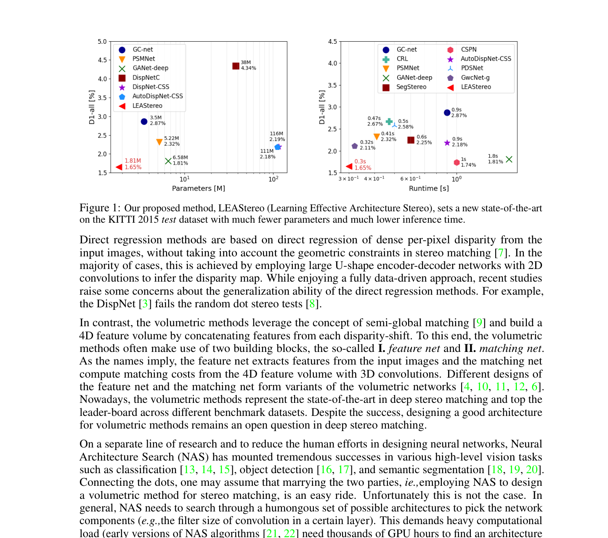
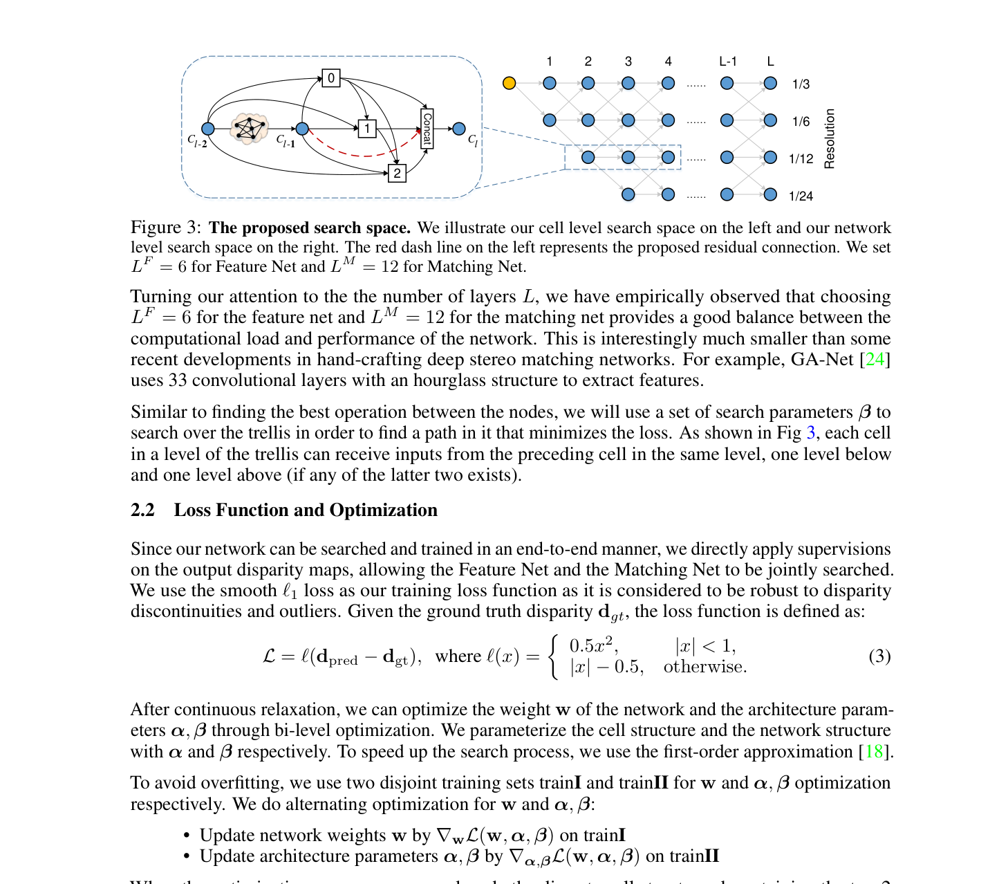

# LEAStereo: Hierarchical Neural Architecture Search for Deep Stereo Matching

**Authors:** Xuelian Cheng, Yiran Zhong, Mehrtash Harandi et al. (Monash / ANU / NWPU)
**Venue:** NeurIPS 2020
**Tier:** 2 (first hierarchical NAS for stereo)

---

## Core Idea
**First end-to-end hierarchical NAS framework applied to volumetric stereo matching.** Instead of manually designing the feature encoder and cost aggregation network, simultaneously searches both the **Feature Net** and the **Matching Net** architectures using **task-specific domain priors** (the stereo pipeline structure) to constrain and reduce the prohibitive search space.

## Architecture Highlights
- **Pipeline:** Feature Net (2D CNN → 4D feature volume) → 4D Cost Volume (concatenation) → Matching Net (3D CNN aggregation) → Soft-argmin + projection
- **Two-level search hierarchy:**
  - **Cell-level:** each cell is a DAG with 2 input nodes, 3 intermediate nodes, 1 output node. Candidate ops: {3×3 conv, skip} for Feature Net; {3×3×3 3D conv, skip} for Matching Net. **Residual cells** (include cell input in output) consistently outperform direct cells
  - **Network-level:** L-layer trellis with 4 resolution levels (1/3 down to 1/24), each cell chooses its spatial resolution. L=6 for Feature Net, L=12 for Matching Net
- **DARTS-style bi-level optimization:** architecture parameters $\alpha, \beta$ jointly optimized with weights $w$; first-order approximation for efficiency
- **Search cost:** ~10 GPU days on V100
- **Final model:** 1.81M parameters, 0.3s runtime

## Main Innovation
**First NAS method to respect the volumetric stereo pipeline structure as inductive bias.** Allows joint search of the full feature-to-disparity pipeline (not just the encoder cell as in AutoDispNet).

**By embedding geometric knowledge** (cost volume must match features across disparity levels, so 3D convolution is the natural Matching Net op; pooling is harmless in Feature Net but not Matching Net), LEAStereo **dramatically reduces the search space** vs naive NAS while achieving 9.30% EPE improvement and 10.50% parameter reduction over joint search with generic ops.

**Residual cell design proves essential.**

## Benchmark Numbers
| Method | Scene Flow EPE | KITTI 2015 D1-all | Params | Runtime |
|--------|---------------|-------------------|--------|---------|
| GANet-deep | 0.78 | 1.93% | 43.34M | 1.9s |
| PSMNet | 1.09 | 2.32% | 5.22M | 0.4s |
| **LEAStereo** | **0.78** | **1.65%** (rank 1) | **1.81M** | **0.3s** |

**KITTI 2012 test:** bad 2.0 Noc **1.90%**, bad 3.0 Noc **1.13%** — rank 1 at submission.
**Middlebury 2014:** bad 2.0 Noc **7.15%** — top rank.

## Historical Position
**Dominant NAS stereo paper (NeurIPS 2020).** Appeared between PSMNet/GANet (2018-2019) and the RAFT-Stereo iterative era (2021). **Peak of 3D cost volume + NAS research.** Outperforms all hand-designed volumetric methods with **~20× fewer parameters than GANet**, establishing that NAS can find more efficient volumetric architectures than human design. Direct predecessor that EASNet explicitly targets for improvement.

## Relevance to Edge Stereo
**Very high as a design reference.** LEAStereo's searched architecture is already compact (**1.81M params**) and its NAS methodology — domain-constrained search over the full stereo pipeline with task-specific ops — is exactly the right approach for edge design.

**Key lessons for our edge model:**
1. **Residual cells consistently outperform direct cells**
2. **Joint Feature Net + Matching Net search** is superior to separate search
3. **3D depthwise separable convolutions** (not used in LEAStereo but a natural extension) would further reduce cost

LEAStereo's architecture (without NAS) serves as a **strong compact baseline** for the edge model.
