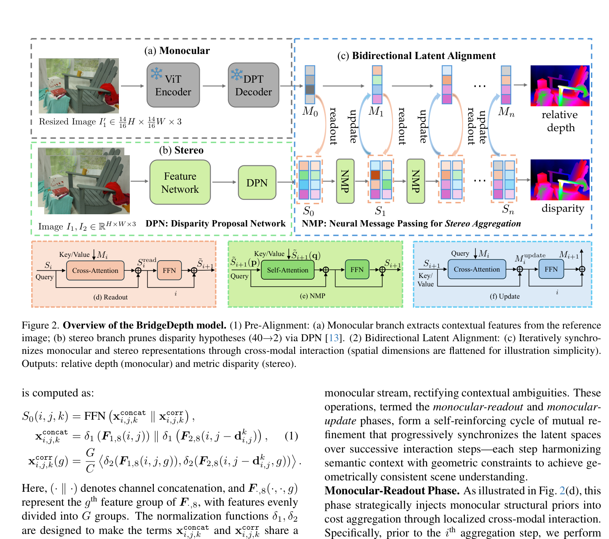
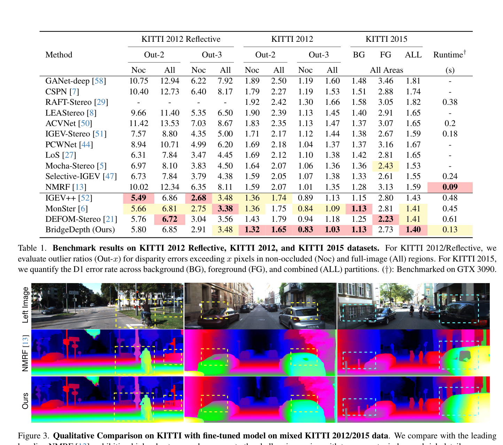

# BridgeDepth: Bridging Monocular and Stereo Reasoning with Latent Alignment

**Authors:** Tongfan Guan, Jiaxin Guo, Chen Wang, Yun-Hui Liu (CUHK, University at Buffalo)
**Venue:** ICCV 2025
**Tier:** 2 (NMRF successor with bidirectional mono-stereo alignment)

---

## Core Idea
Unifies monocular depth estimation and stereo matching in a single network through **iterative bidirectional latent alignment** — a cross-attention mechanism dynamically synchronizes monocular contextual features with stereo hypothesis embeddings during stereo cost aggregation. Injects semantic priors to resolve textureless/reflective ambiguities that pure stereo methods fail on.

## Architecture Highlights
- **Monocular branch:** frozen DepthAnythingV2 ViT encoder + DPT decoder → contextual features $M_0..M_n$ at multiple scales
- **Stereo branch:** NMRF-style DPN prunes disparity hypothesis space from D to **k=2 candidates per pixel** (vs NMRF's k=4)
- **Bidirectional Latent Alignment (BLA)** — the core module, $l+l'$ iterations with two alternating phases:
  - **Monocular-Readout:** window-based cross-attention where stereo hypothesis embeddings query monocular features as key/value (stereo reads from mono, injecting contextual priors)
  - **Monocular-Update:** inverted cross-attention where mono features update using geometrically verified stereo correspondences (stereo injects geometric precision back into mono)
- **Neural Message Passing (NMP):** after each alignment step, NMRF-style message passing aggregates stereo hypothesis embeddings spatially
- **Fine-Grained Detail Recovery:** 1/8 → 1/4 residual refinement
- **Dual outputs:** metric disparity + relative depth, complementary losses (L1 stereo + affine-invariant mono)
- **Modular monocular backbones:** BridgeDepth-L uses ConvNext-Tiny instead of DAv2 (not locked to DAv2)

## Main Innovation
**Unlike DEFOM-Stereo and MonSter (one-way mono injection at cost volume construction), BridgeDepth implements iterative bidirectional alignment** where each modality continuously refines the other:
- **Monocular branch reads from stereo geometry** (geometric constraints tighten the monocular estimate)
- **Stereo reads from monocular context** (semantic priors resolve stereo matching ambiguities)
- This **mutual refinement is maintained throughout all aggregation steps**, not just at initialization

**Result:** qualitatively superior handling of specular surfaces and transparent materials — failure modes where DEFOM-Stereo and NMRF struggle. Naturally produces a **refined monocular depth estimate** as a side output.

## Benchmark Numbers
| Metric | BridgeDepth | Baselines |
|--------|-------------|-----------|
| **Scene Flow EPE** | **0.32** | RAFT 0.56, IGEV++ 0.41, DEFOM 0.37 |
| **Scene Flow BP-1** | **3.25%** | RAFT 5.39, IGEV++ 4.98, DEFOM 4.94 |
| **KITTI 2012 Reflective Out-2 (noc)** | **5.80%** | NMRF 10.02, IGEV++ 5.49, DEFOM 5.76 |
| **KITTI 2015 D1-all** | **1.13%** (fastest at 0.13s) | — |
| **ETH3D (zero-shot BP-1)** | **0.50%** | DEFOM 0.78, matches FoundationStereo 0.48 |
| Middlebury (zero-shot) | >40% better than NMRF | — |

## Paradigm Comparison vs RAFT-Stereo / IGEV-Stereo
**Not a recurrent iterator** like RAFT or IGEV. Inherits from NMRF (sparse proposals + message passing) but adds the bidirectional monocular alignment loop.

**Closest architectural relative: DEFOM-Stereo.** Both integrate a DAv2 ViT into stereo matching, but:
- **DEFOM:** one-way injection (mono features → cost volume at init, then RAFT-style GRU iterations)
- **BridgeDepth:** continuous bidirectional alignment throughout inference, refines BOTH mono and stereo outputs

## Relevance to Edge Stereo
**High and directly actionable.**
- **k=2 disparity hypotheses** is more aggressive than NMRF's k=4, reducing memory proportionally — **key edge technique**
- **Bidirectional alignment** can use lightweight monocular backbone — BridgeDepth-L uses ConvNext-Tiny and maintains strong generalization
- **0.13s runtime on RTX 3090** already beats most competing methods; with architectural optimization could approach real-time on Jetson
- **Dual-output design** (metric disparity + relative depth) valuable for edge applications requiring both metric 3D and semantic depth
- **ICCV 2025 — one of the most current results** — directly informs next-generation edge model design
