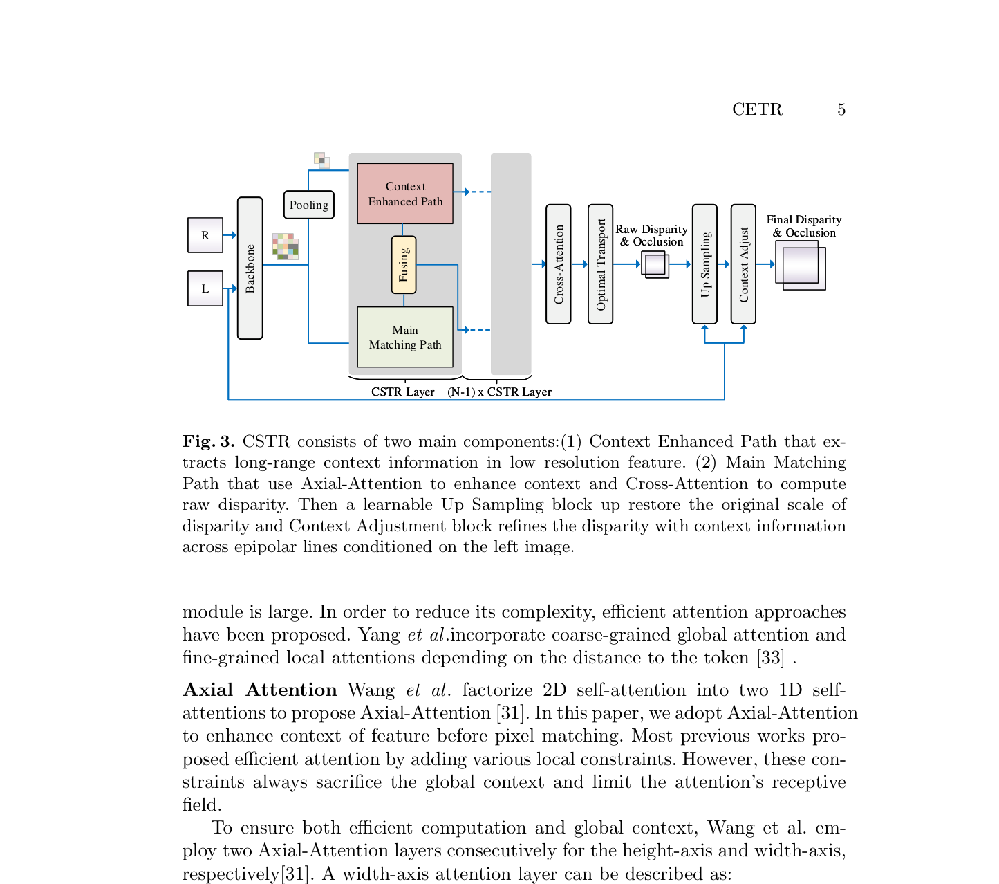
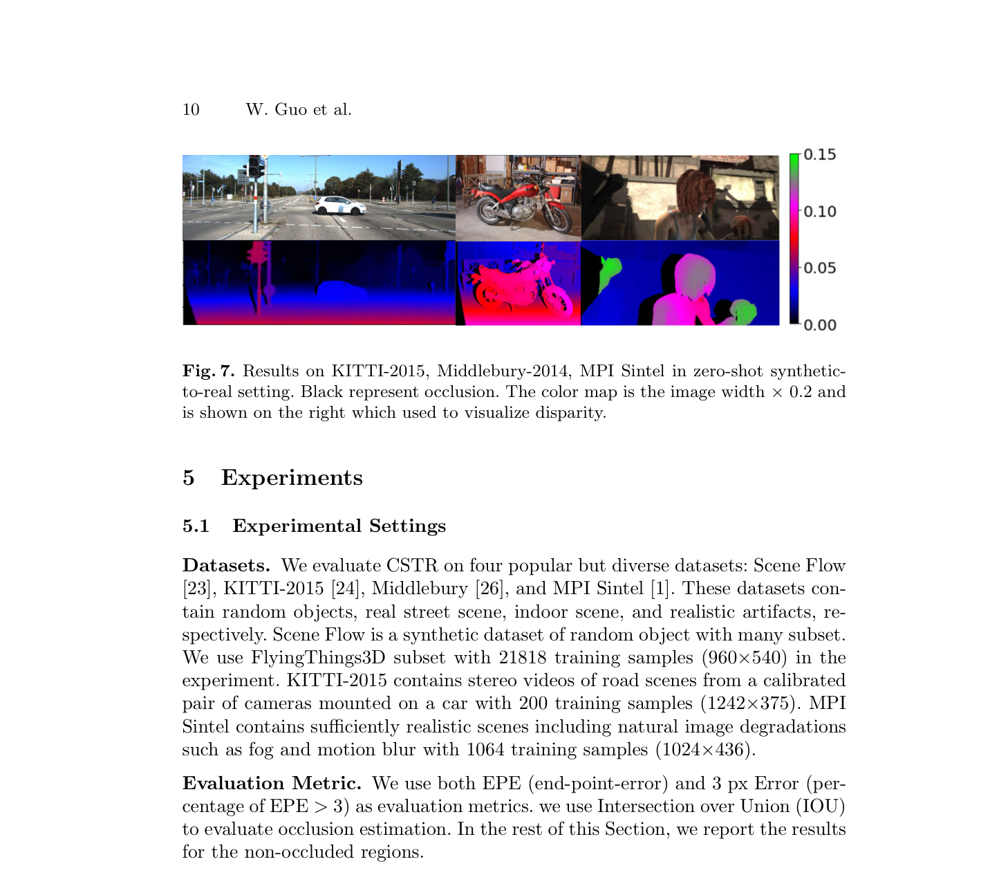

# CEST: Context-Enhanced Stereo Transformer

**Authors:** Weiyu Guo, Zhaoshuo Li, Yongkui Yang et al. (SIAT/CAS + JHU)
**Venue:** ECCV 2022
**Tier:** 2 (STTR enhancement for textureless regions)

---

## Core Idea
Augments STTR with a **plug-in Context Enhanced Path (CEP)** module that extracts long-range cross-epipolar contextual information at low resolution and injects it layer-by-layer into the main matching transformer. Directly addresses **STTR's failure in large uniform hazardous regions** (textureless walls, specular surfaces, transparency, disparity jumps).

## Architecture Highlights
- **Hourglass CNN backbone** (SPP encoding + dense-block decoding) at 1/4 resolution
- **Main Matching Path (MMP):** STTR-style alternating self-attention (but using **Axial-Attention** covering both horizontal and vertical axes rather than only epipolar lines) + cross-attention for left-right matching
- **Relative positional encoding** with position-position term removed for efficiency
- **Context Enhanced Path (CEP):** operates on pooled low-resolution features; applies Axial-Attention + Cross-Attention for global structure; three design variants (M1/M2/M3) of increasing depth; features fused into each MMP layer via upsampling + concatenation + 2 conv layers
- **Optimal transport layer** for uniqueness-constrained disparity regression
- **Context Adjustment Layer** (from STTR)

## Main Innovation
**CEST identifies a precise failure mode of STTR:** its self-attention only operates along epipolar lines (single row), so it **cannot aggregate contextual information across rows** — making it blind to global image structure (e.g., the horizontal extent of a white wall).

**CEP fills this gap** by adding a parallel low-resolution pathway with true 2D global attention (Axial-Attention covers both height and width axes). The plug-in design means CEP could be added to **any transformer-based stereo method**. Result: **11% improvement on Middlebury-2014** in the challenging zero-shot synthetic-to-real setting.

## Benchmark Numbers
| Metric | Value |
|--------|-------|
| **Scene Flow EPE** | 0.41 |
| **Scene Flow D1-1px** | 1.41% |
| **Middlebury-2014 zero-shot** | **11% improvement** over STTR |
| Best on AvgErr and 3px Err in occluded regions | — |

## Historical Position
**Direct enhancement of STTR (ICCV 2021)**, arriving at ECCV 2022. Concurrent with ELFNet (which also builds on STTR), preceding GOAT. Together these papers represent the **second wave of transformer stereo work:**
- **First wave:** established feasibility (STTR, GMStereo)
- **Second wave:** fixed specific failure modes (CEST: hazardous regions; GOAT: occlusions; ELFNet: local-global fusion)

**CEST's plug-in CEP module** is a useful template for modular transformer improvements.

## Relevance to Edge Stereo
**Moderate relevance.** The CEP concept — a **low-resolution parallel context pathway** that augments a local matching network with global scene structure — is directly applicable to edge stereo.

A **lightweight depthwise separable version of CEP** could be added to a small iterative network (e.g., mobile RAFT-Stereo) to improve textureless region handling with minimal compute overhead. The **Axial-Attention mechanism** is more efficient than full 2D self-attention (linear in H+W rather than H×W) and thus **edge-compatible**. The overall STTR base is too slow for real-time edge use, but the CEP idea is portable.
