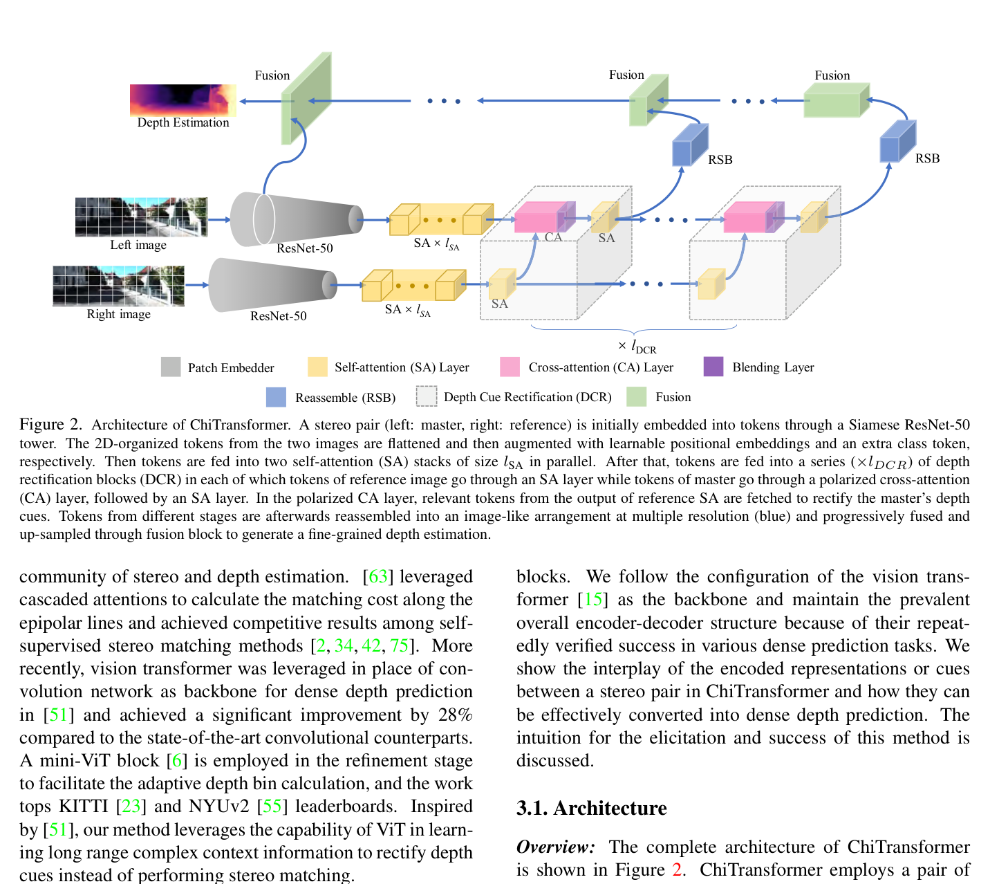
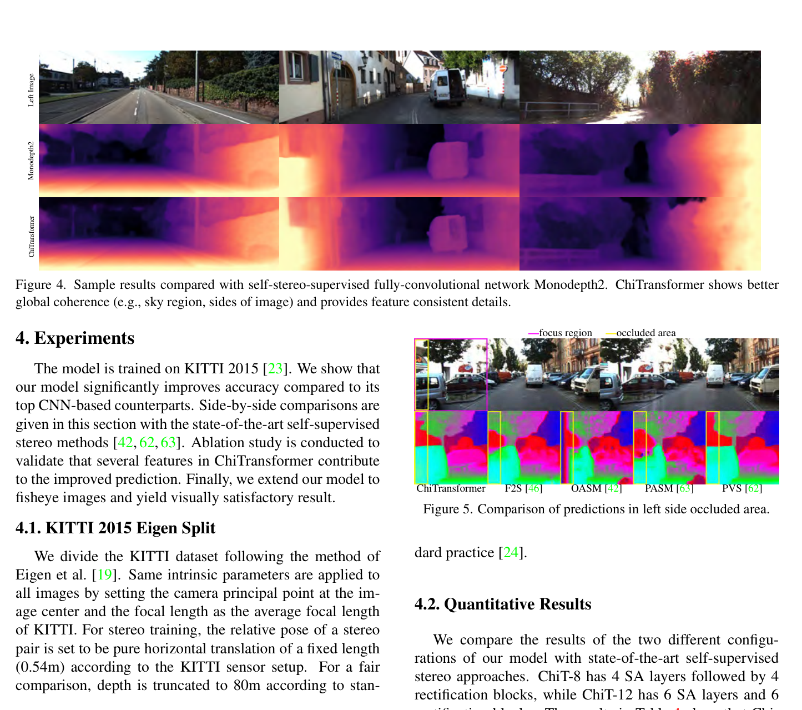

# ChiTransformer: Towards Reliable Stereo from Cues

**Authors:** Qing Su, Shihao Ji (Georgia State University)
**Venue:** CVPR 2022
**Tier:** 2 (self-supervised transformer with cross-view cues)

---

## Core Idea
Self-supervised binocular depth estimator that **cross-injects monocular depth cues from a reference (right) view into a master (left) view** using a biologically inspired **optic-chiasma mechanism** — polarized cross-attention retrieves pattern-matched tokens from the opposite view to rectify the master view's monocular depth prediction.

## Architecture Highlights
- **Siamese ResNet-50** (shared weights) as patch embedder for both views
- **Self-Attention (SA) layers** over master view tokens for long-range context
- **Polarized Cross-Attention (CA) layer:** novel **Hopfield-network-inspired attention** where the query (master) conditions retrieval from reference view key/value space; uses learnable positive-definite decomposition $G = M^T M$ to enforce sub-space consistency
- **Gated Positional Cross-Attention (GPCA):** epipolar geometry encoded as learnable polynomial **relative positional bias** constraining attention to valid epipolar neighborhoods — generalizes to **non-rectilinear (fisheye) images** without explicit warping
- **Reassemble Blocks (RSB):** progressively fuse multi-resolution token outputs (DPT-style) into image-like feature maps
- **Depth Cue Rectification (DCR):** blending layer merging depth-cue tokens from reference and master views at multiple resolutions
- **Self-supervised training:** photometric + smoothness loss, binary auto-masking on occlusions

## Main Innovation
**Reframes stereo matching as monocular depth estimation with cross-view cue injection**, rather than as a disparity/correspondence problem.

**Optic-chiasma analogy is architecturally concrete:** polarized cross-attention performs feature-selective retrieval where only the most discriminative dimensions of a token are activated (analogous to feature polarization in visual cortex). **Features from one eye highlight relevant pattern elements in the other**, improving depth consistency in textureless large regions and near occlusion boundaries — exactly the failure modes of standard CNN stereo.

**No disparity ground truth required** (self-supervised) — enables use on any synchronized stereo camera rig.

## Benchmark Numbers
| Metric | ChiTransformer-12 | Best Competitor |
|--------|-------------------|-----------------|
| **KITTI Eigen (80m), Abs Rel** | **0.073** | Monodepth2 0.106 |
| **KITTI Eigen, SqRel** | **0.634** | — |
| **KITTI Eigen, RMSE** | **3.105** | — |
| **δ<1.25 accuracy** | **0.924** | — |

**Best among all self-supervised stereo methods, competitive with fully-supervised monocular methods.**

## Historical Position
**CVPR 2022 — at the convergence of the STTR transformer-stereo lineage and self-supervised monocular depth (Monodepth2, SfSMNet) lineage.** Predates DEFOM-Stereo's explicit fusion of monocular priors and stereo geometry by ~3 years but **foreshadows the same key insight:** monocular priors help where stereo matching fails. First to apply ViT + cross-view attention for self-supervised stereo.

## Relevance to Edge Stereo
**High conceptual relevance to DEFOM-Stereo and edge model goal.** Demonstrates that even a ResNet-50 + lightweight cross-attention can leverage monocular depth cues for self-supervised stereo.

**For edge deployment:**
- **Self-supervised training paradigm** is valuable (no need for LiDAR-labeled data)
- **GPCA mechanism for fisheye cameras** is useful for robotics/UAV applications
- **Replacing ResNet-50 with MobileNetV4** and reducing DCR stages would produce a viable edge variant
- **Caveat:** self-supervised photometric objective may limit sub-pixel accuracy
