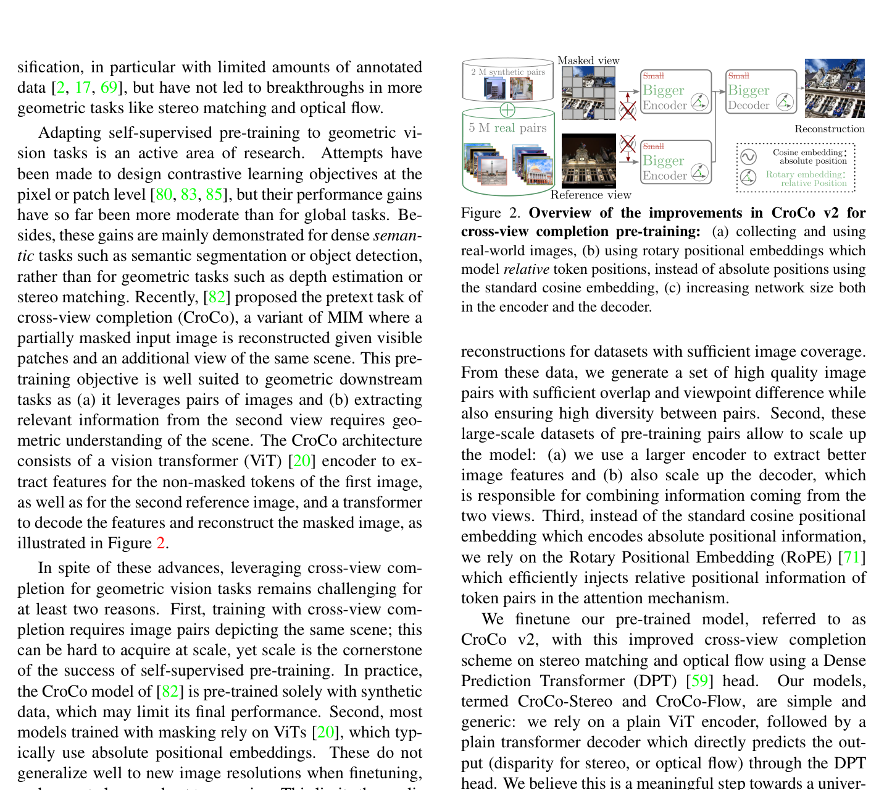
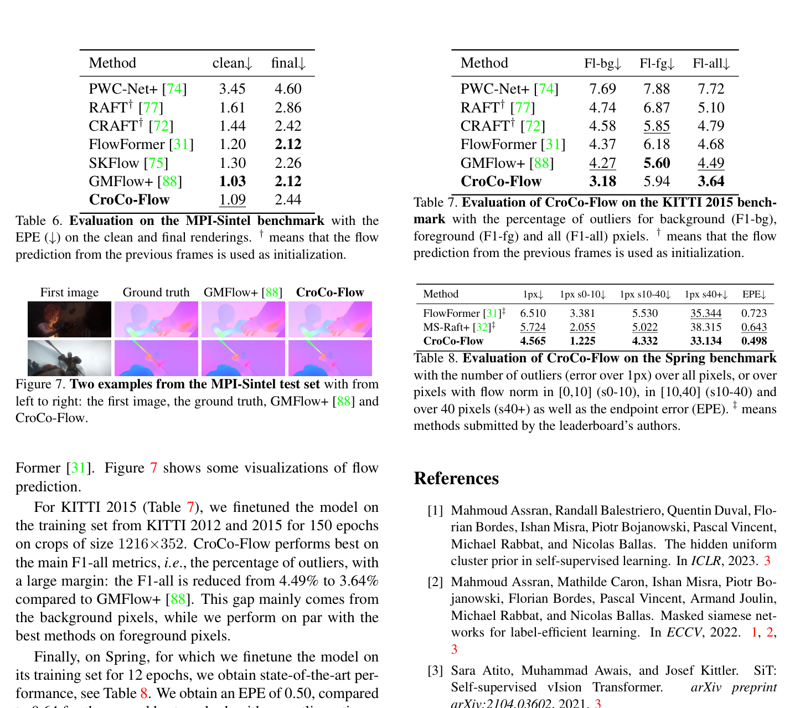

# CroCo v2: Improved Cross-view Completion Pre-training for Stereo Matching and Optical Flow

**Authors:** Philippe Weinzaepfel, Thomas Lucas, Vincent Leroy, Yohann Cabon et al. (NAVER LABS Europe)
**Venue:** ICCV 2023
**Tier:** 2 (foundation pre-training for stereo)

---

## Core Idea
Large-scale **self-supervised pre-training via cross-view completion** — masking patches from one image and reconstructing them using the other image as context — produces a ViT architecture that achieves SOTA on stereo matching and optical flow **without any task-specific design**. Replaces cost volumes and iterative refinement with a simple dense prediction transformer decoder.

## Architecture Highlights
- **Pre-training task (cross-view completion):** monocular ViT encoder processes masked patches from one image; a binocular decoder with cross-attention between the two views reconstructs the masked patches
- **Real-world pre-training data (v2 key improvement):** 5.3M pairs from ARKitScenes, MegaDepth, 3DStreetView, IndoorVL, filtered by overlap score and viewpoint angle
- **Rotary Positional Embedding (RoPE):** replaces absolute positional embeddings with relative RoPE — enables different resolutions and focuses on relative feature positions
- **Architecture scaling:** larger ViT-Base encoder (12 blocks, 768-dim, 12 heads) + decoder (8 blocks, 512-dim) vs v1
- **Downstream finetuning:** pre-trained model + DPT-style dense prediction head → disparity or flow with Laplacian loss
- **Tiling strategy** at inference handles arbitrary resolutions
- **No task-specific cost volumes, correlation, or iterative refinement**

## Main Innovation
**First demonstration that SOTA stereo matching + optical flow can be achieved using a universal pre-training approach** — without any task-specific modules like correlation volumes, cost aggregation, image warping, or multi-scale feature pyramids.

Cross-view completion is **naturally suited to binocular downstream tasks** because reconstructing masked patches in one view using context from the other requires understanding 3D scene geometry.

**Three key improvements over v1:**
1. Real-world image pair data at scale
2. RoPE positional embeddings for geometric generalization
3. Scaled-up architecture

**Result:** a single model architecture finetuned for either stereo or flow without architectural modifications.

## Benchmark Numbers
| Metric | Value |
|--------|-------|
| **ETH3D stereo bad 0.5** | **1.14%** (best, vs CREStereo 1.38%, RAFT-Stereo 4.70%) |
| Middlebury stereo bad 1.0 | 15.5% (not SOTA on Middlebury) |
| **MPI-Sintel stereo EPE** | **1.43** (best) |
| **KITTI 2015 flow F1-all** | **3.64%** (vs GMFlow+ 4.49%) |
| **MPI-Sintel flow EPE (final)** | **1.99** (vs RAFT 2.86, best by margin) |
| **Spring flow** | **4.33** (2nd only to FlowFormer++) |

## Paradigm Comparison vs RAFT-Stereo / IGEV-Stereo
**Orthogonal axis:** rather than designing a better cost volume or GRU iterator, focuses on **representation learning through pre-training**. At finetuning time, uses **no cost volume at all** — the ViT encoder-decoder directly outputs dense disparity. Closer to monocular depth estimation (single forward pass, no iterative refinement) than RAFT-Stereo's recurrent architecture.

Uses **4× fewer parameters than RAFT-Stereo and 15× fewer inference steps**, yet achieves better ETH3D accuracy. Weakness: tiling strategy can mishandle large disparities, underperforms iterative methods on KITTI.

## Relevance to Edge Stereo
**Very high.** **Direct predecessor to DEFOM-Stereo's approach** of using a ViT foundation model for stereo. Key insight: cross-view completion pre-training produces representations that generalize across geometric tasks without task-specific modules. Directly motivates foundation model features in DEFOM-Stereo and FoundationStereo.

**For edge models:** the question is whether the ViT-Base encoder can be replaced with an efficient ViT (EfficientViT, FastViT) while retaining the cross-view completion pre-training benefit. CroCo v2 shows that with good pre-training, **a simple DPT decoder without iterative refinement can match iterative methods** on several benchmarks — favorable for edge deployment.
